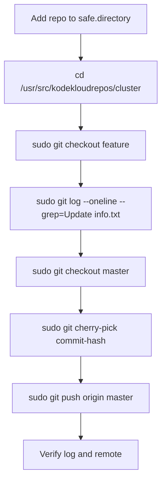

Use this with both **`safe.directory`** and **`sudo`** in mind, since the repo is likely root-owned and Git will otherwise block writes. The correct way to move only the commit with message `Update info.txt` from `feature` to `master` is to cherry-pick that commit, then push `master`. [atlassian](https://www.atlassian.com/git/tutorials/cherry-pick)

## OTS
```bash
git config --global --add safe.directory /usr/src/kodekloudrepos/cluster
cd /usr/src/kodekloudrepos/cluster
sudo git checkout feature
sudo git log --oneline --grep="Update info.txt"
sudo git checkout master
sudo git cherry-pick <commit-hash>
sudo git push origin master
```

## Runbook
1. Add `/usr/src/kodekloudrepos/cluster` to Git’s safe directory list.
2. Go to the cloned repository.
3. Switch to `feature` and find the commit whose message is `Update info.txt`.
4. Switch to `master`.
5. Cherry-pick only that commit into `master`.
6. Push `master` to the remote origin.

## Pre-checks
```bash
whoami
cd /usr/src/kodekloudrepos/cluster
ls -ld .git
git branch
git remote -v
sudo git log feature --oneline --grep="Update info.txt"
```

## Post-checks
```bash
git log --oneline -3
git status
git branch --show-current
git show --stat HEAD
git ls-remote origin master
```

## Mermaid


## Note
If the repo ownership is restrictive, `sudo` is needed for the Git operations that write to `.git`, while `safe.directory` only removes the ownership trust warning. [support.atlassian](https://support.atlassian.com/bitbucket-cloud/kb/git-command-returns-fatal-error-detected-dubious-ownership/)

If you want, I can also give you the **exact one-line final answer** as it would be used in a lab submission.