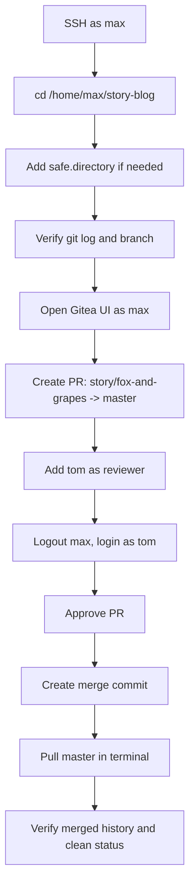

## OTS
```bash
ssh max@ststor01
cd /home/max/story-blog
git config --global --add safe.directory /home/max/story-blog
git checkout master
git pull
git log --oneline --decorate --graph -5
git status
```

## Runbook
1. SSH into the storage server as `max` using the provided password.
2. Change into the cloned repository at `/home/max/story-blog`.
3. Add the repo to Git’s safe directory list so Git trusts the path if needed.
4. Check the current branch and commit history to confirm `story/fox-and-grapes` exists and the story commit is present.
5. Open the Gitea UI from the top bar and log in as `max`.
6. Create a Pull Request with:
   - Title: `Added fox-and-grapes story`
   - Source branch: `story/fox-and-grapes`
   - Destination branch: `master`
7. Add `tom` as reviewer from the PR page.
8. Log out of Gitea and log back in as `tom`.
9. Open the same PR, approve it, and create the merge commit.
10. Return to the terminal, checkout `master`, pull the latest changes, and confirm the merge commit is present.

## Mermaid


## Pre-checks
```bash
whoami
pwd
ls -ld /home/max/story-blog
git branch
git remote -v
git log --oneline --decorate --graph -5
git status
```

## Post-checks
```bash
git checkout master
git pull
git log --oneline --decorate --graph -5
git status
```

## Note
From the completed history you shared, the merge commit is present on `master`, so these steps document the successful workflow rather than a pending fix.