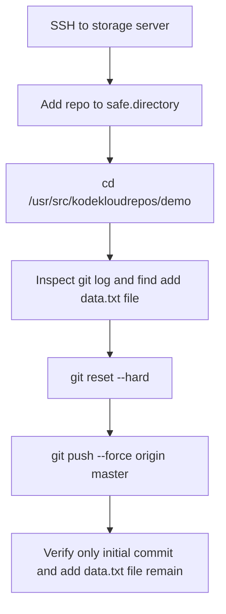

Here’s the **OTS, runbook, and mermaid** for the `demo` repo task. Because this is a history rewrite, the key action is to reset the branch back to the commit with message **`add data.txt file`** and then force-push the rewritten branch. `safe.directory` and `sudo` are included because you asked to keep them in mind. [runcloud](https://runcloud.io/blog/git-reset-to-revert-previous-commit)

## OTS
```bash
git config --global --add safe.directory /usr/src/kodekloudrepos/demo
cd /usr/src/kodekloudrepos/demo
sudo git log --oneline --decorate
sudo git reset --hard <commit-hash-of-add-data-txt-file>
sudo git push --force origin master
```

## Runbook
1. SSH into the storage server and go to `/usr/src/kodekloudrepos/demo`.
2. Add the repo to Git’s safe directory list if Git ownership warnings appear.
3. Inspect the commit history and identify the commit whose message is `add data.txt file`.
4. Reset `master` hard to that commit so the branch pointer and working tree match it exactly.
5. Force-push the rewritten `master` branch to the remote origin.
6. Verify that the repository history now contains only:
   - `initial commit`
   - `add data.txt file`

## Pre-checks
```bash
whoami
cd /usr/src/kodekloudrepos/demo
ls -ld .git
git branch --show-current
git remote -v
git log --oneline --decorate --graph -5
git status
```

## Post-checks
```bash
git log --oneline --decorate --graph -5
git status
git branch --show-current
git ls-remote origin master
```

## Mermaid


## Important note
If the repo is root-owned or Git blocks writes, use `sudo` for the Git commands that need filesystem access. Since this task rewrites history, `git push --force` is required. [dev](https://dev.to/vast-cow/rewriting-remote-git-history-with-reset-and-push-force-with-lease-407a)

If you want, I can also give you a **short version with the exact reset command once you know the commit hash**.