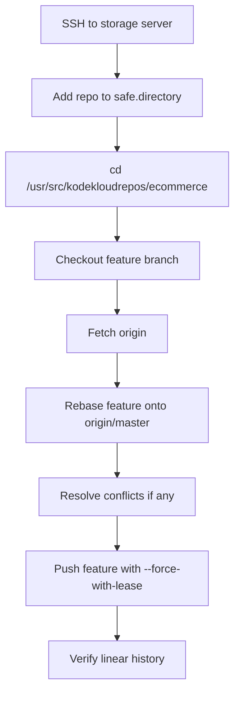

Use this to **rebase `feature` on top of `master` without a merge commit** and push the rebased branch back to origin. Since this is a repo operation on the storage server, I’m including `safe.directory` and `sudo` as requested. [atlassian](https://www.atlassian.com/git/tutorials/merging-vs-rebasing)

## OTS
```bash
git config --global --add safe.directory /usr/src/kodekloudrepos/ecommerce
cd /usr/src/kodekloudrepos/ecommerce
sudo git checkout feature
sudo git fetch origin
sudo git rebase origin/master
sudo git push origin feature --force-with-lease
```

## Runbook
1. SSH into the storage server and open the repository at `/usr/src/kodekloudrepos/ecommerce`.
2. Add the repo to Git’s safe directory list if needed.
3. Switch to the `feature` branch.
4. Fetch the latest `master` changes from origin.
5. Rebase `feature` onto `origin/master` so the feature commits are replayed on top of the latest master history.
6. Resolve any conflicts if they appear, then continue the rebase.
7. Push the rebased `feature` branch back to origin using `--force-with-lease`.

## Pre-checks
```bash
whoami
cd /usr/src/kodekloudrepos/ecommerce
ls -ld .git
git branch -a
git remote -v
git log --oneline --decorate --graph --all -5
git status
```

## Post-checks
```bash
git log --oneline --decorate --graph --all -8
git status
git branch -a
git ls-remote origin feature
```

## Mermaid


## Important note
A rebase rewrites branch history, so a normal push often fails afterward. That’s why `--force-with-lease` is the safer push option for the rebased `feature` branch. [stackoverflow](https://stackoverflow.com/questions/53194677/git-pull-rebase-on-feature-branch-to-merge-in-origin-master-changes)

If you want, I can also provide a **conflict-handling mini-guide** for this rebase task.