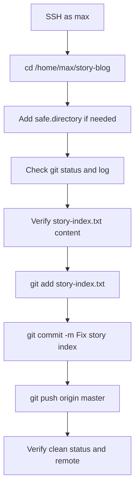

## OTS
```bash
git config --global --add safe.directory /home/max/story-blog
cd /home/max/story-blog
git status
git log --oneline --decorate --graph --all -5
git add story-index.txt
git commit -m "Fix story index"
git push origin master
```

## Runbook
1. SSH into the storage server as `max`.
2. Go to the cloned repository at `/home/max/story-blog`.
3. Add the repo to Git’s safe directory list if Git reports ownership warnings.
4. Check the current status and history to confirm the branch and latest changes.
5. Open `story-index.txt` and ensure it contains exactly:
   - The Lion and the Mouse
   - The Frogs and the Ox
   - The Fox and the Grapes
   - The Donkey and the Dog
6. Stage the corrected file.
7. Commit the fix with a clear message.
8. Push the commit to `origin master`.
9. Open the Gitea UI and verify the update is present in the repository history or file view.
10. Take screenshots if the lab requires proof.

## Pre-checks
```bash
whoami
pwd
ls -ld /home/max/story-blog
git branch --show-current
git remote -v
git status
git log --oneline --decorate --graph --all -5
```

## Post-checks
```bash
git status
git log --oneline --decorate --graph -5
git ls-remote origin master
```

## Mermaid


If you want, I can also provide a **short lab submission version** with only the command sequence.