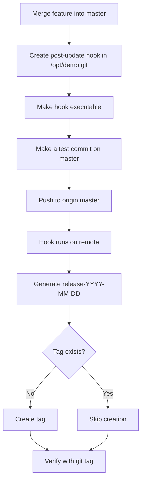

## Notes

- The hook is in `/opt/demo.git/hooks/post-update`.
- The tag format is `release-YYYY-MM-DD`.
- The main issue was trying to create the same date-based tag again on later pushes.
- The safer pattern is to check whether the tag already exists before creating it. [askubuntu](https://askubuntu.com/questions/1452706/problem-with-my-iptables-configuration-on-reboot)

## Runbook

1. Clone or open the working repo at `/usr/src/kodekloudrepos/demo`.
2. Switch to `master` and merge `feature` into it.
3. Create or update `/opt/demo.git/hooks/post-update`.
4. Make the hook executable with `chmod +x /opt/demo.git/hooks/post-update`.
5. Make a test commit on `master`.
6. Push to `origin master`.
7. Verify the release tag exists with `git tag` and `git show-ref --tags`.

## PRP

**Plan**
- Merge `feature` into `master`.
- Install a `post-update` hook in the bare repo.
- Test the hook with a real push.
- Confirm a release tag is created for the current date.

**Risks**
- The same date-based tag can already exist on later pushes.
- A failing `git tag` command can print `fatal: tag 'release-YYYY-MM-DD' already exists`.

**Protection**
- Check for tag existence before creating it.
- Keep the hook simple and run it only in the bare repository context. [askubuntu](https://askubuntu.com/questions/1452706/problem-with-my-iptables-configuration-on-reboot)

## Post checks

- `git tag` shows the release tag.
- `git show-ref --tags` confirms the tag points to an object.
- Pushing `master` again on the same day should not break if the hook checks for existing tags.
- Permissions in `/opt/demo.git` should remain unchanged except for the hook file being executable.

## Mermaid



## Learnings

- `post-update` runs on the remote bare repository after refs are updated.
- Date-based tag names are easy to reuse accidentally.
- A hook should be idempotent when possible.
- For lab tasks, verify both the push and the resulting tag. [askubuntu](https://askubuntu.com/questions/1452706/problem-with-my-iptables-configuration-on-reboot)

## One-line safe hook

```bash
#!/bin/bash
cd /opt/demo.git || exit 1
TAG_NAME="release-$(date +%F)"
git show-ref --tags --verify --quiet "refs/tags/$TAG_NAME" || git tag "$TAG_NAME"
```

If you want, I can turn this into a **single polished Markdown document** for your notes.


Got it — the requirement is specific: you need a **post-update** hook in the **bare repo** `/opt/demo.git` that creates a tag named `release-YYYY-MM-DD` for **today’s date** whenever `master` is updated, then you must **merge `feature` into `master`**, **test the hook at least once**, and **push the final changes** as user `natasha` without changing permissions.  

## Correct approach

Run these steps on the storage server as `natasha`:

```bash
cd /usr/src/kodekloudrepos/demo
git checkout master
git merge feature
```

Create the hook in the bare repo:

```bash
cat > /opt/demo.git/hooks/post-update <<'EOF'
#!/bin/bash
cd /opt/demo.git || exit 1
for ref in "$@"; do
  if [ "$ref" = "refs/heads/master" ]; then
    git tag "release-$(date +%F)"
  fi
done
EOF

chmod +x /opt/demo.git/hooks/post-update
```

## Test the hook

Make a small change so the hook runs on a real push:

```bash
cd /usr/src/kodekloudrepos/demo
echo "test" >> hook-test.txt
git add hook-test.txt
git commit -m "test release tag hook"
git push origin master
```

Verify the tag exists:

```bash
git tag
git show-ref --tags
```

## Final push state

If the merge commit was already pushed by your test commit, you’re done. If not, the final push above is the required push. The release tag should be named like `release-2026-08-04` based on today’s date.

If you want, I can give you the **exact minimal command sequence** in one block to copy-paste.