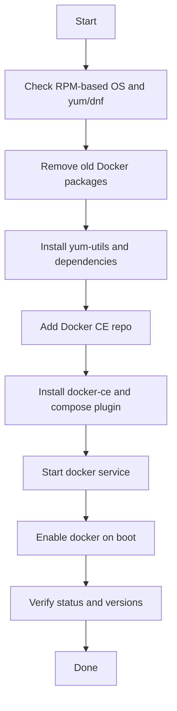

Got it — for a **YUM-based** system, use the Docker CE repo and install via `yum`/`dnf` instead of `apt-get`. The earlier error means the server is not Debian/Ubuntu-based, so the OTS needs to be adjusted for RPM-based Linux. [docs.docker](https://docs.docker.com/engine/install/centos/)

## OTS

**Objective:** Install Docker CE and Docker Compose on App Server 3 using YUM, then start and enable the Docker service. [docs.docker](https://docs.docker.com/engine/install/centos/)

**Success criteria:**
- `docker-ce`, `docker-ce-cli`, `containerd.io`, and `docker-compose-plugin` are installed.
- Docker service is running and enabled.
- `docker version` and `docker compose version` work successfully. [docs.docker](https://docs.docker.com/engine/install/centos/)

## Runbook

1. Remove any older/conflicting Docker packages.
2. Install YUM utilities if needed.
3. Add the official Docker CE repository.
4. Install Docker packages with `yum`.
5. Start Docker service.
6. Enable Docker on boot.
7. Verify installation and service health. [docs.docker](https://docs.docker.com/engine/install/centos/)

### Commands
```bash
sudo yum remove -y docker docker-client docker-client-latest docker-common docker-latest docker-latest-logrotate docker-logrotate docker-engine

sudo yum install -y yum-utils device-mapper-persistent-data lvm2

sudo yum-config-manager --add-repo https://download.docker.com/linux/centos/docker-ce.repo

sudo yum install -y docker-ce docker-ce-cli containerd.io docker-buildx-plugin docker-compose-plugin

sudo systemctl start docker
sudo systemctl enable docker

sudo systemctl status docker
docker version
docker compose version
```


## Todo

- Confirm whether App Server 3 is CentOS/RHEL/Rocky/Alma or another RPM distro.
- Check whether `yum` or `dnf` is available.
- Add Docker CE repository.
- Install Docker Engine and Compose plugin.
- Start and enable Docker.
- Validate service and CLI output.
- Record the final status for the team.

## Mermaid



If you want, I can also give you a **CentOS/RHEL-specific one-liner script** for this task.