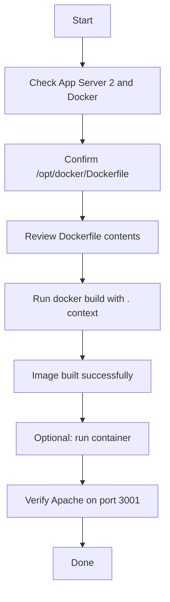

Absolutely — here’s a clean **OTS, runbook, Mermaid, pre-check, post-check, and todo** for the Dockerfile/image build task on App Server 2. [docker-community-leaders.github](https://docker-community-leaders.github.io/dockercommunity/docs/communityleaders/eventhandbooks/docker101/dockerfile/)

## OTS

**Objective:** Create `/opt/docker/Dockerfile` on App Server 2, build a Docker image from `ubuntu:24.04`, install `apache2`, and configure Apache to listen on port `3001` without changing any other Apache settings. [linkedin](https://www.linkedin.com/posts/agbetileamos_100daysofdevops-docker-devopss-activity-7390491035883421696-rxeY)

**Success criteria:**
- Dockerfile exists at `/opt/docker/Dockerfile`.
- Image builds successfully.
- Apache listens on port `3001`.
- No other Apache settings are modified. [linkedin](https://www.linkedin.com/posts/agbetileamos_100daysofdevops-docker-devopss-activity-7390491035883421696-rxeY)

## Pre-check

- Confirm you are on **App Server 2**.
- Confirm Docker is installed and running.
- Confirm `/opt/docker/` exists.
- Confirm the file is named exactly `Dockerfile` with capital `D`.
- Confirm the Dockerfile content uses `ubuntu:24.04` as the base image. [docker-community-leaders.github](https://docker-community-leaders.github.io/dockercommunity/docs/communityleaders/eventhandbooks/docker101/dockerfile/)

## Runbook

1. Go to the build directory:
```bash
cd /opt/docker
```

2. Verify the Dockerfile:
```bash
cat Dockerfile
```

3. Build the image:
```bash
sudo docker build -t apache-custom:latest .
```

4. Verify the image:
```bash
sudo docker images | grep apache-custom
```

5. If needed, run a container to test:
```bash
sudo docker run -d --name apache-test -p 3001:3001 apache-custom:latest
```

6. Check logs or access the app to confirm Apache is listening on port `3001`. [docker-community-leaders.github](https://docker-community-leaders.github.io/dockercommunity/docs/communityleaders/eventhandbooks/docker101/dockerfile/)

## Post-check

- `docker images` shows `apache-custom:latest`.
- `docker run` succeeds without errors.
- Container stays in running state.
- Apache starts successfully on port `3001`.
- No config beyond port change was altered. [forums.docker](https://forums.docker.com/t/how-to-change-a-apache-port-dynamically-in-dockerfile/94271)

## Todo

- Validate Dockerfile location and name.
- Build the image from `/opt/docker`.
- Verify the image name/tag.
- Optionally run the container for testing.
- Confirm Apache port `3001` is active.
- Record completion status.

## Mermaid



If you want, I can also give you a **short lab-answer version** or a **shell script checklist**.