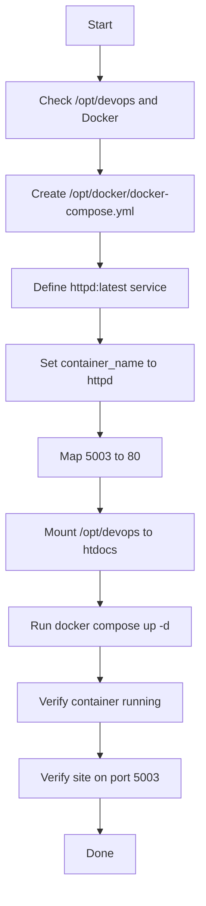

Create this file exactly at `/opt/docker/docker-compose.yml`:

```yaml
version: "3.8"

services:
  web:
    image: httpd:latest
    container_name: httpd
    ports:
      - "5003:80"
    volumes:
      - /opt/devops:/usr/local/apache2/htdocs
```

## Runbook

1. Create or edit the compose file:
```bash
sudo vi /opt/docker/docker-compose.yml
```

2. Paste the YAML above and save the file.

3. Start the container from the compose file:
```bash
cd /opt/docker
sudo docker compose up -d
```

4. Verify the container:
```bash
sudo docker ps
```

5. Verify the site is reachable on host port `5003`.

## OTS

**Objective:** Use Docker Compose to launch an `httpd:latest` container named `httpd`, expose port `5003`, and mount `/opt/devops` into `/usr/local/apache2/htdocs` without modifying the content. [theserverside](https://www.theserverside.com/blog/Coffee-Talk-Java-News-Stories-and-Opinions/Simple-Apache-docker-compose-example-with-Dockers-httpd-image)

## Pre-check

- Confirm App Server 1 is the target host.
- Confirm `/opt/devops` exists and already contains the website files.
- Confirm Docker and Docker Compose are installed.
- Confirm `/opt/docker/` exists.
- Confirm no other service is using host port `5003`. [theserverside](https://www.theserverside.com/blog/Coffee-Talk-Java-News-Stories-and-Opinions/Simple-Apache-docker-compose-example-with-Dockers-httpd-image)

## Post-check

- `docker ps` shows a running container named `httpd`.
- `curl http://localhost:5003` returns the hosted page.
- Files under `/opt/devops` remain unchanged.
- Container keeps running after startup. [theserverside](https://www.theserverside.com/blog/Coffee-Talk-Java-News-Stories-and-Opinions/Simple-Apache-docker-compose-example-with-Dockers-httpd-image)

## Todo

- Create the compose file.
- Map host port `5003` to container port `80`.
- Mount `/opt/devops` to `/usr/local/apache2/htdocs`.
- Start the stack with Compose.
- Validate the running container and site access.

## Mermaid



If you want, I can also provide the **exact one-line command sequence** to create the file and start it.