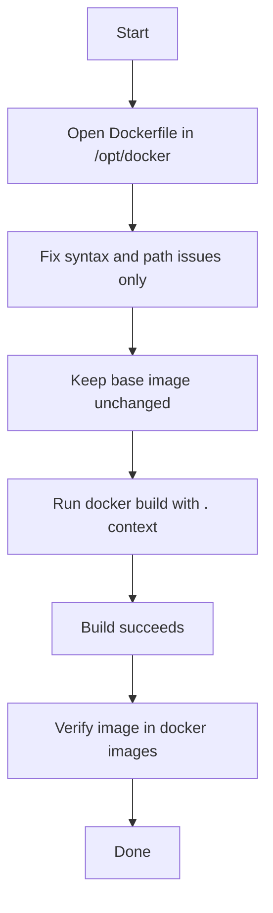

## OTS

**Objective:** Fix the Dockerfile under `/opt/docker` on App Server 2 and build a valid image without changing the base image or the content data. The build must succeed using the corrected Dockerfile and the proper build context. [chris-young](https://chris-young.net/45-100-resolve-dockerfile-issues/)

**Success criteria:**
- The Dockerfile builds successfully.
- The base image remains unchanged.
- `index.html` and other provided data remain unchanged.
- A Docker image is created and visible in `docker images`. [chris-young](https://chris-young.net/45-100-resolve-dockerfile-issues/)

## Pre-check

- Confirm you are on **App Server 2**.
- Confirm `/opt/docker/Dockerfile` exists.
- Confirm the Dockerfile syntax is corrected.
- Confirm the build context contains all required copied files.
- Confirm Docker is installed and available. [chris-young](https://chris-young.net/45-100-resolve-dockerfile-issues/)

## Runbook

1. Open the Dockerfile:
```bash
cd /opt/docker
vi Dockerfile
```

2. Fix only the broken parts:
- Keep `FROM httpd:2.4.43` unchanged.
- Keep valid Apache configuration changes.
- Ensure `COPY` source paths are relative to the build context.
- Do not edit `index.html`. [chris-young](https://chris-young.net/45-100-resolve-dockerfile-issues/)

3. Build the image:
```bash
docker build -t my-httpd-image:latest .
```

4. Verify the image:
```bash
docker images | grep my-httpd-image
```

5. Optionally run the image to test:
```bash
docker run -d --name httpd-test -p 8080:8080 my-httpd-image:latest
```

## Post-check

- `docker build` completes without error.
- The image appears in `docker images`.
- The Dockerfile remains aligned with the lab constraints.
- No provided data files were modified. [chris-young](https://chris-young.net/45-100-resolve-dockerfile-issues/)

## Todo

- Inspect and fix the Dockerfile.
- Ensure `COPY` paths are valid in the build context.
- Build the image with `docker build -t <name> .`.
- Verify successful image creation.
- Keep content files untouched.

## Mermaid



If you want, I can also give you a **short final answer** you can submit directly in the lab.