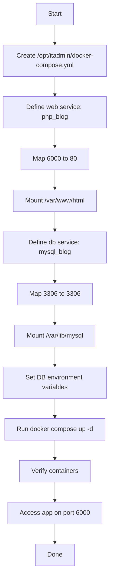

Below is a complete, lab-ready guide for the compose stack on **App Server 3**.

## Pre-requisites

- App Server 3 is reachable and Docker/Compose is installed.
- `/opt/itadmin/` exists or can be created.
- Host ports `6000` and `3306` are free.
- The host paths `/var/www/html` and `/var/lib/mysql` exist and must not be modified.
- You will use:
  - `php:*apache*` image for web.
  - `mariadb:latest` for DB. [hub.docker](https://hub.docker.com/_/php)

## OTS

**Objective:** Create `/opt/itadmin/docker-compose.yml` that starts two containers: `php_blog` for the PHP/Apache web service and `mysql_blog` for the MariaDB service, with the specified port and volume mappings. [hub.docker](https://hub.docker.com/_/php)

**Success criteria:**
- Compose file exists at the exact path.
- `php_blog` runs from a PHP Apache image.
- `mysql_blog` runs from `mariadb`.
- Web is reachable on port `6000`.
- DB listens on port `3306`.
- Requested volumes are mounted correctly. [hub.docker](https://hub.docker.com/_/php)

## Runbook

1. Create the compose directory:
```bash
sudo mkdir -p /opt/itadmin
```

2. Create the compose file:
```bash
sudo vi /opt/itadmin/docker-compose.yml
```

3. Paste this content:
```yaml
version: "3.8"

services:
  web:
    image: php:8.4-apache
    container_name: php_blog
    ports:
      - "6000:80"
    volumes:
      - /var/www/html:/var/www/html
    depends_on:
      - db

  db:
    image: mariadb:latest
    container_name: mysql_blog
    ports:
      - "3306:3306"
    volumes:
      - /var/lib/mysql:/var/lib/mysql
    environment:
      MYSQL_DATABASE: database_blog
      MYSQL_USER: bloguser
      MYSQL_PASSWORD: Str0ngP@ssw0rd123
      MYSQL_ROOT_PASSWORD: RootP@ssw0rd123
```

4. Start the stack:
```bash
cd /opt/itadmin
sudo docker compose up -d
```

5. Verify:
```bash
sudo docker ps
curl http://localhost:6000/
```

## Todo

- Create `/opt/itadmin/docker-compose.yml`.
- Define `web` and `db` services.
- Use a PHP Apache image and `mariadb:latest`.
- Set container names exactly as required.
- Map ports `6000:80` and `3306:3306`.
- Mount the specified host volumes.
- Set the DB environment variables.

## Post-check

- `docker ps` shows `php_blog` and `mysql_blog` running.
- `curl http://<server-ip>:6000/` returns the web page.
- Compose file is located exactly at `/opt/itadmin/docker-compose.yml`.
- No data in `/var/www/html` or `/var/lib/mysql` was altered. [hub.docker](https://hub.docker.com/_/php)

## Mermaid



If you want, I can also provide a **minimal compose file** version or a **one-shot command block** for the lab.