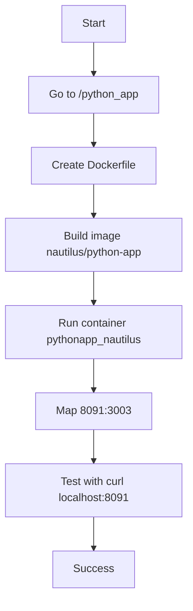

Got it — based on the Dockerized Python app task you shared, here’s a concise **TODO / OTS / Runbook / Learnings / Mermaid** package.

## TODO
- Create `/python_app/Dockerfile`.
- Use a Python base image.
- Install dependencies from `/python_app/src/requirements.txt`.
- Expose port `3003`.
- Run `server.py` with `CMD`.
- Build image as `nautilus/python-app`.
- Run container `pythonapp_nautilus` with `-p 8091:3003`.
- Test using `curl http://localhost:8091/`.

## OTS
- Confirm the build context is `/python_app`, not `/home/steve`.
- Verify `Dockerfile` exists in the build directory.
- Verify `requirements.txt` is present under `/python_app/src/`.
- If build fails, check Dockerfile path and syntax first.
- If the container starts but curl fails, check whether `server.py` binds to `0.0.0.0:3003`.

## Runbook
1. Go to the application directory:
   ```bash
   cd /python_app
   ```
2. Create the Dockerfile:
   ```bash
   cat > Dockerfile <<'EOF'
   FROM python:3.11-slim
   WORKDIR /python_app
   COPY src/requirements.txt /python_app/requirements.txt
   RUN pip install --no-cache-dir -r requirements.txt
   COPY src/ /python_app/
   EXPOSE 3003
   CMD ["python", "server.py"]
   EOF
   ```
3. Build the image:
   ```bash
   docker build -t nautilus/python-app .
   ```
4. Run the container:
   ```bash
   docker run -d --name pythonapp_nautilus -p 8091:3003 nautilus/python-app
   ```
5. Test the app:
   ```bash
   curl http://localhost:8091/
   ```

## Learnings
- Docker uses the current directory as the build context.
- A missing `Dockerfile` causes `docker build` to fail immediately.
- Port mapping must match the app’s internal listening port.
- `EXPOSE` documents the container port; `-p` publishes it on the host.
- For Python apps, `requirements.txt` should be installed during image build.

## Mermaid


If you want, I can turn this into a cleaner **incident-style runbook document** or a **Markdown file**.