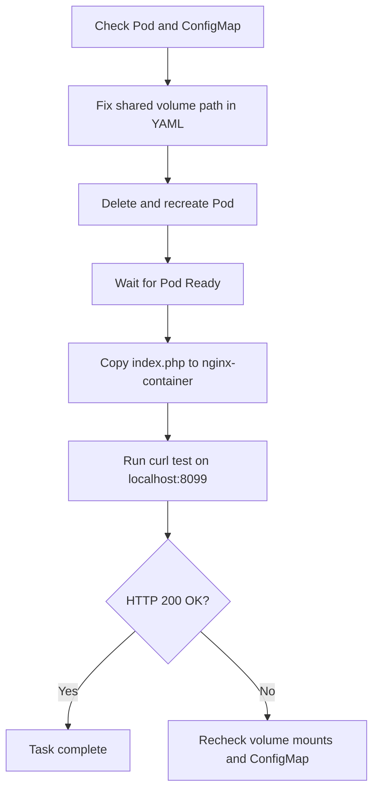

The exact issue was a **volume mount mismatch** between the two containers. `nginx-container` was serving `/var/www/html`, but `php-fpm-container` originally mounted the shared volume at `/usr/share/nginx/html`, so PHP could not resolve the file correctly. [kodekloud](https://kodekloud.com/community/t/cant-complete-the-task-deploy-nginx-and-phpfpm-on-kubernetes/138426)

## To do
- Fix the Pod spec so both containers use the same shared document root.
- Recreate the Pod.
- Copy `/home/thor/index.php` into `nginx-container`.
- Verify the site returns `200 OK`.

## Pre checks
- Confirm the Pod exists:
  ```bash
  kubectl get pod nginx-phpfpm
  ```
- Confirm the ConfigMap exists:
  ```bash
  kubectl get configmap nginx-config
  ```
- Check the Pod volume mounts:
  ```bash
  kubectl get pod nginx-phpfpm -o yaml
  ```

## Post checks
- Verify the file exists:
  ```bash
  kubectl exec nginx-phpfpm -c nginx-container -- ls -l /var/www/html
  ```
- Verify HTTP response:
  ```bash
  kubectl exec nginx-phpfpm -c nginx-container -- curl -I http://localhost:8099
  ```
- Expected result: `HTTP/1.1 200 OK`.

## OTS
- If you see `404`, check that both containers mount the same volume path.
- If the Pod is missing, recreate it from the YAML.
- If the ConfigMap is wrong, reload the Pod after fixing it.
- Always copy `index.php` **after** the Pod is ready.

## Runbook
1. Check current state:
   ```bash
   kubectl get pod nginx-phpfpm
   kubectl get configmap nginx-config
   ```
2. Fix the YAML so both containers use `/var/www/html`.
3. Recreate the Pod:
   ```bash
   kubectl delete pod nginx-phpfpm
   kubectl apply -f nginx-phpfpm.yaml
   kubectl wait --for=condition=Ready pod/nginx-phpfpm --timeout=120s
   ```
4. Copy the file:
   ```bash
   kubectl cp /home/thor/index.php nginx-phpfpm:/var/www/html/index.php -c nginx-container
   ```
5. Validate:
   ```bash
   kubectl exec nginx-phpfpm -c nginx-container -- curl -I http://localhost:8099
   ```

## Mermaid


If you want, I can turn this into a short **lab submission answer** too.