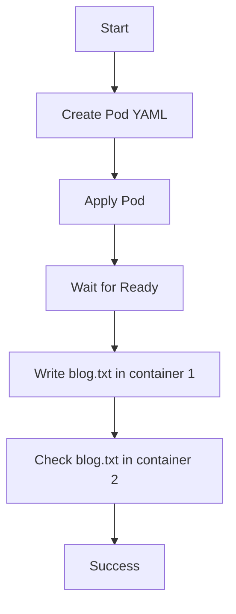

Here’s the clean version for the shared volume task.

## Todo
- Create a Pod named `volume-share-xfusion`.
- Add two containers using `fedora:latest`.
- Keep both containers running with `sleep`.
- Mount the shared `emptyDir` volume at `/tmp/blog` in container 1.
- Mount the same volume at `/tmp/demo` in container 2.
- Create `blog.txt` in container 1.
- Verify the same file appears in container 2. [kubernetes](https://kubernetes.io/docs/tasks/access-application-cluster/communicate-containers-same-pod-shared-volume/)

## Precheck
- Check cluster access:
  ```bash
  kubectl get nodes
  ```
- Check current namespace resources:
  ```bash
  kubectl get pods
  ```
- Make sure no old Pod with the same name exists:
  ```bash
  kubectl get pod volume-share-xfusion
  ```

## Postcheck
- Verify Pod is running:
  ```bash
  kubectl get pod volume-share-xfusion
  ```
- Verify file in first container:
  ```bash
  kubectl exec volume-share-xfusion -c volume-container-xfusion-1 -- ls -l /tmp/blog
  ```
- Verify file in second container:
  ```bash
  kubectl exec volume-share-xfusion -c volume-container-xfusion-2 -- ls -l /tmp/demo
  ```

## OTS
- Use one `emptyDir` volume shared by both containers.
- Use exact container names as given.
- Use `fedora:latest` for both containers.
- Keep both containers alive with `sleep`.
- Write the test file only after the Pod becomes Ready.

## Runbook
1. Create the Pod YAML:
   ```yaml
   apiVersion: v1
   kind: Pod
   metadata:
     name: volume-share-xfusion
   spec:
     volumes:
     - name: volume-share
       emptyDir: {}
     containers:
     - name: volume-container-xfusion-1
       image: fedora:latest
       command: ["/bin/sh", "-c", "sleep 3600"]
       volumeMounts:
       - name: volume-share
         mountPath: /tmp/blog
     - name: volume-container-xfusion-2
       image: fedora:latest
       command: ["/bin/sh", "-c", "sleep 3600"]
       volumeMounts:
       - name: volume-share
         mountPath: /tmp/demo
   ```
2. Apply it:
   ```bash
   kubectl apply -f volume-share-xfusion.yaml
   ```
3. Wait for readiness:
   ```bash
   kubectl wait --for=condition=Ready pod/volume-share-xfusion --timeout=120s
   ```
4. Create the file in container 1:
   ```bash
   kubectl exec volume-share-xfusion -c volume-container-xfusion-1 -- sh -c 'echo "Welcome to xFusionCorp Industries" > /tmp/blog/blog.txt'
   ```
5. Verify in container 2:
   ```bash
   kubectl exec volume-share-xfusion -c volume-container-xfusion-2 -- cat /tmp/demo/blog.txt
   ```

## Mermaid


If you want, I can also give you the **exact one-shot YAML only** version for this task.