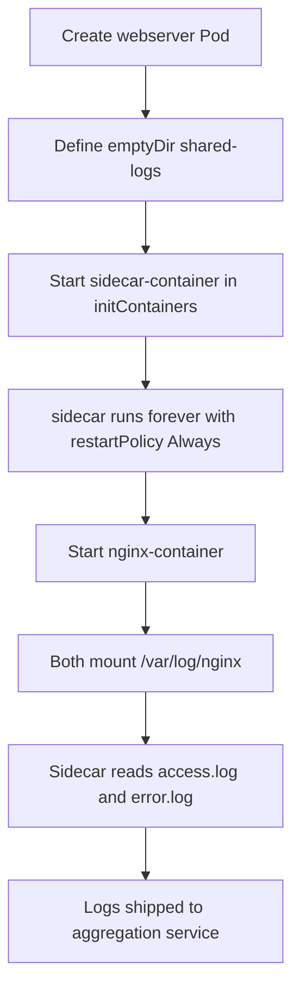

Here are the **complete steps** for the task, using the exact structure the lab usually expects: a Pod with an `initContainer`-style sidecar, `emptyDir` shared storage, and a long-running sidecar command. Kubernetes supports this “restartable init container” sidecar model by setting `restartPolicy: Always` inside `initContainers`. [kubernetes](https://kubernetes.io/docs/concepts/workloads/pods/sidecar-containers/)

## Purpose
This pattern keeps the main app container focused on serving web pages while the sidecar handles log shipping. Both containers share the same Pod network and an `emptyDir` volume, so the sidecar can read the Nginx access and error logs without using persistent storage. [kubernetes](https://kubernetes.io/docs/concepts/cluster-administration/logging/)

## Todo
- Create a Pod named `webserver`.
- Create an `emptyDir` volume named `shared-logs`.
- Add `nginx-container` using `nginx:latest`.
- Add `sidecar-container` using `ubuntu:latest`.
- Put the sidecar in `initContainers` with `restartPolicy: Always`.
- Mount `shared-logs` at `/var/log/nginx` in both containers.
- Make sure both containers stay running. [kubernetes](https://kubernetes.io/docs/concepts/workloads/pods/sidecar-containers/)

## Precheck
- Confirm cluster access:
  ```bash
  kubectl get nodes
  ```
- Confirm no conflicting Pod exists:
  ```bash
  kubectl get pod webserver
  ```
- Confirm the namespace is correct:
  ```bash
  kubectl config current-context
  ```

## Runbook
1. Create the YAML file:
   ```bash
   cat > webserver.yaml <<'EOF'
   apiVersion: v1
   kind: Pod
   metadata:
     name: webserver
   spec:
     volumes:
     - name: shared-logs
       emptyDir: {}
     initContainers:
     - name: sidecar-container
       image: ubuntu:latest
       restartPolicy: Always
       command: ["sh","-c","while true; do cat /var/log/nginx/access.log /var/log/nginx/error.log; sleep 30; done"]
       volumeMounts:
       - name: shared-logs
         mountPath: /var/log/nginx
     containers:
     - name: nginx-container
       image: nginx:latest
       volumeMounts:
       - name: shared-logs
         mountPath: /var/log/nginx
   EOF
   ```
2. Apply the manifest:
   ```bash
   kubectl apply -f webserver.yaml
   ```
3. Wait for readiness:
   ```bash
   kubectl wait --for=condition=Ready pod/webserver --timeout=120s
   ```
4. Verify the containers:
   ```bash
   kubectl describe pod webserver
   kubectl get pod webserver
   ```
5. Check the shared mount:
   ```bash
   kubectl exec webserver -c nginx-container -- ls -l /var/log/nginx
   kubectl exec webserver -c sidecar-container -- ls -l /var/log/nginx
   ```

## Postcheck
- Pod is `Running` and `Ready`.
- `nginx-container` exists.
- `sidecar-container` exists.
- `shared-logs` is mounted in both containers.
- Sidecar is continuously running and reading both log files. [kubernetes](https://kubernetes.io/docs/concepts/workloads/pods/sidecar-containers/)

## Mermaid


## Key note
If your lab uses the newer sidecar implementation, the `sidecar-container` must be in `initContainers` with `restartPolicy: Always`. If you place it in `containers`, some validators will mark the task wrong even if the Pod runs. [kubernetes](https://kubernetes.io/docs/concepts/workloads/pods/sidecar-containers/)

If you want, I can also give you a **shorter exam-ready version** with only the YAML and commands.