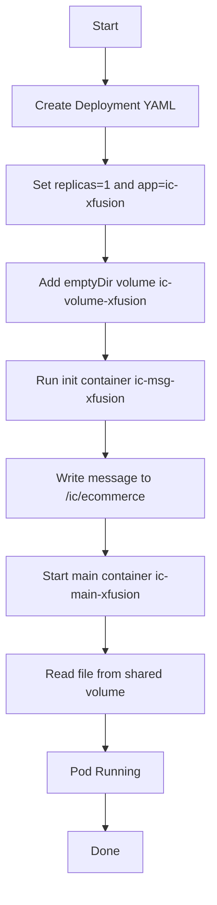

Init containers are Kubernetes containers that run **before** the main application containers and must finish successfully before the Pod becomes ready. They’re used for setup work like generating config files, waiting for dependencies, migrations, or writing shared data into a volume without baking that logic into the app image. [kubernetes](https://kubernetes.io/docs/concepts/workloads/pods/init-containers/)

## Purpose

In this task, the init container writes the file `ecommerce` into a shared `emptyDir` volume at `/ic`, and the main container keeps reading that file. This pattern is useful when the app image should stay clean and setup must happen at runtime during Pod startup. [kubernetes](https://kubernetes.io/docs/concepts/workloads/pods/init-containers/)

## OTS

**Objective:** Create a Deployment named `ic-deploy-xfusion` with one replica, one init container, one main container, and a shared `emptyDir` volume. The init container creates the file, and the main container continuously displays its content. [kubernetes](https://kubernetes.io/docs/concepts/workloads/pods/init-containers/)

**Success criteria:**
- Deployment name is `ic-deploy-xfusion`.
- Replica count is `1`.
- Label `app=ic-xfusion` is set on the Deployment and Pod template.
- Init container and main container names match exactly.
- Shared volume `ic-volume-xfusion` is of type `emptyDir`.
- Pod reaches Running state. [kubernetes](https://kubernetes.io/docs/concepts/workloads/pods/init-containers/)

## Pre-check

- Confirm `kubectl` is configured and can access the cluster.
- Confirm the current namespace if the lab expects a specific one.
- Confirm no existing deployment with the same name is present.
- Confirm the shared volume path `/ic` will be used by both containers. [kubernetes](https://kubernetes.io/docs/concepts/workloads/pods/init-containers/)

## Runbook

1. Create the deployment YAML, for example:
```yaml
apiVersion: apps/v1
kind: Deployment
metadata:
  name: ic-deploy-xfusion
spec:
  replicas: 1
  selector:
    matchLabels:
      app: ic-xfusion
  template:
    metadata:
      labels:
        app: ic-xfusion
    spec:
      volumes:
        - name: ic-volume-xfusion
          emptyDir: {}
      initContainers:
        - name: ic-msg-xfusion
          image: ubuntu:latest
          command: ["/bin/bash", "-c", "echo Init Done - Welcome to xFusionCorp Industries > /ic/ecommerce"]
          volumeMounts:
            - name: ic-volume-xfusion
              mountPath: /ic
      containers:
        - name: ic-main-xfusion
          image: ubuntu:latest
          command: ["/bin/bash", "-c", "while true; do cat /ic/ecommerce; sleep 5; done"]
          volumeMounts:
            - name: ic-volume-xfusion
              mountPath: /ic
```

2. Apply it:
```bash
kubectl apply -f deployment.yaml
```

3. Check rollout and pods:
```bash
kubectl get deploy,pods
kubectl describe pod <pod-name>
```

4. Confirm the init container completed and the main container is running.

## Todo

- Create the Deployment manifest.
- Add the shared `emptyDir` volume.
- Configure the init container to write the message.
- Configure the main container to read the file in a loop.
- Apply the manifest.
- Verify the Pod status and logs.

## Post-check

- `kubectl get deployment ic-deploy-xfusion` shows one replica available.
- `kubectl get pods` shows the Pod in `Running` state.
- Init container has completed successfully.
- Main container is reading the shared file content.
- The message `Init Done - Welcome to xFusionCorp Industries` is present in `/ic/ecommerce`. [kubernetes](https://kubernetes.io/docs/concepts/workloads/pods/init-containers/)

## Mermaid



If you want, I can also provide the **exact `kubectl apply` commands** and a **ready-to-use YAML file**.

Yes — that Pod is **Running**, so the easiest way to validate the init container’s work is to `exec` into the **main container** and read the shared file from the mounted volume. Since both containers share the same `emptyDir`, the file written by the init container should be visible there. [kubernetes](https://kubernetes.io/docs/tasks/debug/debug-application/get-shell-running-container/)

## Commands to verify

```bash
kubectl exec -it pod/ic-deploy-xfusion-687869766f-7j26c -c ic-main-xfusion -- /bin/bash
cat /ic/ecommerce
```

You can also check the file directly without opening a shell:

```bash
kubectl exec pod/ic-deploy-xfusion-687869766f-7j26c -c ic-main-xfusion -- cat /ic/ecommerce
```

## What to expect

The output should be:

```bash
Init Done - Welcome to xFusionCorp Industries
```

## Extra checks
If you want to confirm the init container completed:

```bash
kubectl describe pod ic-deploy-xfusion-687869766f-7j26c
```

And if the main container is looping output, you can also check its logs:

```bash
kubectl logs pod/ic-deploy-xfusion-687869766f-7j26c -c ic-main-xfusion
```

If you want, I can give you a **single-line validation command** for the lab.