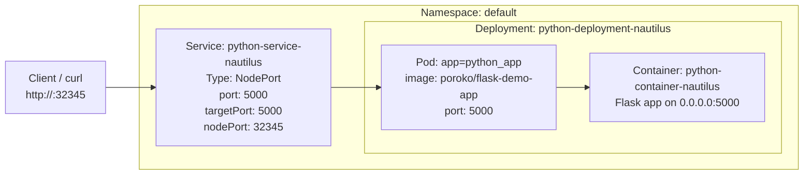

You’ve now correctly diagnosed the issue: Flask runs on port 5000, but the service was pointing to 8080. Below is a clean, logical documentation package for this task: **purpose**, **OTS**, **TODO**, **runbook**, and a **Mermaid diagram** you can reuse in your notes/runbooks.

***

## Purpose

Deploy and expose a Python Flask app (`poroko/flask-demo-app`) on a Kubernetes cluster so that:

- Deployment `python-deployment-nautilus` in `default` namespace runs the app on **port 5000**.
- Service `python-service-nautilus` exposes the app via **NodePort 32345**.
- Clients can reach the app at `http://<node-ip>:32345` (or `http://localhost:32345` if the jump host is a node). [kubernetes](https://kubernetes.io/docs/concepts/services-networking/service/)

***

## OTS (One-Time Setup / Fix) Commands

These are the minimal commands to fix and verify the lab from a clean state.

### 1) Fix deployment image (if needed)

```bash
# Ensure deployment uses the correct image
kubectl -n default set image deployment/python-deployment-nautilus \
  python-container-nautilus=poroko/flask-demo-app

# Watch rollout
kubectl -n default rollout status deployment/python-deployment-nautilus

# Check pods and logs
kubectl -n default get pods -l app=python_app -o wide
kubectl -n default logs <python-pod-name>
```

Expect logs like:

```text
* Running on http://0.0.0.0:5000/
```

### 2) Fix NodePort service

```bash
# Remove incorrect service
kubectl -n default delete svc python-service-nautilus

# Create corrected service spec
cat << 'EOF' > python-service-nautilus.yaml
apiVersion: v1
kind: Service
metadata:
  name: python-service-nautilus
  namespace: default
spec:
  type: NodePort
  selector:
    app: python_app
  ports:
    - protocol: TCP
      port: 5000
      targetPort: 5000
      nodePort: 32345
EOF

kubectl apply -f python-service-nautilus.yaml

# Validate service
kubectl -n default describe svc python-service-nautilus
```

You should see `Port: 5000/TCP`, `TargetPort: 5000/TCP`, `NodePort: 32345/TCP`, and `Endpoints: <pod-ip>:5000`. [kubernetes](https://kubernetes.io/docs/concepts/services-networking/service/)

### 3) Test external access

```bash
kubectl get nodes -o wide   # get node IP

# From jump host
curl http://<node-ip>:32345
# or, if jump-host is a node:
curl http://localhost:32345
```

***

## TODO (Checklist)

- [ ] Confirm deployment `python-deployment-nautilus` exists in `default` namespace.
- [ ] Ensure deployment uses image `poroko/flask-demo-app`.
- [ ] Ensure pod logs show Flask listening on `0.0.0.0:5000`.
- [ ] Ensure service `python-service-nautilus` exists in `default` namespace.
- [ ] Set service:
  - Type: `NodePort`
  - Selector: `app=python_app`
  - `port: 5000`
  - `targetPort: 5000`
  - `nodePort: 32345`
- [ ] Verify service endpoints are `<pod-ip>:5000`.
- [ ] Curl `http://<node-ip>:32345` and confirm Flask app response.

***

## Runbook (Logical Sequence)

### Step 1: Discover resources

1. Check deployments and pods:

   ```bash
   kubectl -n default get deploy python-deployment-nautilus
   kubectl -n default describe deploy python-deployment-nautilus
   kubectl -n default get pods -l app=python_app -o wide
   ```

2. Check services:

   ```bash
   kubectl -n default get svc
   kubectl -n default describe svc python-service-nautilus
   ```

This establishes current image, ports, labels, and service wiring.

### Step 2: Verify app is actually running

```bash
kubectl -n default logs <python-pod-name>
```

Confirm:

- Flask app is running.
- Log contains `Running on http://0.0.0.0:5000/`.

If not:

- Fix image or other runtime issues.
- Re-run `rollout status` and logs.

### Step 3: Correct the service configuration

If `describe svc` shows:

- `Port: 8080/TCP`
- `TargetPort: 8080/TCP`
- `NodePort: 32345/TCP`

then you must fix the port mapping.

1. Delete the misconfigured service:

   ```bash
   kubectl -n default delete svc python-service-nautilus
   ```

2. Apply correct service YAML:

   ```yaml
   apiVersion: v1
   kind: Service
   metadata:
     name: python-service-nautilus
     namespace: default
   spec:
     type: NodePort
     selector:
       app: python_app
     ports:
       - protocol: TCP
         port: 5000
         targetPort: 5000
         nodePort: 32345
   ```

3. Re-validate:

   ```bash
   kubectl -n default describe svc python-service-nautilus
   ```

Check:

- Type = NodePort.
- Port = 5000/TCP.
- TargetPort = 5000/TCP.
- NodePort = 32345/TCP.
- Endpoints point to `<pod-ip>:5000`.

### Step 4: Connectivity test

1. Get node IPs:

   ```bash
   kubectl get nodes -o wide
   ```

2. From jump host:

   ```bash
   curl http://<node-ip>:32345
   # or
   curl http://localhost:32345    # if jump-host is a node
   ```

You should see the Flask demo app page or response. If not:

- Confirm service endpoints:

  ```bash
  kubectl -n default describe svc python-service-nautilus
  ```

- Confirm firewall / security rules allow NodePort range (30000–32767). [sysdig](https://www.sysdig.com/blog/kubernetes-services-clusterip-nodeport-loadbalancer)

Once curl works, the lab validation around nodePort + targetPort will pass.

***

## Mermaid diagram (Logical Architecture)

This diagram captures the relationship between the deployment, pod, container, and NodePort service:



You can drop this diagram plus the runbook into your documentation (wiki, markdown notes) as a reusable pattern for “debugging NodePort vs container port mismatches” in Kubernetes.