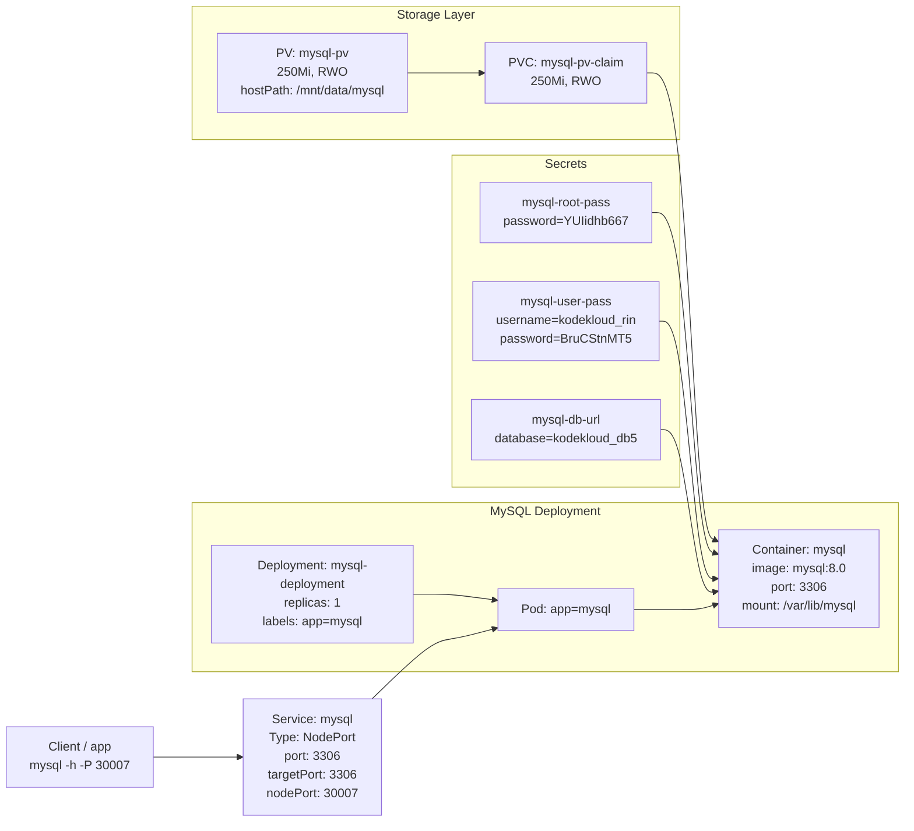

Below is a clean, task-focused documentation you can reuse or adapt as a runbook/knowledge base entry for this MySQL-on-Kubernetes lab.

***

## Title

Deploy MySQL on Kubernetes with PV, PVC, Secrets, and NodePort Service

***

## Purpose

Deploy a **MySQL server** on a Kubernetes cluster with:

- **Persistent storage** via a PersistentVolume (PV) and PersistentVolumeClaim (PVC).
- **Secure credentials** via Kubernetes Secrets.
- **Configuration via environment variables** sourced from secrets.
- **External access** via a NodePort service.

This setup models a production-like MySQL deployment with durable storage and secure credential handling. [kubernetes](https://kubernetes.io/docs/tutorials/stateful-application/mysql-wordpress-persistent-volume/)

***

## Requirements

1. Create a **PersistentVolume** `mysql-pv` with capacity `250Mi`.
2. Create a **PersistentVolumeClaim** `mysql-pv-claim` requesting `250Mi`.
3. Create a **Deployment** `mysql-deployment`:
   - Use any MySQL image (e.g., `mysql:8.0`).
   - Mount the PV-backed storage at `/var/lib/mysql`.
4. Create a **NodePort Service** `mysql` with `nodePort: 30007`.
5. Create three **Secrets**:
   - `mysql-root-pass`: `password=YUIidhb667`.
   - `mysql-user-pass`: `username=kodekloud_rin`, `password=BruCStnMT5`.
   - `mysql-db-url`: `database=kodekloud_db5`.
6. Define environment variables in the container:
   - `MYSQL_ROOT_PASSWORD` → secret `mysql-root-pass` key `password`.
   - `MYSQL_DATABASE` → secret `mysql-db-url` key `database`.
   - `MYSQL_USER` → secret `mysql-user-pass` key `username`.
   - `MYSQL_PASSWORD` → secret `mysql-user-pass` key `password`. [linkedin](https://www.linkedin.com/posts/bhaskargonthini1998_day67-100daysofdevops-kubernetes-activity-7416814604514709504-EfBF)

***

## Prechecks

Before implementing:

1. **Verify cluster context and connectivity**

   ```bash
   kubectl config current-context
   kubectl get nodes
   kubectl get ns
   ```

2. **Check for existing MySQL-related resources**

   ```bash
   kubectl get pv,pvc,deploy,svc,secret | grep -i mysql || echo "No existing MySQL resources"
   ```

3. **Confirm StorageClass behavior**

   ```bash
   kubectl get storageclass
   ```

   Note: In this lab, `local-path` exists and may dynamically provision PVs, but we explicitly create a static PV `mysql-pv` per requirement. [docs.k3s](https://docs.k3s.io/add-ons/storage)

***

## Implementation

### 1. Create PersistentVolume `mysql-pv`

```bash
cat << 'EOF' > mysql-pv.yaml
apiVersion: v1
kind: PersistentVolume
metadata:
  name: mysql-pv
spec:
  capacity:
    storage: 250Mi
  accessModes:
    - ReadWriteOnce
  persistentVolumeReclaimPolicy: Retain
  hostPath:
    path: /mnt/data/mysql
EOF

kubectl apply -f mysql-pv.yaml
kubectl get pv mysql-pv
kubectl describe pv mysql-pv
```

Key points:

- Name: `mysql-pv`.
- Capacity: `250Mi`.
- Access mode: `ReadWriteOnce`.
- Reclaim policy: `Retain`.
- Backed by local hostPath `/mnt/data/mysql`. [dev](https://dev.to/wycliffealphus/100-days-of-devops-day-66-3d35)

***

### 2. Create PersistentVolumeClaim `mysql-pv-claim`

```bash
cat << 'EOF' > mysql-pvc.yaml
apiVersion: v1
kind: PersistentVolumeClaim
metadata:
  name: mysql-pv-claim
spec:
  accessModes:
    - ReadWriteOnce
  resources:
    requests:
      storage: 250Mi
EOF

kubectl apply -f mysql-pvc.yaml
kubectl get pvc mysql-pv-claim
kubectl describe pvc mysql-pv-claim
```

Expected:

- `STATUS: Bound`.
- `VOLUME: mysql-pv`.
- `CAPACITY: 250Mi`.
- `ACCESS MODES: RWO`. [dev](https://dev.to/wycliffealphus/100-days-of-devops-day-66-3d35)

***

### 3. Create Secrets

#### 3.1 Root password

```bash
kubectl create secret generic mysql-root-pass \
  --from-literal=password=YUIidhb667
```

#### 3.2 User credentials

```bash
kubectl create secret generic mysql-user-pass \
  --from-literal=username=kodekloud_rin \
  --from-literal=password=BruCStnMT5
```

#### 3.3 Database name

```bash
kubectl create secret generic mysql-db-url \
  --from-literal=database=kodekloud_db5
```

Validation:

```bash
kubectl get secret mysql-root-pass mysql-user-pass mysql-db-url
kubectl describe secret mysql-root-pass
kubectl describe secret mysql-user-pass
kubectl describe secret mysql-db-url
```

Secrets must contain:

- `mysql-root-pass`: key `password`.
- `mysql-user-pass`: keys `username`, `password`.
- `mysql-db-url`: key `database`. [linkedin](https://www.linkedin.com/posts/bhaskargonthini1998_day67-100daysofdevops-kubernetes-activity-7416814604514709504-EfBF)

***

### 4. Create Deployment `mysql-deployment`

```bash
cat << 'EOF' > mysql-deployment.yaml
apiVersion: apps/v1
kind: Deployment
metadata:
  name: mysql-deployment
  labels:
    app: mysql
spec:
  replicas: 1
  selector:
    matchLabels:
      app: mysql
  template:
    metadata:
      labels:
        app: mysql
    spec:
      containers:
        - name: mysql
          image: mysql:8.0
          env:
            - name: MYSQL_ROOT_PASSWORD
              valueFrom:
                secretKeyRef:
                  name: mysql-root-pass
                  key: password
            - name: MYSQL_DATABASE
              valueFrom:
                secretKeyRef:
                  name: mysql-db-url
                  key: database
            - name: MYSQL_USER
              valueFrom:
                secretKeyRef:
                  name: mysql-user-pass
                  key: username
            - name: MYSQL_PASSWORD
              valueFrom:
                secretKeyRef:
                  name: mysql-user-pass
                  key: password
          ports:
            - containerPort: 3306
              name: mysql
          volumeMounts:
            - name: mysql-persistent-storage
              mountPath: /var/lib/mysql
      volumes:
        - name: mysql-persistent-storage
          persistentVolumeClaim:
            claimName: mysql-pv-claim
EOF

kubectl apply -f mysql-deployment.yaml
kubectl get deploy mysql-deployment
kubectl get pods -l app=mysql -o wide
kubectl describe deploy mysql-deployment
```

Key validation points:

- Deployment name: `mysql-deployment`.
- Container image: `mysql:8.0` (or any MySQL image).
- Volume mount: `/var/lib/mysql` from `mysql-persistent-storage`.
- Volume: PVC `mysql-pv-claim`.
- Env mapping:

  ```text
  MYSQL_ROOT_PASSWORD -> mysql-root-pass/password
  MYSQL_DATABASE      -> mysql-db-url/database
  MYSQL_USER          -> mysql-user-pass/username
  MYSQL_PASSWORD      -> mysql-user-pass/password
  ``` [kubernetes](https://kubernetes.io/docs/tutorials/stateful-application/mysql-wordpress-persistent-volume/)

***

### 5. Create NodePort Service `mysql` (30007)

```bash
cat << 'EOF' > mysql-service.yaml
apiVersion: v1
kind: Service
metadata:
  name: mysql
spec:
  type: NodePort
  selector:
    app: mysql
  ports:
    - protocol: TCP
      port: 3306
      targetPort: 3306
      nodePort: 30007
EOF

kubectl apply -f mysql-service.yaml
kubectl get svc mysql
kubectl describe svc mysql
```

Expected:

- `TYPE: NodePort`.
- `PORT(S): 3306:30007/TCP`.
- `Selector: app=mysql`.
- `Endpoints: <mysql-pod-ip>:3306`. [linkedin](https://www.linkedin.com/posts/bhaskargonthini1998_day67-100daysofdevops-kubernetes-activity-7416814604514709504-EfBF)

***

## Validation Checklist

Run:

```bash
kubectl get pv mysql-pv
kubectl get pvc mysql-pv-claim
kubectl get deploy mysql-deployment
kubectl get svc mysql
kubectl get secret mysql-root-pass mysql-user-pass mysql-db-url
kubectl describe deploy mysql-deployment
kubectl describe svc mysql
```

Confirm:

- **PV**:
  - `Name: mysql-pv`.
  - `Capacity: 250Mi`.
- **PVC**:
  - `Name: mysql-pv-claim`.
  - `STATUS: Bound`.
  - `CAPACITY: 250Mi`.
- **Deployment**:
  - `Name: mysql-deployment`.
  - `READY: 1/1`.
  - Volume mount `/var/lib/mysql` from PVC `mysql-pv-claim`.
  - Env vars wired from secrets as specified.
- **Service**:
  - `Name: mysql`.
  - `Type: NodePort`.
  - `Port: 3306`.
  - `NodePort: 30007`.
- **Secrets**:
  - Keys and values match requirements.

Optional connectivity test (if `mysql` client is available):

```bash
kubectl get nodes -o wide
mysql -h <node-ip> -P 30007 -u kodekloud_rin -pBruCStnMT5
```

***

## Mermaid Diagram



This documentation captures the full MySQL lab: storage, secrets, deployment, service, and validation, in a format you can reuse for future tasks or as part of a K8s runbook.