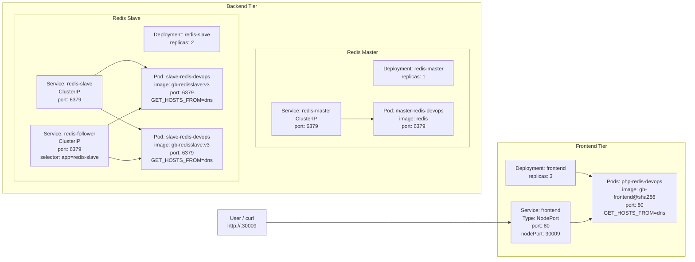

Here’s a clean, self-contained documentation/runbook for the **Guestbook app on Kubernetes** you just deployed. You can reuse this directly in your notes or internal wiki.

***

## Title

Deploy Guestbook App on Kubernetes (Redis Backend + PHP Frontend)

***

## Purpose

Deploy a **Guestbook web application** on a Kubernetes cluster with:

- **Back-end tier**: Redis master and Redis slaves, exposed via appropriate services.
- **Front-end tier**: PHP + AngularJS guestbook UI talking to Redis.
- **External access**: Frontend exposed via a NodePort service on port `30009`.

This models a simple multi-tier application with separate caching/storage and presentation layers, suitable for demos and practice. [github](https://github.com/joseeden/KodeKloud_Engineer_Labs/blob/main/Tasks_121-130/TASK_128_Deploy_Guest_Book_App.md)

***

## Architecture Overview

### Back-end tier

- **redis-master Deployment**
  - Name: `redis-master`
  - Replicas: `1`
  - Container name: `master-redis-devops`
  - Image: `redis`
  - Resource requests: `cpu: 100m`, `memory: 100Mi`
  - Container port: `6379`
- **redis-master Service**
  - Name: `redis-master`
  - Type: `ClusterIP`
  - Port: `6379`, targetPort: `6379`

- **redis-slave Deployment**
  - Name: `redis-slave`
  - Replicas: `2`
  - Container name: `slave-redis-devops`
  - Image: `gcr.io/google_samples/gb-redisslave:v3`
  - Resource requests: `cpu: 100m`, `memory: 100Mi`
  - Env: `GET_HOSTS_FROM=dns`
  - Container port: `6379`
- **redis-slave Service**
  - Name: `redis-slave`
  - Type: `ClusterIP`
  - Port: `6379`, targetPort: `6379`

- **redis-follower Service**
  - Name: `redis-follower`
  - Type: `ClusterIP`
  - Port: `6379`, targetPort: `6379`
  - Selector: `app=redis-slave` (points to slave pods)

### Front-end tier

- **frontend Deployment**
  - Name: `frontend`
  - Replicas: `3`
  - Container name: `php-redis-devops`
  - Image:  
    `gcr.io/google-samples/gb-frontend@sha256:a908df8486ff66f2c4daa0d3d8a2fa09846a1fc8efd65649c0109695c7c5cbff`
  - Resource requests: `cpu: 100m`, `memory: 100Mi`
  - Env: `GET_HOSTS_FROM=dns`
  - Container port: `80`
- **frontend Service**
  - Name: `frontend`
  - Type: `NodePort`
  - Port: `80`, targetPort: `80`
  - NodePort: `30009`

***

## Prechecks

Before deploying:

1. **Verify kubectl context and connectivity**

   ```bash
   kubectl config current-context
   kubectl get nodes
   kubectl get ns
   ```

2. **Ensure no conflicting resources**

   ```bash
   kubectl get deploy,svc,pods | grep -E 'redis|frontend' || echo "No guestbook-related resources"
   ```

***

## Implementation

### 1. Back-end: Redis master

#### 1.1 redis-master Deployment

```bash
cat << 'EOF' > redis-master-deploy.yaml
apiVersion: apps/v1
kind: Deployment
metadata:
  name: redis-master
  labels:
    app: redis-master
spec:
  replicas: 1
  selector:
    matchLabels:
      app: redis-master
  template:
    metadata:
      labels:
        app: redis-master
    spec:
      containers:
        - name: master-redis-devops
          image: redis
          resources:
            requests:
              cpu: "100m"
              memory: "100Mi"
          ports:
            - containerPort: 6379
              name: redis
EOF

kubectl apply -f redis-master-deploy.yaml
kubectl get deploy,pods -l app=redis-master
```

#### 1.2 redis-master Service

```bash
cat << 'EOF' > redis-master-svc.yaml
apiVersion: v1
kind: Service
metadata:
  name: redis-master
  labels:
    app: redis-master
spec:
  selector:
    app: redis-master
  ports:
    - protocol: TCP
      port: 6379
      targetPort: 6379
EOF

kubectl apply -f redis-master-svc.yaml
kubectl get svc redis-master
kubectl describe svc redis-master
```

***

### 2. Back-end: Redis slave

#### 2.1 redis-slave Deployment

```bash
cat << 'EOF' > redis-slave-deploy.yaml
apiVersion: apps/v1
kind: Deployment
metadata:
  name: redis-slave
  labels:
    app: redis-slave
spec:
  replicas: 2
  selector:
    matchLabels:
      app: redis-slave
  template:
    metadata:
      labels:
        app: redis-slave
    spec:
      containers:
        - name: slave-redis-devops
          image: gcr.io/google_samples/gb-redisslave:v3
          resources:
            requests:
              cpu: "100m"
              memory: "100Mi"
          env:
            - name: GET_HOSTS_FROM
              value: "dns"
          ports:
            - containerPort: 6379
              name: redis
EOF

kubectl apply -f redis-slave-deploy.yaml
kubectl get deploy,pods -l app=redis-slave
```

#### 2.2 redis-slave Service

```bash
cat << 'EOF' > redis-slave-svc.yaml
apiVersion: v1
kind: Service
metadata:
  name: redis-slave
  labels:
    app: redis-slave
spec:
  selector:
    app: redis-slave
  ports:
    - protocol: TCP
      port: 6379
      targetPort: 6379
EOF

kubectl apply -f redis-slave-svc.yaml
kubectl get svc redis-slave
kubectl describe svc redis-slave
```

#### 2.3 redis-follower Service

```bash
cat << 'EOF' > redis-follower-svc.yaml
apiVersion: v1
kind: Service
metadata:
  name: redis-follower
  labels:
    app: redis-follower
spec:
  selector:
    app: redis-slave
  ports:
    - protocol: TCP
      port: 6379
      targetPort: 6379
EOF

kubectl apply -f redis-follower-svc.yaml
kubectl get svc redis-follower
kubectl describe svc redis-follower
```

***

### 3. Front-end: Guestbook UI

#### 3.1 frontend Deployment

```bash
cat << 'EOF' > frontend-deploy.yaml
apiVersion: apps/v1
kind: Deployment
metadata:
  name: frontend
  labels:
    app: frontend
spec:
  replicas: 3
  selector:
    matchLabels:
      app: frontend
  template:
    metadata:
      labels:
        app: frontend
    spec:
      containers:
        - name: php-redis-devops
          image: gcr.io/google-samples/gb-frontend@sha256:a908df8486ff66f2c4daa0d3d8a2fa09846a1fc8efd65649c0109695c7c5cbff
          resources:
            requests:
              cpu: "100m"
              memory: "100Mi"
          env:
            - name: GET_HOSTS_FROM
              value: "dns"
          ports:
            - containerPort: 80
              name: http
EOF

kubectl apply -f frontend-deploy.yaml
kubectl get deploy,pods -l app=frontend
kubectl describe deploy frontend
```

#### 3.2 frontend Service (NodePort)

```bash
cat << 'EOF' > frontend-svc.yaml
apiVersion: v1
kind: Service
metadata:
  name: frontend
  labels:
    app: frontend
spec:
  type: NodePort
  selector:
    app: frontend
  ports:
    - protocol: TCP
      port: 80
      targetPort: 80
      nodePort: 30009
EOF

kubectl apply -f frontend-svc.yaml
kubectl get svc frontend
kubectl describe svc frontend
```

Expected service output:

- `TYPE: NodePort`
- `PORT(S): 80:30009/TCP`
- `Endpoints: <frontend-pod-ips>:80`. [github](https://github.com/joseeden/KodeKloud_Engineer_Labs/blob/main/Tasks_121-130/TASK_128_Deploy_Guest_Book_App.md)

***

## Validation

### 1. Resource overview

```bash
kubectl get deploy
kubectl get pods -o wide
kubectl get svc
```

You should see:

- Deployments: `redis-master` (1/1), `redis-slave` (2/2), `frontend` (3/3).
- Services: `redis-master`, `redis-slave`, `redis-follower` (ClusterIP, port 6379), `frontend` (NodePort 30009).

### 2. Back-end checks

```bash
kubectl describe deploy redis-master
kubectl describe svc redis-master

kubectl describe deploy redis-slave
kubectl describe svc redis-slave
kubectl describe svc redis-follower
```

Confirm:

- redis-master deployment:
  - Container `master-redis-devops`, image `redis`, requests `cpu: 100m`, `memory: 100Mi`, port `6379`.
- redis-master service:
  - Port/targetPort `6379/TCP`, endpoints include master pod.

- redis-slave deployment:
  - Container `slave-redis-devops`, image `gcr.io/google_samples/gb-redisslave:v3`, env `GET_HOSTS_FROM=dns`, requests `cpu: 100m`, `memory: 100Mi`, port `6379`.
- redis-slave & redis-follower services:
  - Port/targetPort `6379/TCP`, selectors targeting `app=redis-slave`, endpoints include both slave pods.

### 3. Front-end checks

```bash
kubectl describe deploy frontend
kubectl describe svc frontend
```

Confirm:

- frontend deployment:
  - Container `php-redis-devops`, correct SHA256 image, env `GET_HOSTS_FROM=dns`, requests `cpu: 100m`, `memory: 100Mi`, port `80`.
- frontend service:
  - `Type: NodePort`, `port: 80/TCP`, `nodePort: 30009/TCP`, endpoints pointing to all three frontend pods.

### 4. Application test (Guestbook UI)

From the jump host:

```bash
curl http://localhost:30009
# or, if accessing externally:
curl http://<node-ip>:30009
```

Expected response:

```html
<html ng-app="redis">
  <head>
    <title>Guestbook</title>
    ...
  </head>
  <body ng-controller="RedisCtrl">
    <div style="width: 50%; margin-left: 20px">
      <h2>Guestbook</h2>
      <form> ... </form>
      <div ng-repeat="msg in messages track by $index">
        {{msg}}
      </div>
    </div>
  </body>
</html>
```

This proves the Guestbook app is served correctly and wired to Redis. [github](https://github.com/joseeden/KodeKloud_Engineer_Labs/blob/main/Tasks_121-130/TASK_128_Deploy_Guest_Book_App.md)

***

## Mermaid Diagram



This documentation covers:

- What was deployed and why.
- Exact YAML manifests.
- Validation commands.
- Architecture diagram.

You can store it as your canonical “Deploy Guestbook App on Kubernetes” runbook.