# Architecture Explained — Reasoning, Diagrams, Issues & Fixes

Companion to [`Architecture.md`](Architecture.md).

`Architecture.md` answers **"what is it and how does each cloud spell it?"**
This document answers the four questions that come *after* that:

| Question | Section in every entry |
| --- | --- |
| Can I explain this to someone in 30 seconds? | **In one sentence** |
| *Why* does this component exist at all? | **The reason** |
| What is actually happening on the wire? | **Mermaid** (renders inline — no image files) |
| It broke. What broke, and what do I type? | **Issues → Fixes** + **Verify it** |

Every diagram here is **Mermaid**, not a JPEG, so it renders on GitHub, diffs in git, and can be
edited without a drawing tool. The JPEGs in [`100DaysofNW/`](100DaysofNW/) stay as the illustrated
versions; these are the maintainable ones.

---

## How to read the "Issues → Fixes" tables

Each row is a real failure mode, written the way you actually meet it:

> **Symptom** (what you observe) → **Root cause** (what is actually wrong) → **Fix** (what you change)

The symptom column is deliberately the thing you see *first* — a timeout, a 502, a bill — because
that is the only information you have when the pager goes off.

---

## Index

| Entry | Topic | Jump to |
| --- | --- | --- |
| **E0** | Defects found in `Architecture.md` itself | [§0](#0--defects-found-in-architecturemd-itself) |
| **C1** | VPC / VNet — the boundary | [§C1](#c1--vpc--vnet) |
| **C2** | Subnets & tiering | [§C2](#c2--subnets--tiering) |
| **C3** | Route tables & UDR | [§C3](#c3--route-tables--udr) |
| **C4** | Security Groups / NSG | [§C4](#c4--security-groups--nsg) |
| **C5** | NACLs & layered defence | [§C5](#c5--nacls--layered-defence) |
| **C6** | Centralised egress inspection | [§C6](#c6--centralised-egress-inspection) |
| **C7** | Private service access | [§C7](#c7--private-service-access) |
| **C8** | Internet Gateway | [§C8](#c8--internet-gateway) |
| **C9** | NAT Gateway vs NAT Instance | [§C9](#c9--nat-gateway-vs-nat-instance) |
| **C10** | Peering | [§C10](#c10--peering) |
| **C11** | Hub & spoke / transit | [§C11](#c11--hub--spoke--transit) |
| **C12** | Load balancers L7 vs L4 | [§C12](#c12--load-balancers-l7-vs-l4) |
| **C13** | LB algorithms | [§C13](#c13--lb-algorithms) |
| **C14** | LB types & features | [§C14](#c14--lb-types--features) |
| **C15** | Edge, listeners, port forwarding | [§C15](#c15--edge-listeners-port-forwarding) |
| **C16** | Agentic IaC & policy-as-code | [§C16](#c16--agentic-iac--policy-as-code) |
| **K1** | Production EKS reference architecture | [§K1](#k1--production-eks-reference-architecture) |
| **K2** | Zero-downtime Kubernetes upgrades | [§K2](#k2--zero-downtime-kubernetes-upgrades) |
| **A** | Debugging order as a decision tree | [§A](#a--debugging-order-as-a-decision-tree) |

---

## 0 — Defects found in `Architecture.md` itself

A documentation review of the source file, in the same symptom → cause → fix format.

| # | Symptom | Root cause | Fix | Status |
| --- | --- | --- | --- | --- |
| 1 | The "Production EKS Cluster" diagram renders as a wall of raw text on GitHub, and the `---`/`title:` lines above it render as a horizontal rule plus stray text | The block at the end of Appendix C was never wrapped in a ` ```mermaid ` fence — every other diagram in the file is | Wrap the block in a mermaid fence and give it a real heading | **Fixed** — see the commit accompanying this document |
| 2 | Two `# H1` headings in one file (`Multi-Cloud Network Architecture Guide` and `Zero-Downtime Kubernetes Upgrade Runbook`), so the document outline shows two documents | Two guides were concatenated without demoting the second heading | Acceptable if intentional (the file is a binder, not one guide). Noted so it is a decision, not an accident | Noted |
| 3 | C8 (Internet Gateway) and C9 (NAT) have no diagram at all, while C1–C7 and C12–C16 do | The JPEG set was never extended to cover them | Mermaid diagrams supplied here in [§C8](#c8--internet-gateway) and [§C9](#c9--nat-gateway-vs-nat-instance) | **Fixed here** |
| 4 | C9's comparison table is ASCII art inside a plain code fence — it does not reflow on mobile and cannot be sorted or diffed cleanly | Pasted from a terminal rather than written as Markdown | Re-rendered as a Markdown table in [§C9](#c9--nat-gateway-vs-nat-instance) | **Fixed here** |
| 5 | Concept Index links to C1–C16 but nothing links *forward* to the Kubernetes runbook | The runbook was appended after the index was written | Index entries **K1/K2** added in this document | **Fixed here** |

> **Why this section exists.** "Issues and fixes" applies to the documentation as much as the
> infrastructure. A diagram that does not render is an outage in the doc.

---

## C1 — VPC / VNet

> Source: [`Architecture.md` §3.1](Architecture.md#c1--vpc--vnet-the-network-boundary)

### In one sentence
A private, software-defined IP address space that you own, in which nothing is reachable from
outside until you deliberately build a path in.

### The reason
Before VPCs, cloud instances sat on a shared provider network and isolation was done entirely with
host firewalls — one misconfigured host and you were on the same L2 segment as a stranger. The VPC
moves isolation from *the host* down to *the network fabric*: two VPCs cannot reach each other even
if every firewall in both is set to allow-all, because there is no route and no shared address
space. That is why the VPC is the **blast-radius unit** — it is the only boundary in cloud
networking that fails closed by default.

The one decision that outlives everything else here is the **CIDR plan**. Routing, peering, and
hybrid connectivity all depend on non-overlapping ranges, and you cannot renumber a live estate.

### How it actually works

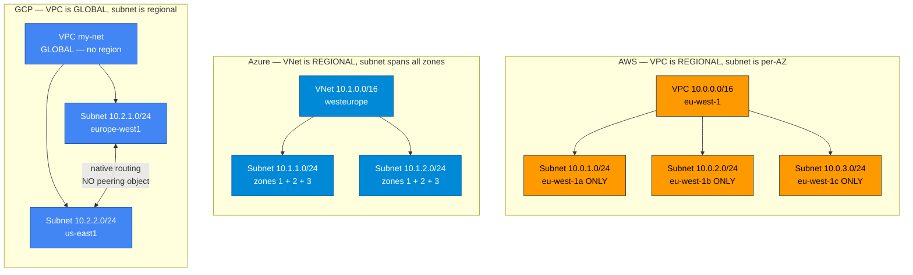
```mermaid
flowchart TB
    subgraph AWSREG["AWS — VPC is REGIONAL, subnet is per-AZ"]
        direction TB
        AV["VPC 10.0.0.0/16<br/>eu-west-1"]
        AV --> AS1["Subnet 10.0.1.0/24<br/>eu-west-1a ONLY"]
        AV --> AS2["Subnet 10.0.2.0/24<br/>eu-west-1b ONLY"]
        AV --> AS3["Subnet 10.0.3.0/24<br/>eu-west-1c ONLY"]
    end

    subgraph AZREG["Azure — VNet is REGIONAL, subnet spans all zones"]
        direction TB
        ZV["VNet 10.1.0.0/16<br/>westeurope"]
        ZV --> ZS1["Subnet 10.1.1.0/24<br/>zones 1 + 2 + 3"]
        ZV --> ZS2["Subnet 10.1.2.0/24<br/>zones 1 + 2 + 3"]
    end

    subgraph GCPREG["GCP — VPC is GLOBAL, subnet is regional"]
        direction TB
        GV["VPC my-net<br/>GLOBAL — no region"]
        GV --> GS1["Subnet 10.2.1.0/24<br/>europe-west1"]
        GV --> GS2["Subnet 10.2.2.0/24<br/>us-east1"]
        GS1 <-->|"native routing<br/>NO peering object"| GS2
    end

    classDef aws fill:#FF9900,stroke:#232F3E,color:#000
    classDef az fill:#0089D6,stroke:#005BA1,color:#fff
    classDef gcp fill:#4285F4,stroke:#174EA6,color:#fff
    class AV,AS1,AS2,AS3 aws
    class ZV,ZS1,ZS2 az
    class GV,GS1,GS2 gcp
```

**Read it as:** the same word ("VPC") buys you a different blast radius on each provider. On GCP the
two subnets above talk to each other with no peering object at all; the identical design on AWS
needs two VPCs and a Transit Gateway.

### Issues → Fixes

| Symptom | Root cause | Fix |
| --- | --- | --- |
| Peering request fails with `overlapping CIDR` and there is no workaround | Two environments were both built on `10.0.0.0/16` by different teams | No in-place fix — one side must be renumbered. **Prevent it:** allocate a non-overlapping `/16` per environment × region on day one, in an IPAM (AWS VPC IPAM / Azure IPAM / GCP internal ranges) rather than a spreadsheet |
| Ran out of IPs in a subnet that "should have been big enough" | Provider reservations were not budgeted: AWS reserves 5 IPs per subnet, Azure 5, GCP 4 — and EKS/AKS pods consume subnet IPs directly with the VPC CNI | Size for `nodes × maxPods`, not `nodes`. Add a secondary CIDR (AWS) or a second address space (Azure) rather than rebuilding |
| A brand-new account already has a wide-open network with an internet route | The **default VPC** (AWS, per region) or **auto-mode VPC** (GCP) exists before anyone logs in | AWS: delete default VPCs in every region as an account-baseline step. GCP: set `constraints/compute.skipDefaultNetworkCreation` at the org node so it is never created |
| Cross-region traffic bills far higher than expected on AWS | Every cross-region hop is a TGW attachment-hour + per-GB charge; the GCP equivalent is free-form intra-VPC | Expected behaviour, not a bug — but model it before choosing a topology. Collapse chatty services into one region |
| Cannot delete a VPC; "has dependencies" | ENIs left behind by Lambda, RDS, VPC endpoints, or a NAT Gateway still hold the subnets | Delete in dependency order: endpoints → NAT GW → ENIs → subnets → IGW detach → VPC. `aws ec2 describe-network-interfaces --filters Name=vpc-id,Values=<id>` names the blocker |

### Verify it

```bash
# AWS — is a default VPC lurking in any region?
for r in $(aws ec2 describe-regions --query 'Regions[].RegionName' --output text); do
  aws ec2 describe-vpcs --region "$r" --filters Name=isDefault,Values=true \
    --query "Vpcs[].VpcId" --output text | grep -q . && echo "DEFAULT VPC in $r"
done

# Azure — list every address space to spot overlaps
az network vnet list --query "[].{name:name, rg:resourceGroup, cidr:addressSpace.addressPrefixes}" -o table

# GCP — confirm the VPC is custom-mode (not auto-mode)
gcloud compute networks list --format="table(name, x_gcloud_subnet_mode)"
```

---

## C2 — Subnets & tiering

> Source: [`Architecture.md` §3.2](Architecture.md#c2--subnets--network-tiering)

### In one sentence
A slice of the VPC CIDR whose **route table** — not its name — decides whether it is public,
private, or isolated.

### The reason
"Public" and "private" are not properties a subnet has; they are consequences of where `0.0.0.0/0`
points. This matters because it means tiering is enforced by **routing**, which fails closed: an
isolated subnet with no default route cannot exfiltrate data even if every firewall rule in it is
set to allow-all and the workload is fully compromised. Firewall rules are a list someone maintains;
the absence of a route is a physical fact. That is the whole argument for putting databases in a
subnet with no default route.

### How it actually works

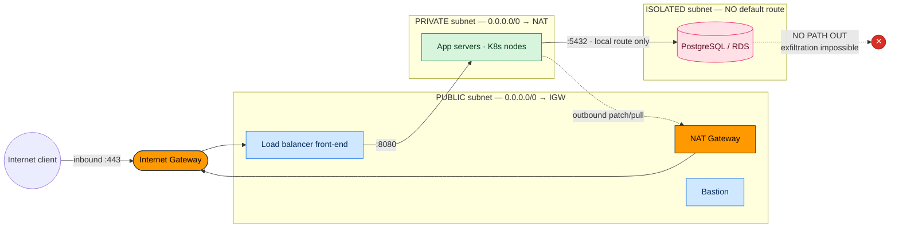
```mermaid
flowchart LR
    IGW(["Internet Gateway"]):::edge
    NAT["NAT Gateway"]:::edge

    subgraph PUB["PUBLIC subnet — 0.0.0.0/0 → IGW"]
        LB["Load balancer front-end"]:::pub
        NAT
        BAS["Bastion"]:::pub
    end

    subgraph PRIV["PRIVATE subnet — 0.0.0.0/0 → NAT"]
        APP["App servers · K8s nodes"]:::priv
    end

    subgraph ISO["ISOLATED subnet — NO default route"]
        DB[("PostgreSQL / RDS")]:::iso
    end

    Client(("Internet client")) -->|inbound :443| IGW
    IGW --> LB
    LB -->|":8080"| APP
    APP -->|":5432 · local route only"| DB
    APP -.->|"outbound patch/pull"| NAT
    NAT --> IGW
    DB -.->|"NO PATH OUT<br/>exfiltration impossible"| X(("✕")):::block

    classDef edge fill:#FF9900,stroke:#232F3E,color:#000
    classDef pub fill:#cfe8ff,stroke:#1a73e8,color:#062a5a
    classDef priv fill:#d7f5dd,stroke:#1e8e3e,color:#0b3d1a
    classDef iso fill:#ffe0e6,stroke:#e91e63,color:#5a0d24
    classDef block fill:#d93025,stroke:#7f1d1d,color:#fff
```

### Issues → Fixes

| Symptom | Root cause | Fix |
| --- | --- | --- |
| A subnet named `public-a` black-holes all traffic | Its route table lost the `0.0.0.0/0 → igw-xxx` entry (or was re-associated to the private table). The name never changed | Compare the *association*, not the name: `aws ec2 describe-route-tables --filters Name=association.subnet-id,Values=<subnet>`. Re-add the IGW route |
| EKS/AKS pods stop scheduling with `insufficient IPs` while nodes look fine | With the AWS VPC CNI (and Azure CNI) every **pod** takes a subnet IP, not just every node | Move to a larger secondary CIDR for pods, or switch to prefix delegation (AWS) / Azure CNI Overlay, which hands each node a `/28` instead of individual IPs |
| Azure Firewall deployment fails: "subnet must be named `AzureFirewallSubnet`" or "too small" | Azure reserves specific subnet *names* for platform services and fixes their minimum size (`/26` for Azure Firewall) | Create them with the exact reserved name and size at build time. They cannot be resized while resources exist — you must drain and rebuild |
| A workload got a public IP despite the "private subnet" design | AWS `MapPublicIpOnLaunch=true` on the subnet, or someone attached a public IP resource on Azure/GCP | AWS SCP denying `ec2:ModifySubnetAttribute` with `MapPublicIpOnLaunch=true`; Azure Policy *"Network interfaces should not have public IPs"*; GCP `constraints/compute.vmExternalIpAccess` |
| App team can re-route the subnet they were only supposed to deploy into | They were granted a full network role instead of a join/use permission | Grant **only** `Microsoft.Network/virtualNetworks/subnets/join/action` (Azure), `roles/compute.networkUser` (GCP), or a subnet-ARN-scoped `RunInstances` policy (AWS). This is the highest-value least-privilege pattern in cloud networking |

### Verify it

```bash
# AWS — which subnets actually have an internet route? (the real definition of "public")
aws ec2 describe-route-tables \
  --query "RouteTables[?Routes[?GatewayId!=null && starts_with(GatewayId,'igw-')]].Associations[].SubnetId" \
  --output text

# Azure — effective routes as the NIC sees them (the only source of truth)
az network nic show-effective-route-table -g <rg> -n <nic> -o table

# GCP — confirm no VM in the tier holds an external IP
gcloud compute instances list --format="table(name, networkInterfaces[0].accessConfigs[0].natIP)"
```

---

## C3 — Route tables & UDR

> Source: [`Architecture.md` §3.3](Architecture.md#c3--route-tables--user-defined-routes-udr)

### In one sentence
The ordered destination-CIDR → next-hop table that decides where every packet goes, resolved by
**longest-prefix match**.

### The reason
Routing is where security policy becomes physics. A firewall rule *asks* traffic to behave; a route
*makes* traffic go somewhere. Centralised inspection ([C6](#c6--centralised-egress-inspection))
only works because the route leaves no alternative path — which is also why a single added route is
the most dangerous change in cloud networking. It takes effect instantly, produces no application
error, triggers no alarm by default, and can silently move production traffic around your entire
security stack.

Longest-prefix match is the mechanism to internalise: a `/32` beats a `/24` beats a `/16` beats
`0.0.0.0/0`, regardless of the order rules appear in the table.

### How it actually works

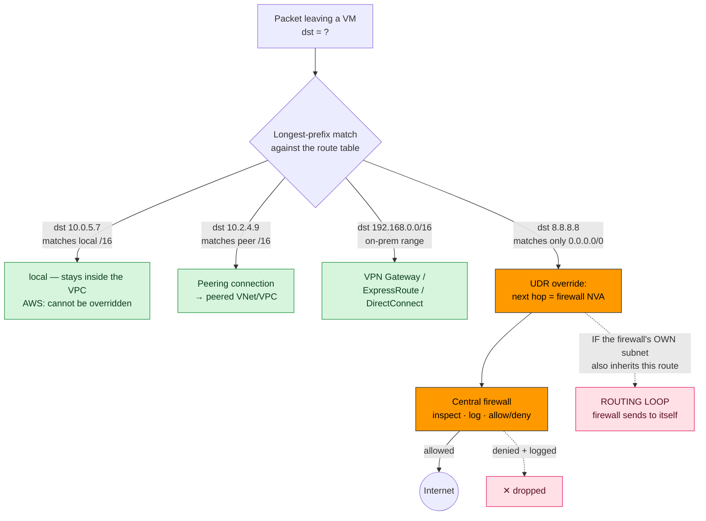
```mermaid
flowchart TD
    P["Packet leaving a VM<br/>dst = ?"] --> M{"Longest-prefix match<br/>against the route table"}

    M -->|"dst 10.0.5.7<br/>matches local /16"| L["local — stays inside the VPC<br/>AWS: cannot be overridden"]
    M -->|"dst 10.2.4.9<br/>matches peer /16"| PR["Peering connection<br/>→ peered VNet/VPC"]
    M -->|"dst 192.168.0.0/16<br/>on-prem range"| VPN["VPN Gateway /<br/>ExpressRoute / DirectConnect"]
    M -->|"dst 8.8.8.8<br/>matches only 0.0.0.0/0"| UDR["UDR override:<br/>next hop = firewall NVA"]

    UDR --> FW["Central firewall<br/>inspect · log · allow/deny"]
    FW -->|allowed| NET(("Internet"))
    FW -.->|denied + logged| DROP["✕ dropped"]

    UDR -.->|"IF the firewall's OWN subnet<br/>also inherits this route"| LOOP["ROUTING LOOP<br/>firewall sends to itself"]

    classDef ok fill:#d7f5dd,stroke:#1e8e3e,color:#0b3d1a
    classDef warn fill:#ffe0e6,stroke:#e91e63,color:#5a0d24
    classDef hop fill:#FF9900,stroke:#232F3E,color:#000
    class L,PR,VPN ok
    class LOOP,DROP warn
    class UDR,FW hop
```

### Issues → Fixes

| Symptom | Root cause | Fix |
| --- | --- | --- |
| Silent timeout — packets leave and nothing comes back, no error anywhere | No matching route; the packet went to a black hole. This is the signature symptom of a routing problem versus a firewall problem (a firewall usually gives you `connection refused` or a log line) | Azure: **Effective routes** on the NIC. AWS: **VPC Reachability Analyzer**. GCP: **Connectivity Tests**. All three answer "why can't A reach B" without touching the host |
| The whole firewall is bypassed and nobody noticed | Someone added `0.0.0.0/0 → igw-xxx` to a private subnet's route table. Instant, silent, unlogged by default | SCP denying `ec2:CreateRoute` / `ec2:ReplaceRoute` outside the pipeline role; Azure Policy Deny on `routeTables/write` outside the platform subscription; **alert on every route-change API call** — treat it as break-glass |
| Traffic to a firewall NVA loops until TTL expiry | The inspection subnet inherited the same `0.0.0.0/0 → firewall` UDR, so the firewall routes packets to itself | Explicitly exclude the inspection subnet from the forced-tunnel route table. Give it its own table with `0.0.0.0/0 → Internet` |
| A route to a "peer of a peer" resolves but drops all traffic | Peering is **non-transitive** on all three clouds; the route exists locally but the middle VPC will not forward | Use a transit router ([C11](#c11--hub--spoke--transit)) — TGW, vWAN, or NCC. Adding routes cannot make peering transitive |
| Stateful firewall randomly drops established connections | **Asymmetric routing** — the request went through the appliance and the reply came back a different way, so the appliance never saw the handshake | Ensure both directions traverse the same appliance: symmetric UDRs on both subnets, or an appliance-mode TGW attachment (AWS `appliance_mode_support = enable`) |
| A new, more specific route "took over" unexpectedly | Longest-prefix match — a `/24` someone added beats your `/16`, no matter the intended precedence | Audit for specific routes, not just `0.0.0.0/0`. GCP additionally uses numeric priority (lower wins) as the tiebreak between equal prefixes |

### Verify it

```bash
# AWS — find every route that points straight at an internet gateway
aws ec2 describe-route-tables \
  --query "RouteTables[].Routes[?GatewayId!=null && starts_with(GatewayId,'igw-')].[GatewayId,DestinationCidrBlock]" \
  --output text

# Azure — what the NIC will ACTUALLY do (system routes + UDR merged)
az network nic show-effective-route-table -g <rg> -n <nic> -o table

# GCP — any custom route escaping straight to the internet gateway
gcloud compute routes list --filter="nextHopGateway:default-internet-gateway" \
  --format="table(name, destRange, priority, network)"
```

---

## C4 — Security Groups / NSG

> Source: [`Architecture.md` §3.4](Architecture.md#c4--security-groups--nsg-nic-level-stateful-firewall)

### In one sentence
A **stateful** firewall bolted to the virtual NIC: allow the inbound flow and the return traffic is
automatically permitted, no outbound rule required.

### The reason
Stateful connection tracking exists so that you write **half** the rules and cannot get the other
half wrong. Before it, every allow needed a matching ephemeral-port return rule — the single most
common cause of "the request arrives, the response vanishes" (which is exactly what still happens
with stateless NACLs, see [C5](#c5--nacls--layered-defence)).

The second reason SG/NSG exists at the NIC rather than the subnet is **identity-based rules**: the
source of a rule can be *another security group*, an application security group, or on GCP a
*service account*. That makes the rule survive autoscaling. `allow :8080 from sg-loadbalancer` is
still correct after the LB replaces every node; `allow :8080 from 10.0.1.47/32` is wrong the moment
autoscaling recycles it. This is the highest-value habit in cloud firewalling.

### How it actually works

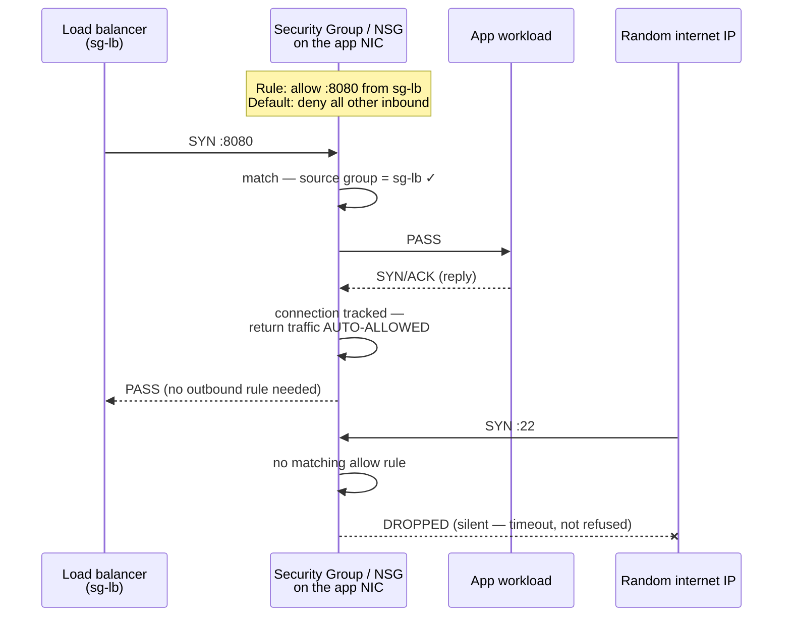
```mermaid
sequenceDiagram
    participant LB as Load balancer<br/>(sg-lb)
    participant SG as Security Group / NSG<br/>on the app NIC
    participant APP as App workload
    participant ATT as Random internet IP

    Note over SG: Rule: allow :8080 from sg-lb<br/>Default: deny all other inbound

    LB->>SG: SYN :8080
    SG->>SG: match — source group = sg-lb ✓
    SG->>APP: PASS
    APP-->>SG: SYN/ACK (reply)
    SG->>SG: connection tracked —<br/>return traffic AUTO-ALLOWED
    SG-->>LB: PASS (no outbound rule needed)

    ATT->>SG: SYN :22
    SG->>SG: no matching allow rule
    SG--xATT: DROPPED (silent — timeout, not refused)
```

**On Azure, add one more gate.** Traffic must clear the **subnet NSG *and* the NIC NSG** in
sequence. Allowing at only one of the two is the single most common Azure networking mistake:

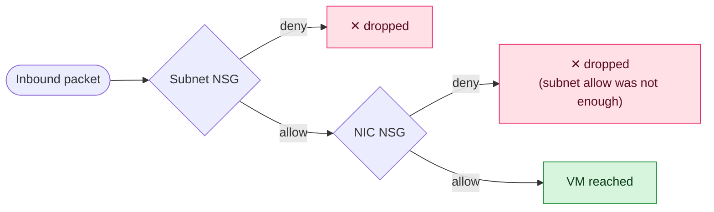
```mermaid
flowchart LR
    IN(["Inbound packet"]) --> SNSG{"Subnet NSG"}
    SNSG -->|deny| D1["✕ dropped"]:::bad
    SNSG -->|allow| NNSG{"NIC NSG"}
    NNSG -->|deny| D2["✕ dropped<br/>(subnet allow was not enough)"]:::bad
    NNSG -->|allow| VM["VM reached"]:::good
    classDef bad fill:#ffe0e6,stroke:#e91e63,color:#5a0d24
    classDef good fill:#d7f5dd,stroke:#1e8e3e,color:#0b3d1a
```

### Issues → Fixes

| Symptom | Root cause | Fix |
| --- | --- | --- |
| "It works from the subnet but not from outside" on Azure | Only one of the two NSGs (subnet or NIC) allows the traffic — both are evaluated | `az network nic list-effective-nsg` shows the merged, evaluated rule set. Fix the layer that denies |
| A rule that worked yesterday now blocks traffic after a scale event | The rule referenced a hard-coded IP/CIDR of a node that autoscaling replaced | Reference the **source security group / ASG / service account**, never an instance IP |
| Cannot carve an exception out of a broad allow on AWS | AWS Security Groups are **allow-only** — there is no deny rule to subtract with | Restructure: narrow the allow itself, or move the deny to a NACL ([C5](#c5--nacls--layered-defence)) or the central firewall ([C6](#c6--centralised-egress-inspection)). Azure NSG and GCP firewall rules *do* have deny |
| An Azure NSG rule "should" match but a different one wins | NSG rules are evaluated by **numeric priority 100–4096, first match wins** — not most-specific-wins | Read priorities, not rule names. Leave gaps (100, 200, 300) so rules can be inserted later |
| GCP egress is wide open despite a carefully written ingress policy | GCP has an **implied `allow all egress`** at priority 65535 | Add an explicit lower-priority (higher-precedence) egress deny, then allow-list what is needed |
| An SG with `0.0.0.0/0` on `:22`/`:3389` reaches production | Nothing structurally prevented it | The highest-return SCP most organisations can write: deny `ec2:AuthorizeSecurityGroupIngress` when the request carries `0.0.0.0/0` on 22/3389/3306/5432. Azure built-ins *"Management ports should be closed"* and *"RDP/SSH from Internet blocked"* in **Deny** mode |
| Nobody can tell who opened a port | `compute.firewalls.*` was bundled with general network admin | GCP already splits it: firewall rules need `roles/compute.securityAdmin`, **not** `networkAdmin`. Build the same split by hand on AWS/Azure with custom roles, and alert on every `0.0.0.0/0` rule change |

### Verify it

```bash
# AWS — every security group open to the world on a management port
aws ec2 describe-security-groups --query \
 "SecurityGroups[?IpPermissions[?IpRanges[?CidrIp=='0.0.0.0/0'] && (FromPort==\`22\` || FromPort==\`3389\`)]].[GroupId,GroupName]" \
 --output table

# Azure — the merged NSG view the NIC actually enforces (subnet + NIC together)
az network nic list-effective-nsg -g <rg> -n <nic> -o json | jq '.value[].effectiveSecurityRules'

# GCP — rules sorted by the priority that decides the winner
gcloud compute firewall-rules list \
  --format="table(name, direction, priority, sourceRanges.list(), allowed[].map().firewall_rule().list())" \
  --sort-by=priority
```

---

## C5 — NACLs & layered defence

> Source: [`Architecture.md` §3.5](Architecture.md#c5--nacls--layered-perimeter-defence)

### In one sentence
Independent security layers at the subnet edge that a packet must clear **all** of, evaluated in a
fixed order, owned by different teams.

### The reason
Defence in depth is not about stacking redundant controls — it is about stacking **independently
failing** controls. A NACL that denies the corporate `10.50.0.0/16` range keeps working when
someone fat-fingers a security group, because it is a different object, changed through a different
process, by a different team. That independence is precisely what an auditor is looking for, and
why "we have a firewall" is not the same answer as "we have layers".

The cost of the outer layer is **statelessness**. A NACL evaluates each packet alone, with no memory
of the connection — so an inbound allow without a matching outbound **ephemeral port** allow lets
the request in and drops the reply. That single property causes most NACL outages.

### How it actually works

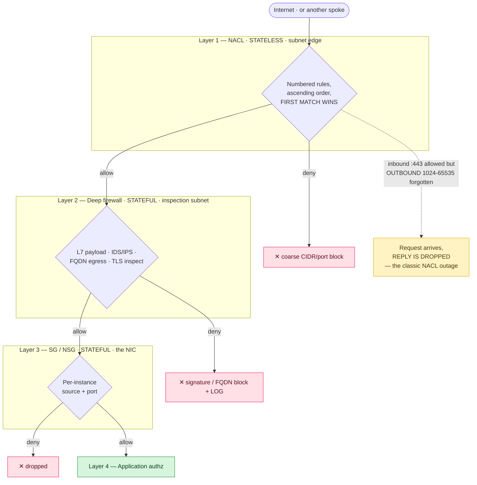
```mermaid
flowchart TB
    SRC(["Internet · or another spoke"]) --> L1

    subgraph L1G["Layer 1 — NACL · STATELESS · subnet edge"]
        L1{"Numbered rules,<br/>ascending order,<br/>FIRST MATCH WINS"}
    end
    L1 -->|deny| X1["✕ coarse CIDR/port block"]:::bad
    L1 -->|allow| L2

    subgraph L2G["Layer 2 — Deep firewall · STATEFUL · inspection subnet"]
        L2{"L7 payload · IDS/IPS ·<br/>FQDN egress · TLS inspect"}
    end
    L2 -->|deny| X2["✕ signature / FQDN block + LOG"]:::bad
    L2 -->|allow| L3

    subgraph L3G["Layer 3 — SG / NSG · STATEFUL · the NIC"]
        L3{"Per-instance<br/>source + port"}
    end
    L3 -->|deny| X3["✕ dropped"]:::bad
    L3 -->|allow| L4["Layer 4 — Application authz"]:::good

    L1 -.->|"inbound :443 allowed but<br/>OUTBOUND 1024-65535 forgotten"| TRAP["Request arrives,<br/>REPLY IS DROPPED<br/>— the classic NACL outage"]:::trap

    classDef bad fill:#ffe0e6,stroke:#e91e63,color:#5a0d24
    classDef good fill:#d7f5dd,stroke:#1e8e3e,color:#0b3d1a
    classDef trap fill:#fff3c4,stroke:#e6a700,color:#4a3800
```

### Issues → Fixes

| Symptom | Root cause | Fix |
| --- | --- | --- |
| Inbound connections hang: the SYN arrives at the host but the client never sees a response | Stateless NACL allows inbound `:443` but has no outbound allow for **ephemeral ports 1024–65535** | Add the outbound ephemeral range to the NACL. Or: do coarse blocking only at the NACL and leave port-level work to stateful SG/NSG, which never has this failure mode |
| A newly added NACL deny rule has no effect | NACL rules are evaluated in **ascending rule-number order and stop at the first match** — an earlier broad allow makes every later deny dead code | Renumber. Reserve low numbers (100–200) for denies, high numbers for broad allows. Audit for any allow numbered below a deny |
| Team wants a stateless subnet layer on Azure and cannot find one | Azure has **no NACL equivalent**; the subnet-level NSG is stateful | Do not emulate it. Use Azure Firewall with explicit deny rule collections, or accept that the subnet NSG is the layer |
| Deny rules produce no evidence for the auditor | Firewall/NACL logging was never enabled on deny paths | Enable Firewall Rules Logging (GCP) on every deny rule, NSG/VNet flow logs (Azure), and VPC Flow Logs with `REJECT` capture (AWS). Ship to an account the workload team cannot write to |
| A project owner locally overrode the org-wide firewall baseline | Rules were defined per-VPC, where a project owner has authority | GCP: **hierarchical firewall policies** at the org/folder node — evaluated *before* VPC rules and not overridable below. AWS: **Firewall Manager** in a delegated security account. Azure: Firewall Policy parent/child + Azure Policy Deny |

### Verify it

```bash
# AWS — dump NACL rules in evaluation order (the order is the behaviour)
aws ec2 describe-network-acls --query \
 "NetworkAcls[].Entries[].[RuleNumber,Egress,Protocol,RuleAction,CidrBlock,PortRange.From,PortRange.To]" \
 --output table | sort -n

# Azure — confirm every subnet has an NSG attached
az network vnet subnet list -g <rg> --vnet-name <vnet> \
  --query "[].{subnet:name, nsg:networkSecurityGroup.id}" -o table

# GCP — hierarchical policies (these beat VPC rules)
gcloud compute firewall-policies list --organization=<ORG_ID>
```

---

## C6 — Centralised egress inspection

> Source: [`Architecture.md` §3.6](Architecture.md#c6--centralised-egress-inspection)

### In one sentence
Force all outbound and east-west traffic through one appliance so there is exactly one rule set to
reason about and one log to audit.

### The reason
Distributed firewall rules cannot answer the question a regulator actually asks: *"prove no workload
can reach an unapproved endpoint."* Answering it from 400 security groups is a research project;
answering it from one firewall policy plus its logs takes a minute. Centralisation trades
throughput and cost for **provability**.

The critical insight is that inspection is enforced by **routing, not by firewall rules**
([C3](#c3--route-tables--udr)). The firewall does not intercept traffic; the route leaves it no
alternative. That is why the two permissions — *edit firewall rules* and *edit routes* — must be
held by different people. Either one alone can silently disable the control.

### How it actually works

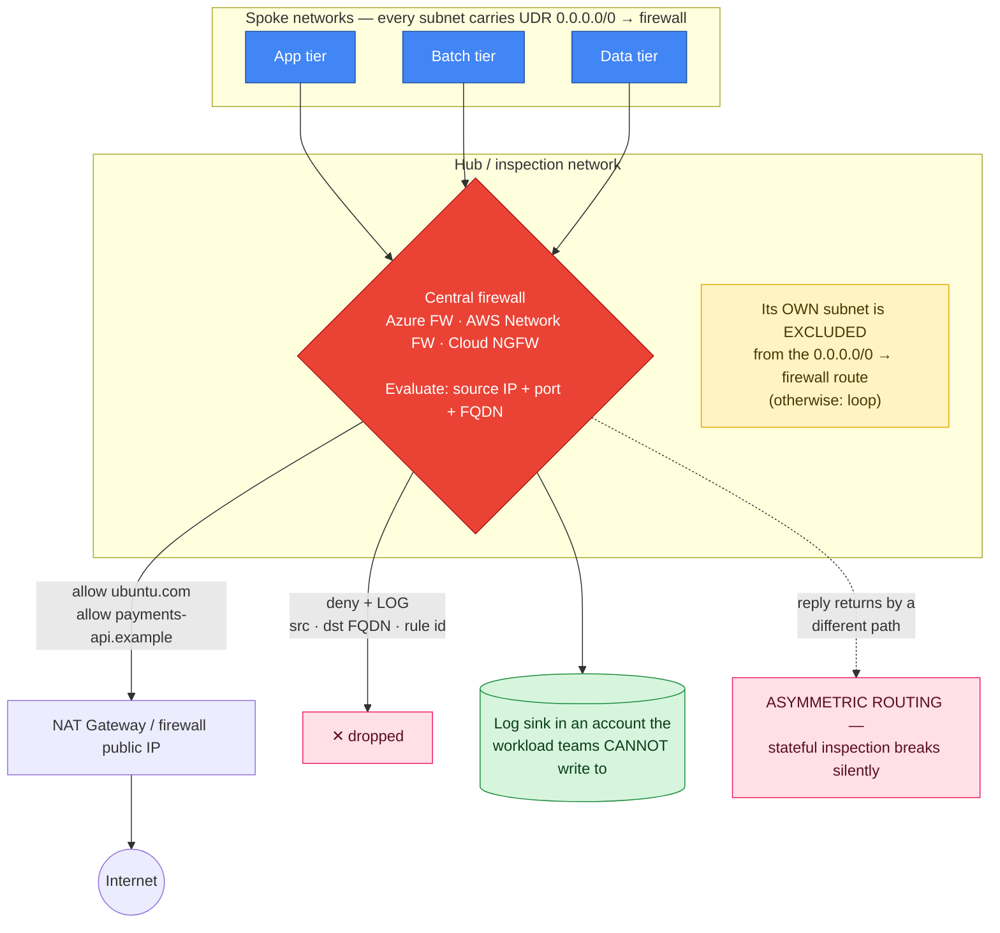
```mermaid
flowchart TB
    subgraph SPOKES["Spoke networks — every subnet carries UDR 0.0.0.0/0 → firewall"]
        A["App tier"]:::spoke
        B["Batch tier"]:::spoke
        C["Data tier"]:::spoke
    end

    A --> FW
    B --> FW
    C --> FW

    subgraph HUB["Hub / inspection network"]
        FW{"Central firewall<br/>Azure FW · AWS Network FW · Cloud NGFW<br/><br/>Evaluate: source IP + port + FQDN"}:::fw
        NOTE["Its OWN subnet is EXCLUDED<br/>from the 0.0.0.0/0 → firewall route<br/>(otherwise: loop)"]:::note
    end

    FW -->|"allow ubuntu.com<br/>allow payments-api.example"| SNAT["NAT Gateway / firewall public IP"]
    SNAT --> INET(("Internet"))
    FW -->|"deny + LOG<br/>src · dst FQDN · rule id"| DROP["✕ dropped"]:::bad
    FW --> LOGS[("Log sink in an account the<br/>workload teams CANNOT write to")]:::log

    FW -.->|"reply returns by a<br/>different path"| ASYM["ASYMMETRIC ROUTING —<br/>stateful inspection breaks silently"]:::bad

    classDef spoke fill:#4285F4,stroke:#174EA6,color:#fff
    classDef fw fill:#EA4335,stroke:#B31412,color:#fff
    classDef bad fill:#ffe0e6,stroke:#e91e63,color:#5a0d24
    classDef log fill:#d7f5dd,stroke:#1e8e3e,color:#0b3d1a
    classDef note fill:#fff3c4,stroke:#e6a700,color:#4a3800
```

### Issues → Fixes

| Symptom | Root cause | Fix |
| --- | --- | --- |
| Packets loop until TTL expiry; the firewall's CPU spikes with no legitimate traffic | The inspection subnet inherited the `0.0.0.0/0 → firewall` route and forwards to itself | Exclude the firewall subnet from the forced-tunnel route table — it needs its own table pointing at the real internet gateway |
| Long-lived connections drop at random; the firewall logs show flows with no handshake | **Asymmetric routing** — request via the firewall, reply direct | Make both directions symmetric. AWS: enable **appliance mode** on the TGW attachment (`appliance_mode_support = enable`) so flows pin to one appliance. Azure/GCP: mirror the UDR/custom route on both sides |
| Throughput collapses under load; latency doubles across every service at once | The central firewall is a shared chokepoint sized for average, not peak | Size for peak plus headroom; scale out (Azure Firewall Premium scale units, AWS Network Firewall endpoints per AZ, GCP NGFW). Consider bypassing inspection for known-safe high-volume paths via **private endpoints** ([C7](#c7--private-service-access)), which do not traverse the firewall at all |
| The firewall line item becomes one of the largest on the cloud bill | Data-processing charges are per-GB and *all* traffic now traverses it | Route S3/Storage/ECR traffic to **VPC endpoints / Private Endpoints** instead — this is the same fix that cuts NAT cost, and it removes the traffic from the firewall too |
| A developer's call to an unapproved SaaS API works in production but not in dev | Rule drift between environments — the prod policy has an extra allow nobody remembers | Manage rule collections as code through the same pipeline as everything else ([C16](#c16--agentic-iac--policy-as-code)); alert on any rule widening a destination to `*` or `0.0.0.0/0` |
| Somebody bypassed inspection and it was untraceable | The same role held both `UpdateFirewallPolicy` and `CreateRoute` | Split them: rules = SecOps role, routes = platform role. Neither alone can bypass inspection; together they are unaccountable |

### Verify it

```bash
# Azure — prove every spoke subnet actually forces 0.0.0.0/0 at the firewall
az network route-table list --query \
 "[].{table:name, routes:routes[?addressPrefix=='0.0.0.0/0'].[nextHopType,nextHopIpAddress]}" -o json

# AWS — confirm the private route tables point at the GWLB endpoint / TGW, not the IGW
aws ec2 describe-route-tables --query \
 "RouteTables[].Routes[?DestinationCidrBlock=='0.0.0.0/0'].[VpcEndpointId,TransitGatewayId,GatewayId]" \
 --output table

# GCP — custom routes steering to the internal LB in front of the NVA
gcloud compute routes list --filter="nextHopIlb:*" --format="table(name,destRange,nextHopIlb,priority)"
```

---

## C7 — Private service access

> Source: [`Architecture.md` §3.7](Architecture.md#c7--private-service-access--delegated-subnets)

### In one sentence
Give a managed PaaS service a NIC with a **private IP inside your own subnet**, so every other
control in this guide — NSG, routes, flow logs — applies to it.

### The reason
A managed database's default endpoint is a public DNS name. Even with a firewall allow-list on the
service side, the traffic leaves your network, traverses the internet, and is invisible to your flow
logs. Private endpoints collapse that: the service becomes an ordinary internal IP, subject to
ordinary internal controls, appearing in ordinary internal telemetry.

The secondary benefit is usually the larger one: it lets you set `publicNetworkAccess = Disabled`
and make an entire class of misconfiguration **structurally impossible**. A leaked connection string
is worthless from outside the VPC because the endpoint does not resolve or accept connections.

The third benefit is cost: traffic to an S3/Storage endpoint bypasses the NAT Gateway and the
central firewall, removing per-GB charges on both.

### How it actually works

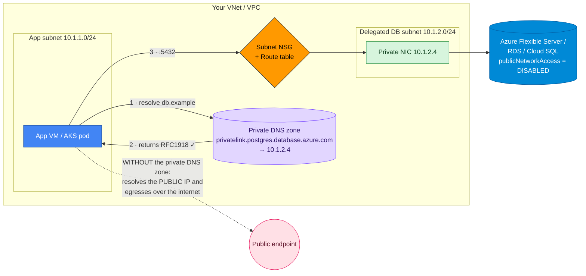
```mermaid
flowchart LR
    subgraph VNET["Your VNet / VPC"]
        subgraph APPSUB["App subnet 10.1.1.0/24"]
            APP["App VM / AKS pod"]:::app
        end
        NSG{"Subnet NSG<br/>+ Route table"}:::gate
        subgraph DBSUB["Delegated DB subnet 10.1.2.0/24"]
            NIC["Private NIC 10.1.2.4"]:::nic
        end
        DNS[("Private DNS zone<br/>privatelink.postgres.database.azure.com<br/>→ 10.1.2.4")]:::dns
    end

    PAAS[("Azure Flexible Server /<br/>RDS / Cloud SQL<br/>publicNetworkAccess = DISABLED")]:::paas
    PUB(("Public endpoint")):::bad

    APP -->|"1 · resolve db.example"| DNS
    DNS -->|"2 · returns RFC1918 ✓"| APP
    APP -->|"3 · :5432"| NSG
    NSG --> NIC
    NIC --> PAAS

    APP -.->|"WITHOUT the private DNS zone:<br/>resolves the PUBLIC IP and<br/>egresses over the internet"| PUB

    classDef app fill:#4285F4,stroke:#174EA6,color:#fff
    classDef nic fill:#d7f5dd,stroke:#1e8e3e,color:#0b3d1a
    classDef gate fill:#FF9900,stroke:#232F3E,color:#000
    classDef dns fill:#e2d6ff,stroke:#7c4dff,color:#2c1466
    classDef paas fill:#0089D6,stroke:#005BA1,color:#fff
    classDef bad fill:#ffe0e6,stroke:#e91e63,color:#5a0d24
```

### Issues → Fixes

| Symptom | Root cause | Fix |
| --- | --- | --- |
| The private endpoint exists, is "Approved", and the app still connects over the internet | **DNS.** Without the private DNS zone linked to the VNet, the name resolves to the public IP. This is where this design fails 80% of the time | `nslookup <service-fqdn>` **from inside the subnet** — it must return an RFC1918 address. Link the private DNS zone (`privatelink.*`) to every VNet whose clients need it, including peered spokes and on-prem via a DNS forwarder |
| Connection times out from an on-prem client over VPN/ExpressRoute | On-prem DNS resolves the public name; the private zone is not reachable from on-prem | Add a conditional forwarder on the on-prem DNS server pointing at an Azure DNS Private Resolver / Route 53 inbound endpoint |
| Cannot deploy anything else into the subnet | An Azure **delegated subnet** is exclusive to the delegated service | Give the delegated service its own subnet from day one. The delegation cannot be removed while resources exist |
| Data can still be copied *out* to a stranger's S3 bucket over your own endpoint | A VPC endpoint with no endpoint policy permits any bucket in any account | Attach a **VPC endpoint policy** scoped to your account's buckets, plus an S3 bucket policy conditioned on `aws:SourceVpce`. Endpoint policies are the only control for this |
| PaaS resource is created with the public endpoint still enabled | Nothing denied it at create time | Azure Policy denying `publicNetworkAccess = Enabled` (built-ins exist for Storage, SQL, Key Vault, Cosmos); GCP `constraints/sql.restrictPublicIp` and `constraints/storage.publicAccessPrevention` |
| An unknown party connected to a Private Link service you publish | Auto-approval was left on | Require **manual, logged connection approval** on every published Private Link / PSC service attachment |

### Verify it

```bash
# THE test — run it from inside the subnet, not from your laptop
nslookup mydb.postgres.database.azure.com    # must return 10.x / 172.16-31.x / 192.168.x

# Azure — private endpoint connection state
az network private-endpoint-connection list --id <paas-resource-id> \
  --query "[].{name:name, state:properties.privateLinkServiceConnectionState.status}" -o table

# AWS — endpoints and whether they carry a restrictive policy
aws ec2 describe-vpc-endpoints --query \
 "VpcEndpoints[].{id:VpcEndpointId, svc:ServiceName, policy:PolicyDocument}" --output json

# GCP — public IP still on a Cloud SQL instance?
gcloud sql instances list --format="table(name, settings.ipConfiguration.ipv4Enabled)"
```

---

## C8 — Internet Gateway

> Source: [`Architecture.md` §3.8](Architecture.md#c8--internet-gateway-igw) · *(no diagram existed — supplied here)*

### In one sentence
The VPC's door to the internet: a managed, horizontally scaled component that performs 1:1 NAT
between a public IP and an instance's private IP, in **both** directions.

### The reason
The IGW exists so that internet reachability is an explicit, auditable object rather than an
implicit property. On AWS, an OU whose SCP denies `AttachInternetGateway` is **structurally
incapable** of internet exposure — one line of policy makes an entire set of accounts safe by
construction, which no amount of firewall rule review can match.

The thing to internalise: **an IGW does nothing on its own.** Three conditions must all be true for
inbound reachability, and the route is the one that actually decides.

### How it actually works

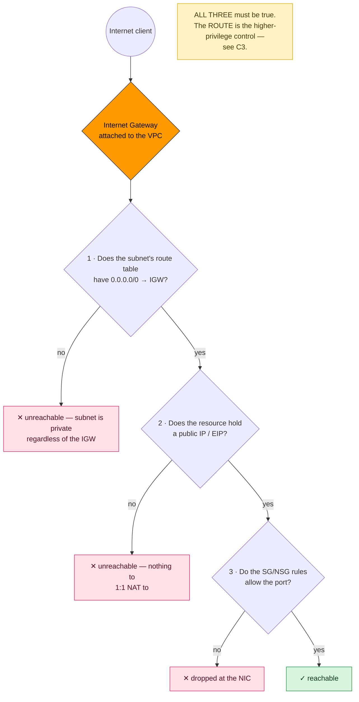
```mermaid
flowchart TB
    C(("Internet client")) --> IGW

    IGW{"Internet Gateway<br/>attached to the VPC"}:::gw

    IGW --> K1{"1 · Does the subnet's route table<br/>have 0.0.0.0/0 → IGW?"}
    K1 -->|no| F1["✕ unreachable — subnet is private<br/>regardless of the IGW"]:::bad
    K1 -->|yes| K2{"2 · Does the resource hold<br/>a public IP / EIP?"}
    K2 -->|no| F2["✕ unreachable — nothing to<br/>1:1 NAT to"]:::bad
    K2 -->|yes| K3{"3 · Do the SG/NSG rules<br/>allow the port?"}
    K3 -->|no| F3["✕ dropped at the NIC"]:::bad
    K3 -->|yes| OK["✓ reachable"]:::good

    NOTE["ALL THREE must be true.<br/>The ROUTE is the higher-privilege control —<br/>see C3."]:::note

    classDef gw fill:#FF9900,stroke:#232F3E,color:#000
    classDef bad fill:#ffe0e6,stroke:#e91e63,color:#5a0d24
    classDef good fill:#d7f5dd,stroke:#1e8e3e,color:#0b3d1a
    classDef note fill:#fff3c4,stroke:#e6a700,color:#4a3800
```

### Issues → Fixes

| Symptom | Root cause | Fix |
| --- | --- | --- |
| IGW is attached, the instance has an Elastic IP, and it is still unreachable | The subnet's route table has no `0.0.0.0/0 → igw-xxx` entry. Attaching is not routing | Add the route. Confirm with `aws ec2 describe-route-tables --filters Name=association.subnet-id,Values=<subnet>` |
| An Azure VM reaches the internet with no gateway and no route, surprising anyone from AWS | Azure historically grants **default outbound access** implicitly | Azure is retiring it. Attach an explicit **NAT Gateway** to every subnet now, and treat implicit outbound as a migration debt with a deadline |
| Outbound works, inbound does not, for an instance with a public IP | Public IP is present but the SG denies the port, or the instance is in a private subnet whose route points at NAT (NAT is outbound-only) | Check all three conditions in the diagram, in order |
| A "fully private" account got internet exposure during an incident | Someone attached an IGW under pressure | SCP denying `ec2:CreateInternetGateway` and `ec2:AttachInternetGateway` in the private/PCI/backup OUs. Alert on `DetachInternetGateway` too — detaching is an outage |
| IPv6 workloads get inbound reachability that was never intended | An ordinary IGW is bidirectional for IPv6 as well | Use an **Egress-Only Internet Gateway** for IPv6 outbound-only, and explicit IPv6 rules on Azure/GCP |

### Verify it

```bash
# AWS — every IGW, and which VPC it is attached to
aws ec2 describe-internet-gateways \
  --query "InternetGateways[].{igw:InternetGatewayId, vpc:Attachments[0].VpcId, state:Attachments[0].State}" \
  --output table

# Azure — public IPs that are actually attached to a NIC (the real exposure)
az network public-ip list --query "[?ipConfiguration!=null].{name:name, ip:ipAddress, attachedTo:ipConfiguration.id}" -o table

# GCP — instances with an external IP
gcloud compute instances list --filter="networkInterfaces[0].accessConfigs[0].natIP:*" \
  --format="table(name, zone, networkInterfaces[0].accessConfigs[0].natIP)"
```

---

## C9 — NAT Gateway vs NAT Instance

> Source: [`Architecture.md` §3.9](Architecture.md#c9--nat-gateway-vs-nat-instance) · *(ASCII table re-rendered as Markdown; diagram supplied here)*

### In one sentence
Source-NAT for private subnets: many private IPs become one public IP for **outbound-only**
internet, so workloads can patch and pull images while remaining unreachable from the internet.

### The reason
Private workloads still need the internet — OS updates, package registries, container images,
third-party APIs. NAT gives them exactly that and nothing more, because a NAT translation only
exists for connections the *inside* initiated. There is no inbound path to create; the asymmetry is
the security property.

The corollary that surprises people: a NAT Gateway has **no security group**. The only control over
it is the route. It is a routing device, not a filtering device — put the filtering in the central
firewall behind it ([C6](#c6--centralised-egress-inspection)).

### Managed NAT Gateway vs self-managed NAT Instance

| Dimension | Managed NAT Gateway | Custom NAT Instance |
| --- | --- | --- |
| **High availability** | Managed by the provider; zonal on AWS/Azure, regional on GCP | You build it — ASG, health checks, route failover automation |
| **Scalability** | Automatic, to ~45–50 Gbps | Capped by the instance/VM size you chose |
| **Maintenance** | Zero — no OS, no patching | OS patching, kernel tuning, `SourceDestCheck` disabled |
| **Cost** | Hourly + per-GB processed | Hourly compute only (cheaper at low volume, riskier always) |
| **Security control** | **No SG** — route-controlled only | SG + host firewall (`iptables`) available |
| **Port forwarding** | Not supported | Supported via custom `iptables` |
| **Verdict** | Default choice everywhere | Only for a documented exception (e.g. port forwarding, cost-critical dev) |

### How it actually works

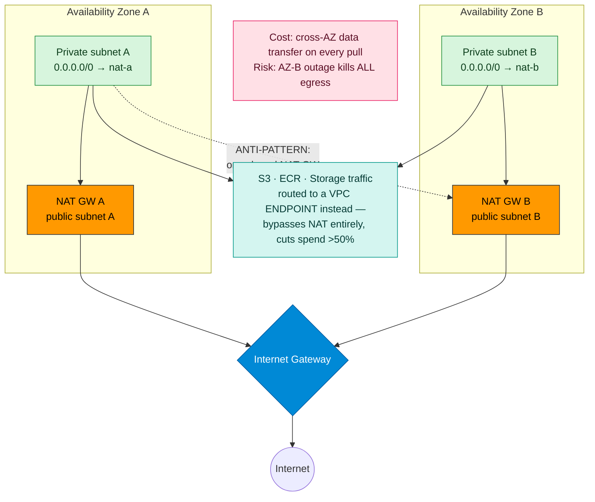
```mermaid
flowchart TB
    subgraph AZA["Availability Zone A"]
        PA["Private subnet A<br/>0.0.0.0/0 → nat-a"]:::priv
        NA["NAT GW A<br/>public subnet A"]:::nat
        PA --> NA
    end
    subgraph AZB["Availability Zone B"]
        PB["Private subnet B<br/>0.0.0.0/0 → nat-b"]:::priv
        NB["NAT GW B<br/>public subnet B"]:::nat
        PB --> NB
    end

    NA --> IGW{"Internet Gateway"}:::gw
    NB --> IGW
    IGW --> NET(("Internet"))

    PA -.->|"ANTI-PATTERN:<br/>one shared NAT GW"| NB
    ANTI["Cost: cross-AZ data transfer on every pull<br/>Risk: AZ-B outage kills ALL egress"]:::bad

    BYPASS["S3 · ECR · Storage traffic<br/>routed to a VPC ENDPOINT instead —<br/>bypasses NAT entirely, cuts spend >50%"]:::good
    PA --> BYPASS
    PB --> BYPASS

    classDef priv fill:#d7f5dd,stroke:#1e8e3e,color:#0b3d1a
    classDef nat fill:#FF9900,stroke:#232F3E,color:#000
    classDef gw fill:#0089D6,stroke:#005BA1,color:#fff
    classDef bad fill:#ffe0e6,stroke:#e91e63,color:#5a0d24
    classDef good fill:#d4f5f0,stroke:#009688,color:#053b35
```

### Issues → Fixes

| Symptom | Root cause | Fix |
| --- | --- | --- |
| All egress from every AZ dies during a single-AZ incident | One shared NAT Gateway. AWS/Azure NAT Gateways are **zonal** | **One NAT Gateway per AZ**, each private subnet's route table pointing at its *own* AZ's NAT. Build it into the Terraform module so nobody re-decides it. GCP Cloud NAT is regional and does not have this failure mode |
| Intermittent connection timeouts under high fan-out, resolving on retry | **SNAT port exhaustion** — 55,000 ports per public IP, consumed fastest by many short-lived connections to the same destination:port | Assign additional public IPs to the NAT Gateway (each adds a port block). Reduce churn with connection pooling and HTTP keep-alive. Azure: raise the per-VM SNAT port allocation |
| NAT data-processing charges are a top-three line item on the bill | Every image pull, package install, and S3/Storage call is billed per GB through NAT | Add **VPC endpoints / Private Endpoints** ([C7](#c7--private-service-access)) for S3, ECR, DynamoDB, Storage. This routinely cuts NAT spend by more than half and is the single highest-ROI network cost fix |
| All egress silently stops after a change; no errors, just timeouts | The NAT Gateway was created in a **private** subnet, so its own default route points back at itself — a loop | NAT Gateways must live in a **public** subnet (one with `0.0.0.0/0 → IGW`). Recreate it in the right subnet |
| Cross-AZ data transfer charges appear with no obvious cause | Private subnets in AZ-B routing through a NAT Gateway in AZ-A | Per-AZ NAT, as above. The charge is the symptom that tells you the routing is wrong |
| "We can't put a security group on the NAT to block this" | NAT Gateways have no SG by design | Correct — filter upstream at the central firewall ([C6](#c6--centralised-egress-inspection)) or downstream at the workload SG. Do not swap in a NAT instance just to get a SG |
| A self-managed NAT instance became a single point of failure and an unpatched box | Someone chose it to save money and never built the HA or patching around it | Deny NAT instances (EC2 with `SourceDestCheck` disabled) in production via SCP unless a documented, expiring exception exists |

### Verify it

```bash
# AWS — is there one NAT GW per AZ, and are they in PUBLIC subnets?
aws ec2 describe-nat-gateways --query \
 "NatGateways[?State=='available'].{id:NatGatewayId, subnet:SubnetId, ips:length(NatGatewayAddresses)}" \
 --output table

# AWS — SNAT port exhaustion signal
aws cloudwatch get-metric-statistics --namespace AWS/NATGateway \
  --metric-name ErrorPortAllocation --statistics Sum --period 300 \
  --start-time "$(date -u -d '3 hours ago' +%FT%TZ)" --end-time "$(date -u +%FT%TZ)" \
  --dimensions Name=NatGatewayId,Value=<nat-id>

# Azure — which subnets have a NAT Gateway (vs relying on retiring default outbound)
az network vnet subnet list -g <rg> --vnet-name <vnet> --query "[].{subnet:name, nat:natGateway.id}" -o table
```

---

## C10 — Peering

> Source: [`Architecture.md` §3.10](Architecture.md#c10--vpc--vnet-peering)

### In one sentence
A direct layer-3 route between two networks over the provider backbone — no gateway, no encryption
overhead, no bandwidth bottleneck — with two hard constraints: **non-transitive** and
**no overlapping CIDRs**.

### The reason
Peering is the cheapest possible private connection because it is *only* routing: no appliance to
size, no tunnel to encrypt, no hop to pay for. The two constraints are not limitations to work
around, they are what makes it cheap.

Non-transitivity is often more useful than it looks. If dev and prod are both peered to a shared
services network but not to each other, they **cannot** reach each other through it — the isolation
is structural, not rule-based, so it holds up under audit and survives any firewall mistake. The
same property becomes the problem at scale: n networks that all need to talk require n² peerings,
which is when you move to hub-and-spoke ([C11](#c11--hub--spoke--transit)).

### How it actually works

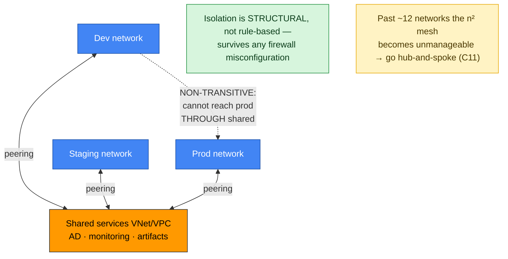
```mermaid
flowchart TB
    SHARED["Shared services VNet/VPC<br/>AD · monitoring · artifacts"]:::shared

    DEV["Dev network"]:::env
    STG["Staging network"]:::env
    PROD["Prod network"]:::env

    DEV <-->|peering| SHARED
    STG <-->|peering| SHARED
    PROD <-->|peering| SHARED

    DEV -.->|"NON-TRANSITIVE:<br/>cannot reach prod<br/>THROUGH shared"| PROD

    NOTE1["Isolation is STRUCTURAL, not rule-based —<br/>survives any firewall misconfiguration"]:::good
    NOTE2["Past ~12 networks the n² mesh<br/>becomes unmanageable → go hub-and-spoke (C11)"]:::warn

    classDef shared fill:#FF9900,stroke:#232F3E,color:#000
    classDef env fill:#4285F4,stroke:#174EA6,color:#fff
    classDef good fill:#d7f5dd,stroke:#1e8e3e,color:#0b3d1a
    classDef warn fill:#fff3c4,stroke:#e6a700,color:#4a3800
```

### Issues → Fixes

| Symptom | Root cause | Fix |
| --- | --- | --- |
| Peering status is `active` but no traffic flows — on AWS | AWS does **not** propagate routes for you. The peering object exists; the route table entries do not | Add routes on **both** sides pointing the peer CIDR at the peering connection. Azure and GCP add them automatically, which is why this trap is AWS-specific |
| A peering request cannot be created: `overlapping CIDR` | Both networks use the same range | Unfixable in place — renumber one side. Prevent with an IPAM-driven CIDR plan ([C1](#c1--vpc--vnet)) |
| Hub-and-spoke over VNet peering does not carry on-prem traffic | Azure peering has four toggles and hub-and-spoke needs a specific combination | Set `allowGatewayTransit = true` on the **hub** side and `useRemoteGateways = true` on the **spoke** side. Also review `allowForwardedTraffic` if an NVA is in the path |
| Spoke A can suddenly reach spoke B | Someone peered them directly, or `allowForwardedTraffic` was enabled through a hub NVA | Audit peering flags regularly; keep the "no spoke-to-spoke peering" rule in policy, not just in a diagram |
| A private path into your network appeared from an unknown account | Someone accepted an inbound peering request | **The accept step is the control point.** AWS SCP denying `ec2:AcceptVpcPeeringConnection` unless `aws:PrincipalOrgID` matches; GCP `constraints/compute.restrictVpcPeering` with an allow-list; Azure RBAC on the remote VNet |
| Hit the peering limit and cannot add another spoke | GCP defaults to 25 peerings per VPC; AWS 125; Azure 500 | Request a quota increase, or (better) treat hitting the limit as the signal to migrate to a transit hub |

### Verify it

```bash
# AWS — peerings WITHOUT matching routes (the silent failure)
aws ec2 describe-vpc-peering-connections --query \
 "VpcPeeringConnections[?Status.Code=='active'].[VpcPeeringConnectionId,RequesterVpcInfo.CidrBlock,AccepterVpcInfo.CidrBlock]" --output table
aws ec2 describe-route-tables --query "RouteTables[].Routes[?VpcPeeringConnectionId!=null]" --output table

# Azure — the four toggles that decide hub-and-spoke behaviour
az network vnet peering list -g <rg> --vnet-name <vnet> --query \
 "[].{name:name, state:peeringState, vnetAccess:allowVirtualNetworkAccess, fwd:allowForwardedTraffic, gwTransit:allowGatewayTransit, useRemoteGw:useRemoteGateways}" -o table

# GCP — peering state on both sides must be ACTIVE
gcloud compute networks peerings list --format="table(name, network, peerNetwork, state)"
```

---

## C11 — Hub & spoke / transit

> Source: [`Architecture.md` §3.11](Architecture.md#c11--hub--spoke--transit-routing)

### In one sentence
Put shared infrastructure — firewall, VPN/ExpressRoute, DNS — in one **hub**, attach every workload
network as a **spoke**, and control who-can-reach-whom with hub route tables instead of a peering
mesh.

### The reason
Two problems force this move, and they arrive together. First, peering's non-transitivity means
on-prem connectivity has to be rebuilt in every network — n VPN gateways, n sets of BGP, n bills.
Second, the mesh grows as n². Hub-and-spoke collapses both to n attachments plus one shared set of
services.

The strategic payoff is that **segmentation becomes a data structure you can audit**. On AWS,
"prod cannot reach nonprod" stops being an assertion about 400 security groups and becomes three
TGW route tables that one team owns and anyone can read. That is why the route-table *association*
permission is the real boundary — a spoke team that can associate its own attachment to the `prod`
route table has just granted itself production network access.

### How it actually works

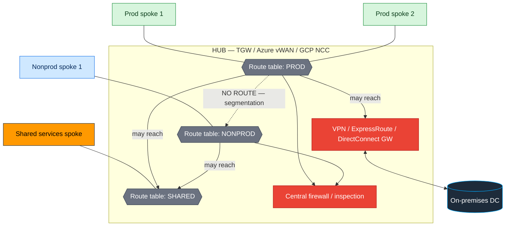
```mermaid
flowchart TB
    ONPREM[("On-premises DC")]:::onprem

    subgraph HUB["HUB — TGW / Azure vWAN / GCP NCC"]
        RTPROD{{"Route table: PROD"}}:::rt
        RTNON{{"Route table: NONPROD"}}:::rt
        RTSHR{{"Route table: SHARED"}}:::rt
        FW["Central firewall / inspection"]:::fw
        GW["VPN / ExpressRoute / DirectConnect GW"]:::fw
    end

    P1["Prod spoke 1"]:::prod
    P2["Prod spoke 2"]:::prod
    N1["Nonprod spoke 1"]:::non
    S1["Shared services spoke"]:::shr

    P1 --- RTPROD
    P2 --- RTPROD
    N1 --- RTNON
    S1 --- RTSHR

    RTPROD -->|"may reach"| RTSHR
    RTPROD -->|"may reach"| GW
    RTNON -->|"may reach"| RTSHR
    RTPROD -. "NO ROUTE — segmentation" .-> RTNON

    GW <--> ONPREM
    RTPROD --> FW
    RTNON --> FW

    classDef rt fill:#6b7280,stroke:#374151,color:#fff
    classDef fw fill:#EA4335,stroke:#B31412,color:#fff
    classDef prod fill:#d7f5dd,stroke:#1e8e3e,color:#0b3d1a
    classDef non fill:#cfe8ff,stroke:#1a73e8,color:#062a5a
    classDef shr fill:#FF9900,stroke:#232F3E,color:#000
    classDef onprem fill:#1d2b3a,stroke:#0af,color:#fff
```

**Adding team #41** is one attachment plus one route-table association — not forty new peerings.

### Issues → Fixes

| Symptom | Root cause | Fix |
| --- | --- | --- |
| A spoke can reach a segment it should not | The attachment was associated with the wrong TGW route table, or a route was **propagated** into it | **Association ≠ propagation.** Association picks which table the attachment *uses for lookups*; propagation decides which tables *learn* its routes. Confusing them is the most common TGW misconfiguration — read both |
| A spoke team granted itself production access | They held `ec2:AssociateTransitGatewayRouteTable` | Share the TGW via **AWS RAM** so spoke accounts can *attach* but never *associate*. Segmentation stays with the platform team alone |
| Stateful inspection breaks for cross-spoke flows | The TGW load-balances flows across appliances, so request and reply hit different firewall instances | Enable **appliance mode** on the inspection VPC's TGW attachment (`appliance_mode_support = enable`) — it pins a flow to one appliance for its lifetime |
| Hub bill grows faster than the estate | TGW is charged **per attachment-hour plus per GB**; forty spokes is a standing line item before any traffic | Model it at design time. Consolidate low-traffic spokes; keep intra-spoke traffic intra-spoke; use private endpoints so PaaS traffic never crosses the hub |
| Azure vWAN routes behave unpredictably after a change | **Routing intent** and manually managed hub route tables were mixed | Pick one model per hub. Routing intent replaces manual tables; the two do not compose cleanly |
| On-prem cannot reach a new spoke | The spoke's routes are not propagated to the hub's on-prem-facing table, or the on-prem BGP filter excludes the range | Check propagation in both directions, and the prefix filters on the customer gateway |

### Verify it

```bash
# AWS — associations and propagations per TGW route table (read BOTH)
aws ec2 get-transit-gateway-route-table-associations --transit-gateway-route-table-id <rtb> --output table
aws ec2 get-transit-gateway-route-table-propagations --transit-gateway-route-table-id <rtb> --output table

# AWS — prove a segmentation boundary: is there a route from prod's table to nonprod's CIDR?
aws ec2 search-transit-gateway-routes --transit-gateway-route-table-id <prod-rtb> \
  --filters Name=type,Values=static,propagated --query "Routes[].DestinationCidrBlock"

# Azure — effective routes on the vWAN hub
az network vhub get-effective-routes --resource-group <rg> --name <hub> --resource-type RouteTable -o table
```

---

## C12 — Load balancers L7 vs L4

> Source: [`Architecture.md` §3.12](Architecture.md#c12--load-balancers-l7-vs-l4)

### In one sentence
L7 opens the HTTP request and routes on its content; L4 forwards TCP/UDP without looking inside —
and that one difference decides everything else about the two.

### The reason
The choice is not "which is better", it is **what the load balancer needs to see**. Path-based
routing, header rules, WAF, and OIDC authentication all require reading the request, which requires
terminating TLS, which makes the LB a proxy — and a proxy necessarily replaces the client's source
IP with its own. L4 declines to look, so it keeps line-rate latency and **preserves the client
source IP** natively.

Every downstream consequence follows from that: L7 gives you routing intelligence and costs you the
source IP (recovered imperfectly via `X-Forwarded-For`); L4 gives you the source IP and speed and
costs you every content-based decision.

### How it actually works

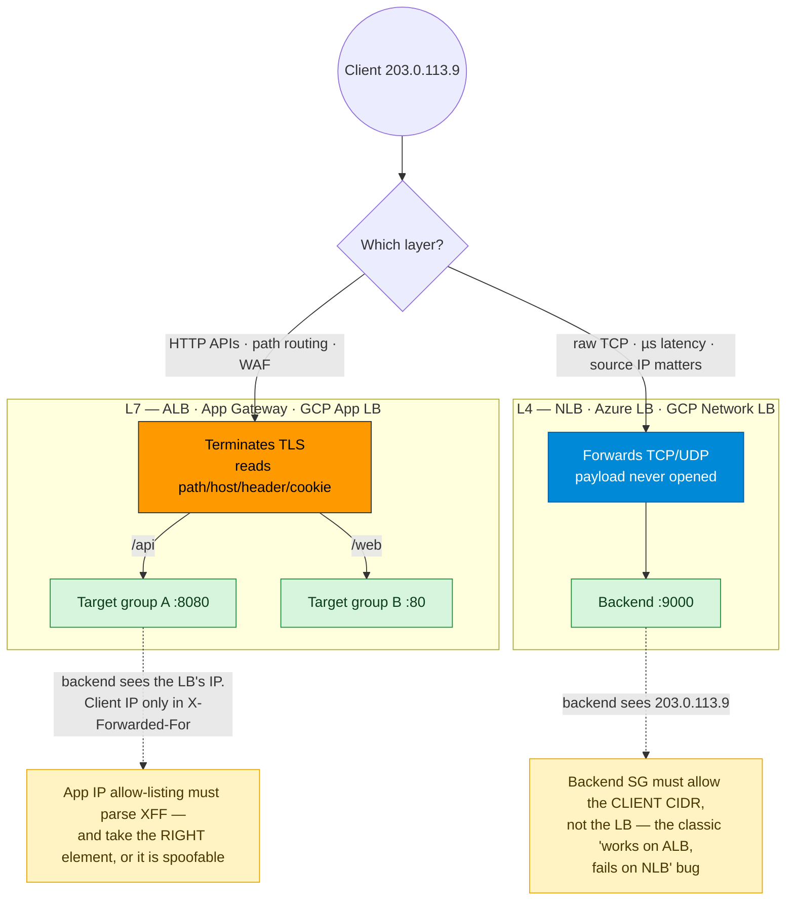
```mermaid
flowchart TB
    C(("Client 203.0.113.9")) --> SPLIT{"Which layer?"}

    SPLIT -->|"HTTP APIs · path routing · WAF"| L7
    SPLIT -->|"raw TCP · µs latency · source IP matters"| L4

    subgraph L7G["L7 — ALB · App Gateway · GCP App LB"]
        L7["Terminates TLS<br/>reads path/host/header/cookie"]:::l7
        L7 -->|"/api"| TG1["Target group A :8080"]:::be
        L7 -->|"/web"| TG2["Target group B :80"]:::be
    end

    subgraph L4G["L4 — NLB · Azure LB · GCP Network LB"]
        L4["Forwards TCP/UDP<br/>payload never opened"]:::l4
        L4 --> TG3["Backend :9000"]:::be
    end

    TG1 -.->|"backend sees the LB's IP.<br/>Client IP only in X-Forwarded-For"| NOTE1["App IP allow-listing must parse XFF —<br/>and take the RIGHT element, or it is spoofable"]:::warn
    TG3 -.->|"backend sees 203.0.113.9"| NOTE2["Backend SG must allow the CLIENT CIDR,<br/>not the LB — the classic 'works on ALB,<br/>fails on NLB' bug"]:::warn

    classDef l7 fill:#FF9900,stroke:#232F3E,color:#000
    classDef l4 fill:#0089D6,stroke:#005BA1,color:#fff
    classDef be fill:#d7f5dd,stroke:#1e8e3e,color:#0b3d1a
    classDef warn fill:#fff3c4,stroke:#e6a700,color:#4a3800
```

### Issues → Fixes

| Symptom | Root cause | Fix |
| --- | --- | --- |
| 502 / 503 with no application logs at all | No **healthy** backend in the pool — the request never reached your code | Check target group / backend pool health, not the LB's own status. Then check that the health-check port, path, protocol, and the backend SG all agree |
| "It works behind the ALB but not behind the NLB" | The NLB preserves the client source IP, so the backend SG must allow the **client** CIDR — the LB's own CIDR is never the source | Update the backend SG to the client range, or disable source-IP preservation if the design does not need it |
| App IP allow-listing blocks everyone, or lets an attacker through | Behind an L7 LB the backend sees the LB's IP; the app is reading the wrong `X-Forwarded-For` element (a client can inject fake ones) | Take the **rightmost trusted** XFF entry, not the leftmost. Better: do the allow-listing at the LB/WAF, where the value is authoritative |
| Health checks pass while the service is broken | The health check points at `/`, which returns 200 without touching the database | Point it at a **deep** health endpoint that exercises real dependencies. Treat health-check config as an availability control under change management |
| Deploys drop a small number of requests every time | Connection draining / deregistration delay is shorter than the slowest in-flight request | Raise the drain timeout above p99.9 request duration; add `preStop` + `terminationGracePeriodSeconds` on Kubernetes |
| gRPC or WebSocket connections fail through the L7 LB | HTTP/2 not enabled end-to-end, or the idle timeout is shorter than the stream's natural life | Enable HTTP/2 to the backend; raise the idle timeout above the expected stream duration |
| Someone deleted a production load balancer | No deletion protection, and delete permission was widely held | Require `deletion_protection` on prod LBs; deny `elasticloadbalancing:DeleteLoadBalancer` outside the pipeline role |

### Verify it

```bash
# AWS — unhealthy targets and WHY (the Reason field is the useful part)
aws elbv2 describe-target-health --target-group-arn <arn> \
  --query "TargetHealthDescriptions[].{id:Target.Id, state:TargetHealth.State, why:TargetHealth.Reason}" --output table

# AWS — any plaintext HTTP listener that is not a redirect
aws elbv2 describe-listeners --load-balancer-arn <arn> \
  --query "Listeners[?Protocol=='HTTP'].[Port,DefaultActions[0].Type]" --output table

# Azure — backend health on Application Gateway
az network application-gateway show-backend-health -g <rg> -n <appgw> \
  --query "backendAddressPools[].backendHttpSettingsCollection[].servers[].{addr:address,health:health}" -o table
```

---

## C13 — LB algorithms

> Source: [`Architecture.md` §3.13](Architecture.md#c13--load-balancing-algorithms)

### In one sentence
Six ways to pick the next backend, each of which is really a different answer to *"what does 'load'
mean for this workload?"*

### The reason
Every algorithm is a proxy measurement. Round robin assumes **request count** ≈ load, which is true
only when every request costs the same on identical hardware. Least connections assumes
**concurrency** ≈ load, which is true for long-lived streams. Resource-based measures load
directly — and pays for it with a metrics feedback loop that can oscillate.

Pick by asking which proxy is least wrong for your traffic, not by which sounds most advanced.

### How it actually works

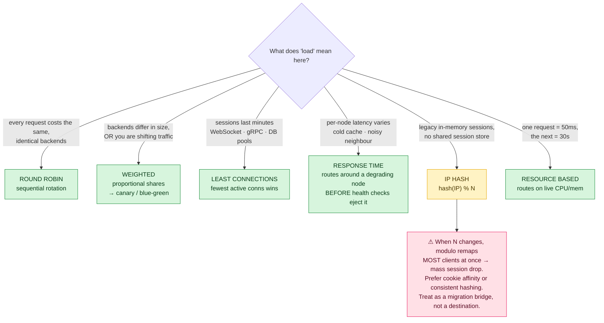
```mermaid
flowchart TD
    START{"What does 'load' mean here?"} 

    START -->|"every request costs the same,<br/>identical backends"| RR["ROUND ROBIN<br/>sequential rotation"]:::a
    START -->|"backends differ in size,<br/>OR you are shifting traffic"| W["WEIGHTED<br/>proportional shares<br/>→ canary / blue-green"]:::a
    START -->|"sessions last minutes<br/>WebSocket · gRPC · DB pools"| LC["LEAST CONNECTIONS<br/>fewest active conns wins"]:::a
    START -->|"per-node latency varies<br/>cold cache · noisy neighbour"| RT["RESPONSE TIME<br/>routes around a degrading node<br/>BEFORE health checks eject it"]:::a
    START -->|"legacy in-memory sessions,<br/>no shared session store"| IH["IP HASH<br/>hash(IP) % N"]:::b
    START -->|"one request = 50ms,<br/>the next = 30s"| RB["RESOURCE BASED<br/>routes on live CPU/mem"]:::a

    IH --> TRAP["⚠ When N changes, modulo remaps<br/>MOST clients at once → mass session drop.<br/>Prefer cookie affinity or consistent hashing.<br/>Treat as a migration bridge, not a destination."]:::warn

    classDef a fill:#d7f5dd,stroke:#1e8e3e,color:#0b3d1a
    classDef b fill:#fff3c4,stroke:#e6a700,color:#4a3800
    classDef warn fill:#ffe0e6,stroke:#e91e63,color:#5a0d24
```

### Issues → Fixes

| Symptom | Root cause | Fix |
| --- | --- | --- |
| One node is pinned at 100% CPU while others idle, under round robin | The fleet is **not** homogeneous, or request cost varies wildly — round robin's core assumption is false | Move to weighted (for known size differences) or least-connections / resource-based (for variable cost) |
| A slow node keeps receiving its full share and dragging p99 up | Round robin has no feedback loop; the node keeps its turn until a health check ejects it | Response-time or least-outstanding-requests balancing routes around it *before* ejection. Also shorten the unhealthy threshold |
| Every user is logged out at once when a node is added or removed | **IP hash remap storm** — changing `N` re-maps most clients simultaneously | Switch to cookie-based affinity, or consistent hashing where supported. Long term: externalise sessions to Redis and stop needing affinity at all |
| Sticky sessions are wildly uneven | Many clients share one source IP (corporate NAT, mobile carrier CGNAT), so IP hash puts them all on one backend | Cookie-based affinity distributes on a per-browser basis instead |
| Traffic oscillates between backends under resource-based balancing | The metrics feedback loop is faster than the effect of the routing change | Lengthen the metrics window / add damping; combine with connection-count balancing as a floor |
| A canary at "5%" is actually getting far more or less | Weights are applied per-LB-node, and sticky sessions or uneven client distribution skew the split | Verify with request-count metrics per target group rather than trusting the configured weight; disable affinity during a canary |

---

## C14 — LB types & features

> Source: [`Architecture.md` §3.14](Architecture.md#c14--load-balancer-types--key-features)

### In one sentence
Seven load balancer shapes and twelve features — and most production incidents trace back to just
three of the features being misconfigured: health checks, connection draining, and session affinity.

### The reason
The type list looks like taxonomy but it is really a **placement** decision: where in the path does
the traffic get inspected, terminated, or redirected? DNS-based balancing decides before a packet
is sent; GSLB decides which region; L7/L4 decide which backend; a Gateway LB decides which
*appliance* sees it first.

The feature list is where operational reality lives. A health check pointed at `/` will happily
route to nodes whose database is down. A drain timeout below your slowest request will drop traffic
on every deploy. These two settings are **availability controls** and belong under the same change
control as firewall rules.

### How it actually works

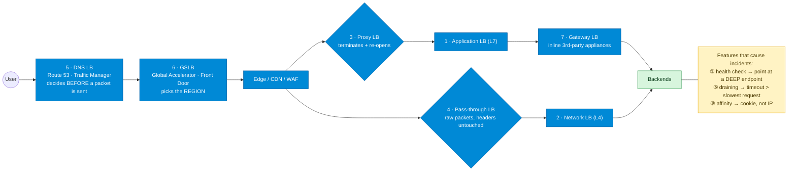
```mermaid
flowchart LR
    U(("User")) --> DNS["5 · DNS LB<br/>Route 53 · Traffic Manager<br/>decides BEFORE a packet is sent"]:::t
    DNS --> GSLB["6 · GSLB<br/>Global Accelerator · Front Door<br/>picks the REGION"]:::t
    GSLB --> EDGE["Edge / CDN / WAF"]:::t

    EDGE --> PROXY{"3 · Proxy LB<br/>terminates + re-opens"}:::t
    EDGE --> PASS{"4 · Pass-through LB<br/>raw packets, headers untouched"}:::t

    PROXY --> L7["1 · Application LB (L7)"]:::t
    PASS --> L4["2 · Network LB (L4)"]:::t

    L7 --> GWLB["7 · Gateway LB<br/>inline 3rd-party appliances"]:::t
    GWLB --> BE["Backends"]:::be
    L4 --> BE

    BE --- F["Features that cause incidents:<br/>① health check → point at a DEEP endpoint<br/>⑥ draining → timeout > slowest request<br/>⑧ affinity → cookie, not IP"]:::warn

    classDef t fill:#0089D6,stroke:#005BA1,color:#fff
    classDef be fill:#d7f5dd,stroke:#1e8e3e,color:#0b3d1a
    classDef warn fill:#fff3c4,stroke:#e6a700,color:#4a3800
```

### Issues → Fixes

| Symptom | Root cause | Fix |
| --- | --- | --- |
| The LB routes happily to nodes whose dependencies are down | Shallow health check on `/` that returns 200 from the web server regardless of state | Deep health endpoint that checks DB/cache/downstream. Keep it cheap enough to run every few seconds, and never let it cascade (a dependency blip must not eject the whole fleet) |
| Every deploy drops a handful of requests | Deregistration delay / drain timeout shorter than the slowest in-flight request | Raise it above p99.9. On Kubernetes pair it with `preStop` sleep and a matching `terminationGracePeriodSeconds` |
| Failover has never actually been exercised | It was configured and assumed | Test it. Untested failover is a hypothesis, not a control — schedule a game day |
| Cross-AZ data transfer charges from load balancing | Cross-zone load balancing sends traffic to backends in other AZs by default (or is off when you need it on) | Decide deliberately: zonal isolation cuts cost and blast radius; cross-zone smooths uneven capacity. Know which one you enabled |
| Autoscaled pods/instances never receive traffic | Service discovery / target registration mode is wrong (instance mode where IP mode is needed) | Use **IP target mode** for Kubernetes pods, instance mode for VMs behind an ASG |
| Authentication was silently disabled for a whole application | Edge auth (ALB `authenticate-oidc`, GCP IAP) is a rule change, not a code change — whoever holds `CreateRule` can remove it | Audit `elasticloadbalancing:CreateRule` / `roles/iap.admin` as production-security permissions and alert on changes to auth actions |
| No access logs when investigating an incident | Logging was never enabled, or is written where the app team can delete it | Enable access logging on every production LB, shipped to a bucket/workspace the app team cannot write to |

---

## C15 — Edge, listeners, port forwarding

> Source: [`Architecture.md` §3.15](Architecture.md#c15--edge-networking-listeners--port-forwarding)

### In one sentence
Three mechanisms in sequence — the edge PoP absorbs and filters, the listener accepts on a
protocol+port, and PAT maps that public port onto whatever internal port the container really uses.

### The reason
The edge exists to make the expensive stuff happen far away from your origin: TLS handshakes, DDoS
absorption, bot filtering, and cache hits all resolve at a PoP near the user, so your region only
sees traffic that is both legitimate and uncacheable.

That reasoning collapses entirely if an attacker can reach the origin directly. **Origin protection
is the load-bearing control** — without it the WAF is optional from the attacker's point of view,
because they simply address the load balancer's DNS name instead. This is the single most commonly
missed step in an otherwise well-built edge.

### How it actually works

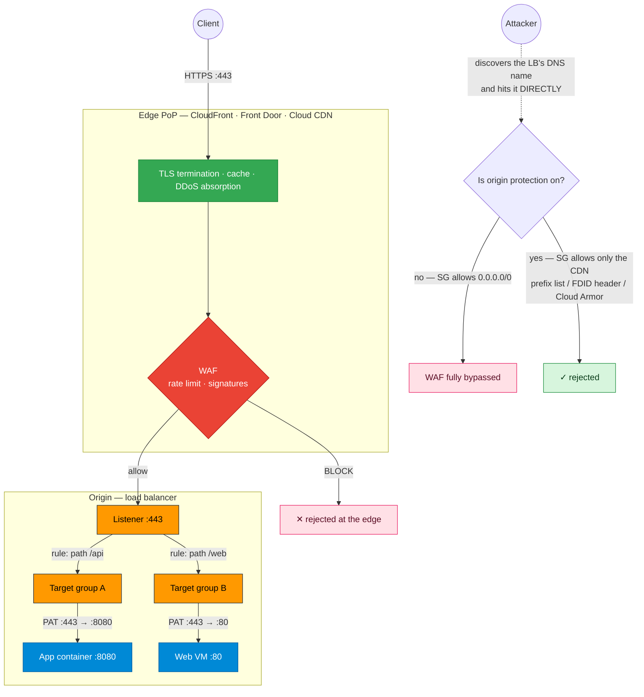
```mermaid
flowchart TB
    C(("Client")) -->|"HTTPS :443"| EDGE

    subgraph EDGEG["Edge PoP — CloudFront · Front Door · Cloud CDN"]
        EDGE["TLS termination · cache · DDoS absorption"]:::edge
        WAF{"WAF<br/>rate limit · signatures"}:::waf
        EDGE --> WAF
    end

    WAF -->|"BLOCK"| X["✕ rejected at the edge"]:::bad
    WAF -->|"allow"| LB

    subgraph LBG["Origin — load balancer"]
        LB["Listener :443"]:::lb
        LB -->|"rule: path /api"| R1["Target group A"]:::lb
        LB -->|"rule: path /web"| R2["Target group B"]:::lb
        R1 -->|"PAT :443 → :8080"| APP["App container :8080"]:::be
        R2 -->|"PAT :443 → :80"| WEB["Web VM :80"]:::be
    end

    ATT(("Attacker")) -.->|"discovers the LB's DNS name<br/>and hits it DIRECTLY"| BYPASS{"Is origin protection on?"}
    BYPASS -->|"no — SG allows 0.0.0.0/0"| PWNED["WAF fully bypassed"]:::bad
    BYPASS -->|"yes — SG allows only the CDN<br/>prefix list / FDID header / Cloud Armor"| BLOCKED["✓ rejected"]:::good

    classDef edge fill:#34A853,stroke:#188038,color:#fff
    classDef waf fill:#EA4335,stroke:#B31412,color:#fff
    classDef lb fill:#FF9900,stroke:#232F3E,color:#000
    classDef be fill:#0089D6,stroke:#005BA1,color:#fff
    classDef bad fill:#ffe0e6,stroke:#e91e63,color:#5a0d24
    classDef good fill:#d7f5dd,stroke:#1e8e3e,color:#0b3d1a
```

### Issues → Fixes

| Symptom | Root cause | Fix |
| --- | --- | --- |
| Attack traffic reaches the origin despite a WAF being deployed | **Origin protection missing** — the LB accepts `0.0.0.0/0`, so the CDN and WAF are optional | AWS: restrict the LB's SG to the **CloudFront managed prefix list** + a secret custom header. Azure: Front Door service tag + verify `X-Azure-FDID`. GCP: Cloud Armor policy on the backend service |
| The WAF logs attacks but nothing is ever blocked | The web ACL / rule is in **COUNT** mode, not BLOCK | Verify the *mode*, not the presence. Alert on every rule-action change — flipping BLOCK→COUNT silently disables the perimeter and is indistinguishable from normal traffic |
| A CloudFront distribution refuses the ACM certificate | ACM certs for CloudFront **must** be issued in `us-east-1`, regardless of origin region | Request/import the certificate in `us-east-1`. Regional ALBs still use the regional cert |
| One user sees another user's personalised page | The edge cached a response containing `Set-Cookie` or per-user content | Set `Cache-Control: private, no-store` on personalised responses; define cache keys deliberately; never cache on a key that omits the authenticating dimension |
| Health checks or redirects loop between HTTP and HTTPS | A `:80` listener redirects to `:443` while the edge also forwards on `:80` | Keep exactly one plaintext listener whose only action is redirect-to-HTTPS; make the edge originate to the origin over HTTPS |
| TLS scanning flags weak ciphers on a modern stack | The LB's security policy defaults to an older predefined policy | Set the minimum policy to TLS 1.2+ explicitly; deny plaintext listeners by policy |
| WAF rules were changed without a ticket | `wafv2:UpdateWebACL` / `compute.securityPolicies.update` was treated as a networking convenience | It is a production-security permission. Restrict to SecOps, require change tickets, alert on every rule-action change |

### Verify it

```bash
# Is the origin reachable directly, bypassing the CDN? (run from outside)
curl -sS -o /dev/null -w "%{http_code}\n" https://<alb-dns-name>/     # should be 403/timeout, not 200

# AWS — is the WebACL blocking or only counting?
aws wafv2 get-web-acl --scope CLOUDFRONT --region us-east-1 --name <name> --id <id> \
  --query "WebACL.Rules[].{name:Name, action:keys(Action || OverrideAction)}" --output table

# AWS — does the ALB SG allow only the CloudFront prefix list?
aws ec2 describe-security-groups --group-ids <alb-sg> \
  --query "SecurityGroups[].IpPermissions[].{prefix:PrefixListIds[].PrefixListId, open:IpRanges[].CidrIp}"
```

---

## C16 — Agentic IaC & policy-as-code

> Source: [`Architecture.md` §4](Architecture.md#c16--how-the-network-actually-gets-built)

### In one sentence
Every guardrail named in C1–C15 is only real if a machine enforces it on the Terraform plan before
a human ever approves it.

### The reason
A guardrail written in a wiki is a suggestion. The same guardrail as an OPA/Sentinel/Checkov rule
that fails the plan is a control. This section exists because the preceding fifteen are otherwise
just advice.

The design has two properties worth naming. First, the agent generates Terraform **against
retrieved standards**, not from memory — the CIDR plan, approved SKUs, naming, and region allow-list
are fetched at step 02, so the output is grounded rather than plausible. Second, a policy failure
**loops back to the agent**, not to a human: the agent revises and re-submits, and a person is only
interrupted at the approval gate. That is what makes the loop economical.

And the uncomfortable truth: **the pipeline identity is the most privileged identity in your
cloud.** It can create routes, firewall rules, and peerings — everything this guide warns about. A
guardrail the pipeline can edit is not a guardrail.

### How it actually works

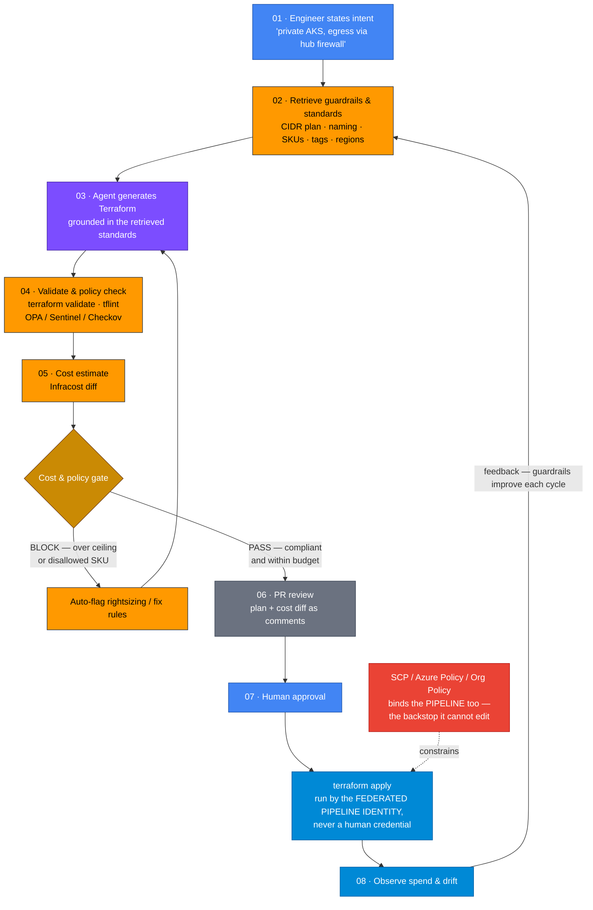
```mermaid
flowchart TB
    E["01 · Engineer states intent<br/>'private AKS, egress via hub firewall'"]:::eng
    E --> G["02 · Retrieve guardrails & standards<br/>CIDR plan · naming · SKUs · tags · regions"]:::pol
    G --> A["03 · Agent generates Terraform<br/>grounded in the retrieved standards"]:::agent
    A --> V["04 · Validate & policy check<br/>terraform validate · tflint<br/>OPA / Sentinel / Checkov"]:::pol
    V --> CE["05 · Cost estimate<br/>Infracost diff"]:::pol
    CE --> GATE{"Cost & policy gate"}:::gate

    GATE -->|"BLOCK — over ceiling<br/>or disallowed SKU"| FIX["Auto-flag rightsizing / fix rules"]:::pol
    FIX --> A

    GATE -->|"PASS — compliant<br/>and within budget"| PR["06 · PR review<br/>plan + cost diff as comments"]:::git
    PR --> H["07 · Human approval"]:::eng
    H --> APPLY["terraform apply<br/>run by the FEDERATED PIPELINE IDENTITY,<br/>never a human credential"]:::cloud
    APPLY --> OBS["08 · Observe spend & drift"]:::cloud
    OBS -->|"feedback — guardrails improve each cycle"| G

    SCP["SCP / Azure Policy / Org Policy<br/>binds the PIPELINE too —<br/>the backstop it cannot edit"]:::stop
    SCP -.->|"constrains"| APPLY

    classDef eng fill:#4285F4,stroke:#174EA6,color:#fff
    classDef agent fill:#7c4dff,stroke:#4527a0,color:#fff
    classDef pol fill:#FF9900,stroke:#232F3E,color:#000
    classDef git fill:#6b7280,stroke:#374151,color:#fff
    classDef cloud fill:#0089D6,stroke:#005BA1,color:#fff
    classDef gate fill:#ca8a04,stroke:#713f12,color:#fff
    classDef stop fill:#EA4335,stroke:#B31412,color:#fff
```

### Guardrail → enforcement mapping

| Guardrail from this guide | Enforced at step 04 as | Backstop |
| --- | --- | --- |
| No `0.0.0.0/0` on `:22`/`:3389` ([C4](#c4--security-groups--nsg)) | OPA/Sentinel rule on the plan | SCP / Azure Policy Deny |
| No IGW route from a private subnet ([C3](#c3--route-tables--udr)) | Checkov `CKV_AWS_*` route rule | SCP on `ec2:CreateRoute` |
| Every subnet has an NSG ([C2](#c2--subnets--tiering)) | Plan check on `subnet.networkSecurityGroup` | Azure Policy built-in, Deny |
| PaaS reachable only privately ([C7](#c7--private-service-access)) | Plan check on `publicNetworkAccess` | Azure Policy / GCP Org Policy |
| WAF in BLOCK not COUNT ([C15](#c15--edge-listeners-port-forwarding)) | Plan check on the rule action | Drift alert on rule-action change |
| One NAT Gateway per AZ ([C9](#c9--nat-gateway-vs-nat-instance)) | Module design + cost gate | Infracost ceiling |

### Issues → Fixes

| Symptom | Root cause | Fix |
| --- | --- | --- |
| The agent generates plausible Terraform that violates the CIDR plan | It generated from memory rather than from retrieved standards | Step 02 is not optional. Feed the CIDR plan, naming convention, SKU allow-list, and region list into the prompt as retrieved context, and fail the plan if the output contradicts them |
| Policy checks pass but the applied infrastructure is non-compliant | The policy engine examined the **HCL**, not the **plan JSON** — count/for_each and modules hide the real resources | Run OPA/Checkov against `terraform show -json tfplan`, not the source files |
| Cost surprises after apply despite an estimate | NAT data processing, TGW attachment-hours, and firewall data processing are usage-based and invisible to a static estimate | Add usage assumptions to Infracost; alert on actuals in step 08 and feed the delta back into step 02 |
| Someone bypassed the pipeline with local credentials | Humans still hold apply-capable roles | Remove standing human write access; make `terraform apply` the only path. Break-glass is time-boxed, MFA-gated, and alerted on assume |
| The pipeline itself edited a guardrail away | The pipeline role was not bound by the org-level policy | SCPs / Azure Policy at management-group scope / Org Policy constraints must bind the pipeline identity too |
| Long-lived cloud keys sit in CI secrets | Static credentials were the fastest way to get started | **OIDC / workload identity federation** on all three clouds. No static keys anywhere |
| The `plan` stage can mutate infrastructure | One role is used for both plan and apply | Split them: `plan` gets read-only credentials, `apply` gets a separate, environment-scoped identity |
| Two pipelines corrupt the same state file | No state locking | S3 + DynamoDB lock (AWS), blob lease (Azure), GCS with versioning; enable encryption (SSE-KMS / CMEK) and versioning everywhere |

---

## K1 — Production EKS reference architecture

> Source: the (previously unfenced) diagram at the end of [`Architecture.md` Appendix C](Architecture.md#appendix-c--diagram-index)

### In one sentence
Every concept in C1–C15 assembled into one cluster: three AZs, public/private tiering, a managed
control plane, and five cross-cutting concerns — security, observability, scaling, automation, and
operations.

### The reason
A Kubernetes cluster is where the abstract networking concepts stop being abstract. The private
subnet from [C2](#c2--subnets--tiering) is where nodes live; the NAT from
[C9](#c9--nat-gateway-vs-nat-instance) is how they pull images; the L7 LB from
[C12](#c12--load-balancers-l7-vs-l4) is the ingress; the private endpoint from
[C7](#c7--private-service-access) is how they reach the database. Getting the network wrong here
shows up as pod scheduling failures and mysterious image-pull timeouts, not as networking tickets.

The five cross-cutting boxes exist because a cluster that is only *networked* correctly is still
not production-ready. Each one answers a different failure question: who can do what (security),
what is happening (observability), what happens under load (scaling), how does it get built
(automation), and how does it survive change (operations).

### How it actually works

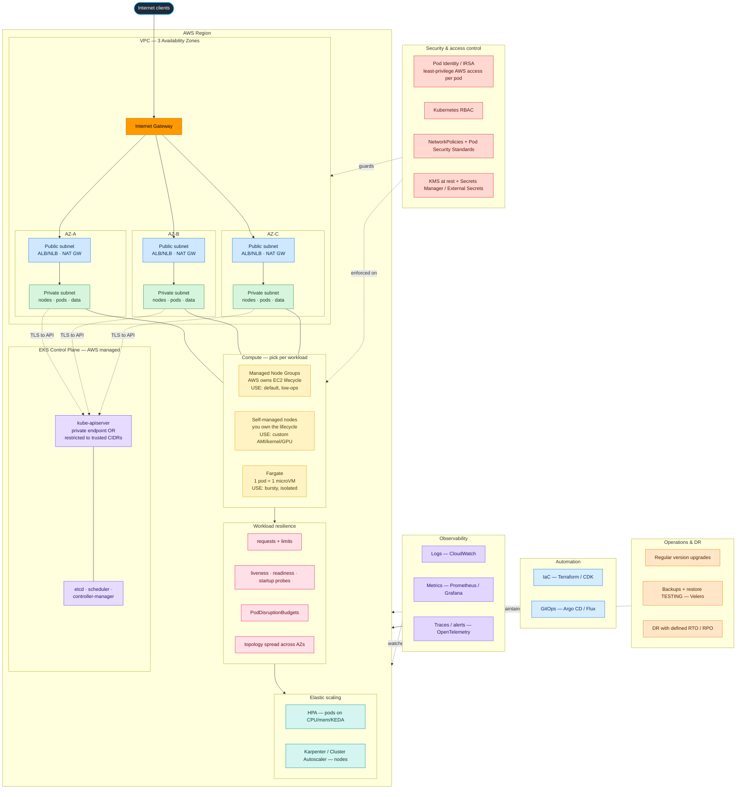
```mermaid
flowchart TB
    Users(["Internet clients"]):::internet

    subgraph AWS["AWS Region"]
        direction TB

        subgraph CP["EKS Control Plane — AWS managed"]
            API["kube-apiserver<br/>private endpoint OR<br/>restricted to trusted CIDRs"]:::eks
            ETCD["etcd · scheduler ·<br/>controller-manager"]:::eks
            API --- ETCD
        end

        subgraph VPC["VPC — 3 Availability Zones"]
            IGW["Internet Gateway"]:::edge
            subgraph AZA["AZ-A"]
                PUBA["Public subnet<br/>ALB/NLB · NAT GW"]:::public
                PRVA["Private subnet<br/>nodes · pods · data"]:::private
                PUBA --> PRVA
            end
            subgraph AZB["AZ-B"]
                PUBB["Public subnet<br/>ALB/NLB · NAT GW"]:::public
                PRVB["Private subnet<br/>nodes · pods · data"]:::private
                PUBB --> PRVB
            end
            subgraph AZC["AZ-C"]
                PUBC["Public subnet<br/>ALB/NLB · NAT GW"]:::public
                PRVC["Private subnet<br/>nodes · pods · data"]:::private
                PUBC --> PRVC
            end
        end

        subgraph COMPUTE["Compute — pick per workload"]
            MNG["Managed Node Groups<br/>AWS owns EC2 lifecycle<br/>USE: default, low-ops"]:::compute
            SELF["Self-managed nodes<br/>you own the lifecycle<br/>USE: custom AMI/kernel/GPU"]:::compute
            FARG["Fargate<br/>1 pod = 1 microVM<br/>USE: bursty, isolated"]:::compute
        end

        subgraph RESIL["Workload resilience"]
            REQ["requests + limits"]:::resil
            PRB["liveness · readiness · startup probes"]:::resil
            PDB["PodDisruptionBudgets"]:::resil
            SPR["topology spread across AZs"]:::resil
        end

        subgraph SCALE["Elastic scaling"]
            HPA["HPA — pods on CPU/mem/KEDA"]:::scale
            KARP["Karpenter / Cluster Autoscaler — nodes"]:::scale
        end
    end

    subgraph SEC["Security & access control"]
        IRSA["Pod Identity / IRSA<br/>least-privilege AWS access per pod"]:::sec
        RBAC["Kubernetes RBAC"]:::sec
        NETPOL["NetworkPolicies + Pod Security Standards"]:::sec
        SECRETS["KMS at rest + Secrets Manager / External Secrets"]:::sec
    end

    subgraph OBS["Observability"]
        LOGS["Logs — CloudWatch"]:::obs
        MET["Metrics — Prometheus / Grafana"]:::obs
        TR["Traces / alerts — OpenTelemetry"]:::obs
    end

    subgraph AUTO["Automation"]
        IAC["IaC — Terraform / CDK"]:::auto
        GITOPS["GitOps — Argo CD / Flux"]:::auto
    end

    subgraph OPS["Operations & DR"]
        UPG["Regular version upgrades"]:::dr
        BKP["Backups + restore TESTING — Velero"]:::dr
        DR["DR with defined RTO / RPO"]:::dr
    end

    Users --> IGW
    IGW --> PUBA & PUBB & PUBC
    PRVA -. "TLS to API" .-> API
    PRVB -. "TLS to API" .-> API
    PRVC -. "TLS to API" .-> API
    PRVA --- COMPUTE
    PRVB --- COMPUTE
    PRVC --- COMPUTE
    COMPUTE --> RESIL --> SCALE
    SEC -.->|guards| VPC
    SEC -.->|enforced on| COMPUTE
    OBS -.->|watches| AWS
    AUTO -->|provisions| AWS
    OPS -.->|maintains| AWS

    classDef internet fill:#1d2b3a,stroke:#0af,color:#fff
    classDef edge fill:#ff9900,stroke:#b36b00,color:#000
    classDef public fill:#cfe8ff,stroke:#1a73e8,color:#062a5a
    classDef private fill:#d7f5dd,stroke:#1e8e3e,color:#0b3d1a
    classDef eks fill:#e7dcff,stroke:#6b3ff2,color:#2a1560
    classDef compute fill:#fff3c4,stroke:#e6a700,color:#4a3800
    classDef resil fill:#ffe0e6,stroke:#e91e63,color:#5a0d24
    classDef scale fill:#d4f5f0,stroke:#009688,color:#053b35
    classDef sec fill:#ffd8d2,stroke:#d93025,color:#5a120c
    classDef obs fill:#e2d6ff,stroke:#7c4dff,color:#2c1466
    classDef auto fill:#d6ecff,stroke:#0b74de,color:#062f5a
    classDef dr fill:#ffe6c7,stroke:#f57c00,color:#4a2600
```

### Choosing the compute primitive

| | Managed Node Groups | Self-managed nodes | Fargate |
| --- | --- | --- | --- |
| **Who owns the EC2 lifecycle** | AWS | You | Nobody — there are no nodes |
| **Use when** | Default for almost everything | Custom AMI, kernel tuning, GPU drivers, compliance images | Bursty or strongly isolated workloads; 1 pod = 1 microVM |
| **Upgrade primitive** | Version bump, or blue-green group | You build the rollout | N/A — pods are replaced |
| **Cost shape** | EC2 pricing + unused headroom | EC2 pricing + your ops time | Per-pod, higher unit cost, zero idle |
| **DaemonSets** | Supported | Supported | **Not supported** — plan logging/monitoring sidecars differently |

### Issues → Fixes

| Symptom | Root cause | Fix |
| --- | --- | --- |
| Pods stuck `Pending` with `insufficient IPs`, nodes healthy | The VPC CNI assigns a **subnet IP per pod** — the subnet, not the node, ran out | Prefix delegation (AWS) or Azure CNI Overlay; or add a secondary CIDR sized for `nodes × maxPods`. See [C2](#c2--subnets--tiering) |
| `ImagePullBackOff` on private subnets only | No NAT route, or the registry is not reachable privately | Confirm `0.0.0.0/0 → NAT` on the private route table; add an **ECR interface endpoint + S3 gateway endpoint** so image pulls bypass NAT entirely ([C7](#c7--private-service-access)) — cheaper and more reliable |
| Ingress creates no load balancer | The AWS Load Balancer Controller lacks IAM permissions, or subnets are missing the discovery tags | Tag public subnets `kubernetes.io/role/elb=1` and private `kubernetes.io/role/internal-elb=1`; verify the controller's IRSA role |
| The API server is reachable from the internet | Public endpoint left at `0.0.0.0/0` | Set the endpoint to private, or restrict `publicAccessCidrs` to known admin ranges. Access from CI via a private path |
| A compromised pod reaches AWS APIs with node-level permissions | Pods inherited the node instance role | **IRSA / Pod Identity** — per-pod, least-privilege roles. Block IMDSv1 and set the hop limit to 1 |
| Any pod can reach any other pod | No NetworkPolicies — Kubernetes defaults to a flat network | Default-deny NetworkPolicy per namespace, then allow-list. The VPC-level controls in C4/C5 do **not** see pod-to-pod traffic on the same node |
| Nodes scale but pods still cannot schedule | HPA scaled pods without node capacity, or Karpenter/CA lacks permissions or a suitable instance type | Pair HPA with Karpenter/Cluster Autoscaler; check the autoscaler logs for `no instance type satisfies` |
| Backups exist but a restore has never worked | Backups were configured, restores were assumed | Test restores on a schedule. An untested backup is not a backup |

---

## K2 — Zero-downtime Kubernetes upgrades

> Source: [`Architecture.md` — Zero-Downtime Kubernetes Upgrade Runbook](Architecture.md#zero-downtime-kubernetes-upgrade-runbook)

### In one sentence
The upgrade procedure does not deliver zero downtime — **the application's HA design does**; the
procedure's only job is to avoid breaking that guarantee.

### The reason
This is the point that separates someone who has done the upgrade from someone who has read about
it. Draining a node evicts pods. If a Deployment has one replica, that eviction is an outage no
matter how careful the operator is. If it has three replicas across three AZs with a
PodDisruptionBudget and a readiness probe, the drain simply **blocks** until it is safe.

So the five preconditions are not a checklist item — they are the entire mechanism:

| Precondition | What it does during a drain |
| --- | --- |
| `replicas >= 2`, spread across zones | A drained node can never take the last replica |
| **PodDisruptionBudget** | Drain *waits* instead of evicting below the budget |
| **Readiness probes** | New pods take traffic only when genuinely ready — no 5xx during reschedule |
| **Topology spread / multi-AZ** | One node or zone cycling never removes all capacity |
| **Graceful termination** (`preStop`, `terminationGracePeriodSeconds`) | In-flight requests finish before the pod dies |

The second reason for the ordering — **control plane first, then add-ons, then nodes** — is that
upgrading the control plane validates API compatibility *before* any running workload is touched,
and a newer control plane supports older nodes (the reverse is not true).

### How it actually works

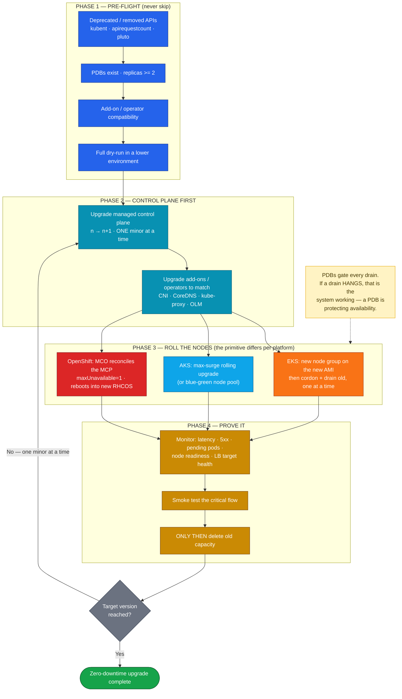
```mermaid
flowchart TB
    subgraph P1["PHASE 1 — PRE-FLIGHT (never skip)"]
        A1["Deprecated / removed APIs<br/>kubent · apirequestcount · pluto"]:::p1
        A2["PDBs exist · replicas >= 2"]:::p1
        A3["Add-on / operator compatibility"]:::p1
        A4["Full dry-run in a lower environment"]:::p1
        A1 --> A2 --> A3 --> A4
    end

    subgraph P2["PHASE 2 — CONTROL PLANE FIRST"]
        B1["Upgrade managed control plane<br/>n → n+1 · ONE minor at a time"]:::p2
        B2["Upgrade add-ons / operators to match<br/>CNI · CoreDNS · kube-proxy · OLM"]:::p2
        B1 --> B2
    end

    subgraph P3["PHASE 3 — ROLL THE NODES (the primitive differs per platform)"]
        C1["EKS: new node group on the new AMI<br/>then cordon + drain old, one at a time"]:::eks
        C2["AKS: max-surge rolling upgrade<br/>(or blue-green node pool)"]:::aks
        C3["OpenShift: MCO reconciles the MCP<br/>maxUnavailable=1 · reboots into new RHCOS"]:::ocp
    end

    subgraph P4["PHASE 4 — PROVE IT"]
        D1["Monitor: latency · 5xx · pending pods ·<br/>node readiness · LB target health"]:::p4
        D2["Smoke test the critical flow"]:::p4
        D3["ONLY THEN delete old capacity"]:::p4
        D1 --> D2 --> D3
    end

    A4 --> B1
    B2 --> C1 & C2 & C3
    C1 --> D1
    C2 --> D1
    C3 --> D1
    D3 --> LOOP{"Target version<br/>reached?"}:::gate
    LOOP -->|"No — one minor at a time"| B1
    LOOP -->|"Yes"| DONE(["Zero-downtime upgrade complete"]):::done

    GATE2["PDBs gate every drain.<br/>If a drain HANGS, that is the<br/>system working — a PDB is<br/>protecting availability."]:::note
    GATE2 -.-> P3

    classDef p1 fill:#2563eb,stroke:#1e3a8a,color:#fff
    classDef p2 fill:#0891b2,stroke:#155e75,color:#fff
    classDef p4 fill:#ca8a04,stroke:#713f12,color:#fff
    classDef eks fill:#f97316,stroke:#9a3412,color:#fff
    classDef aks fill:#0ea5e9,stroke:#075985,color:#fff
    classDef ocp fill:#dc2626,stroke:#7f1d1d,color:#fff
    classDef gate fill:#6b7280,stroke:#374151,color:#fff
    classDef done fill:#16a34a,stroke:#14532d,color:#fff
    classDef note fill:#fff3c4,stroke:#e6a700,color:#4a3800
```

### The only thing that really differs: the node-replacement primitive

| | AWS EKS | Azure AKS | OpenShift on OCI |
| --- | --- | --- | --- |
| **Orchestrator** | You / `eksctl` / API | You / `az aks` / channels | **Cluster Version Operator (CVO)** |
| **Worker group** | Managed Node Group | Node Pool | **MachineConfigPool** + MachineSet |
| **Roll primitive** | New node group + manual cordon/drain (or MNG version bump) | **`max-surge`** rolling, or blue-green pool | MCO reconcile, gated by **`maxUnavailable`** (default 1) |
| **Skip-minor exception** | None | **LTS** clusters may skip | **EUS→EUS** — workers reboot **once** across two minors |
| **Deprecated-API safety net** | Upgrade Insights (advisory) | **Blocks** the upgrade — hardest enforcement of the three | Cluster Operators go Degraded |
| **Rollback lever** | Old node group still live | Old pool retained (blue-green) | Paused MCP |

> **Control plane upgrades cannot be rolled back on any of the three.** The rollback path is
> always *retained old capacity + application-level rollback* — which is why "never delete the old
> node group / pool until smoke tests pass" is the load-bearing rule of the whole runbook.

### Issues → Fixes

| Symptom | Root cause | Fix |
| --- | --- | --- |
| `kubectl drain` hangs indefinitely | A **PodDisruptionBudget is blocking eviction** — this is the system working correctly | Do not force. Scale the Deployment up so the budget can be satisfied, or fix a PDB that is unsatisfiable (e.g. `minAvailable` equal to `replicas`, which can never allow an eviction) |
| Drain succeeds but the app 5xxs during the roll | Missing readiness probes (traffic sent to pods that are not ready) or no graceful termination (in-flight requests killed) | Add readiness probes and a `preStop` sleep with `terminationGracePeriodSeconds` above the LB's deregistration delay |
| Upgrade fails partway with API errors from controllers | Removed APIs still in use by a Helm chart, operator, or CRD | Run `kubent` / `pluto` / `kubectl get apirequestcount` **before** the control plane hop, and upgrade the offending charts first |
| AKS refuses to start the upgrade | AKS's deprecated-API check found in-use removed APIs and blocked it | Treat as a gift, not an obstacle — fix the manifests. EKS does not enforce this as hard, so run `kubent` there yourself |
| AKS node pool upgrade fails with IP exhaustion | Surge nodes need `(nodes + maxSurge) × (1 + maxPods)` IPs and the subnet is too small | Lower `max-surge`, or move to a larger subnet / Azure CNI Overlay before upgrading |
| Nodes upgraded but the cluster misbehaves — DNS flaky, CNI errors | Add-ons (VPC CNI, CoreDNS, kube-proxy) were not upgraded to versions compatible with the new control plane | Upgrade add-ons **between** the control plane and the node roll — that is why they are their own phase |
| OpenShift workers rebooted twice going 4.14 → 4.16 | Sequential minor hops with the MCP unpaused | Use the **EUS→EUS** path: `eus-4.16` channel, pause all non-master MCPs, hop the control plane twice, then unpause — workers reboot once |
| Some ClusterOperators sit `Degraded` after a CVO upgrade | An OLM operator is incompatible with the target version | Update layered/OLM operators to compatible versions *before* the hop; `oc get co` must be all `Available=True, Degraded=False` before continuing |
| Everything looks fine, then the old capacity is deleted and traffic breaks | Validation was "pods are Running", not "the critical user flow works" | Smoke test the real path (login → account → API → transaction) before deleting the old node group / pool / unpausing the next pool |

### Verify it

```bash
# Universal pre-flight — run these on any of the three platforms
kubent                                              # deprecated / removed APIs in use
kubectl get pdb -A                                  # do PDBs exist at all?
kubectl get deploy -A -o custom-columns=NS:.metadata.namespace,NAME:.metadata.name,REP:.spec.replicas | awk '$3<2'
kubectl get pods -A -o wide | grep -v Running       # anything already unhealthy?

# AWS EKS
aws eks list-insights --cluster-name prod-cluster    # built-in readiness checks

# Azure AKS
az aks get-upgrades -g myRG -n myAKS -o table        # legal upgrade paths

# OpenShift
oc get clusterversion && oc get co && oc get mcp     # all Available, none Degraded, MCPs Updated
```

---

## A — Debugging order as a decision tree

> Source: [`Architecture.md` Appendix A](Architecture.md#appendix-a--debugging-order)

### The reason
When traffic does not arrive you have exactly one piece of information — the symptom — and a dozen
plausible causes. Walking the hops **in order** converts guessing into elimination, and the order is
fixed because it is the order the packet actually traverses. Skipping ahead to the interesting layer
is how an hour gets spent on a firewall that was never involved.

The most useful discriminator early on: **a timeout usually means routing; a refusal usually means
a firewall or a listener.** A route to nowhere produces silence; a filter produces a decision.

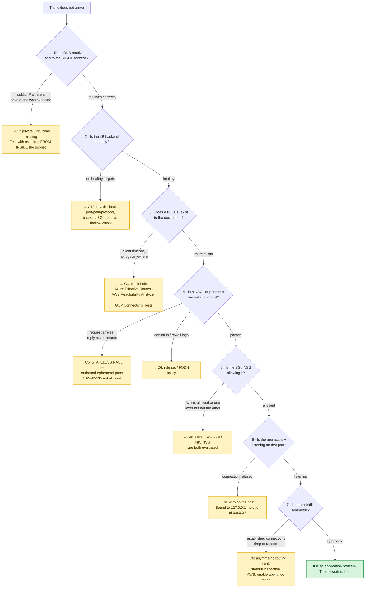
```mermaid
flowchart TD
    S["Traffic does not arrive"] --> Q1{"1 · Does DNS resolve,<br/>and to the RIGHT address?"}
    Q1 -->|"public IP where a<br/>private one was expected"| F1["→ C7: private DNS zone missing<br/>Test with nslookup FROM INSIDE the subnet"]:::fix
    Q1 -->|resolves correctly| Q2{"2 · Is the LB backend healthy?"}

    Q2 -->|"no healthy targets"| F2["→ C12: health-check port/path/protocol,<br/>backend SG, deep vs shallow check"]:::fix
    Q2 -->|healthy| Q3{"3 · Does a ROUTE exist<br/>to the destination?"}

    Q3 -->|"silent timeout,<br/>no logs anywhere"| F3["→ C3: black hole.<br/>Azure Effective Routes ·<br/>AWS Reachability Analyzer ·<br/>GCP Connectivity Tests"]:::fix
    Q3 -->|route exists| Q4{"4 · Is a NACL or perimeter<br/>firewall dropping it?"}

    Q4 -->|"request arrives,<br/>reply never returns"| F4["→ C5: STATELESS NACL —<br/>outbound ephemeral ports<br/>1024-65535 not allowed"]:::fix
    Q4 -->|"denied in firewall logs"| F4b["→ C6: rule set / FQDN policy"]:::fix
    Q4 -->|passes| Q5{"5 · Is the SG / NSG<br/>allowing it?"}

    Q5 -->|"Azure: allowed at one<br/>layer but not the other"| F5["→ C4: subnet NSG AND NIC NSG<br/>are both evaluated"]:::fix
    Q5 -->|allowed| Q6{"6 · Is the app actually<br/>listening on that port?"}

    Q6 -->|"connection refused"| F6["→ ss -lntp on the host.<br/>Bound to 127.0.0.1 instead of 0.0.0.0?"]:::fix
    Q6 -->|listening| Q7{"7 · Is return traffic<br/>symmetric?"}

    Q7 -->|"established connections<br/>drop at random"| F7["→ C6: asymmetric routing breaks<br/>stateful inspection.<br/>AWS: enable appliance mode"]:::fix
    Q7 -->|symmetric| APP["It is an application problem.<br/>The network is fine."]:::good

    classDef fix fill:#fff3c4,stroke:#e6a700,color:#4a3800
    classDef good fill:#d7f5dd,stroke:#1e8e3e,color:#0b3d1a
```

### The three tools that answer "why can't A reach B" without touching a host

| Cloud | Tool | What it evaluates |
| --- | --- | --- |
| **AWS** | VPC Reachability Analyzer | Routes, SGs, NACLs, gateways — returns the exact blocking component |
| **Azure** | Network Watcher — Connection Troubleshoot, **Effective Security Rules**, **Effective Routes** | The merged, evaluated NSG and route view per NIC |
| **GCP** | Connectivity Tests | Firewall rules, routes, and forwarding across the path |

Use them **first**, not last. They read the control plane, so they work even when the host is
unreachable — which is exactly the situation you are in.

---

## Guardrail checklist — with the reason attached

> Source: [`Architecture.md` Appendix B](Architecture.md#appendix-b--guardrail-checklist)

The ten controls, restated with *why each one is worth the friction it causes*:

| # | Control | Why it earns its place |
| --- | --- | --- |
| 1 | No `0.0.0.0/0` on management ports | Highest-return single policy anyone can write. Removes the most-exploited misconfiguration in cloud entirely |
| 2 | No public IPs on workloads | Makes internet exposure require a deliberate, reviewable exception rather than a default |
| 3 | Route changes are break-glass and alerted | Route edits are instant, silent, unlogged by default, and can bypass every other control here |
| 4 | All egress inspected | The only way to *prove* a workload cannot reach an unapproved endpoint |
| 5 | Every subnet has a firewall attached | Closes the "new subnet, no controls" gap that appears whenever someone adds capacity in a hurry |
| 6 | PaaS private-only | Makes a leaked connection string worthless from outside the network |
| 7 | Peering only within the org | The accept step is the only thing standing between you and a private path from a stranger's account |
| 8 | Flow logs on, in a locked account | Without them an incident is unreconstructable — and if the workload team can delete them, so can an attacker on that team's credentials |
| 9 | Firewall/WAF edits split from route edits | Either permission alone silently disables inspection; together they are unaccountable |
| 10 | Pipeline identity federated, no static keys | The pipeline is the most privileged identity you have; a long-lived key for it is the highest-value credential in the estate |

---

## Cross-reference: concept → what it protects against

| Concept | The failure it exists to prevent |
| --- | --- |
| [C1](#c1--vpc--vnet) VPC/VNet | Shared-fabric exposure; unbounded blast radius |
| [C2](#c2--subnets--tiering) Subnets | Data exfiltration from a compromised app tier |
| [C3](#c3--route-tables--udr) Routes | Silent bypass of every security control below |
| [C4](#c4--security-groups--nsg) SG/NSG | Lateral movement between neighbouring workloads |
| [C5](#c5--nacls--layered-defence) NACL & layers | A single misconfiguration becoming a single point of failure |
| [C6](#c6--centralised-egress-inspection) Central egress | Unprovable, unauditable outbound traffic |
| [C7](#c7--private-service-access) Private access | Managed-service traffic leaving your network entirely |
| [C8](#c8--internet-gateway) IGW | Accidental, undeclared internet reachability |
| [C9](#c9--nat-gateway-vs-nat-instance) NAT | Public IPs on every workload that needs to patch |
| [C10](#c10--peering) Peering | Overlapping address space; unvetted inbound private paths |
| [C11](#c11--hub--spoke--transit) Hub & spoke | n² mesh sprawl; unauditable segmentation |
| [C12](#c12--load-balancers-l7-vs-l4) L7/L4 | Single-instance exposure; loss of client identity |
| [C13](#c13--lb-algorithms) Algorithms | Uneven load; mass session loss on scale events |
| [C14](#c14--lb-types--features) Types & features | Routing to unhealthy backends; dropped requests on deploy |
| [C15](#c15--edge-listeners-port-forwarding) Edge | Origin exposure that makes the WAF optional |
| [C16](#c16--agentic-iac--policy-as-code) Agentic IaC | Every guardrail above existing only as advice |
| [K1](#k1--production-eks-reference-architecture) EKS reference | Cluster-level assembly mistakes: IP exhaustion, node-role over-permission, flat pod networking |
| [K2](#k2--zero-downtime-kubernetes-upgrades) Upgrades | Downtime introduced by maintenance rather than by failure |


# Top 10 AWS VPC Interview Questions — STAR + Diagrams

> **How to use STAR for technical scenarios:** Frame each answer as a short story.
> **S**ituation = the context, **T**ask = what you had to achieve, **A**ction = the technical
> steps you took (this is where you prove depth), **R**esult = the outcome + the lesson.
> Speak the S/T in ~15 seconds, spend most time on A, close crisply on R.
>
> _Diagrams below are inline SVG — they render in VS Code preview, Obsidian, Typora and any
> browser. (GitHub's markdown viewer strips inline SVG, so open locally to see them.)_

---

## Reference architecture (answers Q1 and Q5)

<svg width="100%" viewBox="0 0 680 620" xmlns="http://www.w3.org/2000/svg">
<style>
 text{font-family:'Segoe UI',system-ui,-apple-system,sans-serif}
 .th{font-weight:500;font-size:14px} .ts{font-weight:400;font-size:12px}
 .arr{stroke:#5F5E5A;stroke-width:1.5;fill:none}
 .gray rect{fill:#F1EFE8;stroke:#5F5E5A;stroke-width:.5} .gray .th{fill:#2C2C2A} .gray .ts{fill:#5F5E5A}
 .blue rect{fill:#E6F1FB;stroke:#185FA5;stroke-width:.5} .blue .th{fill:#0C447C} .blue .ts{fill:#185FA5}
 .teal rect{fill:#E1F5EE;stroke:#0F6E56;stroke-width:.5} .teal .th{fill:#085041} .teal .ts{fill:#0F6E56}
 .purple rect{fill:#EEEDFE;stroke:#534AB7;stroke-width:.5} .purple .th{fill:#3C3489} .purple .ts{fill:#534AB7}
 .coral rect{fill:#FAECE7;stroke:#993C1D;stroke-width:.5} .coral .th{fill:#712B13} .coral .ts{fill:#993C1D}
 .lbl{fill:#5F5E5A;font-weight:400;font-size:12px}
</style>
<defs><marker id="a1" viewBox="0 0 10 10" refX="8" refY="5" markerWidth="6" markerHeight="6" orient="auto-start-reverse"><path d="M2 1L8 5L2 9" fill="none" stroke="context-stroke" stroke-width="1.5" stroke-linecap="round" stroke-linejoin="round"/></marker></defs>
<text class="th" x="340" y="26" text-anchor="middle" fill="#2C2C2A">Internet</text>
<line x1="340" y1="34" x2="340" y2="70" class="arr" marker-end="url(#a1)"/>
<g class="blue"><rect x="270" y="70" width="140" height="44" rx="8"/><text class="th" x="340" y="93" text-anchor="middle">Internet Gateway</text><text class="ts" x="340" y="108" text-anchor="middle">IGW</text></g>
<line x1="340" y1="114" x2="340" y2="140" class="arr" marker-end="url(#a1)"/>
<g class="gray"><rect x="30" y="140" width="620" height="450" rx="20"/><text class="th" x="50" y="168">VPC  10.0.0.0/16</text></g>
<text class="lbl" x="200" y="192" text-anchor="middle">Availability Zone A</text>
<text class="lbl" x="490" y="192" text-anchor="middle">Availability Zone B</text>
<g class="teal"><rect x="60" y="205" width="280" height="90" rx="12"/><text class="th" x="200" y="232" text-anchor="middle">Public subnet</text><text class="ts" x="200" y="250" text-anchor="middle">10.0.1.0/24 · ALB + NAT GW</text><text class="ts" x="200" y="280" text-anchor="middle">route: 0.0.0.0/0 → IGW</text></g>
<g class="teal"><rect x="360" y="205" width="280" height="90" rx="12"/><text class="th" x="500" y="232" text-anchor="middle">Public subnet</text><text class="ts" x="500" y="250" text-anchor="middle">10.0.2.0/24 · ALB + NAT GW</text><text class="ts" x="500" y="280" text-anchor="middle">route: 0.0.0.0/0 → IGW</text></g>
<line x1="200" y1="295" x2="200" y2="325" class="arr" marker-end="url(#a1)"/>
<line x1="500" y1="295" x2="500" y2="325" class="arr" marker-end="url(#a1)"/>
<g class="purple"><rect x="60" y="325" width="280" height="90" rx="12"/><text class="th" x="200" y="352" text-anchor="middle">Private app subnet</text><text class="ts" x="200" y="370" text-anchor="middle">10.0.11.0/24 · app ASG</text><text class="ts" x="200" y="400" text-anchor="middle">route: 0.0.0.0/0 → NAT GW</text></g>
<g class="purple"><rect x="360" y="325" width="280" height="90" rx="12"/><text class="th" x="500" y="352" text-anchor="middle">Private app subnet</text><text class="ts" x="500" y="370" text-anchor="middle">10.0.12.0/24 · app ASG</text><text class="ts" x="500" y="400" text-anchor="middle">route: 0.0.0.0/0 → NAT GW</text></g>
<line x1="200" y1="415" x2="200" y2="445" class="arr" marker-end="url(#a1)"/>
<line x1="500" y1="415" x2="500" y2="445" class="arr" marker-end="url(#a1)"/>
<g class="coral"><rect x="60" y="445" width="280" height="90" rx="12"/><text class="th" x="200" y="472" text-anchor="middle">Private DB subnet</text><text class="ts" x="200" y="490" text-anchor="middle">10.0.21.0/24 · RDS primary</text><text class="ts" x="200" y="520" text-anchor="middle">no internet route</text></g>
<g class="coral"><rect x="360" y="445" width="280" height="90" rx="12"/><text class="th" x="500" y="472" text-anchor="middle">Private DB subnet</text><text class="ts" x="500" y="490" text-anchor="middle">10.0.22.0/24 · RDS standby</text><text class="ts" x="500" y="520" text-anchor="middle">Multi-AZ failover</text></g>
<text class="lbl" x="340" y="565" text-anchor="middle">SG chain: ALB (443 from 0.0.0.0/0) → App (from ALB SG) → DB (5432 from App SG)</text>
</svg>

---

## Troubleshooting decision flow (the logic behind Q2, Q3, Q4, Q6, Q8)

<svg width="100%" viewBox="0 0 680 640" xmlns="http://www.w3.org/2000/svg">
<style>
 text{font-family:'Segoe UI',system-ui,-apple-system,sans-serif}
 .th{font-weight:500;font-size:14px} .ts{font-weight:400;font-size:12px}
 .arr{stroke:#5F5E5A;stroke-width:1.5;fill:none}
 .gray rect{fill:#F1EFE8;stroke:#5F5E5A;stroke-width:.5} .gray .th{fill:#2C2C2A} .gray .ts{fill:#5F5E5A}
 .blue rect{fill:#E6F1FB;stroke:#185FA5;stroke-width:.5} .blue .th{fill:#0C447C} .blue .ts{fill:#185FA5}
 .teal rect{fill:#E1F5EE;stroke:#0F6E56;stroke-width:.5} .teal .th{fill:#085041} .teal .ts{fill:#0F6E56}
 .amber rect{fill:#FAEEDA;stroke:#854F0B;stroke-width:.5} .amber .th{fill:#633806} .amber .ts{fill:#854F0B}
 .coral rect{fill:#FAECE7;stroke:#993C1D;stroke-width:.5} .coral .th{fill:#712B13} .coral .ts{fill:#993C1D}
 .lbl{fill:#5F5E5A;font-weight:400;font-size:12px}
</style>
<defs><marker id="a2" viewBox="0 0 10 10" refX="8" refY="5" markerWidth="6" markerHeight="6" orient="auto-start-reverse"><path d="M2 1L8 5L2 9" fill="none" stroke="context-stroke" stroke-width="1.5" stroke-linecap="round" stroke-linejoin="round"/></marker></defs>
<g class="gray"><rect x="230" y="24" width="220" height="44" rx="8"/><text class="th" x="340" y="51" text-anchor="middle">Traffic not flowing</text></g>
<line x1="340" y1="68" x2="340" y2="96" class="arr" marker-end="url(#a2)"/>
<g class="blue"><rect x="230" y="96" width="220" height="56" rx="8"/><text class="th" x="340" y="119" text-anchor="middle">1. Route table</text><text class="ts" x="340" y="137" text-anchor="middle">IGW / NAT / local route present?</text></g>
<line x1="340" y1="152" x2="340" y2="180" class="arr" marker-end="url(#a2)"/>
<g class="blue"><rect x="230" y="180" width="220" height="56" rx="8"/><text class="th" x="340" y="203" text-anchor="middle">2. NACL (subnet)</text><text class="ts" x="340" y="221" text-anchor="middle">stateless: port + ephemeral</text></g>
<line x1="340" y1="236" x2="340" y2="264" class="arr" marker-end="url(#a2)"/>
<g class="blue"><rect x="230" y="264" width="220" height="56" rx="8"/><text class="th" x="340" y="287" text-anchor="middle">3. Security group</text><text class="ts" x="340" y="305" text-anchor="middle">stateful: allow inbound / SG ref</text></g>
<line x1="340" y1="320" x2="340" y2="348" class="arr" marker-end="url(#a2)"/>
<g class="blue"><rect x="230" y="348" width="220" height="56" rx="8"/><text class="th" x="340" y="371" text-anchor="middle">4. Host / app</text><text class="ts" x="340" y="389" text-anchor="middle">listening? OS firewall? DNS?</text></g>
<line x1="450" y1="124" x2="510" y2="124" class="arr" marker-end="url(#a2)"/>
<g class="amber"><rect x="510" y="100" width="150" height="48" rx="8"/><text class="ts" x="585" y="120" text-anchor="middle">Q2 private EC2</text><text class="ts" x="585" y="137" text-anchor="middle">no NAT route</text></g>
<line x1="450" y1="208" x2="510" y2="208" class="arr" marker-end="url(#a2)"/>
<g class="amber"><rect x="510" y="184" width="150" height="48" rx="8"/><text class="ts" x="585" y="204" text-anchor="middle">Q8 no return</text><text class="ts" x="585" y="221" text-anchor="middle">ephemeral blocked</text></g>
<line x1="450" y1="292" x2="510" y2="292" class="arr" marker-end="url(#a2)"/>
<g class="amber"><rect x="510" y="268" width="150" height="48" rx="8"/><text class="ts" x="585" y="288" text-anchor="middle">Q4 / Q6</text><text class="ts" x="585" y="305" text-anchor="middle">SG not open</text></g>
<line x1="230" y1="376" x2="170" y2="376" class="arr" marker-end="url(#a2)"/>
<g class="coral"><rect x="20" y="352" width="150" height="48" rx="8"/><text class="ts" x="95" y="372" text-anchor="middle">Q3 same subnet</text><text class="ts" x="95" y="389" text-anchor="middle">SG / OS only</text></g>
<line x1="340" y1="404" x2="340" y2="448" class="arr" marker-end="url(#a2)"/>
<g class="teal"><rect x="140" y="450" width="400" height="76" rx="12"/><text class="th" x="340" y="478" text-anchor="middle">Confirm with tooling</text><text class="ts" x="340" y="498" text-anchor="middle">VPC Flow Logs → find the REJECT</text><text class="ts" x="340" y="516" text-anchor="middle">Reachability Analyzer → find the blocking hop</text></g>
<text class="lbl" x="340" y="556" text-anchor="middle">Same-subnet traffic skips route table and NACL — jump straight to SG + host</text>
<text class="lbl" x="340" y="578" text-anchor="middle">Timeout → network/SG · Connection refused → app not listening</text>
</svg>

---

## 1. Design a VPC with Public and Private Subnets

**S** — On a project we hosted a public-facing website plus a backend app server that had to stay off the public internet.

**T** — Design the VPC, subnets, route tables and gateways so the web tier is reachable but the app tier is isolated yet still able to pull updates.

**A** —
- Created a VPC with a `/16` CIDR (e.g. `10.0.0.0/16`) so I had room to grow.
- **Public subnet** (`10.0.1.0/24`) for the ALB / web tier; **private subnet** (`10.0.2.0/24`) for the app server.
- Attached an **Internet Gateway (IGW)** to the VPC.
- Deployed a **NAT Gateway** in the *public* subnet with an Elastic IP — this lets the private tier reach out for patching but blocks inbound.
- **Route tables:** Public RT → `0.0.0.0/0 → IGW`; Private RT → `0.0.0.0/0 → NAT Gateway`.
- **Security group chaining:** ALB SG allows `443` from `0.0.0.0/0`; app SG allows traffic *only* from the ALB SG (reference the SG, not a CIDR).

**R** — Web tier publicly reachable, app tier had zero inbound exposure but still patched cleanly. This became my reusable landing-zone pattern. _(See the reference architecture diagram above.)_

---

## 2. Private EC2 Instance Can't Reach the Internet

**S** — A private-subnet EC2 instance was failing `yum update` / package pulls.

**T** — Find why outbound internet was broken and restore it without exposing the instance publicly.

**A** — I walked the outbound path in order:
1. **Private RT** — confirmed `0.0.0.0/0 → nat-xxxx` (a missing/incorrect route here is the #1 cause).
2. **NAT Gateway** — state `available`, sitting in a *public* subnet, and has an Elastic IP.
3. **Public RT (where NAT lives)** — `0.0.0.0/0 → IGW`.
4. **IGW** — actually attached to the VPC.
5. **Security Group** — outbound allowed (default allows all; only matters if hardened).
6. **NACL** — stateless, so needs **outbound** allow *and* **inbound ephemeral ports (1024–65535)** for return traffic.

```bash
# Quick checks
aws ec2 describe-route-tables --filters "Name=association.subnet-id,Values=subnet-xxxx"
aws ec2 describe-nat-gateways --filter "Name=state,Values=available"
```

**R** — Root cause was a private route table pointing at a NAT that had been recreated with a new ID. Fixed the route, updates flowed, and I added a check to our Terraform to prevent drift.

---

## 3. Two EC2 Instances in the Same Subnet Can't Ping Each Other

**S** — Two app nodes in the *same subnet* couldn't `ping` each other during a health-check debug.

**T** — Identify what was blocking intra-subnet traffic.

**A** — Key insight I called out to the interviewer: **NACLs do NOT apply to traffic within the same subnet** — so despite what many checklists say, NACLs and route tables aren't the culprit here. That leaves:
- **Security Groups** — SGs don't allow ICMP by default. I added an inbound rule allowing **ICMP** from the peer SG (SGs are stateful, so one inbound rule is enough).
- **OS-level firewall** — `iptables` / `firewalld` / Windows Firewall can silently drop ICMP.

```bash
# On the instance
sudo iptables -L -n
sudo firewall-cmd --list-all
```

> If they'd been in *different* subnets, then NACLs (both directions) and route tables would also be in scope.

**R** — SGs were open but `firewalld` was blocking ICMP on one host. Allowed ICMP, ping worked. Bonus point in the interview for knowing the same-subnet NACL nuance.

---

## 4. Application Not Reachable From the Internet

**S** — A service on EC2 behind a security group was timing out from the public internet.

**T** — Verify each layer from the internet down to the app.

**A** — I checked the path top-down (`Internet → IGW → RT → NACL → SG → EC2 → app`):
1. **IGW** attached to the VPC.
2. **Public RT** has `0.0.0.0/0 → IGW`.
3. Instance has a **public IP / Elastic IP** (or is behind a public ALB).
4. **SG inbound** allows `80/443` from `0.0.0.0/0`.
5. **NACL** allows inbound `80/443` *and* outbound ephemeral ports for the response.
6. **App is actually listening**: `ss -tlnp | grep :443`.
7. If behind an **ALB**: target group health checks green, listener rules correct, ALB SG open.

**R** — The route table on a newly added subnet was missing the IGW route. Added it and traffic flowed — reinforced my habit of validating routing before app config.

---

## 5. Design a VPC for a 3-Tier App (Web / App / DB) — Secure, Scalable, HA

**S** — Needed a production-grade network for a 3-tier application with HA and security baked in.

**T** — Design for high availability, scalability and least-privilege segmentation.

**A** —
- VPC `10.0.0.0/16` spanning **at least 2 AZs** for HA.
- **Public subnets** (2 AZs) → ALB only.
- **Private app subnets** (2 AZs) → app servers in an **Auto Scaling Group**.
- **Private DB subnets** (2 AZs) → **RDS Multi-AZ**, placed in a **DB subnet group**.
- **NAT Gateway per AZ** (avoids a single-AZ failure taking out all outbound).
- **SG chaining (least privilege):** `ALB SG (443 from internet)` → `App SG (from ALB SG)` → `DB SG (3306/5432 from App SG only)`.
- Route tables per tier; only public subnets route to IGW.

**R** — Delivered a template that survived an AZ impairment with no downtime and scaled the app tier automatically under load. _(This is exactly the reference architecture diagram at the top.)_

---

## 6. Connection Timeout to RDS From EC2 (Same VPC)

**S** — EC2 could resolve the RDS endpoint but connections **timed out** (not "refused").

**T** — Diagnose why, given they're in the same VPC.

**A** — A **timeout** almost always means network/SG, not the DB engine (a refused connection would point at the DB itself). Checks:
- **RDS SG inbound** allows the DB port (`3306`/`5432`) **from the EC2 security group** — the most common miss.
- **NACLs** on both subnets allow the port + ephemeral return ports.
- **Route table** if the tiers are in different subnets.
- **DB subnet group** spans the right subnets.
- **DNS**: `enableDnsSupport` + `enableDnsHostnames` on the VPC; connect via the **RDS endpoint DNS name**, not an IP.
- RDS in `available` state; `Publicly accessible` set correctly for the access pattern.

```bash
nc -zv myrds.xxxx.rds.amazonaws.com 5432   # confirms reachability
```

**R** — DB SG referenced the wrong app SG after a redeploy. Corrected the SG reference and connections succeeded.

---

## 7. VPC Peering Between Two VPCs (Different Regions/Accounts)

**S** — Two VPCs — different account and region — needed private instance-to-instance connectivity.

**T** — Establish routed, secure connectivity between them.

**A** —
- **Verify CIDRs don't overlap** — peering fails outright if they do.
- Create the **peering connection**; in the other account/region, **accept** the request.
- **Update route tables on BOTH sides**: `peer-CIDR → pcx-xxxx`.
- **Security groups**: within same-region/same-account you can reference the peer SG; **cross-region you must use CIDR ranges** (SG referencing isn't supported across regions).
- **NACLs** on both sides allow the traffic.
- Enable **DNS resolution** on the peering connection if you need private hostnames.
- Called out limits: peering is **not transitive**, and at scale (`n(n-1)/2` connections) I'd move to **Transit Gateway**.

<svg width="100%" viewBox="0 0 680 250" xmlns="http://www.w3.org/2000/svg">
<style>
 text{font-family:'Segoe UI',system-ui,-apple-system,sans-serif}
 .th{font-weight:500;font-size:14px} .ts{font-weight:400;font-size:12px}
 .arr{stroke:#5F5E5A;stroke-width:1.5;fill:none}
 .teal rect{fill:#E1F5EE;stroke:#0F6E56;stroke-width:.5} .teal .th{fill:#085041} .teal .ts{fill:#0F6E56}
 .amber rect{fill:#FAEEDA;stroke:#854F0B;stroke-width:.5} .amber .th{fill:#633806}
 .purple rect{fill:#EEEDFE;stroke:#534AB7;stroke-width:.5} .purple .th{fill:#3C3489}
 .hd{fill:#2C2C2A;font-weight:500;font-size:14px} .lbl{fill:#5F5E5A;font-weight:400;font-size:12px}
</style>
<defs><marker id="a3" viewBox="0 0 10 10" refX="8" refY="5" markerWidth="6" markerHeight="6" orient="auto-start-reverse"><path d="M2 1L8 5L2 9" fill="none" stroke="context-stroke" stroke-width="1.5" stroke-linecap="round" stroke-linejoin="round"/></marker></defs>
<text class="hd" x="185" y="34" text-anchor="middle">Peering — direct mesh</text>
<g class="teal"><rect x="50" y="66" width="110" height="54" rx="8"/><text class="th" x="105" y="90" text-anchor="middle">VPC-A</text><text class="ts" x="105" y="108" text-anchor="middle">10.0.0.0/16</text></g>
<g class="teal"><rect x="210" y="66" width="110" height="54" rx="8"/><text class="th" x="265" y="90" text-anchor="middle">VPC-B</text><text class="ts" x="265" y="108" text-anchor="middle">10.1.0.0/16</text></g>
<line x1="162" y1="93" x2="208" y2="93" class="arr" marker-start="url(#a3)" marker-end="url(#a3)"/>
<text class="lbl" x="185" y="152" text-anchor="middle">not transitive</text>
<text class="lbl" x="185" y="172" text-anchor="middle">CIDRs must not overlap</text>
<text class="lbl" x="185" y="192" text-anchor="middle">add routes on both sides</text>
<line x1="350" y1="60" x2="350" y2="210" stroke="#B4B2A9" stroke-width="0.5" stroke-dasharray="4 4"/>
<text class="hd" x="508" y="34" text-anchor="middle">Transit Gateway — hub</text>
<g class="amber"><rect x="450" y="66" width="116" height="48" rx="8"/><text class="th" x="508" y="94" text-anchor="middle">Transit Gateway</text></g>
<line x1="508" y1="114" x2="416" y2="153" class="arr" marker-end="url(#a3)"/>
<line x1="508" y1="114" x2="508" y2="153" class="arr" marker-end="url(#a3)"/>
<line x1="508" y1="114" x2="600" y2="153" class="arr" marker-end="url(#a3)"/>
<g class="purple"><rect x="380" y="155" width="72" height="44" rx="8"/><text class="th" x="416" y="181" text-anchor="middle">VPC-1</text></g>
<g class="purple"><rect x="472" y="155" width="72" height="44" rx="8"/><text class="th" x="508" y="181" text-anchor="middle">VPC-2</text></g>
<g class="purple"><rect x="564" y="155" width="72" height="44" rx="8"/><text class="th" x="600" y="181" text-anchor="middle">VPC-3</text></g>
<text class="lbl" x="508" y="224" text-anchor="middle">transitive routing, scales to many VPCs</text>
</svg>

**R** — Instances communicated privately across accounts. Flagged the non-transitive limit early, which steered the client toward TGW as they grew.

---

## 8. Traffic Reaches the Instance but Responses Don't Return

**S** — Inbound worked (I could hit the instance), but the instance's *outbound* calls got no responses.

**T** — Explain the asymmetry and fix it.

**A** — Classic **stateless NACL / return-traffic** issue:
- **Security Groups are stateful** — return traffic is auto-allowed. So if outbound works but replies don't return, SGs aren't the problem.
- **NACLs are stateless** — you must **explicitly allow inbound ephemeral ports `1024–65535`** for responses to come back.
- Also confirm the **return route** exists in the route table (e.g., a valid `0.0.0.0/0` path back out).

**R** — Added the inbound ephemeral-port rule to the NACL; responses returned immediately. Great chance to demonstrate the **SG (stateful) vs NACL (stateless)** distinction — a favorite follow-up.

---

## 9. Private Access to S3 Without the Internet

**S** — Instances in private subnets needed S3 access without routing over the internet (compliance requirement).

**T** — Design private, secure S3 connectivity.

**A** —
- Used a **Gateway VPC Endpoint** for S3 (free, and the right choice for S3/DynamoDB). It adds an **AWS-managed prefix-list route** to the subnet route tables — no NAT/IGW involved.
- **Checks:** route table has the endpoint entry; **endpoint policy** allows the required S3 actions; **S3 bucket policy** permits access (optionally restrict to the endpoint via `aws:sourceVpce`).
- Contrasted with an **Interface Endpoint (PrivateLink)** — ENI-based, uses SGs, costs per hour + data — which I'd use for most other services but not S3.

<svg width="100%" viewBox="0 0 680 350" xmlns="http://www.w3.org/2000/svg">
<style>
 text{font-family:'Segoe UI',system-ui,-apple-system,sans-serif}
 .th{font-weight:500;font-size:14px} .ts{font-weight:400;font-size:12px}
 .arr{stroke:#5F5E5A;stroke-width:1.5;fill:none}
 .gray rect{fill:#F1EFE8;stroke:#5F5E5A;stroke-width:.5} .gray .th{fill:#2C2C2A}
 .purple rect{fill:#EEEDFE;stroke:#534AB7;stroke-width:.5} .purple .th{fill:#3C3489} .purple .ts{fill:#534AB7}
 .teal rect{fill:#E1F5EE;stroke:#0F6E56;stroke-width:.5} .teal .th{fill:#085041} .teal .ts{fill:#0F6E56}
 .green rect{fill:#EAF3DE;stroke:#3B6D11;stroke-width:.5} .green .th{fill:#27500A} .green .ts{fill:#3B6D11}
 .amber rect{fill:#FAEEDA;stroke:#854F0B;stroke-width:.5} .amber .th{fill:#633806} .amber .ts{fill:#854F0B}
 .lbl{fill:#5F5E5A;font-weight:400;font-size:12px}
</style>
<defs><marker id="a4" viewBox="0 0 10 10" refX="8" refY="5" markerWidth="6" markerHeight="6" orient="auto-start-reverse"><path d="M2 1L8 5L2 9" fill="none" stroke="context-stroke" stroke-width="1.5" stroke-linecap="round" stroke-linejoin="round"/></marker></defs>
<g class="gray"><rect x="30" y="55" width="400" height="150" rx="20"/><text class="th" x="48" y="84">VPC (private)</text></g>
<g class="purple"><rect x="55" y="100" width="155" height="90" rx="12"/><text class="th" x="132" y="132" text-anchor="middle">Private subnet</text><text class="ts" x="132" y="152" text-anchor="middle">EC2 / app</text><text class="ts" x="132" y="172" text-anchor="middle">no public IP</text></g>
<g class="teal"><rect x="250" y="100" width="150" height="90" rx="12"/><text class="th" x="325" y="132" text-anchor="middle">S3 gateway</text><text class="ts" x="325" y="152" text-anchor="middle">VPC endpoint</text><text class="ts" x="325" y="172" text-anchor="middle">route: pl-xxxx</text></g>
<line x1="210" y1="145" x2="248" y2="145" class="arr" marker-end="url(#a4)"/>
<text class="lbl" x="450" y="130" text-anchor="middle">AWS backbone</text>
<line x1="400" y1="145" x2="498" y2="145" class="arr" marker-end="url(#a4)"/>
<g class="green"><rect x="500" y="110" width="145" height="70" rx="12"/><text class="th" x="572" y="140" text-anchor="middle">Amazon S3</text><text class="ts" x="572" y="160" text-anchor="middle">bucket</text></g>
<text class="lbl" x="340" y="238" text-anchor="middle">No IGW, no NAT — traffic never leaves the AWS network</text>
<g class="amber"><rect x="45" y="262" width="175" height="48" rx="8"/><text class="th" x="132" y="284" text-anchor="middle">Endpoint policy</text><text class="ts" x="132" y="302" text-anchor="middle">allows S3 actions</text></g>
<g class="amber"><rect x="250" y="262" width="175" height="48" rx="8"/><text class="th" x="337" y="284" text-anchor="middle">Route table</text><text class="ts" x="337" y="302" text-anchor="middle">has prefix-list route</text></g>
<g class="amber"><rect x="455" y="262" width="175" height="48" rx="8"/><text class="th" x="542" y="284" text-anchor="middle">Bucket policy</text><text class="ts" x="542" y="302" text-anchor="middle">aws:sourceVpce</text></g>
</svg>

**R** — Traffic to S3 stayed entirely on the AWS backbone, satisfied the auditor, and removed NAT data-processing cost for S3 traffic.

---

## 10. Monitor and Troubleshoot VPC Network Issues

**S** — Recurring intermittent connectivity issues that were hard to reproduce.

**T** — Build observability to catch and diagnose network problems fast.

**A** — Layered the AWS-native tooling:
- **VPC Flow Logs** → CloudWatch Logs / S3 to see **ACCEPT/REJECT** per flow (fastest way to spot an SG/NACL drop).
- **VPC Reachability Analyzer** for static path analysis between a source and destination — tells you exactly which hop blocks traffic.
- **CloudWatch metrics/alarms** on NAT, ALB, and VPC metrics.
- **VPC Traffic Mirroring** for deep packet inspection on tricky app-layer issues.
- **CloudTrail** to catch who changed a route table / SG.
- `ping` / `traceroute` / `ss` from inside the instance for the last mile.

**R** — Flow Logs revealed a REJECT on a specific port from a NACL that had drifted. Alarmed on REJECT spikes so we'd catch it proactively next time.

---

### Cross-Cutting Talking Points (drop these in to sound senior)
- **SG = stateful, NACL = stateless** — the single most-tested distinction.
- **NACLs don't apply to same-subnet traffic.**
- **Ephemeral ports (1024–65535)** matter for NACL return traffic.
- **Gateway endpoint** for S3/DynamoDB; **Interface endpoint (PrivateLink)** for everything else.
- **Peering is not transitive** → Transit Gateway at scale.
- Troubleshoot **in path order** (routing → NACL → SG → app), and let **Flow Logs + Reachability Analyzer** do the heavy lifting.
- **Timeout → network/SG; connection refused → app not listening.**