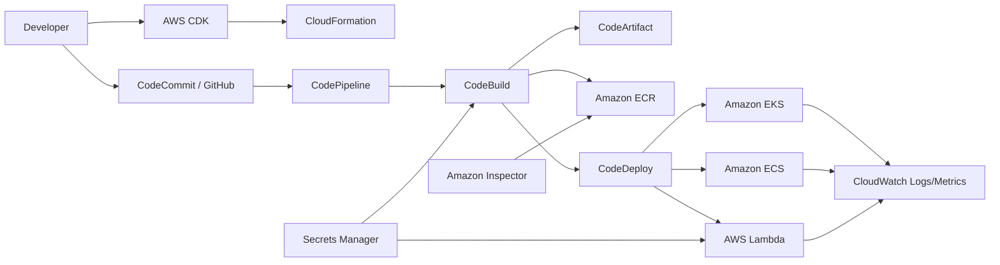

# AWS CI/CD Pipeline

```mermaid
graph LR
    Dev[Developer] --> Git[CodeCommit / GitHub]
    Dev --> CDK[AWS CDK]
    CDK --> CFN[CloudFormation]
    Git --> Pipeline[CodePipeline]
    Pipeline --> Build[CodeBuild]
    Build --> Artifact[CodeArtifact]
    Build --> Registry[Amazon ECR]
    Build --> Deploy[CodeDeploy]
    Deploy --> EKS[Amazon EKS]
    Deploy --> ECS[Amazon ECS]
    Deploy --> Lambda[AWS Lambda]
    Secrets[Secrets Manager] --> Build
    Secrets --> Lambda
    Inspector[Amazon Inspector] --> Registry
    EKS --> CloudWatch[CloudWatch Logs/Metrics]
    ECS --> CloudWatch
    Lambda --> CloudWatch
```