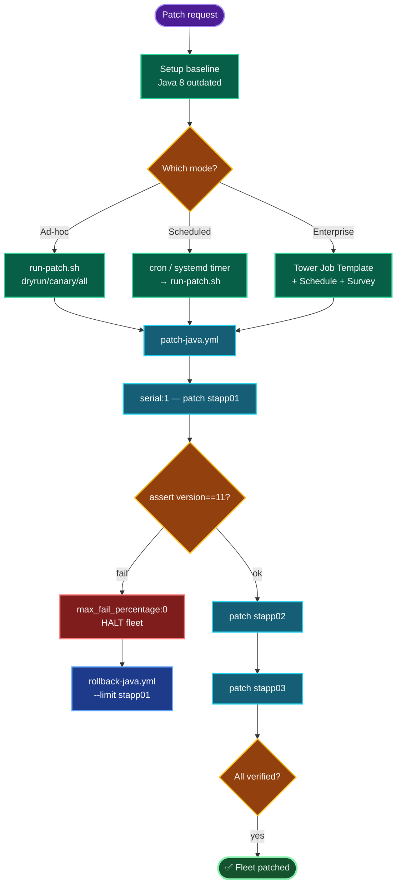

# Fleet Patching Lab — Java Upgrade Across Stratos DC
### Ad-hoc / Scheduled / Tower Implementation Documentation

---

## TODO

| # | Task | Status |
|---|------|--------|
| 1 | Build grouped inventory + `ansible.cfg` | ✅ |
| 2 | Setup baseline (install outdated Java 8) | ✅ |
| 3 | Author core patch playbook (canary rollout + verify) | ✅ |
| 4 | Mode A — ad-hoc execution + wrapper script | ✅ |
| 5 | Mode B — scheduled (cron / systemd timer) | ✅ |
| 6 | Mode C — Tower/AWX job template + schedule | ✅ |
| 7 | Rollback playbook | ✅ |
| 8 | Run end-to-end + verify before/after | ⬜ (execute) |

---

## Concept

**1. Three delivery modes, one playbook.** The patch logic (`patch-java.yml`) is written once; ad-hoc, scheduled, and Tower are just *triggers* around it. This separation is the core principle — never duplicate patch logic per mode.

**2. Canary → rolling via `serial`.** `serial: 1` patches one host at a time; a failure halts the run (`max_fail_percentage: 0`) before the whole fleet is touched. This is the single most important safety pattern in fleet patching — you find out a patch is bad on host 1, not on all 3.

**3. Pre/post verification gate.** `pre_tasks` capture the before-version; `post_tasks` capture after and `assert` the new version is present. Without the assert, a silently-failed patch looks "green." The gate turns "the command ran" into "the change actually happened."

**4. Idempotency.** `yum: state=present` and `alternatives --set` are safe to re-run — a second run on an already-patched host is a no-op. This is what makes scheduled runs and retries safe.

**5. Rollback is not optional.** Every patch playbook ships with its reverse. In production you assume some patch *will* misbehave; the rollback playbook is the pre-agreed escape.

**6. Mode selection maps to operational maturity.** Ad-hoc = manual/emergency; cron/systemd = unattended maintenance windows; Tower/AWX = enterprise with RBAC, audit, surveys, and notifications. Same playbook, escalating governance.

---

## Runbook

### Phase 1 — Inventory + config
```bash
cat > /home/thor/ansible/inventory <<'EOF'
[app]
stapp01 ansible_host=stapp01 ansible_user=tony ansible_ssh_pass=Ir0nM@n
stapp02 ansible_host=stapp02 ansible_user=steve ansible_ssh_pass=Am3ric@
stapp03 ansible_host=stapp03 ansible_user=banner ansible_ssh_pass=BigGr33n

[all:vars]
ansible_connection=ssh
ansible_become=yes
ansible_become_method=sudo
EOF

cat > /home/thor/ansible/ansible.cfg <<'EOF'
[defaults]
host_key_checking = False
inventory = inventory
retry_files_enabled = False
[privilege_escalation]
become = True
become_method = sudo
EOF
```

### Phase 2 — Baseline (outdated Java)
```bash
cat > /home/thor/ansible/setup-baseline.yml <<'EOF'
---
- name: Install baseline Java 8 (outdated state)
  hosts: app
  tasks:
    - name: Install Java 8
      ansible.builtin.yum: { name: java-1.8.0-openjdk, state: present }
    - name: Show baseline
      ansible.builtin.shell: java -version 2>&1 | head -1
      register: v
      changed_when: false
    - ansible.builtin.debug: { msg: "{{ inventory_hostname }}: {{ v.stdout }}" }
EOF
ansible-playbook setup-baseline.yml
```

### Phase 3 — Core patch playbook
```bash
cat > /home/thor/ansible/patch-java.yml <<'EOF'
---
- name: Patch Java across app fleet (canary rollout)
  hosts: app
  serial: 1
  max_fail_percentage: 0
  vars:
    target_java: java-11-openjdk
  pre_tasks:
    - name: Version BEFORE
      ansible.builtin.shell: java -version 2>&1 | head -1
      register: ver_before
      changed_when: false
    - ansible.builtin.debug: { msg: "[{{ inventory_hostname }}] BEFORE: {{ ver_before.stdout }}" }
  tasks:
    - name: Update cache
      ansible.builtin.yum: { update_cache: yes }
    - name: Install target Java
      ansible.builtin.yum: { name: "{{ target_java }}", state: present }
    - name: Set default via alternatives
      ansible.builtin.shell: |
        alt=$(alternatives --list | grep -i 'java-11' | head -1 | awk '{print $3}')
        [ -n "$alt" ] && alternatives --set java "$alt" || true
      changed_when: false
  post_tasks:
    - name: Version AFTER
      ansible.builtin.shell: java -version 2>&1 | head -1
      register: ver_after
      changed_when: false
    - name: Verify patch landed
      ansible.builtin.assert:
        that: "'11' in ver_after.stdout"
        success_msg: "[{{ inventory_hostname }}] OK: {{ ver_after.stdout }}"
        fail_msg: "[{{ inventory_hostname }}] FAILED: {{ ver_after.stdout }}"
EOF
```

### Phase 4 — Wrapper script (ad-hoc)
```bash
cat > /home/thor/ansible/run-patch.sh <<'EOF'
#!/usr/bin/env bash
set -euo pipefail
cd /home/thor/ansible
MODE="${1:-all}"
LOG="patch-$(date +%Y%m%d-%H%M%S).log"
case "$MODE" in
  dryrun) ansible-playbook patch-java.yml --check --diff | tee "$LOG" ;;
  canary) ansible-playbook patch-java.yml --limit stapp01 | tee "$LOG" ;;
  all)    ansible-playbook patch-java.yml | tee "$LOG" ;;
  *) echo "Usage: $0 {all|canary|dryrun}"; exit 1 ;;
esac
EOF
chmod +x /home/thor/ansible/run-patch.sh
```

### Phase 5 — Scheduled
```bash
# cron: canary Sat 22:00, full Sun 02:00
( crontab -l 2>/dev/null; \
  echo "0 22 * * 6 /home/thor/ansible/run-patch.sh canary >> /home/thor/ansible/patch-cron.log 2>&1"; \
  echo "0 2  * * 0 /home/thor/ansible/run-patch.sh all    >> /home/thor/ansible/patch-cron.log 2>&1" ) | crontab -
crontab -l
```

### Phase 6 — Rollback
```bash
cat > /home/thor/ansible/rollback-java.yml <<'EOF'
---
- name: Rollback Java to 8
  hosts: app
  serial: 1
  tasks:
    - name: Set Java 8 default
      ansible.builtin.shell: |
        alt=$(alternatives --list | grep -i 'java-1.8' | head -1 | awk '{print $3}')
        [ -n "$alt" ] && alternatives --set java "$alt"
      changed_when: true
    - name: Verify
      ansible.builtin.shell: java -version 2>&1 | head -1
      register: v
      changed_when: false
    - ansible.builtin.debug: { msg: "[{{ inventory_hostname }}] {{ v.stdout }}" }
EOF
```

### Phase 7 — Execute end-to-end
```bash
cd /home/thor/ansible
ansible-playbook setup-baseline.yml                       # baseline
ansible app -m shell -a "java -version 2>&1 | head -1"    # before
./run-patch.sh dryrun                                     # preview
./run-patch.sh canary                                     # stapp01 only
./run-patch.sh all                                        # full fleet
ansible app -m shell -a "java -version 2>&1 | head -1"    # after
```

---

## OTS (One-Line-To-Ship)

```bash
cd /home/thor/ansible && ansible-playbook setup-baseline.yml && \
./run-patch.sh dryrun && ./run-patch.sh canary && ./run-patch.sh all && \
ansible app -m shell -a "java -version 2>&1 | head -1"
```

---

## Tower / AWX Setup (Mode C)

| Object | Configuration |
|--------|---------------|
| **Project** | Git/manual → dir containing `patch-java.yml` |
| **Credential** | Machine type — SSH user/pass + privilege-escalation (sudo) password |
| **Inventory** | `Stratos-DC` → group `app` (stapp01/02/03) |
| **Job Template** | `Patch-Java-Fleet` → inventory + project + playbook; enable "Prompt limit on launch" |
| **Survey** | `target_java` dropdown (java-11/17); `serial` field (1 / 33% / 100%) |
| **Schedule** | RRULE weekly, Sun 02:00 |
| **Notifications** | Slack/email on success + failure |

CLI launch:
```bash
awx job_templates launch Patch-Java-Fleet --monitor \
  --extra_vars '{"target_java":"java-11-openjdk"}'
```

---

## Mermaid



---

## Troubleshooting

| Symptom | Cause | Fix |
|---------|-------|-----|
| `sshpass ... Host Key checking is enabled` | first-connect fingerprint prompt | `host_key_checking = False` in ansible.cfg |
| `sshpass program not found` | sshpass missing on jump host | `sudo yum install -y sshpass` |
| `become` / sudo password required | privilege escalation prompt | set sudo pass or NOPASSWD; `ansible_become=yes` |
| assert fails "still java 8" | alternatives not switched | check `alternatives --list`; adjust grep pattern |
| Run halts after host 1 | `max_fail_percentage: 0` (working as designed) | fix host 1, re-run; rollback if needed |
| cron job silent/no effect | env/PATH differs in cron | use absolute paths (already in wrapper); check `patch-cron.log` |
| Tower job fails auth | wrong Machine credential | verify SSH + escalation password in credential |
| yum can't reach repo | no internet on app server | configure repo/proxy, or use internal mirror |
| Re-run shows changed on idempotent task | shell task always "changed" | add `changed_when: false` (already applied to checks) |

---

## RCA Template (for when a patch run fails)

**Incident:** Java patch run halted at host N with a verification failure.

**Likely root causes, in order:**
1. **`alternatives` didn't switch the default** — the newer package installed but `java -version` still reports the old one because the symlink wasn't repointed. The `assert` correctly caught it. Fix: correct the `alternatives --set` grep pattern for the installed version path.
2. **Repo/network** — `yum` couldn't reach the package mirror (no NAT/proxy on the target). Fix: configure the internal mirror or egress.
3. **Disk/space** — install failed mid-way. Fix: clear space, re-run (idempotent).

**Why the blast radius was contained:** `serial: 1` + `max_fail_percentage: 0` stopped the run at the first bad host — the rest of the fleet stayed on the known-good version. This is the design working as intended, not a failure of the approach.

**Resolution:** rollback the affected host (`rollback-java.yml --limit <host>`), fix the root cause, re-run the patch playbook (idempotent — already-patched hosts skip).

**Prevention:** always `run-patch.sh dryrun` then `canary` before `all`; keep the rollback playbook current; add LB-drain (pull node from `stlb01` before patch, re-add after) for zero-downtime rolling patches in production.

---

**Definition of done:** Grouped inventory + `ansible.cfg` in place; baseline Java 8 installed on `stapp01/02/03`; `patch-java.yml` upgrades to Java 11 with canary rollout and post-verification; ad-hoc (`run-patch.sh`), scheduled (cron/systemd), and Tower job-template modes all driving the same playbook; rollback playbook ready; before/after `java -version` confirms the upgrade across the fleet.