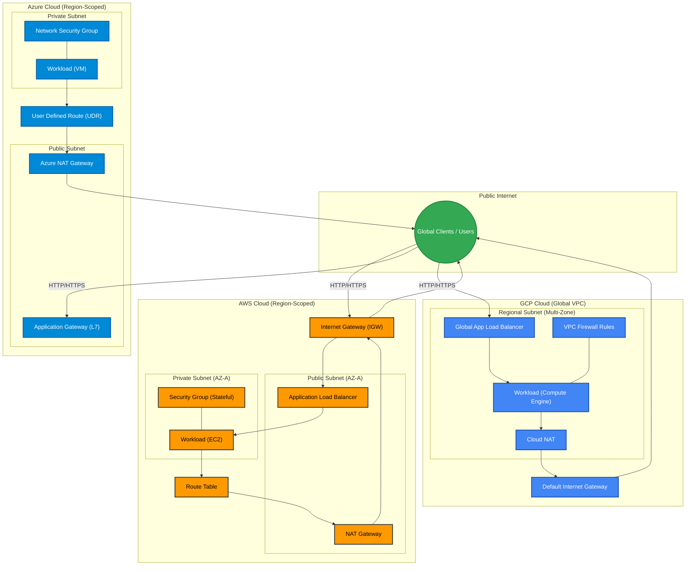
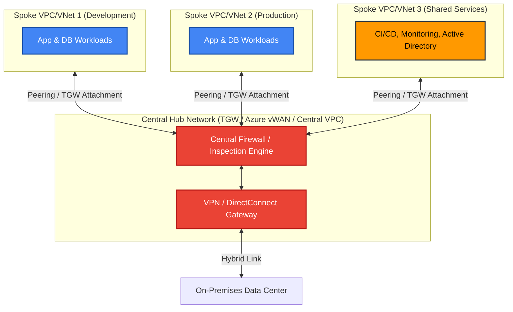
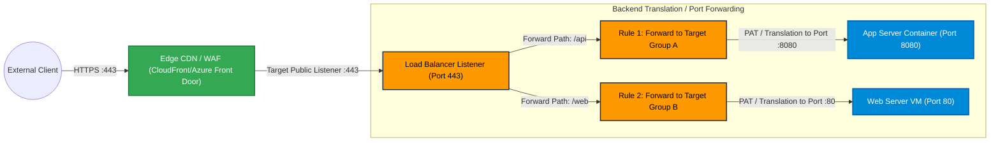

# Multi-Cloud Network Architecture Guide (AWS, Azure, GCP)

---

## 1. Cloud Network Core Mapping & Architecture

| Network Component | AWS Equivalent | Azure Equivalent | GCP Equivalent | Primary Function |
| --- | --- | --- | --- | --- |
| **Isolated Virtual Network** | **VPC** (Virtual Private Cloud) | **VNet** (Virtual Network) | **VPC** (Global Virtual Private Cloud) | Provides isolated IP address space for cloud resources. |
| **IP Address Block** | **Subnet** (AZ-specific) | **Subnet** (Region-scoped) | **Subnet** (Region-scoped, subnets span AZs) | Segregates network segments into public, private, or isolated zones. |
| **Routing Control** | **Route Table** | **Route Table** (UDR - User Defined Routes) | **Cloud Router / VPC Routes** | Directs IP traffic flow between subnets, gateways, and internet. |
| **Instance-Level Firewall** | **Security Group (SG)** | **Network Security Group (NSG)** | **VPC Firewall Rules** (Target Tags/Service Accounts) | Stateful filtering of inbound/outbound traffic at the NIC level. |
| **Subnet/Perimeter Firewall** | **Network ACL (NACL) / AWS Network Firewall** | **Azure Firewall / NSG Subnet Association** | **Cloud Firewall / Hierarchical Firewall Rules** | Stateless subnet filtering or deep packet inspection (DPI) firewall. |
| **Application Load Balancer** | **ALB** (Layer 7 - HTTP/HTTPS) | **Application Gateway** | **Application Load Balancer** (Global/Regional L7) | Content-based routing, TLS termination, path-based rules. |
| **Network Load Balancer** | **NLB** (Layer 4 - TCP/UDP) | **Azure Load Balancer** | **Network Load Balancer** (Passthrough/Proxy L4) | High-throughput, ultra-low latency Layer 4 traffic handling. |
| **Public Internet Egress/Ingress** | **IGW** (Internet Gateway) | **Internet Default Outbound / Azure NAT Gateway** | **Default Internet Gateway** | Enables direct bi-directional connectivity with the public internet. |
| **Outbound-Only Internet** | **NAT Gateway / NAT Instance** | **Azure NAT Gateway** | **Cloud NAT** | Allows private subnet resources to access the internet without public IPs. |
| **Direct Network Peering** | **VPC Peering** | **VNet Peering** | **VPC Network Peering** | Low-latency private IP routing between non-overlapping networks. |
| **Centralized Routing** | **AWS Transit Gateway (TGW)** | **Azure Virtual WAN / Hub VNet** | **Network Connectivity Center (NCC)** | Hub-and-Spoke topology for centralized control, routing, and security. |
| **Edge & CDN Infrastructure** | **Amazon CloudFront + AWS WAF** | **Azure Front Door / CDN** | **Cloud CDN + Cloud Armor** | Edge caching, DDOS mitigation, and global traffic acceleration. |
| **Traffic Handling & Redirection** | **Listeners & Target Groups** | **Listeners & Backend Pools** | **Forwarding Rules & Backend Services** | Binds port mapping, health checks, and path forwarding to targets. |

---

## 2. Global Multi-Cloud Infrastructure Topology

This topology illustrates how AWS, Azure, and GCP structure their core networking components to connect private workloads to the internet safely.



---

## 3. Core Component Deep Dive & Cloud Analysis

### 1. VPC / VNet (Virtual Private Network Base)

* **Core Concept:** Isolated network boundary providing private IPv4/IPv6 CIDR space.
* **Cloud Differences:**
* **AWS VPC:** Bound to a single AWS Region. Subnets are strictly pinned to individual Availability Zones (AZs).
* **Azure VNet:** Regional scope. Subnets span all Availability Zones within that region.
* **GCP VPC:** Global scope. Subnets are regional, allowing resources in different regions to share the same VPC without explicit peering.


---

### 2. Subnets (Public vs. Private)

* **Core Concept:** Sub-division of a VPC/VNet CIDR block to isolate network tiers (e.g., Web, App, Database).
* **Public Subnet:** Has an explicit route to an Internet Gateway or public IP allocation.
* **Private Subnet:** Lacks direct inbound paths from the public internet. Outbound-only traffic passes through a NAT device.

---

### 3. Route Tables & User Defined Routes (UDR)

* **Core Concept:** Set of IP destination rules (`0.0.0.0/0`, local CIDR, peered CIDR) that determine where network packets are directed.
* **Cloud Implementations:**
* **AWS:** Subnets explicitly associate with explicit route tables. Local VPC routing is implicit and non-overridable.
* **Azure:** System routes control default traffic; **User Defined Routes (UDR)** override default paths (e.g., forcing all `0.0.0.0/0` outbound traffic through a central Azure Firewall).
* **GCP:** Routes apply globally across the VPC using system routes, dynamic routing (via Cloud Router), or custom routes with target tags.


---

### 4. Security Groups & Network Security Groups (SG / NSG)

* **Core Concept:** Stateful firewalls attached directly to virtual network interfaces (NICs).
* **Stateful Behavior:** If inbound traffic is permitted, return outbound traffic is automatically allowed regardless of outbound rules.
* **Cloud Implementations:**
* **AWS SG:** Allow-only rules (no explicit deny). Evaluated as a holistic set of rules.
* **Azure NSG:** Supports both **Allow** and **Deny** rules, processed in numerical priority order (e.g., 100 to 4096).
* **GCP Firewall Rules:** Applied directly at the VPC level targeting specific instances using service accounts or network tags, supporting explicit allow/deny and priority ordering.


---

### 5. Firewalls & NACLs (Perimeter & Subnet Protection)

* **Core Concept:** Stateless/Stateful perimeter defenses placed at subnet or network boundary entry points.
* **AWS Network ACL (NACL):** Stateless subnet layer security (requires defining both inbound and explicit return outbound port rules).
* **Deep Inspection Firewalls:** AWS Network Firewall, Azure Firewall, and GCP Cloud Firewall perform stateful L7 packet inspection, IDS/IPS, and FQDN filtering.

---

### 6. Load Balancers (ALB vs. NLB)

#### Application Load Balancer (ALB) — Layer 7

* **Function:** Inspects HTTP/HTTPS headers, hostnames, and URLs to direct traffic to target groups or backend pools. Performs SSL/TLS termination and path-based routing (`/api` vs `/static`).

#### Network Load Balancer (NLB) — Layer 4

* **Function:** Operates at the transport layer (TCP, UDP, TLS). Ultra-high throughput, capable of handling millions of requests per second with ultra-low latency. Preserves client source IP addresses natively.

---

### 7. Internet Gateway (IGW)

* **Core Concept:** Horizontally scalable, highly available VPC edge component that enables bi-directional communication between resources with public IPs and the internet.

---

### 8. NAT Gateway vs. NAT Instance

* **Core Concept:** Translates private IP addresses from internal subnets into a single public Elastic/Static IP to enable outbound-only internet connectivity (e.g., software patches, API calls) while blocking inbound connections.

```
+-----------------------------------------------------------------------------------+
| SPECIFICATION      | MANAGED NAT GATEWAY (Cloud-native) | CUSTOM NAT INSTANCE         |
+--------------------+------------------------------------+-----------------------------+
| High Availability  | Managed by Provider across AZs     | Self-managed (requires HA)  |
| Scalability        | Automatically scales (up to 45Gbps)| Limited by Instance EC2/VM  |
| Maintenance        | Zero maintenance                   | Requires OS Patching & Mgmt |
| Cost Structure     | Hourly rate + Data processed (GB)  | Hourly EC2/VM compute rate  |
+-----------------------------------------------------------------------------------+

```

---

## 4. Advanced Networking Topologies

### Hub and Spoke Architecture

Centralizes shared infrastructure—such as firewalls, inspection engines, VPN gateways, and hybrid connectivity (DirectConnect/ExpressRoute)—in a central **Hub**, while isolating workloads across multiple **Spoke** networks.



---

### VPC / VNet Peering

* **Core Concept:** Direct layer-3 routing connection between two distinct networks using private IP addresses.
* **Key Properties:** Non-transitive by default (Network A peered to B, and B to C, does **not** allow A to communicate with C without a central transit router). CIDR blocks **must not overlap**.

---

### Edge Networking, Listener Ports & Port Forwarding



* **Edge Networks:** Places traffic ingestion close to the end user using globally distributed Points of Presence (PoPs) to run WAF protection, SSL/TLS negotiation, and caching.
* **Listeners:** Active processes running on gateways/load balancers configured to check for connection requests based on protocol and port (e.g., `HTTPS:443`).
* **Port Forwarding / PAT:** Maps incoming public traffic arriving at a specific port on a load balancer/gateway to a completely different port on an internal target resource (e.g., mapping incoming public `443` traffic to container port `8080` internally).

---