# Multi-Cloud Network Architecture Guide (AWS, Azure, GCP)

A concept-by-concept reference for cloud networking. Every concept below follows the same
five-part structure so the three providers can be compared like for like:

> **Diagram** → **What it is** → **How each cloud does it** → **Real-world use** → **Policies & roles**

Diagrams live in [`100DaysofNW/`](100DaysofNW/).

> **Companion document.** [`ARCHITECTURE-EXPLAINED.md`](ARCHITECTURE-EXPLAINED.md) covers the same
> concepts from the operator's angle: *why* each one exists, a Mermaid diagram for every entry
> (including the ones with no JPEG here), and a **symptom → root cause → fix** table plus verification
> commands for each. Use this file to learn the model; use that one when something is broken.

---

## Concept Index

| # | Concept | Layer | Jump to |
| --- | --- | --- | --- |
| — | Core terminology mapping | Reference | [§1](#1-cloud-network-core-mapping--architecture) |
| — | Global topology & the end-to-end path | Reference | [§2](#2-global-topology--the-end-to-end-request-path) |
| **C1** | VPC / VNet — the network boundary | Foundation | [§3.1](#c1--vpc--vnet-the-network-boundary) |
| **C2** | Subnets & network tiering | Foundation | [§3.2](#c2--subnets--network-tiering) |
| **C3** | Route tables & User Defined Routes | Foundation | [§3.3](#c3--route-tables--user-defined-routes-udr) |
| **C4** | Security Groups / NSG (NIC-level) | Security | [§3.4](#c4--security-groups--nsg-nic-level-stateful-firewall) |
| **C5** | NACLs & layered perimeter defence | Security | [§3.5](#c5--nacls--layered-perimeter-defence) |
| **C6** | Centralised egress inspection | Security | [§3.6](#c6--centralised-egress-inspection) |
| **C7** | Private service access & delegated subnets | Security | [§3.7](#c7--private-service-access--delegated-subnets) |
| **C8** | Internet Gateway | Connectivity | [§3.8](#c8--internet-gateway-igw) |
| **C9** | NAT Gateway vs NAT Instance | Connectivity | [§3.9](#c9--nat-gateway-vs-nat-instance) |
| **C10** | VPC / VNet Peering | Connectivity | [§3.10](#c10--vpc--vnet-peering) |
| **C11** | Hub & Spoke / transit routing | Connectivity | [§3.11](#c11--hub--spoke--transit-routing) |
| **C12** | Load balancers — L7 vs L4 | Traffic | [§3.12](#c12--load-balancers-l7-vs-l4) |
| **C13** | Load balancing algorithms | Traffic | [§3.13](#c13--load-balancing-algorithms) |
| **C14** | Load balancer types & key features | Traffic | [§3.14](#c14--load-balancer-types--key-features) |
| **C15** | Edge networking, listeners & port forwarding | Traffic | [§3.15](#c15--edge-networking-listeners--port-forwarding) |
| **C16** | Agentic IaC & policy-as-code delivery | Governance | [§4](#4-governance-agentic-iac--policy-as-code-delivery) |
| **K1** | Production EKS reference architecture | Kubernetes | [Appendix D](#appendix-d--production-eks-reference-architecture) |
| **K2** | Zero-downtime Kubernetes upgrades (EKS · AKS · OpenShift) | Kubernetes | [Runbook](#zero-downtime-kubernetes-upgrade-runbook) |

Every row above also has an **issues & fixes** entry in
[`ARCHITECTURE-EXPLAINED.md`](ARCHITECTURE-EXPLAINED.md#index).

---

## 1. Cloud Network Core Mapping & Architecture

| Network Component | AWS Equivalent | Azure Equivalent | GCP Equivalent | Primary Function |
| --- | --- | --- | --- | --- |
| **Isolated Virtual Network** | **VPC** (Virtual Private Cloud) | **VNet** (Virtual Network) | **VPC** (Global Virtual Private Cloud) | Provides isolated IP address space for cloud resources. |
| **IP Address Block** | **Subnet** (AZ-specific) | **Subnet** (Region-scoped) | **Subnet** (Region-scoped, subnets span AZs) | Segregates network segments into public, private, or isolated zones. |
| **Routing Control** | **Route Table** | **Route Table** (UDR - User Defined Routes) | **Cloud Router / VPC Routes** | Directs IP traffic flow between subnets, gateways, and internet. |
| **Instance-Level Firewall** | **Security Group (SG)** | **Network Security Group (NSG)** | **VPC Firewall Rules** (Target Tags/Service Accounts) | Stateful filtering of inbound/outbound traffic at the NIC level. |
| **Subnet/Perimeter Firewall** | **Network ACL (NACL) / AWS Network Firewall** | **Azure Firewall / NSG Subnet Association** | **Cloud Firewall / Hierarchical Firewall Rules** | Stateless subnet filtering or deep packet inspection (DPI) firewall. |
| **Application Load Balancer** | **ALB** (Layer 7 - HTTP/HTTPS) | **Application Gateway** | **Application Load Balancer** (Global/Regional L7) | Content-based routing, TLS termination, path-based rules. |
| **Network Load Balancer** | **NLB** (Layer 4 - TCP/UDP) | **Azure Load Balancer** | **Network Load Balancer** (Passthrough/Proxy L4) | High-throughput, ultra-low latency Layer 4 traffic handling. |
| **Public Internet Egress/Ingress** | **IGW** (Internet Gateway) | **Internet Default Outbound / Azure NAT Gateway** | **Default Internet Gateway** | Enables direct bi-directional connectivity with the public internet. |
| **Outbound-Only Internet** | **NAT Gateway / NAT Instance** | **Azure NAT Gateway** | **Cloud NAT** | Allows private subnet resources to access the internet without public IPs. |
| **Direct Network Peering** | **VPC Peering** | **VNet Peering** | **VPC Network Peering** | Low-latency private IP routing between non-overlapping networks. |
| **Centralized Routing** | **AWS Transit Gateway (TGW)** | **Azure Virtual WAN / Hub VNet** | **Network Connectivity Center (NCC)** | Hub-and-Spoke topology for centralized control, routing, and security. |
| **Edge & CDN Infrastructure** | **Amazon CloudFront + AWS WAF** | **Azure Front Door / CDN** | **Cloud CDN + Cloud Armor** | Edge caching, DDOS mitigation, and global traffic acceleration. |
| **Traffic Handling & Redirection** | **Listeners & Target Groups** | **Listeners & Backend Pools** | **Forwarding Rules & Backend Services** | Binds port mapping, health checks, and path forwarding to targets. |
| **Private Service Access** | **VPC Endpoint / PrivateLink** | **Private Endpoint / Delegated Subnet** | **Private Service Connect** | Reaches managed services over private IPs, never the internet. |
| **Network Telemetry** | **VPC Flow Logs** | **NSG Flow Logs / VNet Flow Logs** | **VPC Flow Logs** | Records accepted and rejected flows for audit and forensics. |

### Identity & Access Mapping

The permission model matters as much as the topology. These are the identities that govern every concept below:

| Governance Function | AWS | Azure | GCP |
| --- | --- | --- | --- |
| **Full network administration** | `AmazonVPCFullAccess` managed policy | `Network Contributor` built-in role | `roles/compute.networkAdmin` |
| **Firewall / security rules** | Same policy (`ec2:AuthorizeSecurityGroup*`) | `Network Contributor` | **`roles/compute.securityAdmin`** (deliberately separate) |
| **Read-only network audit** | `AmazonVPCReadOnlyAccess` | `Reader` | `roles/compute.networkViewer` |
| **Consume a shared network** | RAM resource share + `ec2:DescribeSubnets` | `Microsoft.Network/virtualNetworks/subnets/join/action` | `roles/compute.networkUser` |
| **Org-wide guardrail** | **Service Control Policy (SCP)** | **Azure Policy** (deny / audit effects) | **Organization Policy Constraints** |
| **Load balancer administration** | `ElasticLoadBalancingFullAccess` | `Network Contributor` | `roles/compute.loadBalancerAdmin` |

> **Separation-of-duties note.** GCP is the only provider that splits *network plumbing* from
> *firewall rules* by default: `compute.networkAdmin` can build subnets and routes but **cannot**
> create firewall rules — that requires `compute.securityAdmin`. On AWS and Azure you must build
> that separation yourself with custom policies/roles.

---

## 2. Global Topology & the End-to-End Request Path

This topology illustrates how AWS, Azure, and GCP structure their core networking components to connect private workloads to the internet safely.

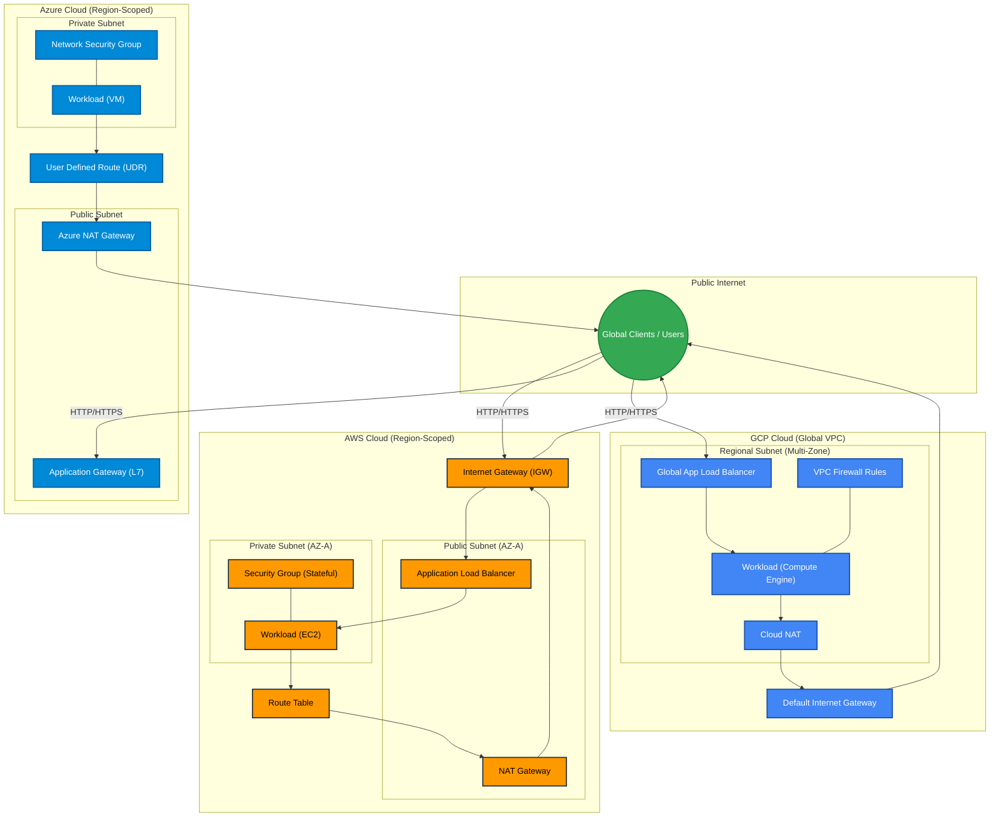
```mermaid
graph TB
    %% Styling Definitions
    classDef aws fill:#FF9900,stroke:#232F3E,stroke-width:2px,color:#000;
    classDef azure fill:#0089D6,stroke:#005BA1,stroke-width:2px,color:#fff;
    classDef gcp fill:#4285F4,stroke:#174EA6,stroke-width:2px,color:#fff;
    classDef internet fill:#34A853,stroke:#188038,stroke-width:2px,color:#fff;
    classDef firewall fill:#EA4335,stroke:#B31412,stroke-width:2px,color:#fff;

    subgraph Public_Internet ["Public Internet"]
        Users(("Global Clients / Users")):::internet
    end

    subgraph AWS_Cloud ["AWS Cloud (Region-Scoped)"]
        AWS_IGW["Internet Gateway (IGW)"]:::aws
        AWS_ALB["Application Load Balancer"]:::aws
        AWS_NAT["NAT Gateway"]:::aws
        AWS_RT["Route Table"]:::aws

        subgraph AWS_PubSub ["Public Subnet (AZ-A)"]
            AWS_ALB
            AWS_NAT
        end

        subgraph AWS_PrivSub ["Private Subnet (AZ-A)"]
            AWS_SG["Security Group (Stateful)"]:::aws
            AWS_EC2["Workload (EC2)"]:::aws
            AWS_SG --- AWS_EC2
        end
    end

    subgraph Azure_Cloud ["Azure Cloud (Region-Scoped)"]
        AZ_NAT["Azure NAT Gateway"]:::azure
        AZ_AppGW["Application Gateway (L7)"]:::azure
        AZ_UDR["User Defined Route (UDR)"]:::azure

        subgraph AZ_PubSub ["Public Subnet"]
            AZ_AppGW
            AZ_NAT
        end

        subgraph AZ_PrivSub ["Private Subnet"]
            AZ_NSG["Network Security Group"]:::azure
            AZ_VM["Workload (VM)"]:::azure
            AZ_NSG --- AZ_VM
        end
    end

    subgraph GCP_Cloud ["GCP Cloud (Global VPC)"]
        GCP_IGW["Default Internet Gateway"]:::gcp
        GCP_L7["Global App Load Balancer"]:::gcp
        GCP_NAT["Cloud NAT"]:::gcp

        subgraph GCP_Subnet ["Regional Subnet (Multi-Zone)"]
            GCP_L7
            GCP_NAT
            GCP_FW["VPC Firewall Rules"]:::gcp
            GCP_GCE["Workload (Compute Engine)"]:::gcp
            GCP_FW --- GCP_GCE
        end
    end

    %% Edge Traffic Flow
    Users -->|HTTP/HTTPS| AWS_IGW
    Users -->|HTTP/HTTPS| AZ_AppGW
    Users -->|HTTP/HTTPS| GCP_L7

    %% Ingress Pathways
    AWS_IGW --> AWS_ALB --> AWS_EC2
    GCP_L7 --> GCP_GCE

    %% Outbound Pathways
    AWS_EC2 --> AWS_RT --> AWS_NAT --> AWS_IGW --> Users
    AZ_VM --> AZ_UDR --> AZ_NAT --> Users
    GCP_GCE --> GCP_NAT --> GCP_IGW --> Users
```

### The provider-neutral request path

Every hop below exists in all three clouds under a different name. **The order of evaluation is
what stays constant** — and it is the order in which you should debug a connectivity failure.

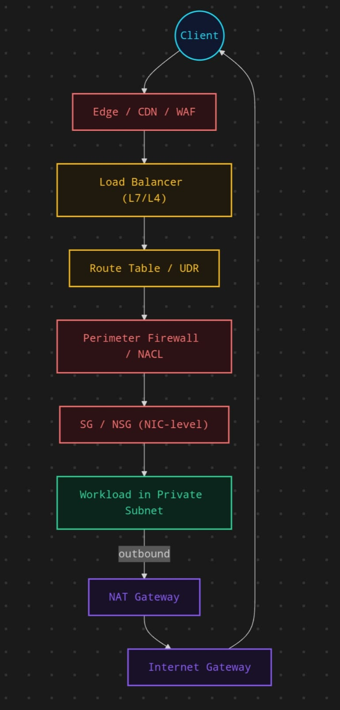

| Hop | Component | Concept | If traffic dies here, the symptom is |
| --- | --- | --- | --- |
| 1 | Edge / CDN / WAF | [C15](#c15--edge-networking-listeners--port-forwarding) | 403 from the WAF, or a cached stale response |
| 2 | Load Balancer (L7/L4) | [C12](#c12--load-balancers-l7-vs-l4) | 502/503 — no healthy backend in the pool |
| 3 | Route Table / UDR | [C3](#c3--route-tables--user-defined-routes-udr) | Silent timeout — packet routed to a black hole |
| 4 | Perimeter Firewall / NACL | [C5](#c5--nacls--layered-perimeter-defence) | Timeout inbound, or asymmetric one-way traffic |
| 5 | SG / NSG at the NIC | [C4](#c4--security-groups--nsg-nic-level-stateful-firewall) | Connection refused / timeout on one port only |
| 6 | Workload in private subnet | [C2](#c2--subnets--network-tiering) | App-level error — the network is fine |
| 7 | NAT Gateway → IGW (return) | [C9](#c9--nat-gateway-vs-nat-instance) / [C8](#c8--internet-gateway-igw) | Outbound package installs and API calls hang |

* **Inbound:** Client → Edge/CDN/WAF → Load Balancer → Route Table/UDR → Perimeter Firewall/NACL → SG/NSG → Workload.
* **Outbound:** Workload → NAT Gateway → Internet Gateway → Client. **The workload never holds a public IP.**

---

## 3. Concept Library

### C1 — VPC / VNet: the network boundary

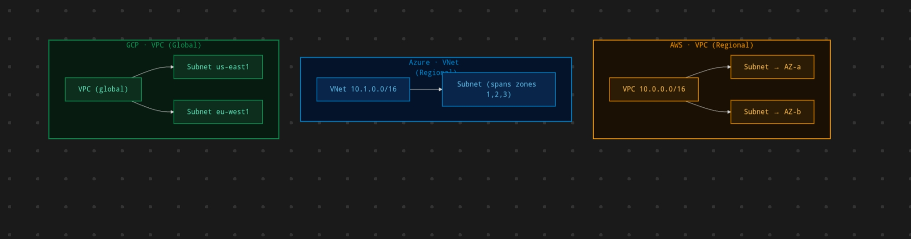

**What it is.** An isolated, software-defined network boundary that owns a private IPv4/IPv6 CIDR
space. Nothing inside it is reachable from outside unless you explicitly build a path. It is the
unit of blast-radius containment — everything else in this guide is configured *within* one.

**How each cloud does it.** Scope is the single biggest portability trap; the same word means a
different blast radius on each provider:

| | AWS VPC | Azure VNet | GCP VPC |
| --- | --- | --- | --- |
| **Network scope** | Regional | Regional | **Global** |
| **Subnet scope** | **Pinned to one AZ** | Spans all zones in the region | Regional (spans zones) |
| **Multi-region** | One VPC per region + peering/TGW | One VNet per region + peering | **One VPC spans all regions** |
| **Default network** | Default VPC per region | None created | Default VPC (auto-mode) — disable it |
| **CIDR** | `/16`–`/28`, secondary CIDRs allowed | Multiple address spaces allowed | Per-subnet ranges, expandable in place |
| **Practical consequence** | HA needs a subnet per AZ and an AZ-aware CIDR plan | One subnet is already zone-redundant | Cross-region workloads share one VPC, no peering |

**Real-world use.** A payments platform running in `eu-west-1` and `eu-central-1`:

* On **AWS** you build two VPCs and join them with Transit Gateway — cross-region routing is explicit and billed per attachment plus data.
* On **GCP** the same workload sits in one global VPC; `us-east1` and `eu-west1` subnets route to each other natively with no peering object at all.
* On **Azure** you build two VNets and a global VNet peering.
  The GCP model is simplest to operate; the AWS model gives you the hardest isolation boundary per region, which regulators often prefer.

**Policies & roles.**

| Action | AWS | Azure | GCP |
| --- | --- | --- | --- |
| Create / delete network | `ec2:CreateVpc`, `ec2:DeleteVpc` | `Microsoft.Network/virtualNetworks/write` | `compute.networks.create` |
| Modify attributes | `ec2:ModifyVpcAttribute` | `.../virtualNetworks/write` | `compute.networks.update` |
| Read / audit | `ec2:DescribeVpcs` | `.../virtualNetworks/read` | `compute.networks.get`, `.list` |
| Bundled role | `AmazonVPCFullAccess` | `Network Contributor` | `roles/compute.networkAdmin` |

**Guardrails worth enforcing:**

* **AWS SCP** — deny `ec2:DeleteVpc` and `ec2:DeleteFlowLogs` outside a break-glass role; require the `CostCentre` tag on `ec2:CreateVpc`.
* **Azure Policy** — *"Virtual networks should be protected by Azure DDoS Protection"*; deny VNet creation outside approved regions with `allowedLocations`.
* **GCP Org Policy** — `constraints/compute.skipDefaultNetworkCreation` (stops the wide-open default VPC ever existing) and `constraints/compute.restrictVpcPeering`.

**Gotchas.** CIDR ranges are effectively permanent once workloads land — overlapping ranges block
peering forever. Reserve non-overlapping `/16`s per environment and region on day one. AWS reserves
5 IPs per subnet, Azure reserves 5, GCP reserves 4.

---

### C2 — Subnets & network tiering

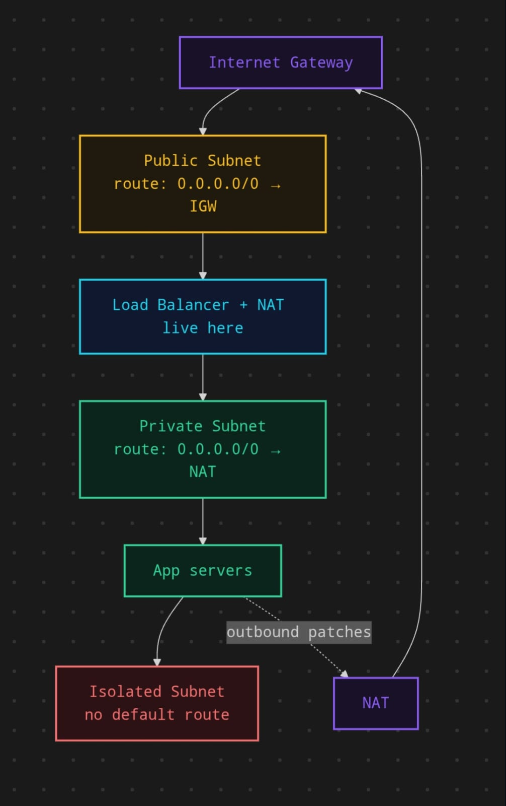

**What it is.** A subdivision of the VPC/VNet CIDR that isolates network tiers. Critically:

> **A subnet is defined by its route table, not by its name.** "Public" and "private" are simply
> descriptions of where `0.0.0.0/0` points.

| Tier | Default route (`0.0.0.0/0`) | Typical residents | Inbound from internet |
| --- | --- | --- | --- |
| **Public** | → Internet Gateway | LB front-ends, NAT Gateway, bastion | Yes, via LB only |
| **Private** | → NAT Gateway | App servers, containers, worker nodes | No — outbound patching only |
| **Isolated** | *none* | Databases, caches, regulated data stores | No — reaches nothing off-network |

**How each cloud does it.**

| | AWS | Azure | GCP |
| --- | --- | --- | --- |
| Availability scope | One AZ per subnet | All zones in region | All zones in region |
| Auto-assign public IP | `MapPublicIpOnLaunch` flag | Per-NIC public IP resource | Per-instance external IP |
| Security attach point | NACL on subnet + SG on ENI | **NSG attaches to subnet *or* NIC** | Firewall rules at VPC level, targeted by tag/SA |
| Reserved for services | — | **Delegated subnets** (`AzureFirewallSubnet`, `GatewaySubnet`) | Proxy-only subnets for L7 LB |

**Real-world use.** A three-tier e-commerce stack: the ALB/Application Gateway sits in the public
subnet; EKS/AKS worker nodes sit in the private subnet and pull container images outbound through
NAT; PostgreSQL sits in the isolated subnet with no default route at all, so even a fully
compromised app node cannot exfiltrate the database to the internet — there is no path.

**Policies & roles.**

| Action | AWS | Azure | GCP |
| --- | --- | --- | --- |
| Create subnet | `ec2:CreateSubnet` | `Microsoft.Network/virtualNetworks/subnets/write` | `compute.subnetworks.create` |
| **Deploy into** a subnet | `ec2:RunInstances` + `ec2:DescribeSubnets` | **`.../subnets/join/action`** | `compute.subnetworks.use` |
| Toggle public IP on launch | `ec2:ModifySubnetAttribute` | `.../publicIPAddresses/join/action` | `compute.instances.create` + external IP quota |
| Least-privilege role | Custom policy scoped by subnet ARN | Custom role with only `join/action` | **`roles/compute.networkUser`** |

> **The most useful least-privilege pattern in cloud networking:** give application teams *only*
> the "join/use" permission (`subnets/join/action` on Azure, `roles/compute.networkUser` on GCP,
> a subnet-ARN-scoped `RunInstances` policy on AWS). They can deploy workloads into the subnets
> the platform team defined, but cannot create, resize, or re-route those subnets.

**Guardrails worth enforcing:**

* **AWS SCP** — deny `ec2:ModifySubnetAttribute` where `MapPublicIpOnLaunch = true`.
* **Azure Policy** — built-in *"Subnets should be associated with a Network Security Group"* (Deny effect).
* **GCP Org Policy** — `constraints/compute.vmExternalIpAccess` set to deny-all, allow-listing only the handful of VMs that genuinely need a public IP.

**Gotchas.** On AWS a "public subnet" that lost its IGW route silently becomes a black hole — the
subnet name does not change. Azure reserves specific subnet *names* for platform services
(`AzureFirewallSubnet`, `GatewaySubnet`, `AzureBastionSubnet`) and they must be sized correctly at
creation (`/26` for Azure Firewall) because they cannot be resized while in use.

---

### C3 — Route tables & User Defined Routes (UDR)

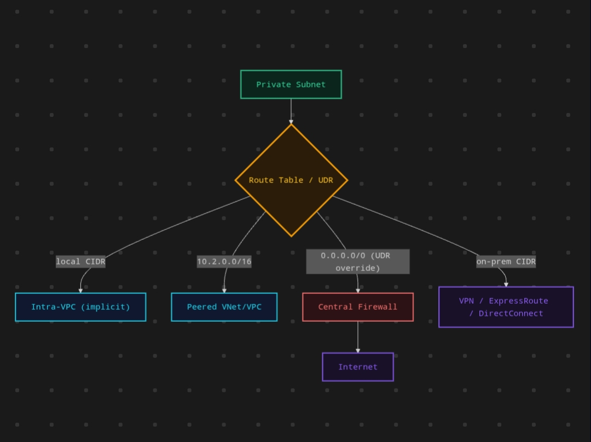

**What it is.** The ordered set of destination-CIDR → next-hop rules that decides where a packet
goes. **Longest-prefix match wins** — a `/24` route always beats a `/16`, which always beats
`0.0.0.0/0`. One subnet's route table fans out to four very different destinations:

| Destination | Next hop | Purpose |
| --- | --- | --- |
| `local` CIDR | Intra-VPC (implicit) | Subnet-to-subnet traffic; **non-overridable on AWS** |
| Peered CIDR (`10.2.0.0/16`) | Peering connection | Private IP routing to another VNet/VPC |
| `0.0.0.0/0` **(UDR override)** | Central firewall NVA | **Forced tunnelling** — inspect before internet |
| On-prem CIDR | VPN / ExpressRoute / DirectConnect | Hybrid connectivity |

**How each cloud does it.**

| | AWS | Azure | GCP |
| --- | --- | --- | --- |
| Model | Explicit route table **associated to** a subnet | **System routes** + UDR overrides | VPC-wide routes with priority + tags |
| Local traffic | Implicit, cannot be overridden | System route, **can** be overridden by UDR | Implicit subnet routes |
| Override mechanism | Add a more specific route | **User Defined Route table** on the subnet | Custom static route with lower priority number |
| Dynamic routing | Route propagation from VGW/TGW | BGP via ExpressRoute / Route Server | **Cloud Router** (BGP) |
| Scope | Per subnet | Per subnet | Per VPC (global), filtered by network tag |

**Real-world use.** A regulated insurer must inspect *all* egress. On Azure they attach a UDR to
every application subnet with `0.0.0.0/0 → Virtual Appliance → <Azure Firewall private IP>`. The
system default route to the internet is overridden, so no VM can reach the internet directly even
if someone attaches a public IP. The identical pattern on AWS is a route table entry pointing
`0.0.0.0/0` at a Gateway Load Balancer endpoint or the TGW; on GCP it is a custom static route with
`next-hop-ilb` set to the firewall's internal load balancer.

**Policies & roles.**

| Action | AWS | Azure | GCP |
| --- | --- | --- | --- |
| Create route table | `ec2:CreateRouteTable` | `Microsoft.Network/routeTables/write` | `compute.routes.create` |
| Add / change a route | `ec2:CreateRoute`, `ec2:ReplaceRoute` | `.../routeTables/routes/write` | `compute.routes.create` / `.delete` |
| Associate to subnet | `ec2:AssociateRouteTable` | `.../routeTables/join/action` | *(implicit — routes are VPC-wide)* |
| Read / audit | `ec2:DescribeRouteTables` | `.../routeTables/read` | `compute.routes.list` |

**Guardrails worth enforcing:**

* **AWS SCP** — deny `ec2:CreateRoute` and `ec2:ReplaceRoute` for everyone except the network pipeline role. A single `0.0.0.0/0 → igw-xxx` added to a private subnet's table silently bypasses your entire egress-inspection design.
* **Azure Policy** — built-in *"All Internet traffic should be routed via your deployed Azure Firewall"*, plus deny on `routeTables/write` outside the platform subscription.
* **GCP Org Policy** — restrict who holds `compute.routes.create`; audit for any route with `nextHopGateway: default-internet-gateway` on a private subnet's tags.

> **Route changes are the highest-privilege, lowest-visibility action in cloud networking.**
> They rarely trigger alerts, take effect instantly, and can silently reroute production traffic.
> Treat `CreateRoute` as a break-glass permission and alert on every invocation.

**Gotchas.** UDRs can create routing loops if the firewall subnet itself inherits the
`0.0.0.0/0 → firewall` route — always exclude the inspection subnet. Peering is **non-transitive**,
so adding a route to a peer-of-a-peer will black-hole rather than forward.

---

### C4 — Security Groups / NSG: NIC-level stateful firewall

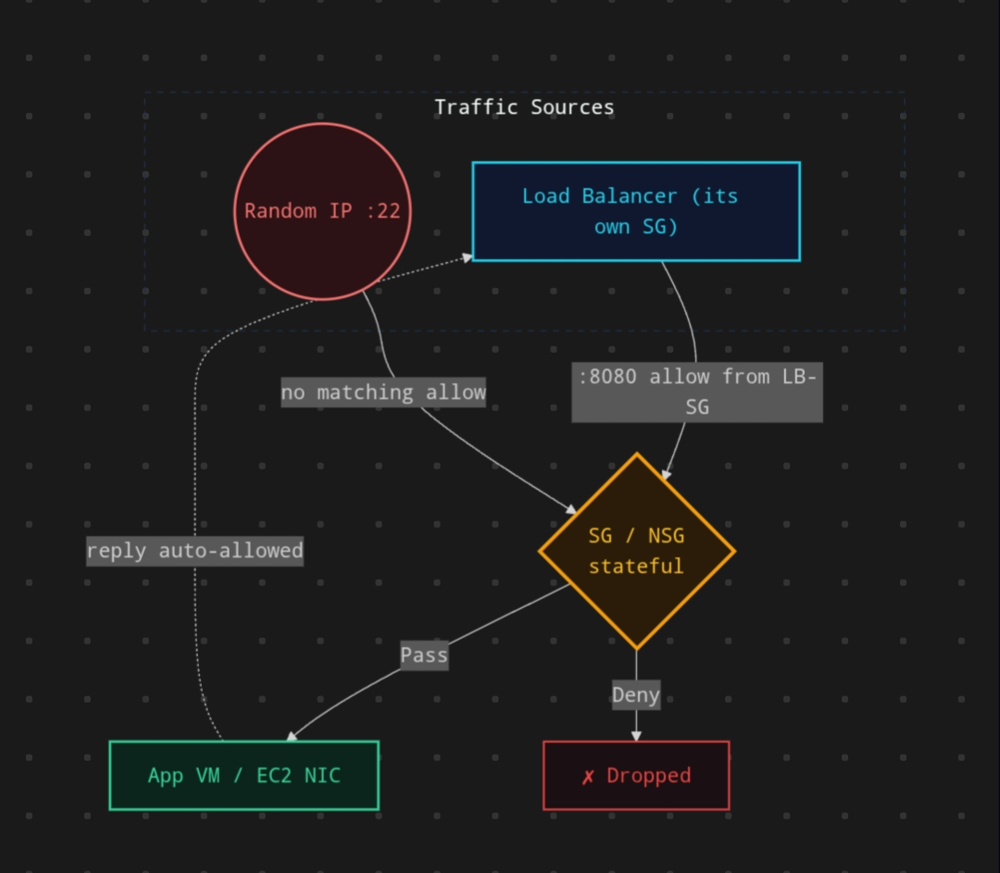

**What it is.** A **stateful** firewall attached directly to a virtual network interface. Stateful
means connection tracking: if the inbound flow is permitted, the return traffic is automatically
allowed regardless of outbound rules.

Reading the diagram:

* **Permitted:** `:8080 allow from LB-SG` → **Pass** → App VM / EC2 NIC.
* **Denied:** an unsolicited internet IP on `:22` → no matching allow → **Dropped**.
* **Return traffic:** the reply is **auto-allowed** by connection tracking — no outbound rule needed.

**How each cloud does it.**

| | AWS Security Group | Azure NSG | GCP VPC Firewall Rules |
| --- | --- | --- | --- |
| Attaches to | ENI (instance NIC) | **Subnet *or* NIC** (both evaluated) | VPC, targeted by tag or service account |
| Rule types | **Allow only** — no deny | **Allow and Deny** | Allow and Deny |
| Evaluation | Union of all rules; most permissive wins | **Numeric priority 100–4096**, first match wins | **Priority 0–65535**, lowest number wins |
| Default inbound | Deny all | Deny all (after default rules) | Deny all (implied) |
| Default outbound | **Allow all** | Allow all (after default rules) | **Allow all** (implied) |
| Source can be | **Another Security Group** | Another ASG, service tag, or CIDR | **Service account** or network tag |
| Limits | 60 rules/SG, 5 SGs/ENI (adjustable) | 1000 rules/NSG | 100 rules/policy (adjustable) |
| Logging | VPC Flow Logs | NSG Flow Logs | Firewall Rules Logging |

> **Reference the source group, not a CIDR.** `allow :8080 from sg-loadbalancer` keeps working when
> the load balancer scales out and its IPs change. `allow :8080 from 10.0.1.47/32` breaks the moment
> autoscaling replaces that node. This is the single highest-value habit in cloud firewalling —
> and the reason GCP's service-account-targeted rules are the strongest model of the three.

**Real-world use.** A Kubernetes cluster on AKS: the node-pool NSG allows `:8080` only from the
Application Gateway's ASG, and `:5432` outbound only to the database subnet's service tag. When a
new node joins the pool it inherits the subnet NSG automatically — no rule edit, no drift. An
attacker landing on a node cannot reach `:22` on its neighbours because the rule set never
allowed lateral SSH.

**Policies & roles.**

| Action | AWS | Azure | GCP |
| --- | --- | --- | --- |
| Create group | `ec2:CreateSecurityGroup` | `Microsoft.Network/networkSecurityGroups/write` | `compute.firewalls.create` |
| **Open a port** | `ec2:AuthorizeSecurityGroupIngress` | `.../networkSecurityGroups/securityRules/write` | `compute.firewalls.create` / `.update` |
| Close a port | `ec2:RevokeSecurityGroupIngress` | `.../securityRules/delete` | `compute.firewalls.delete` |
| Attach to workload | `ec2:ModifyNetworkInterfaceAttribute` | `.../networkInterfaces/write` | Apply network tag / service account |
| Required role | `AmazonVPCFullAccess` or scoped custom | `Network Contributor` | **`roles/compute.securityAdmin`** |

**Guardrails worth enforcing:**

* **AWS SCP** — deny `ec2:AuthorizeSecurityGroupIngress` when the request contains `0.0.0.0/0` on ports `22`, `3389`, `3306`, `5432`. This is the highest-return SCP most organisations can write.
* **Azure Policy** — built-ins *"Management ports should be closed on your virtual machines"* and *"RDP/SSH access from the Internet should be blocked"* (Deny effect).
* **GCP** — `compute.firewalls.*` sits in `roles/compute.securityAdmin`, **not** `networkAdmin`. Grant them to different people. Enable Firewall Rules Logging on every deny rule.
* **All three** — alert on any rule change where source is `0.0.0.0/0` or `::/0`.

**Gotchas.** Azure evaluates the **subnet NSG and the NIC NSG in sequence** — traffic must be
allowed by both, and this trips up almost everyone the first time. AWS SGs cannot express "deny",
so you cannot carve an exception out of a broad allow; restructure the rule instead. GCP's implied
`allow all egress` is wide open until you add a higher-priority deny.

---

### C5 — NACLs & layered perimeter defence

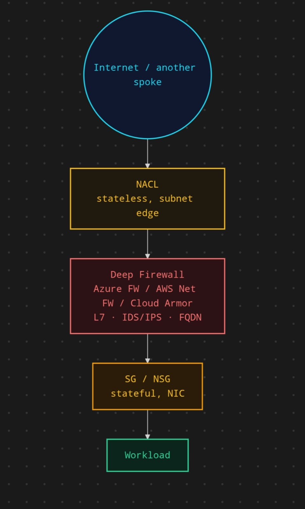

**What it is.** Defence in depth at the subnet boundary. The layers are evaluated in a **fixed
order** and a packet must clear **all** of them:

| Order | Layer | Attach point | State | Blocks |
| --- | --- | --- | --- | --- |
| 1 | **NACL** | Subnet edge | **Stateless** — return ports must be opened explicitly | Coarse CIDR / port denies |
| 2 | **Deep firewall** (Azure FW / AWS Network FW / Cloud Armor) | Inspection subnet | Stateful | L7 payloads, IDS/IPS signatures, FQDN egress |
| 3 | **SG / NSG** | NIC | Stateful | Per-instance source and port |
| 4 | **Workload** | — | — | Application-level authz |

**Stateless vs stateful — the distinction that causes most NACL outages:**

A stateless NACL evaluates every packet independently. If you allow inbound `:443` but forget to
allow **outbound ephemeral ports `1024–65535`**, the request arrives and the response is dropped.
Stateful SG/NSG rules never have this problem.

**How each cloud does it.**

| | AWS | Azure | GCP |
| --- | --- | --- | --- |
| Stateless subnet layer | **Network ACL** (numbered rules, allow + deny) | *(No direct equivalent — NSG on subnet is stateful)* | *(No direct equivalent)* |
| Deep inspection | **AWS Network Firewall** (Suricata rules) | **Azure Firewall** / Firewall Premium (IDPS, TLS inspection) | **Cloud NGFW** / Cloud Armor (WAF at edge) |
| Hierarchical policy | Firewall Manager policies | Azure Firewall Policy (parent/child) | **Hierarchical firewall policies** (org → folder → project) |
| DDoS | AWS Shield / Shield Advanced | Azure DDoS Protection | Cloud Armor Adaptive Protection |

**Real-world use.** A PCI-DSS cardholder data environment. The NACL on the CDE subnet denies the
entire corporate `10.50.0.0/16` range outright — a blunt, auditable "this subnet does not talk to
the office network" control that survives any SG misconfiguration below it. Azure Firewall Premium
then does TLS inspection and IDPS on what remains, and NSGs enforce per-workload ports. Three
independent controls, three different teams, three different change processes — which is exactly
what the auditor wants to see.

**Policies & roles.**

| Action | AWS | Azure | GCP |
| --- | --- | --- | --- |
| Manage NACL | `ec2:CreateNetworkAcl`, `ec2:CreateNetworkAclEntry`, `ec2:ReplaceNetworkAclAssociation` | *(n/a)* | *(n/a)* |
| Manage deep firewall | `network-firewall:CreateFirewall`, `network-firewall:CreateFirewallPolicy`, `network-firewall:UpdateFirewallPolicy` | `Microsoft.Network/azureFirewalls/write`, `.../firewallPolicies/write` | `compute.networkFirewallPolicies.create` / `.update` |
| Org-wide enforcement | **AWS Firewall Manager** (`fms:PutPolicy`) — requires a delegated admin account | **Azure Policy** + Firewall Manager | **Hierarchical firewall policies** at org/folder |
| Read / audit | `ec2:DescribeNetworkAcls` | `.../azureFirewalls/read` | `compute.networkFirewallPolicies.get` |

**Guardrails worth enforcing:**

* **AWS** — enable **Firewall Manager** in the security account so NACL/SG baselines are pushed centrally and cannot be edited in member accounts; deny `ec2:DeleteNetworkAcl` via SCP.
* **Azure Policy** — *"Azure Firewall should be deployed"* and *"Subnets should be associated with an NSG"*, both Deny.
* **GCP** — define **hierarchical firewall policies at the organisation node** so project owners physically cannot create a rule that overrides them; hierarchical rules are evaluated *before* VPC-level rules.

**Gotchas.** NACL rules are evaluated **in ascending rule-number order and stop at the first match**
— an early broad allow makes every later deny dead code. Azure has no stateless equivalent; if a
design calls for one, use Azure Firewall with explicit deny rules instead of trying to emulate it.

---

### C6 — Centralised egress inspection

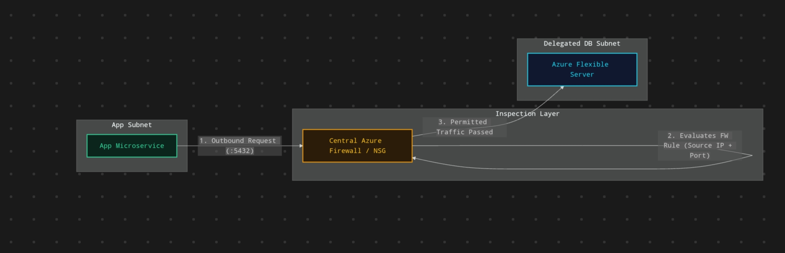

**What it is.** Forcing east-west and outbound traffic through one inspection point, so there is a
single audit trail and a single rule set to reason about. The flow:

1. App microservice issues an outbound request (`:5432`).
2. The central firewall **evaluates the rule on source IP + port**.
3. Only permitted traffic is passed through to the destination subnet.

Everything else is dropped and logged. The enforcement mechanism is the UDR/route from
[C3](#c3--route-tables--user-defined-routes-udr) — routing is what makes inspection unavoidable.

**How each cloud does it.**

| | AWS | Azure | GCP |
| --- | --- | --- | --- |
| Inspection engine | AWS Network Firewall, or 3rd-party NVA behind a **Gateway Load Balancer** | **Azure Firewall** (Standard/Premium) in the hub | **Cloud NGFW Enterprise**, or NVA behind an internal LB |
| Steering mechanism | Route `0.0.0.0/0` → GWLB endpoint / TGW | **UDR** → Virtual Appliance | Custom route `next-hop-ilb` |
| Centralisation | TGW inspection VPC | Hub VNet / Virtual WAN secured hub | Network Connectivity Center hub |
| FQDN filtering | Network Firewall Suricata rules | Application rules (FQDN tags) | FQDN objects in firewall policy |
| Egress SNAT | NAT Gateway behind firewall | Firewall public IP or NAT Gateway | Cloud NAT |

**Real-world use.** A bank must prove that no workload can reach an unapproved external endpoint.
Every spoke VNet gets a UDR sending `0.0.0.0/0` to the hub's Azure Firewall. The firewall's
application rules allow only `*.ubuntu.com`, `*.microsoft.com`, and the payment processor's FQDN.
An engineer who hardcodes a call to an unapproved SaaS API sees it fail in dev, with a firewall log
line naming the source IP, destination FQDN, and rule that denied it — and the audit evidence is
produced automatically rather than assembled by hand at year end.

**Policies & roles.**

| Action | AWS | Azure | GCP |
| --- | --- | --- | --- |
| Deploy firewall | `network-firewall:CreateFirewall` | `Microsoft.Network/azureFirewalls/write` | `compute.networkFirewallPolicies.create` |
| **Edit rules** (the sensitive one) | `network-firewall:UpdateFirewallPolicy` | `.../firewallPolicies/ruleCollectionGroups/write` | `compute.networkFirewallPolicies.update` |
| Manage steering routes | `ec2:CreateRoute` (see C3) | `.../routeTables/routes/write` | `compute.routes.create` |
| Read logs | `logs:GetLogEvents` | `Log Analytics Reader` | `roles/logging.viewer` |
| Suggested split | Rules = SecOps role; routes = platform role | Same split via two custom roles | Same split via `securityAdmin` vs `networkAdmin` |

**Guardrails worth enforcing:**

* Separate **who edits firewall rules** from **who edits routes**. Either permission alone can bypass inspection; together they are unaccountable.
* **Azure Policy** — *"All Internet traffic should be routed via your deployed Azure Firewall"* in Deny mode across every spoke subscription.
* Alert on firewall rule changes that widen a destination to `*` or `0.0.0.0/0`.
* Ship all firewall logs to an account/subscription/project the workload teams **cannot write to**.

**Gotchas.** The inspection subnet must be excluded from its own forced-tunnel route or you build a
loop. Central firewalls are a throughput and cost chokepoint — size them for peak and expect the
data-processing charge to become one of your largest network line items. Asymmetric routing (request
through the firewall, response direct) silently breaks stateful inspection; both directions must
traverse the same appliance.

---

### C7 — Private service access & delegated subnets

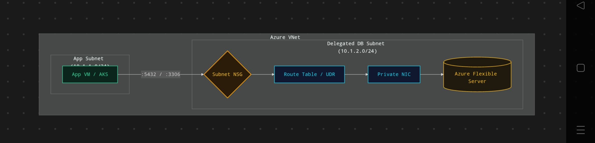

**What it is.** Reaching a managed PaaS service (database, object store, queue) over a **private IP
inside your own network** rather than over its public endpoint. The service gets a NIC in a subnet
you control, so all the concepts above — NSG, routes, flow logs — apply to it.

The path in the diagram:

```
App VM / AKS  →  :5432 / :3306  →  Subnet NSG  →  Route Table / UDR  →  Private NIC  →  Azure Flexible Server
                                                                        (delegated DB subnet 10.1.2.0/24)
```

**How each cloud does it.**

| | AWS | Azure | GCP |
| --- | --- | --- | --- |
| Mechanism | **VPC Endpoint** (Gateway for S3/DynamoDB, Interface/PrivateLink for the rest) | **Private Endpoint**, or **subnet delegation** for injected services | **Private Service Connect** / Private Service Access (VPC peering) |
| What lands in your subnet | An ENI with a private IP | A NIC with a private IP | A forwarding-rule IP |
| DNS | Private hosted zone override | **Private DNS Zone** (`privatelink.postgres.database.azure.com`) | Cloud DNS private zone |
| Publish your own service | PrivateLink service behind an NLB | Private Link Service behind a Standard LB | PSC service attachment behind an ILB |
| Blocks public path | Endpoint policy + S3 bucket policy | `publicNetworkAccess = Disabled` | `Deny all` on the public endpoint |

**Real-world use.** An AKS-hosted microservice needs PostgreSQL. Instead of the default
`*.postgres.database.azure.com` public endpoint, the team delegates `10.1.2.0/24` to
`Microsoft.DBforPostgreSQL/flexibleServers`. The server gets a NIC at `10.1.2.4`; the app connects
to a private IP; `publicNetworkAccess` is disabled so the public endpoint does not resolve at all.
Data never touches the internet, and the connection shows up in VNet flow logs like any other
internal flow. On AWS the same design uses an Interface VPC Endpoint; on GCP, Private Service Connect.

**Policies & roles.**

| Action | AWS | Azure | GCP |
| --- | --- | --- | --- |
| Create endpoint | `ec2:CreateVpcEndpoint` | `Microsoft.Network/privateEndpoints/write` | `compute.forwardingRules.create` |
| Delegate a subnet | *(n/a)* | `.../virtualNetworks/subnets/write` with `delegations` | `compute.subnetworks.update` |
| Approve a connection | `ec2:AcceptVpcEndpointConnections` | `.../privateLinkServices/privateEndpointConnections/write` | `compute.serviceAttachments.update` |
| Manage private DNS | `route53:ChangeResourceRecordSets` | `Private DNS Zone Contributor` | `roles/dns.admin` |
| Publish a service | `ec2:CreateVpcEndpointServiceConfiguration` | `.../privateLinkServices/write` | `compute.serviceAttachments.create` |

**Guardrails worth enforcing:**

* **AWS** — attach a **VPC endpoint policy** restricting the endpoint to your own account's buckets, and add an S3 bucket policy with `aws:SourceVpce` so the bucket is unreachable except through your endpoint. Endpoint policies are the only way to stop data being copied *to someone else's* S3 bucket over your endpoint.
* **Azure Policy** — deny `publicNetworkAccess = Enabled` on PaaS resources; require a Private Endpoint for Storage, SQL, Key Vault, and Cosmos DB (all available as built-ins).
* **GCP Org Policy** — `constraints/storage.publicAccessPrevention` and `constraints/sql.restrictPublicIp`.
* Require **connection approval** to be a manual, logged step for any Private Link service you publish externally.

**Gotchas.** DNS is where this design usually fails: without the private DNS zone the client
resolves the public IP and the connection either fails or silently egresses over the internet.
Always verify with `nslookup` from inside the subnet that the name resolves to an RFC1918 address.
Azure delegated subnets cannot host anything else, and the delegation cannot be removed while
resources exist.

---

### C8 — Internet Gateway (IGW)

**What it is.** A horizontally scalable, highly available edge component that enables
**bi-directional** communication between resources holding public IPs and the internet. It performs
1:1 NAT between a public IP and the instance's private IP. It is not a device you size or patch —
it either exists and is routed to, or it does not.

Two conditions must both be true for a resource to be internet-reachable:

1. The subnet's route table has `0.0.0.0/0 → IGW`, **and**
2. The resource holds a public IP, **and** the SG/NSG allows the traffic.

**How each cloud does it.**

| | AWS | Azure | GCP |
| --- | --- | --- | --- |
| Object | **Internet Gateway**, explicitly attached to the VPC | **Implicit** — no gateway object exists | **Implicit** `default-internet-gateway` route target |
| Inbound | Requires public IP + IGW route | Requires public IP resource on the NIC | Requires external IP on the instance |
| Default outbound | None until IGW attached | **Default outbound access** (being retired — use NAT Gateway) | Via default route if external IP present |
| Egress-only IPv6 | **Egress-Only Internet Gateway** | NSG rules | IPv6 firewall rules |
| Cost | Free (data transfer charged) | Free | Free (data transfer charged) |

**Real-world use.** A public-facing marketing site. The ALB sits in public subnets with
`0.0.0.0/0 → igw-xxxx`; the web servers behind it sit in private subnets with no IGW route at all.
The IGW is attached exactly once per VPC, and the SCP below ensures nobody detaches it during an
incident or attaches a second one to a workload VPC that is supposed to be fully private.

**Policies & roles.**

| Action | AWS | Azure | GCP |
| --- | --- | --- | --- |
| Create | `ec2:CreateInternetGateway` | *(n/a — implicit)* | *(n/a — implicit)* |
| Attach / detach | `ec2:AttachInternetGateway`, `ec2:DetachInternetGateway` | `.../publicIPAddresses/join/action` | `compute.instances.create` with `accessConfigs` |
| Allocate public IP | `ec2:AllocateAddress`, `ec2:AssociateAddress` | `.../publicIPAddresses/write` | `compute.addresses.create` |
| Read / audit | `ec2:DescribeInternetGateways` | `.../publicIPAddresses/read` | `compute.addresses.list` |

**Guardrails worth enforcing:**

* **AWS SCP** — deny `ec2:CreateInternetGateway` and `ec2:AttachInternetGateway` in any OU designated as fully private (data, PCI, backup accounts). This is a one-line control that makes an entire OU structurally incapable of internet exposure.
* **Azure Policy** — built-in *"Network interfaces should not have public IPs"* (Deny); plan the migration off **default outbound access**, which Azure is retiring in favour of explicit NAT Gateway.
* **GCP Org Policy** — `constraints/compute.vmExternalIpAccess` denying external IPs org-wide with an explicit allow-list.

**Gotchas.** Attaching an IGW does nothing on its own — the route is what matters, which is why
[C3](#c3--route-tables--user-defined-routes-udr) is the higher-privilege control. On Azure, VMs
have historically had implicit outbound internet access with **no gateway and no route**, which
surprises engineers arriving from AWS; explicitly attach a NAT Gateway rather than relying on it.

---

### C9 — NAT Gateway vs NAT Instance

**What it is.** Translates private source IPs from internal subnets into one public IP so that
private workloads get **outbound-only** internet (OS patches, package registries, third-party APIs)
while remaining unreachable from inbound connections.

```
+--------------------+------------------------------------+-----------------------------+
| SPECIFICATION      | MANAGED NAT GATEWAY (Cloud-native) | CUSTOM NAT INSTANCE         |
+--------------------+------------------------------------+-----------------------------+
| High Availability  | Managed by Provider across AZs     | Self-managed (requires HA)  |
| Scalability        | Automatically scales (up to 45Gbps)| Limited by Instance EC2/VM  |
| Maintenance        | Zero maintenance                   | Requires OS Patching & Mgmt |
| Cost Structure     | Hourly rate + Data processed (GB)  | Hourly EC2/VM compute rate  |
| Security control   | No SG (route-controlled only)      | SG + host firewall possible |
| Port forwarding    | Not supported                      | Supported (custom iptables) |
+--------------------+------------------------------------+-----------------------------+
```

**How each cloud does it.**

| | AWS | Azure | GCP |
| --- | --- | --- | --- |
| Managed service | **NAT Gateway** (per AZ) | **Azure NAT Gateway** (zonal) | **Cloud NAT** (regional, distributed) |
| Placement | In a **public** subnet, one per AZ for HA | Attached to subnet(s) | **No instance at all** — software-defined on the VPC |
| Scaling | To 45 Gbps automatically | To 50 Gbps | No throughput bottleneck |
| SNAT ports | 55,000 per assigned EIP | Configurable per IP | Configurable per VM |
| Charged for | Hourly + per GB processed | Hourly + per GB processed | Hourly + per GB processed |
| HA caveat | **Zonal** — an AZ outage kills its NAT GW | Zonal or zone-redundant | Regional, inherently redundant |

**Real-world use.** An EKS cluster in three AZs pulling images from Docker Hub. The correct build is
**one NAT Gateway per AZ**, each in that AZ's public subnet, with each private subnet's route table
pointing at its *own* AZ's NAT Gateway. Teams that deploy a single shared NAT Gateway to save money
get two nasty surprises: cross-AZ data transfer charges on every pull, and a full-cluster outage
when that one AZ has an incident. GCP sidesteps the whole question — Cloud NAT is not an instance.

**Policies & roles.**

| Action | AWS | Azure | GCP |
| --- | --- | --- | --- |
| Create | `ec2:CreateNatGateway` + `ec2:AllocateAddress` | `Microsoft.Network/natGateways/write` | `compute.routers.create` (Cloud NAT lives on Cloud Router) |
| Attach to subnet | `ec2:CreateRoute` to the NAT GW | `.../natGateways/join/action` | `compute.routers.update` |
| Delete | `ec2:DeleteNatGateway` | `.../natGateways/delete` | `compute.routers.update` |
| Read / audit | `ec2:DescribeNatGateways` | `.../natGateways/read` | `compute.routers.get` |

**Guardrails worth enforcing:**

* **Cost, not security, is the main guardrail here.** NAT data-processing charges are a top-three surprise on most cloud bills. Add VPC Endpoints ([C7](#c7--private-service-access--delegated-subnets)) for S3/ECR/Storage so that traffic bypasses NAT entirely — this routinely cuts NAT spend by more than half.
* Tag every NAT Gateway with an owner and alert on creation; require the per-AZ pattern in the module rather than leaving it to each team.
* **Azure Policy** — require a NAT Gateway on subnets rather than relying on default outbound access, which Azure is retiring.
* Deny NAT Instance (self-managed EC2 with `SourceDestCheck` disabled) in production via SCP unless a documented exception exists — it is an unpatched, single-point-of-failure router.

**Gotchas.** A NAT Gateway placed in a *private* subnet by mistake creates a routing loop and
silently breaks all egress. NAT Gateways have no security group, so the only control is the route.
SNAT port exhaustion under high fan-out (many short-lived connections to the same destination)
presents as intermittent timeouts — allocate additional public IPs to fix it.

---

### C10 — VPC / VNet Peering

**What it is.** A direct layer-3 routing connection between two networks using private IPs. No
gateway, no encryption overhead, no bandwidth bottleneck — traffic stays on the provider backbone.

**Two properties that shape every design:**

* **Non-transitive.** A peered to B, and B peered to C, does **not** let A reach C. You need a transit router ([C11](#c11--hub--spoke--transit-routing)) for that.
* **CIDRs must not overlap.** Ever. This is why the address plan in [C1](#c1--vpc--vnet-the-network-boundary) is a permanent decision.

**How each cloud does it.**

| | AWS | Azure | GCP |
| --- | --- | --- | --- |
| Object | VPC Peering Connection | VNet Peering (**two objects, one per side**) | VPC Network Peering |
| Cross-region | Yes | Yes (Global VNet Peering) | Yes (VPC is already global) |
| Cross-account/tenant | Yes, with accept step | Yes, with permissions on both sides | Yes, with matching config in both projects |
| Route propagation | **Manual** — add routes to both route tables | **Automatic** | **Automatic** |
| Transitive | No | No | No |
| Transitive gateway option | Transit Gateway | Virtual WAN / hub NVA | Network Connectivity Center |
| Scale limit | 125 peerings per VPC | 500 per VNet | 25 per VPC (default) |

**Real-world use.** A shared-services VNet hosting Active Directory, monitoring, and the artifact
repository is peered to each of the dev, staging, and prod VNets. Prod and dev are **not** peered to
each other, and because peering is non-transitive they cannot reach one another through the shared
VNet either — the isolation is structural rather than rule-based, which is what makes it hold up
under audit. Once the count of peerings grows past roughly a dozen, the n² mesh becomes unmanageable
and you migrate to hub-and-spoke.

**Policies & roles.**

| Action | AWS | Azure | GCP |
| --- | --- | --- | --- |
| Request peering | `ec2:CreateVpcPeeringConnection` | `Microsoft.Network/virtualNetworks/virtualNetworkPeerings/write` | `compute.networks.addPeering` |
| **Accept peering** | `ec2:AcceptVpcPeeringConnection` | Same permission **on the remote VNet** | `compute.networks.addPeering` on the peer project |
| Add routes | `ec2:CreateRoute` (manual on AWS) | *(automatic)* | *(automatic)* |
| Delete | `ec2:DeleteVpcPeeringConnection` | `.../virtualNetworkPeerings/delete` | `compute.networks.removePeering` |

**Guardrails worth enforcing:**

* **The accept step is the control point.** Peering requires action on both sides — never grant `AcceptVpcPeeringConnection` broadly, because accepting a peering from an unknown account creates a private path into your network.
* **AWS SCP** — deny `ec2:AcceptVpcPeeringConnection` unless the requester account is in your Organization (condition on `aws:PrincipalOrgID`).
* **GCP Org Policy** — `constraints/compute.restrictVpcPeering` restricting peering to an allow-list of projects/orgs.
* **Azure Policy** — audit for peerings where `allowVirtualNetworkAccess` or `allowForwardedTraffic` is enabled outside the hub.

**Gotchas.** AWS does not add routes for you; a peering that shows "active" with no traffic flowing
is nearly always missing route table entries on one or both sides. Azure peering has four toggles
(`allowVirtualNetworkAccess`, `allowForwardedTraffic`, `allowGatewayTransit`, `useRemoteGateways`)
and hub-and-spoke needs specific combinations — `allowGatewayTransit` on the hub, `useRemoteGateways`
on the spoke.

---

### C11 — Hub & Spoke / transit routing

**What it is.** Centralising shared infrastructure — firewalls, inspection engines, VPN gateways,
DNS, and hybrid connectivity — in a **hub**, while isolating workloads across many **spokes**. It
is the answer to peering's non-transitivity and to the n² mesh problem.

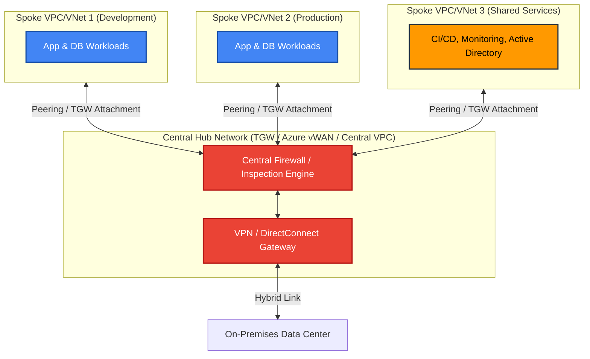
```mermaid
graph TD
    classDef hub fill:#EA4335,stroke:#B31412,stroke-width:2px,color:#fff;
    classDef spoke fill:#4285F4,stroke:#174EA6,stroke-width:2px,color:#fff;
    classDef shared fill:#FF9900,stroke:#232F3E,stroke-width:2px,color:#000;

    subgraph Hub_Network ["Central Hub Network (TGW / Azure vWAN / Central VPC)"]
        Central_FW["Central Firewall / Inspection Engine"]:::hub
        VPN_GW["VPN / DirectConnect Gateway"]:::hub
    end

    subgraph Spoke_Dev ["Spoke VPC/VNet 1 (Development)"]
        Dev_Workload["App & DB Workloads"]:::spoke
    end

    subgraph Spoke_Prod ["Spoke VPC/VNet 2 (Production)"]
        Prod_Workload["App & DB Workloads"]:::spoke
    end

    subgraph Spoke_Shared ["Spoke VPC/VNet 3 (Shared Services)"]
        Shared_Tools["CI/CD, Monitoring, Active Directory"]:::shared
    end

    Spoke_Dev <-->|Peering / TGW Attachment| Central_FW
    Spoke_Prod <-->|Peering / TGW Attachment| Central_FW
    Spoke_Shared <-->|Peering / TGW Attachment| Central_FW

    Central_FW <--> VPN_GW
    VPN_GW <-->|Hybrid Link| OnPrem["On-Premises Data Center"]
```

**How each cloud does it.**

| | AWS | Azure | GCP |
| --- | --- | --- | --- |
| Transit service | **Transit Gateway (TGW)** | **Virtual WAN** (managed) or **hub VNet** (DIY) | **Network Connectivity Center (NCC)** |
| Attachment | TGW VPC attachment per spoke | VNet peering to the hub | NCC spoke |
| Segmentation | **TGW route tables** per segment | vWAN routing intent / custom route tables | NCC hub routing |
| Hybrid | DirectConnect Gateway / Site-to-Site VPN | ExpressRoute / VPN Gateway | Cloud Interconnect / Cloud VPN |
| Sharing across accounts | **AWS RAM** resource share | Cross-subscription peering | Shared VPC / cross-project NCC |
| Inspection | Inspection VPC off the TGW | Secured hub with Azure Firewall | NVA behind ILB in the hub |

**Real-world use.** Forty product teams, each with their own account/subscription and VPC. Every
spoke attaches to the TGW; the TGW has **three route tables** — `prod`, `nonprod`, and `shared`.
Prod spokes can reach `shared` and on-prem but have no route to `nonprod`, and vice versa. Adding
team forty-one is one attachment and one route-table association, not forty new peerings. The
segmentation lives in the TGW route tables, managed by one platform team, and is auditable in one
place.

**Policies & roles.**

| Action | AWS | Azure | GCP |
| --- | --- | --- | --- |
| Create hub | `ec2:CreateTransitGateway` | `Microsoft.Network/virtualHubs/write` | `networkconnectivity.hubs.create` |
| Attach a spoke | `ec2:CreateTransitGatewayVpcAttachment` | `.../virtualNetworkPeerings/write` | `networkconnectivity.spokes.create` |
| **Manage segmentation** | `ec2:CreateTransitGatewayRouteTable`, `ec2:AssociateTransitGatewayRouteTable` | `.../hubRouteTables/write` | `networkconnectivity.hubs.update` |
| Share across accounts | `ram:CreateResourceShare`, `ram:AssociateResourceShare` | RBAC on the hub resource group | `roles/compute.xpnAdmin` (Shared VPC) |
| Service-linked role | `AWSServiceRoleForVPCTransitGateway` | — | — |

**Guardrails worth enforcing:**

* **TGW route table association is the segmentation boundary** — it must be owned by the platform team alone. A spoke team that can associate its own attachment to the `prod` route table has just granted itself production network access.
* **AWS** — share the TGW via **RAM** rather than granting spoke accounts TGW permissions; spoke accounts should be able to *attach* but never to *associate a route table*.
* **Azure** — put the hub in a dedicated `connectivity` subscription under a management group with a Deny policy on `virtualHubs/write` for everyone but the platform pipeline.
* Require every spoke attachment to pass through inspection by default; treat an inspection bypass as a documented, expiring exception.

**Gotchas.** TGW attachments are charged per hour **per attachment** plus per GB — forty spokes is a
material line item. Route table associations vs propagations are different things and confusing
them is the most common TGW misconfiguration. Azure vWAN's "routing intent" replaces manual route
tables and the two approaches do not mix cleanly.

---

### C12 — Load balancers: L7 vs L4

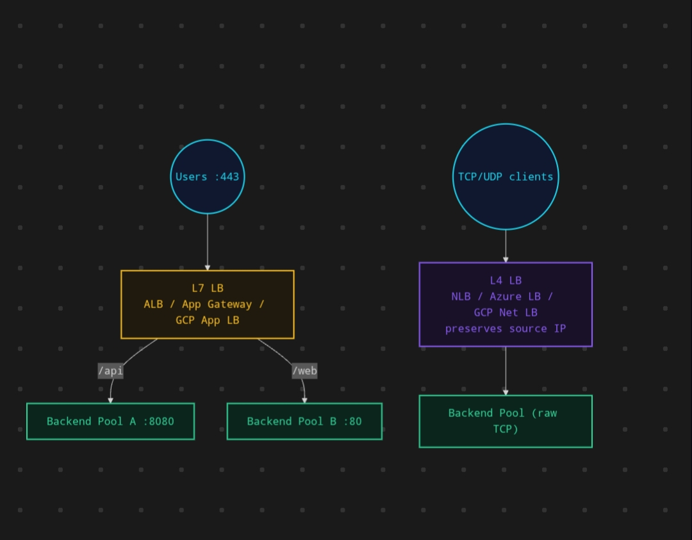

**What it is.** The component that accepts client connections and distributes them across healthy
backends. The layer it operates at determines what it can see and therefore what it can decide on.

* **Layer 7 (Application):** terminates HTTP/HTTPS, reads the path, host, headers and cookies, and routes accordingly — `/api` → pool A on `:8080`, `/web` → pool B on `:80`.
* **Layer 4 (Network):** forwards TCP/UDP without opening the payload. Ultra-high throughput, ultra-low latency, and it **preserves the client source IP**.

| | **L7 — ALB / App Gateway / GCP App LB** | **L4 — NLB / Azure LB / GCP Network LB** |
| --- | --- | --- |
| **Routes on** | Path, host, header, cookie, query | IP, protocol, port |
| **Client source IP** | Replaced (forwarded in `X-Forwarded-For`) | **Preserved** natively |
| **TLS** | Terminates and optionally re-encrypts | Passthrough (or TLS listener) |
| **Protocols** | HTTP/1.1, HTTP/2, gRPC, WebSocket | TCP, UDP, TLS |
| **WAF integration** | Yes | No |
| **Latency** | Higher (proxy hop) | Lower (near line-rate) |
| **Static IP** | No (DNS name) — GCP L7 has anycast IP | **Yes**, per AZ |
| **Use for** | HTTP APIs, path-based microservice routing | Non-HTTP protocols, extreme throughput, source-IP-sensitive apps |

**How each cloud does it.**

| | AWS | Azure | GCP |
| --- | --- | --- | --- |
| L7 | Application Load Balancer (regional) | Application Gateway (regional), **Front Door** (global) | Application Load Balancer (**global** or regional) |
| L4 | Network Load Balancer | Azure Load Balancer (Standard) | Network Load Balancer (passthrough or proxy) |
| Backend abstraction | **Target Group** | **Backend Pool** | **Backend Service** + Network Endpoint Group |
| Entry object | **Listener** + Rules | **Listener** + Rules | **Forwarding Rule** + URL Map |
| Inline appliances | **Gateway Load Balancer** | — (use Azure Firewall) | — (use NVA + ILB) |
| Global anycast | CloudFront / Global Accelerator | Front Door | Native to the global L7 LB |

**Real-world use.** A fintech runs both. The customer-facing REST API sits behind an **ALB** so
`/v1/payments` and `/v1/accounts` route to different microservice target groups, with TLS terminated
at the LB and a WAF in front. The FIX trading gateway sits behind an **NLB** because the protocol is
raw TCP, latency is measured in microseconds, and the upstream venue's firewall allow-lists the
client source IP — which only L4 preserves.

**Policies & roles.**

| Action | AWS | Azure | GCP |
| --- | --- | --- | --- |
| Create LB | `elasticloadbalancing:CreateLoadBalancer` | `Microsoft.Network/loadBalancers/write`, `.../applicationGateways/write` | `compute.forwardingRules.create`, `compute.targetHttpProxies.create` |
| Manage listeners/rules | `elasticloadbalancing:CreateListener`, `:CreateRule` | `.../applicationGateways/write` | `compute.urlMaps.create` / `.update` |
| Manage backends | `elasticloadbalancing:RegisterTargets`, `:ModifyTargetGroup` | `.../backendAddressPools/write` | `compute.backendServices.update` |
| TLS certificates | `acm:RequestCertificate`, `acm:DescribeCertificate` | Key Vault + **managed identity** with `get`/`list` on secrets | `compute.sslCertificates.create` |
| Bundled role | `ElasticLoadBalancingFullAccess` | `Network Contributor` | `roles/compute.loadBalancerAdmin` |
| Service-linked role | `AWSServiceRoleForElasticLoadBalancing` | Managed identity on App Gateway | Google-managed service agent |

**Guardrails worth enforcing:**

* **Deny plaintext listeners.** SCP/Azure Policy/Org Policy denying HTTP-only listeners; require TLS 1.2+ minimum via the LB's security policy setting.
* **Azure Policy** — *"Web Application Firewall should be enabled for Application Gateway"* (Deny).
* **AWS** — require `deletion_protection` on production LBs, and access logging to a locked S3 bucket; deny `elasticloadbalancing:DeleteLoadBalancer` outside the pipeline role.
* Certificate access should be via **managed identity / IAM role**, never a secret pasted into a pipeline variable.

**Gotchas.** With an L7 LB the backend sees the *LB's* IP — any application logic doing IP allow-listing
or rate-limiting must read `X-Forwarded-For`, and must be careful to take the correct element or an
attacker can spoof it. NLBs with source-IP preservation require the backend's SG to allow the
**client** CIDR, not the LB's — a frequent cause of "it works behind the ALB but not the NLB".

---

### C13 — Load balancing algorithms

The algorithm decides *which* healthy backend receives the next request. Six patterns cover
essentially every production case.


```mermaid
flowchart TB
    %% Styling Definitions
    classDef client fill:#34A853,stroke:#188038,stroke-width:2px,color:#fff;
    classDef lb fill:#FF9900,stroke:#232F3E,stroke-width:2px,color:#000;
    classDef server fill:#0089D6,stroke:#005BA1,stroke-width:2px,color:#fff;
    classDef desc fill:#F4F4F4,stroke:#D1D1D1,stroke-width:1px,color:#333;

    %% Subgraph 1: Round Robin
    subgraph RR ["1. Round Robin"]
        direction LR
        C1(("Users")):::client --> LB1["Load Balancer"]:::lb
        LB1 -->|"Request 1"| S1_1["Server 1"]:::server
        LB1 -->|"Request 2"| S1_2["Server 2"]:::server
        LB1 -->|"Request 3"| S1_3["Server 3"]:::server
        D1["Requests are sequentially distributed to<br/>each server as it arrives from end clients."]:::desc
    end

    %% Subgraph 2: Weighted
    subgraph W ["2. Weighted"]
        direction LR
        C2(("Users")):::client --> LB2["Load Balancer"]:::lb
        LB2 -->|"Weight: 4"| S2_1["Server 1 (Higher Traffic)"]:::server
        LB2 -->|"Weight: 2"| S2_2["Server 2 (Medium Traffic)"]:::server
        LB2 -->|"Weight: 1"| S2_3["Server 3 (Lower Traffic)"]:::server
        D2["Requests sent based on assigned weights.<br/>Higher weight = higher number of requests."]:::desc
    end

    %% Subgraph 3: Least Connections
    subgraph LC ["3. Least Connections"]
        direction LR
        C3(("Users")):::client --> LB3["Load Balancer"]:::lb
        LB3 -.->|"15 Connections"| S3_1["Server 1"]:::server
        LB3 -->|"2 Connections (Selected)"| S3_2["Server 2"]:::server
        LB3 -.->|"8 Connections"| S3_3["Server 3"]:::server
        D3["Requests forwarded to servers with fewer<br/>active connections (Order of Less to More)."]:::desc
    end

    %% Subgraph 4: Response Time
    subgraph RT ["4. Response Time"]
        direction LR
        C4(("Users")):::client --> LB4["Load Balancer"]:::lb
        LB4 -.->|"Latency: 900ms"| S4_1["Server 1"]:::server
        LB4 -->|"Latency: 12ms (Selected)"| S4_2["Server 2"]:::server
        LB4 -.->|"Latency: 350ms"| S4_3["Server 3"]:::server
        D4["More requests sent to servers with the best<br/>response times & lowest active connections."]:::desc
    end

    %% Subgraph 5: IP Hash
    subgraph IPH ["5. IP Hash"]
        direction LR
        C5(("Client IP<br/>192.168.1.45")):::client --> LB5["Hash Function<br/>Hash(IP) % N"]:::lb
        LB5 -->|"Mapped Hash ID: 2"| S5_2["Server 2 (Sticky Target)"]:::server
        LB5 -.-> S5_1["Server 1"]:::server
        LB5 -.-> S5_3["Server 3"]:::server
        D5["Hashes client IP to map requests to a specific<br/>server for session consistency."]:::desc
    end

    %% Subgraph 6: Resource Based
    subgraph RB ["6. Resource Based"]
        direction LR
        C6(("Users")):::client --> LB6["Load Balancer"]:::lb
        LB6 -.->|"CPU: 95%"| S6_1["Server 1"]:::server
        LB6 -->|"CPU: 15% (Selected)"| S6_2["Server 2"]:::server
        LB6 -.->|"CPU: 80%"| S6_3["Server 3"]:::server
        D6["Routes traffic based on server metrics<br/>(CPU/Memory availability and free capacity)."]:::desc
    end
```

#### 1. Round Robin

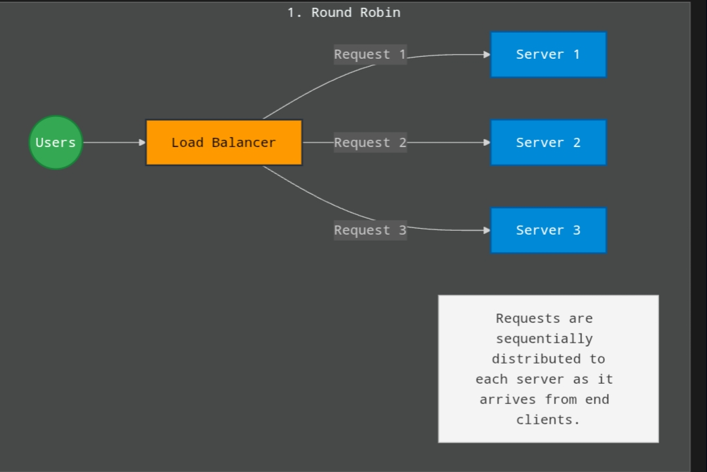

**How it works.** Requests are distributed sequentially to each server in turn as they arrive.

**Real-world use.** A stateless REST API on an identically sized autoscaling group. Every request
costs roughly the same, so simple rotation gives an even spread with zero bookkeeping.
**Where it fails:** identical rotation across *non*-identical servers overloads the weakest node,
and a slow node keeps receiving its full share until health checks eject it.

**Cloud support.** AWS ALB (default) · Azure Application Gateway · GCP `RATE`-based backend service.

#### 2. Weighted

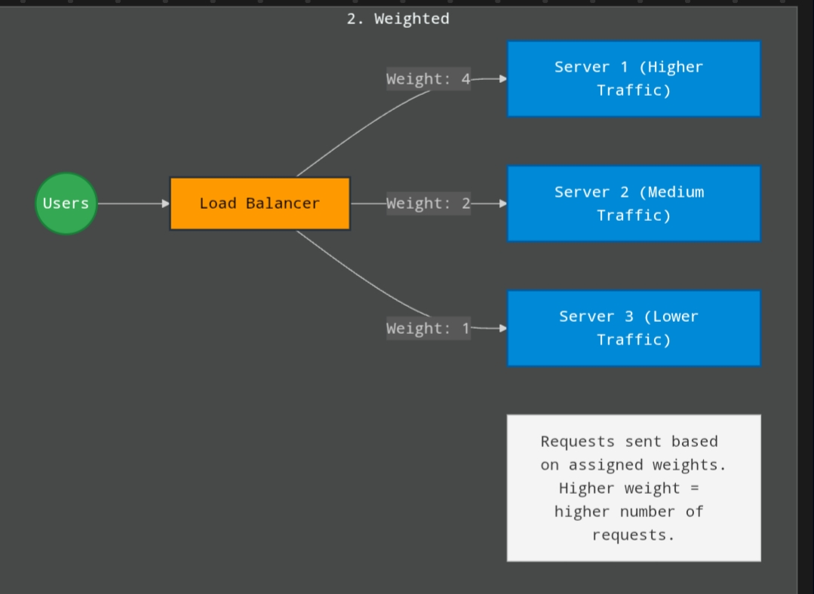

**How it works.** Requests are sent in proportion to an assigned weight — higher weight, higher share.

**Real-world use.** **Canary and blue/green deployments.** Route 5% of traffic to the new version
(weight 5) and 95% to the current one (weight 95), watch error rates, then shift the weights. Also
the correct choice for mixed fleets where older, smaller instances run alongside newer ones.

**Cloud support.** AWS ALB weighted target groups · Azure Traffic Manager weighted routing ·
GCP weighted backend services.

#### 3. Least Connections

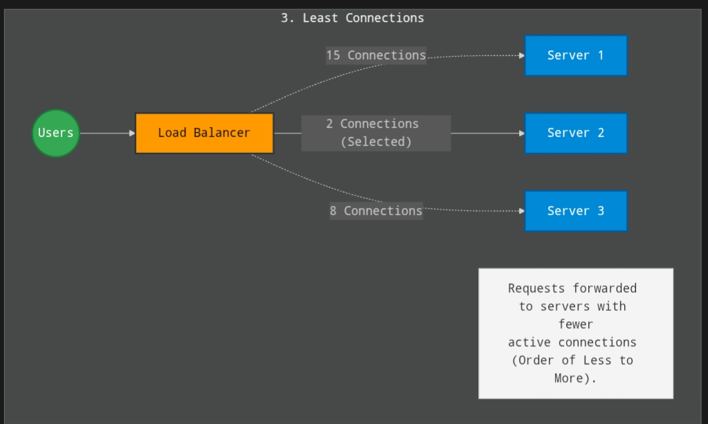

**How it works.** The next request goes to whichever backend currently holds the fewest active
connections — in the diagram, server 2 with 2, ahead of server 3 with 8 and server 1 with 15.

**Real-world use.** **Long-lived connections** — WebSockets, gRPC streams, database connection pools,
video streaming. When sessions last minutes rather than milliseconds, connection count is a far
better proxy for load than request count.

**Cloud support.** AWS ALB (`least_outstanding_requests`) · Azure Load Balancer · GCP `CONNECTION`
balancing mode.

#### 4. Response Time

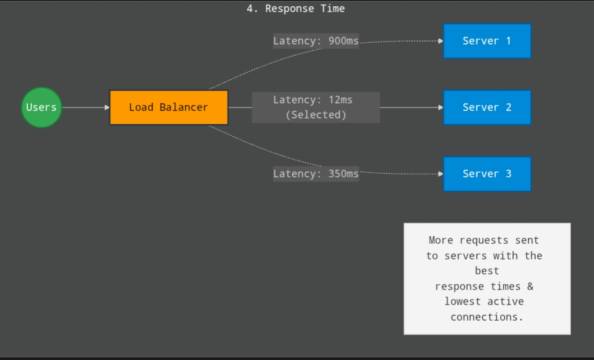

**How it works.** More requests go to the servers with the best measured response times and the
lowest active connection counts — server 2 at 12 ms wins over 350 ms and 900 ms.

**Real-world use.** Latency-sensitive microservices where per-node compute time genuinely varies —
a node with a cold cache, a noisy neighbour, or a JIT still warming up. The algorithm routes around
a degrading node **before** it fails a health check, which is its real value.

**Cloud support.** GCP global LB (latency-aware routing) · most service meshes (Envoy, Istio) ·
NGINX Plus `least_time`.

#### 5. IP Hash

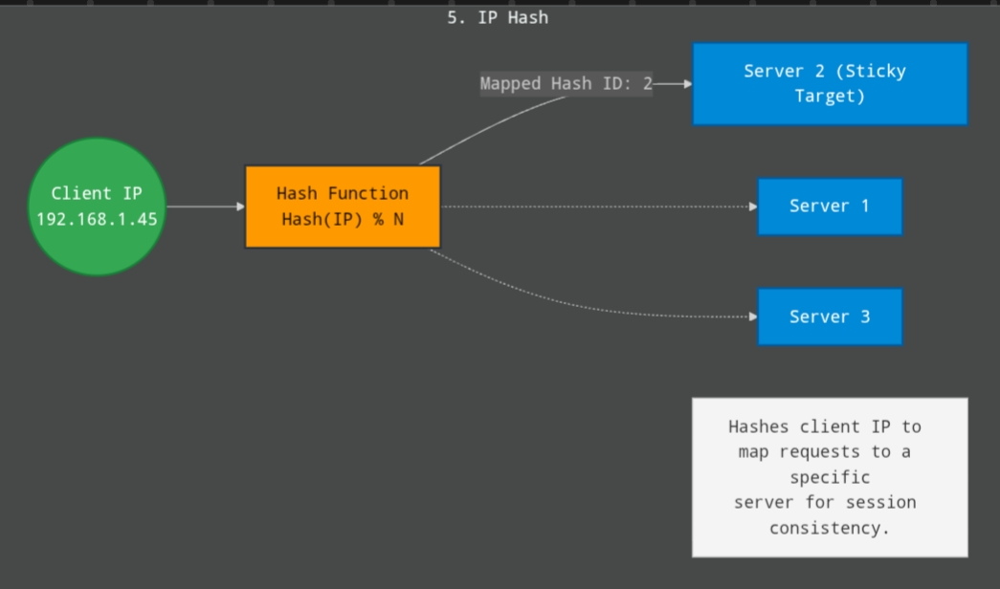

**How it works.** The client IP is hashed (`Hash(IP) % N`) and mapped to a fixed backend, giving
session consistency without any shared session store.

**Real-world use.** Stateful legacy applications holding in-memory sessions on a specific node — the
classic lift-and-shift .NET or Java monolith that was never designed for horizontal scale.
**The trap:** when `N` changes (a node is added or removed) the modulo remaps *most* clients at once
and everybody's session drops. Prefer cookie-based affinity, or consistent hashing, where available;
and treat IP hash as a migration bridge rather than a destination.

**Cloud support.** AWS NLB (flow hash, source-IP affinity) · Azure LB session persistence
(`SourceIP`) · GCP `CLIENT_IP` session affinity.

#### 6. Resource Based


**How it works.** Traffic is routed on live backend metrics — CPU and memory availability and
remaining free capacity. Server 2 at 15% CPU is selected over nodes at 80% and 95%.

**Real-world use.** Compute-heavy, highly variable workloads: ML inference, video transcoding,
report rendering, data pipelines. One request may cost 50 ms and the next 30 seconds, so neither
request count nor connection count reflects real load — only utilisation does.

**Cloud support.** GCP `UTILIZATION` balancing mode (the most direct implementation) ·
Kubernetes custom-metric autoscaling with a mesh · NGINX Plus with an agent.

#### Algorithm selection cheat-sheet

| Algorithm | Choose it when | Avoid it when |
| --- | --- | --- |
| **Round Robin** | Identical backends, uniform request cost | Backends differ in size or request cost varies wildly |
| **Weighted** | Mixed fleets; canary / blue-green rollouts | All nodes identical (adds pointless config) |
| **Least Connections** | WebSockets, gRPC streams, DB pools | Very short-lived HTTP requests |
| **Response Time** | Latency-sensitive services with variable compute | Backends whose latency is uniform (adds overhead) |
| **IP Hash** | Legacy in-memory sticky sessions | Backend count changes often — remap storms |
| **Resource Based** | Rendering, ML inference, data pipelines | Lightweight uniform workloads |

---

### C14 — Load balancer types & key features


```mermaid
flowchart TB
    %% Styling Definitions
    classDef category fill:#FF9900,stroke:#232F3E,stroke-width:2px,color:#000;
    classDef item fill:#0089D6,stroke:#005BA1,stroke-width:2px,color:#fff;
    classDef detail fill:#F4F4F4,stroke:#D1D1D1,stroke-width:1px,color:#333;

    %% Subgraph A: Types of Load Balancers
    subgraph Types ["Types of Load Balancer (LB)"]
        direction TB
        T1["1. Application LB (Layer 7)"]:::item --> D1["Routes traffic based on HTTP/HTTPS content (URL path, headers)."]:::detail
        T2["2. Network LB (Layer 4)"]:::item --> D2["High-throughput routing based on IP, TCP, and UDP ports."]:::detail
        T3["3. Proxy LB"]:::item --> D3["Terminates incoming connection, inspects payload, creates new connection."]:::detail
        T4["4. Pass-Through LB"]:::item --> D4["Forwards raw packets directly to backend without modifying headers."]:::detail
        T5["5. DNS Load Balancing"]:::item --> D5["Distributes requests across servers via DNS IP lookup resolution."]:::detail
        T6["6. Global Server LB (GSLB)"]:::item --> D6["Routes traffic across multiple geographical regions & datacenters."]:::detail
        T7["7. Gateway Load Balancer"]:::item --> D7["Deploys and scales inline 3rd-party virtual network appliances."]:::detail
    end

    %% Subgraph B: Key Features of Load Balancers
    subgraph Features ["Key Features of Load Balancers"]
        direction TB
        F1["1. Health Checking"]:::item --> FD1["Monitors target instances and routes away from degraded nodes."]:::detail
        F2["2. High Availability"]:::item --> FD2["Ensures no single point of failure for system entry points."]:::detail
        F3["3. Failover"]:::item --> FD3["Automatically shifts traffic to standby resources during outages."]:::detail
        F4["4. Monitoring & Telemetry"]:::item --> FD4["Tracks request rates, latency, errors, and active connections."]:::detail
        F5["5. HTTP/2 & gRPC Support"]:::item --> FD5["Handles modern high-performance application protocols natively."]:::detail
        F6["6. Connection Draining"]:::item --> FD6["Allows inflight requests to complete before deregistering a target."]:::detail
        F7["7. Zonal Isolation"]:::item --> FD7["Restricts traffic routing within local Availability Zones."]:::detail
        F8["8. Session Affinity"]:::item --> FD8["Binds a client's session to a specific server (Sticky Sessions)."]:::detail
        F9["9. TLS / SSL Termination"]:::item --> FD9["Decrypts incoming SSL requests to offload cryptographic work from app servers."]:::detail
        F10["10. Service Discovery"]:::item --> FD10["Automatically registers dynamic targets (e.g., K8s Pods / Auto Scaling)."]:::detail
        F11["11. User Authentication"]:::item --> FD11["Offloads identity verification (OIDC/SAML) directly at the edge."]:::detail
        F12["12. Centralized Logging"]:::item --> FD12["Captures detailed access logs for audit trails and security analysis."]:::detail
    end
```

**Types of load balancer**

| # | Type | What it does | AWS | Azure | GCP |
| --- | --- | --- | --- | --- | --- |
| 1 | **Application LB (L7)** | Routes on HTTP/HTTPS content — URL path, headers, hostnames | ALB | Application Gateway | Application LB |
| 2 | **Network LB (L4)** | High-throughput routing on IP, TCP, UDP ports | NLB | Azure LB | Network LB |
| 3 | **Proxy LB** | Terminates the connection, inspects payload, opens a new connection to the backend | ALB / NLB TLS listener | App Gateway | Proxy Network LB |
| 4 | **Pass-Through LB** | Forwards raw packets without modifying headers | NLB (preserve client IP) | Azure LB (DSR) | Passthrough Network LB |
| 5 | **DNS Load Balancing** | Distributes at DNS resolution time | Route 53 routing policies | Traffic Manager | Cloud DNS routing policies |
| 6 | **Global Server LB (GSLB)** | Routes across regions and datacenters | Global Accelerator / CloudFront | **Front Door** | Global Application LB |
| 7 | **Gateway LB** | Deploys and scales inline third-party virtual appliances | **Gateway Load Balancer** | (Azure Firewall / NVA in hub) | (NVA behind ILB) |

**Key features**

| # | Feature | Why it matters | Operational note |
| --- | --- | --- | --- |
| 1 | **Health Checking** | Monitors targets and routes away from degraded nodes | Point it at a **deep** health endpoint that checks dependencies, not `/` |
| 2 | **High Availability** | Removes the single point of failure at the entry point | Requires backends in ≥2 AZs/zones |
| 3 | **Failover** | Shifts traffic to standby resources during an outage | Test it — untested failover is a hypothesis |
| 4 | **Monitoring & Telemetry** | Tracks request rate, latency, errors, active connections | Alert on 5xx rate and unhealthy-host count, not CPU |
| 5 | **HTTP/2 & gRPC Support** | Handles modern high-performance protocols natively | gRPC needs L7 with HTTP/2 end-to-end |
| 6 | **Connection Draining** | Lets in-flight requests finish before deregistering a target | Set the timeout above your slowest request, or deploys drop traffic |
| 7 | **Zonal Isolation** | Keeps routing inside the local AZ | Cuts cross-AZ data charges and blast radius |
| 8 | **Session Affinity** | Binds a client session to one server (sticky sessions) | Prefer cookie-based over IP-based — see [C13](#c13--load-balancing-algorithms) |
| 9 | **TLS / SSL Termination** | Offloads cryptographic work from app servers | Certificates from ACM / Key Vault / Certificate Manager, never files |
| 10 | **Service Discovery** | Auto-registers dynamic targets (K8s Pods, ASGs) | IP-target mode for pods; instance mode for VMs |
| 11 | **User Authentication** | Offloads OIDC/SAML verification to the edge | ALB + Cognito, App Gateway + Entra ID, IAP on GCP |
| 12 | **Centralized Logging** | Captures access logs for audit and security analysis | Ship to an account the app team cannot write to |

**Policies & roles.** Same permission set as [C12](#c12--load-balancers-l7-vs-l4), with two additions
worth calling out:

* **Health check and draining settings are availability controls** — put them under the same change control as the rules themselves. A health check pointed at `/` that returns 200 while the database is down means the LB happily routes to broken nodes.
* **Edge authentication (feature 11)** moves an authorization decision into the network tier: `elasticloadbalancing:CreateRule` with an `authenticate-oidc` action, or **IAP** on GCP (`roles/iap.admin`). Whoever holds that permission can disable authentication for an entire application without touching the application's code — audit it accordingly.

---

### C15 — Edge networking, listeners & port forwarding

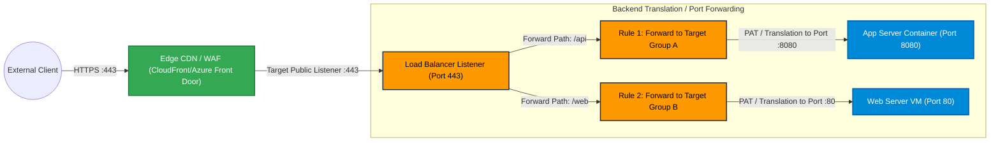
```mermaid
graph LR
    classDef edge fill:#34A853,stroke:#188038,stroke-width:2px,color:#fff;
    classDef lb fill:#FF9900,stroke:#232F3E,stroke-width:2px,color:#000;
    classDef target fill:#0089D6,stroke:#005BA1,stroke-width:2px,color:#fff;

    Client(("External Client")) -->|HTTPS :443| Edge["Edge CDN / WAF (CloudFront/Azure Front Door)"]:::edge
    Edge -->|Target Public Listener :443| LB["Load Balancer Listener (Port 443)"]:::lb

    subgraph Internal_Routing ["Backend Translation / Port Forwarding"]
        LB -->|Forward Path: /api| Rule1["Rule 1: Forward to Target Group A"]:::lb
        LB -->|Forward Path: /web| Rule2["Rule 2: Forward to Target Group B"]:::lb

        Rule1 -->|PAT / Translation to Port :8080| AppServer["App Server Container (Port 8080)"]:::target
        Rule2 -->|PAT / Translation to Port :80| WebServer["Web Server VM (Port 80)"]:::target
    end
```

**What it is.** The three mechanisms that get a client request from the public internet onto the
right port of the right container:

* **Edge networks** place traffic ingestion close to the end user at globally distributed Points of Presence (PoPs), running WAF protection, TLS negotiation, DDoS absorption and caching before the request ever reaches your region.
* **Listeners** are the processes on a gateway or load balancer that watch for connection requests on a given protocol and port (`HTTPS:443`).
* **Port forwarding / PAT** maps public traffic arriving on one port to a completely different internal port — public `:443` → container `:8080`.

**How each cloud does it.**

| | AWS | Azure | GCP |
| --- | --- | --- | --- |
| CDN / edge | **CloudFront** | **Azure Front Door** / Azure CDN | **Cloud CDN** |
| WAF | AWS WAF (`wafv2`) | Azure WAF (on Front Door or App Gateway) | **Cloud Armor** |
| DDoS | Shield / Shield Advanced | DDoS Protection Standard | Cloud Armor Adaptive Protection |
| Listener object | **Listener** + Rules | **Listener** + Routing rules | **Forwarding Rule** + **URL Map** |
| Backend port mapping | Target Group port | Backend Pool + HTTP settings | Backend Service named port |
| Origin protection | Origin Access Control + custom header | Front Door ID header + Private Link origin | Cloud Armor rule on LB |

**Real-world use.** A global retailer during a flash sale. CloudFront absorbs the traffic spike at
the edge — static assets never reach the origin at all; AWS WAF blocks a credential-stuffing
botnet by rate-limiting on a per-IP basis; the remaining dynamic requests hit the ALB listener on
`:443`, which routes `/api` to the checkout service on `:8080` and `/web` to the storefront on `:80`.
The critical detail: the ALB's security group allows **only** the CloudFront managed prefix list, so
an attacker who discovers the ALB's DNS name cannot bypass the WAF by hitting it directly.

**Policies & roles.**

| Action | AWS | Azure | GCP |
| --- | --- | --- | --- |
| Manage CDN | `cloudfront:CreateDistribution`, `:UpdateDistribution` | `Microsoft.Cdn/profiles/write`, `.../afdEndpoints/write` | `compute.backendServices.update` (`enableCDN`) |
| **Manage WAF rules** | `wafv2:CreateWebACL`, `wafv2:UpdateWebACL` | `.../ApplicationGatewayWebApplicationFirewallPolicies/write` | `compute.securityPolicies.create` / `.update` |
| Associate WAF to LB | `wafv2:AssociateWebACL` | `.../applicationGateways/write` | `compute.backendServices.setSecurityPolicy` |
| Manage listeners | `elasticloadbalancing:CreateListener`, `:ModifyListener` | `.../applicationGateways/write` | `compute.forwardingRules.create`, `compute.urlMaps.update` |
| Certificates | `acm:RequestCertificate` (**`us-east-1` for CloudFront**) | Key Vault via managed identity | `compute.sslCertificates.create` |
| Read logs | `logs:FilterLogEvents`, Athena on S3 | `Log Analytics Reader` | `roles/logging.viewer` |

**Guardrails worth enforcing:**

* **`wafv2:UpdateWebACL` / `compute.securityPolicies.update` is a production-security permission,** not a networking convenience. Someone who can flip a WAF rule from `BLOCK` to `COUNT` has silently disabled your perimeter. Restrict it to SecOps, require change tickets, and alert on every rule-action change.
* **Enforce origin protection.** Deny the LB's security group from accepting `0.0.0.0/0` — allow only the CDN's managed prefix list (AWS), Front Door service tag + `X-Azure-FDID` header check (Azure), or a Cloud Armor rule (GCP). Otherwise the WAF is optional from an attacker's point of view.
* **Azure Policy** — *"Azure Front Door profiles should have WAF enabled"*, *"Web Application Firewall should be enabled for Application Gateway"*, both Deny.
* Require TLS 1.2+ minimum and deny plaintext `:80` listeners except a redirect-to-HTTPS rule.

**Gotchas.** ACM certificates for CloudFront **must** be issued in `us-east-1` regardless of where
the origin lives. A WAF in `COUNT` mode logs but does not block — verify the mode, not just its
presence. Caching a response that contains a `Set-Cookie` or personalised body at the edge leaks one
user's data to the next; set cache keys and `Cache-Control` deliberately.

---

## 4. Governance: Agentic IaC & Policy-as-Code Delivery

### C16 — How the network actually gets built

Everything above describes *what* to build. This describes *how it gets built without drift* — an AI
agent drafts the Terraform, a policy and cost engine gates it, and a human approves before apply.


**The five actors** (swimlanes): Engineer · AI Agent · Policy & Cost Engine · Git/PR System · Cloud.

| Step | Stage | Owner | What happens |
| --- | --- | --- | --- |
| 01 | **Understand intent** | Engineer | "Add a private AKS cluster with egress through the hub firewall" |
| 02 | **Retrieve guardrails & standards** | Policy & Cost Engine | CIDR plan, naming, approved SKUs, mandatory tags, region allow-list |
| 03 | **Plan & generate Terraform** | AI Agent | Drafts modules against the retrieved standards, not from memory |
| 04 | **Validate & policy check** | Policy & Cost Engine | `terraform validate`, `tflint`, OPA/Sentinel/Checkov against the guardrails in this guide |
| 05 | **Cost estimate** | Policy & Cost Engine | Infracost diff — NAT Gateways, TGW attachments, and firewall data processing are the usual surprises |
| — | **Cost policy gate** | Policy & Cost Engine | The decision point |
| 06 | **PR & Git review** | Git/PR System | Plan output and cost diff posted as PR comments |
| 07 | **Human approval** | Engineer | Explicit sign-off before any mutation |
| — | `terraform apply` | Cloud | Executed by the pipeline identity, never a human credential |
| 08 | **Observe spending & health** | Cloud | Actuals and drift feed back into step 02 |

**The gate has two outcomes**, and the loop is what matters:

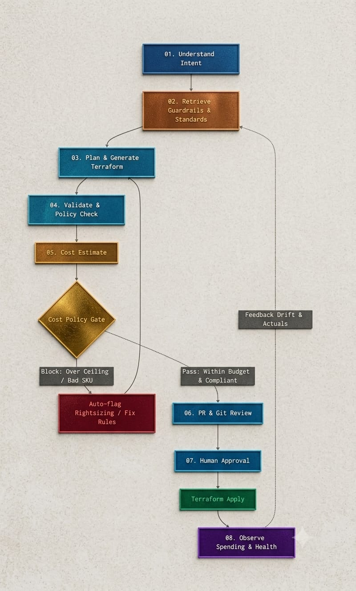

* **Block** — over the cost ceiling, or a disallowed SKU → **auto-flag rightsizing / fix rules** → back to step 03. The agent revises; no human is interrupted.
* **Pass** — within budget and compliant → PR review → human approval → apply → observe.
* **Feedback** — observed drift and actual spend flow back into the guardrails, so step 02 gets better each cycle.

**Why this belongs in a networking guide.** Nearly every guardrail named in C1–C15 is only real if it
is enforced at step 04:

| Guardrail from this guide | Enforced as |
| --- | --- |
| No `0.0.0.0/0` on `:22`/`:3389` ([C4](#c4--security-groups--nsg-nic-level-stateful-firewall)) | OPA/Sentinel policy on the plan + SCP as backstop |
| No route to IGW from a private subnet ([C3](#c3--route-tables--user-defined-routes-udr)) | Checkov rule + Azure Policy Deny |
| Every subnet has an NSG ([C2](#c2--subnets--network-tiering)) | Azure Policy built-in, Deny effect |
| PaaS reachable only via Private Endpoint ([C7](#c7--private-service-access--delegated-subnets)) | Azure Policy / GCP Org Policy |
| WAF in `BLOCK`, not `COUNT` ([C15](#c15--edge-networking-listeners--port-forwarding)) | Policy check on the plan + alert on drift |
| One NAT Gateway per AZ ([C9](#c9--nat-gateway-vs-nat-instance)) | Module design + cost gate |

**Policies & roles for the pipeline itself.**

| Concern | AWS | Azure | GCP |
| --- | --- | --- | --- |
| Pipeline identity | **OIDC federation** to an IAM role — no long-lived keys | **Workload identity federation** to a service principal | **Workload Identity Federation** to a service account |
| State backend | S3 + DynamoDB lock, SSE-KMS, versioned | Storage Account + blob lease, RBAC-restricted | GCS bucket, versioned, CMEK |
| Least privilege | Separate `plan` (read-only) and `apply` roles | Separate service principals per environment | Separate service accounts per environment |
| Org backstop | **SCP** — the pipeline role cannot exceed it | **Azure Policy** at management-group scope | **Org Policy** constraints |
| Human break-glass | Time-boxed, MFA, alerted on assume | PIM eligible role with approval | Short-lived privileged access + audit |

> **The pipeline identity is the most privileged identity in your cloud.** It can create routes,
> firewall rules, and peerings. Federate it (no static keys), scope it per environment, give the
> `plan` stage read-only credentials, and make sure your SCPs/Azure Policies bind it too — a
> guardrail the pipeline can edit is not a guardrail.

---

## Appendix A — Debugging Order

When traffic does not arrive, walk the hops in order rather than guessing. This mirrors the
[end-to-end path](#the-provider-neutral-request-path):

| # | Check | Command / place to look |
| --- | --- | --- |
| 1 | Does DNS resolve, and to the right IP? | `nslookup` **from inside the subnet** — private endpoints must return RFC1918 |
| 2 | Is the LB healthy? | Target group / backend pool health, not just the LB's own status |
| 3 | Does a route exist to the destination? | Route table / effective routes (Azure: *Effective routes* on the NIC) |
| 4 | Is a NACL / perimeter firewall dropping it? | Firewall logs, NACL rule order, **ephemeral return ports** |
| 5 | Is the SG / NSG allowing it? | Azure: **both** subnet NSG and NIC NSG; AWS: SG on the ENI |
| 6 | Is the app listening on that port? | `ss -lntp` on the host |
| 7 | Is return traffic symmetric? | Asymmetric routing silently breaks stateful inspection |

The same seven hops rendered as a decision tree, with the fix for each branch, is in
[`ARCHITECTURE-EXPLAINED.md` §A](ARCHITECTURE-EXPLAINED.md#a--debugging-order-as-a-decision-tree).

**Built-in tools:** AWS **VPC Reachability Analyzer** · Azure **Network Watcher** (Connection
Troubleshoot, Effective Security Rules, Effective Routes) · GCP **Connectivity Tests**. All three
answer "why can't A reach B" from the control plane without touching the hosts.

---

## Appendix B — Guardrail Checklist

The high-value controls from this guide in one place. If you implement nothing else, implement these:

| # | Control | Concept | AWS | Azure | GCP |
| --- | --- | --- | --- | --- | --- |
| 1 | No `0.0.0.0/0` on management ports | [C4](#c4--security-groups--nsg-nic-level-stateful-firewall) | SCP on `AuthorizeSecurityGroupIngress` | Policy: *RDP/SSH from Internet blocked* | Firewall policy at org node |
| 2 | No public IPs on workloads | [C8](#c8--internet-gateway-igw) | SCP on `AttachInternetGateway` | Policy: *NICs should not have public IPs* | `compute.vmExternalIpAccess` |
| 3 | Route changes are break-glass + alerted | [C3](#c3--route-tables--user-defined-routes-udr) | SCP on `CreateRoute` | Deny `routeTables/write` | Restrict `compute.routes.create` |
| 4 | All egress inspected | [C6](#c6--centralised-egress-inspection) | Route to GWLB/TGW | Policy: *route Internet via Azure Firewall* | Custom route `next-hop-ilb` |
| 5 | Every subnet has a firewall attached | [C2](#c2--subnets--network-tiering) | NACL + SG baseline via Firewall Manager | Policy: *Subnets should have an NSG* | Hierarchical firewall policy |
| 6 | PaaS private-only | [C7](#c7--private-service-access--delegated-subnets) | Endpoint policy + `aws:SourceVpce` | Deny `publicNetworkAccess=Enabled` | `storage.publicAccessPrevention` |
| 7 | Peering only within the org | [C10](#c10--vpc--vnet-peering) | SCP with `aws:PrincipalOrgID` | Audit peering flags | `compute.restrictVpcPeering` |
| 8 | Flow logs on, in a locked account | all | VPC Flow Logs → central S3 | NSG/VNet Flow Logs → central LA | VPC Flow Logs → central project |
| 9 | Firewall/WAF rule edits split from route edits | [C6](#c6--centralised-egress-inspection), [C15](#c15--edge-networking-listeners--port-forwarding) | Two IAM roles | Two custom RBAC roles | `securityAdmin` vs `networkAdmin` |
| 10 | Pipeline identity federated, no static keys | [C16](#c16--how-the-network-actually-gets-built) | OIDC → IAM role | Workload identity federation | Workload Identity Federation |

---

## Appendix C — Diagram Index

Every diagram lives in [`100DaysofNW/`](100DaysofNW/). Some also have a `-screenshot`
variant of the same content captured from the diagram editor.

| Diagram | Concept |
| --- | --- |
| `traffic-path-end-to-end.jpeg` | [End-to-end request path](#the-provider-neutral-request-path) |
| `vpc-scope-comparison.jpeg` | [C1 — VPC / VNet](#c1--vpc--vnet-the-network-boundary) |
| `subnet-tiers-routing.jpeg` | [C2 — Subnets & tiering](#c2--subnets--network-tiering) |
| `route-table-udr-decision.jpeg` | [C3 — Route tables & UDR](#c3--route-tables--user-defined-routes-udr) |
| `sg-nsg-stateful-eval.jpeg` | [C4 — Security Groups / NSG](#c4--security-groups--nsg-nic-level-stateful-firewall) |
| `layered-defense-nacl-fw-sg.jpeg` | [C5 — NACLs & layered defence](#c5--nacls--layered-perimeter-defence) |
| `central-firewall-inspection.jpeg` | [C6 — Centralised egress inspection](#c6--centralised-egress-inspection) |
| `azure-private-db-path.jpeg` | [C7 — Private service access](#c7--private-service-access--delegated-subnets) |
| `lb-l7-vs-l4.jpeg` | [C12 — L7 vs L4](#c12--load-balancers-l7-vs-l4) |
| `lb-algo-1-round-robin.jpeg` … `lb-algo-6-resource-based.jpeg` | [C13 — LB algorithms](#c13--load-balancing-algorithms) |
| `agentic-terraform-workflow.jpeg`, `agentic-terraform-flow-plain.jpeg` | [C16 — Agentic IaC delivery](#c16--how-the-network-actually-gets-built) |

---

## Appendix D — Production EKS Reference Architecture

Everything in C1-C15 assembled into one cluster. Walk-through, failure modes, and fixes:
[`ARCHITECTURE-EXPLAINED.md` §K1](ARCHITECTURE-EXPLAINED.md#k1--production-eks-reference-architecture).

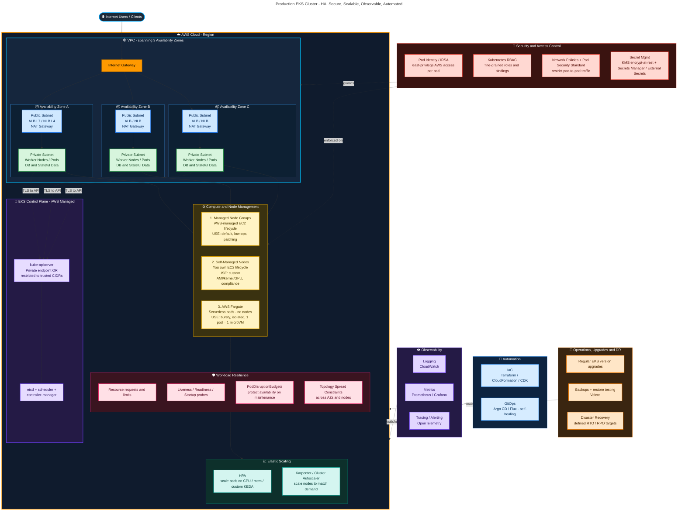
```mermaid
---
title: Production EKS Cluster - HA, Secure, Scalable, Observable, Automated
---
flowchart TB
    Users(["🌐 Internet Users / Clients"]):::internet

    %% ================= AWS CLOUD =================
    subgraph AWS["☁️ AWS Cloud - Region"]
        direction TB

        subgraph CP["🧠 EKS Control Plane - AWS Managed"]
            direction LR
            APISERVER["kube-apiserver<br/>Private endpoint OR<br/>restricted to trusted CIDRs"]:::eks
            ETCD["etcd + scheduler +<br/>controller-manager"]:::eks
        end

        subgraph VPC["🕸️ VPC - spanning 3 Availability Zones"]
            direction TB
            IGW["Internet Gateway"]:::edge

            subgraph AZA["📦 Availability Zone A"]
                direction TB
                PUBA["Public Subnet<br/>ALB L7 / NLB L4<br/>NAT Gateway"]:::public
                PRVA["Private Subnet<br/>Worker Nodes / Pods<br/>DB and Stateful Data"]:::private
                PUBA --> PRVA
            end

            subgraph AZB["📦 Availability Zone B"]
                direction TB
                PUBB["Public Subnet<br/>ALB / NLB<br/>NAT Gateway"]:::public
                PRVB["Private Subnet<br/>Worker Nodes / Pods<br/>DB and Stateful Data"]:::private
                PUBB --> PRVB
            end

            subgraph AZC["📦 Availability Zone C"]
                direction TB
                PUBC["Public Subnet<br/>ALB / NLB<br/>NAT Gateway"]:::public
                PRVC["Private Subnet<br/>Worker Nodes / Pods<br/>DB and Stateful Data"]:::private
                PUBC --> PRVC
            end
        end

        %% ============ COMPUTE / NODE MGMT ============
        subgraph COMPUTE["⚙️ Compute and Node Management"]
            direction LR
            MNG["1. Managed Node Groups<br/>AWS-managed EC2 lifecycle<br/>USE: default, low-ops, patching"]:::compute
            SELF["2. Self-Managed Nodes<br/>You own EC2 lifecycle<br/>USE: custom AMI/kernel/GPU, compliance"]:::compute
            FARGATE["3. AWS Fargate<br/>Serverless pods - no nodes<br/>USE: bursty, isolated, 1 pod = 1 microVM"]:::compute
        end

        %% ============ WORKLOAD RESILIENCE ============
        subgraph RESIL["🛡️ Workload Resilience"]
            direction TB
            REQLIM["Resource requests and limits"]:::resil
            PROBES["Liveness / Readiness / Startup probes"]:::resil
            PDB["PodDisruptionBudgets<br/>protect availability on maintenance"]:::resil
            SPREAD["Topology Spread Constraints<br/>across AZs and nodes"]:::resil
        end

        %% ============ ELASTIC SCALING ============
        subgraph SCALE["📈 Elastic Scaling"]
            direction TB
            HPA["HPA<br/>scale pods on CPU / mem / custom KEDA"]:::scale
            KARP["Karpenter / Cluster Autoscaler<br/>scale nodes to match demand"]:::scale
        end
    end

    %% ================= SECURITY (cross-cutting) =================
    subgraph SEC["🔐 Security and Access Control"]
        direction TB
        IRSA["Pod Identity / IRSA<br/>least-privilege AWS access per pod"]:::sec
        RBAC["Kubernetes RBAC<br/>fine-grained roles and bindings"]:::sec
        NETPOL["Network Policies + Pod Security Standard<br/>restrict pod-to-pod traffic"]:::sec
        SECRETS["Secret Mgmt<br/>KMS encrypt-at-rest + Secrets Manager / External Secrets"]:::sec
    end

    %% ================= OBSERVABILITY =================
    subgraph OBS["👁️ Observability"]
        direction LR
        LOGS["Logging<br/>CloudWatch"]:::obs
        METRICS["Metrics<br/>Prometheus / Grafana"]:::obs
        TRACE["Tracing / Alerting<br/>OpenTelemetry"]:::obs
    end

    %% ================= AUTOMATION =================
    subgraph AUTO["🤖 Automation"]
        direction LR
        IAC["IaC<br/>Terraform / CloudFormation / CDK"]:::auto
        GITOPS["GitOps<br/>Argo CD / Flux - self-healing"]:::auto
    end

    %% ================= OPERATIONS / DR =================
    subgraph OPS["🔄 Operations, Upgrades and DR"]
        direction LR
        UPG["Regular EKS version upgrades"]:::dr
        BACKUP["Backups + restore testing<br/>Velero"]:::dr
        DR["Disaster Recovery<br/>defined RTO / RPO targets"]:::dr
    end

    %% ================= EDGES =================
    Users --> IGW
    IGW --> PUBA & PUBB & PUBC

    PRVA -. "TLS to API" .-> APISERVER
    PRVB -. "TLS to API" .-> APISERVER
    PRVC -. "TLS to API" .-> APISERVER
    APISERVER --- ETCD

    PRVA --- COMPUTE
    PRVB --- COMPUTE
    PRVC --- COMPUTE

    COMPUTE --> RESIL
    RESIL --> SCALE

    SEC -.->|guards| VPC
    SEC -.->|enforced on| COMPUTE
    OBS -.->|watches| AWS
    AUTO -->|provisions and syncs| AWS
    OPS -.->|maintains| AWS

    %% ================= STYLES =================
    classDef internet fill:#1d2b3a,stroke:#0af,stroke-width:2px,color:#fff
    classDef edge fill:#ff9900,stroke:#b36b00,stroke-width:2px,color:#000
    classDef public fill:#cfe8ff,stroke:#1a73e8,stroke-width:2px,color:#062a5a
    classDef private fill:#d7f5dd,stroke:#1e8e3e,stroke-width:2px,color:#0b3d1a
    classDef eks fill:#e7dcff,stroke:#6b3ff2,stroke-width:2px,color:#2a1560
    classDef compute fill:#fff3c4,stroke:#e6a700,stroke-width:2px,color:#4a3800
    classDef resil fill:#ffe0e6,stroke:#e91e63,stroke-width:2px,color:#5a0d24
    classDef scale fill:#d4f5f0,stroke:#009688,stroke-width:2px,color:#053b35
    classDef sec fill:#ffd8d2,stroke:#d93025,stroke-width:2px,color:#5a120c
    classDef obs fill:#e2d6ff,stroke:#7c4dff,stroke-width:2px,color:#2c1466
    classDef auto fill:#d6ecff,stroke:#0b74de,stroke-width:2px,color:#062f5a
    classDef dr fill:#ffe6c7,stroke:#f57c00,stroke-width:2px,color:#4a2600

    style AWS fill:#0f1b2d,stroke:#ff9900,stroke-width:3px,color:#fff
    style VPC fill:#15263d,stroke:#00c2ff,stroke-width:2px,color:#fff
    style CP fill:#241a45,stroke:#6b3ff2,stroke-width:2px,color:#fff
    style AZA fill:#0d2033,stroke:#3ea6ff,color:#fff
    style AZB fill:#0d2033,stroke:#3ea6ff,color:#fff
    style AZC fill:#0d2033,stroke:#3ea6ff,color:#fff
    style COMPUTE fill:#3a3210,stroke:#e6a700,color:#fff
    style RESIL fill:#3a1420,stroke:#e91e63,color:#fff
    style SCALE fill:#0d302b,stroke:#009688,color:#fff
    style SEC fill:#3a1310,stroke:#d93025,color:#fff
    style OBS fill:#241a45,stroke:#7c4dff,color:#fff
    style AUTO fill:#0d2440,stroke:#0b74de,color:#fff
    style OPS fill:#3a2510,stroke:#f57c00,color:#fff
```

---

# Zero-Downtime Kubernetes Upgrade Runbook
### AWS EKS · Azure AKS · Red Hat OpenShift on OCI

> Interview-ready reference. Same story, three platforms. The pattern the original EKS post describes (pre-check → one minor at a time → control plane first → roll the nodes gradually → validate before deleting anything) is universal. Only the tooling and the "node replacement" primitive change.

---

## 0. The one principle that actually delivers zero downtime

The upgrade mechanics **do not** give you zero downtime. The **application design** does. Say this in an interview and you separate yourself from people reciting commands:

> "Zero downtime wasn't achieved because I upgraded carefully. It was possible because the workloads were already HA — multiple replicas, PodDisruptionBudgets, readiness probes, Multi-AZ spread, and controlled node draining. The upgrade procedure just avoided *breaking* that guarantee."

The five things that must be true on **every** platform before you touch the control plane:

| Requirement | Why it matters during a node drain |
|---|---|
| `replicas >= 2` (ideally spread across zones) | A drained node can't take the last replica down |
| **PodDisruptionBudget** (`minAvailable` / `maxUnavailable`) | Drain *blocks* rather than evicting below the budget |
| **Readiness probes** | New pods only get traffic once truly ready; no 5xx during reschedule |
| **Topology spread / Multi-AZ** | One zone/node cycling never removes all capacity |
| **Graceful termination** (`preStop`, `terminationGracePeriodSeconds`) | In-flight requests finish before the pod dies |

---

## 1. Terminology & primitive mapping (memorize this table)

| Concept | AWS EKS | Azure AKS | OpenShift on OCI |
|---|---|---|---|
| Managed control plane | EKS control plane (AWS-managed) | AKS control plane (Azure-managed) | Control plane MachineConfigPool `master` (self-managed on OCI) |
| Upgrade orchestrator | You / eksctl / API | You / `az aks` / channels | **Cluster Version Operator (CVO)** |
| Version skew rule | One minor at a time (n+1) | One minor at a time (non-LTS); LTS can skip | One minor at a time; **EUS→EUS** lets workers reboot once across two minors |
| Cluster add-ons | EKS add-ons (VPC CNI, CoreDNS, kube-proxy) | AKS managed add-ons | **Operators via OLM** + core operators |
| Worker group | Managed Node Group (MNG) | Node Pool | **MachineConfigPool (MCP)** + MachineSet |
| Node image | EKS-optimized AMI | AKS node image (Ubuntu / AzureLinux3) | RHCOS boot image |
| Roll-the-nodes primitive | New MNG + cordon/drain (blue-green) OR MNG version bump | Node pool **max-surge** rolling OR blue-green pool | MCO reconcile, gated by **`maxUnavailable`** (default 1) |
| Drain gate | PDB honored by `kubectl drain` | PDB + `drain-timeout` | PDB honored by MCO |
| Version scheme | k8s 1.3x | k8s 1.3x | OCP 4.x (maps to a k8s minor, e.g. 4.16 ≈ 1.29) |

---

## 2. AWS EKS — 1.32 → 1.34 (the reference flow)

### Runbook

**Step 1 — Pre-checks (never skip)**
```bash
# EKS Upgrade Insights (built-in readiness checks)
aws eks list-insights --cluster-name prod-cluster
aws eks describe-insight --cluster-name prod-cluster --id <insight-id>

# Deprecated / removed API usage in the cluster
kubectl get apirequestcount 2>/dev/null            # if metrics available
# or scan manifests / use pluto / kubent
kubent                                              # kube-no-trouble: flags deprecated APIs

# Add-on + core component versions
kubectl get pods -n kube-system                     # vpc-cni, coredns, kube-proxy
kubectl get pdb -A                                  # PodDisruptionBudgets exist?
kubectl get deploy -A -o wide                       # replica counts
```
Check: Upgrade Insights, deprecated APIs, Helm/app compatibility, VPC CNI / CoreDNS / kube-proxy, AWS Load Balancer Controller, PDBs & replicas, monitoring stack. **Then run the whole thing in a lower environment first.**

**Step 2 — Control plane, one minor at a time**
```bash
# 1.32 -> 1.33 (control plane only)
aws eks update-cluster-version --name prod-cluster --kubernetes-version 1.33
aws eks describe-update --name prod-cluster --update-id <id>   # wait Successful

# Validate, then bump the managed add-ons to versions compatible with 1.33
aws eks update-addon --cluster-name prod-cluster --addon-name vpc-cni     --addon-version <v>
aws eks update-addon --cluster-name prod-cluster --addon-name coredns     --addon-version <v>
aws eks update-addon --cluster-name prod-cluster --addon-name kube-proxy  --addon-version <v>
```

**Step 3 — Replace worker nodes (blue-green node group)**
```bash
# Create a NEW managed node group on an EKS-optimized AMI for 1.33 (don't terminate the old one)
eksctl create nodegroup -f nodegroup-1.33.yaml
kubectl get nodes -L eks.amazonaws.com/nodegroup   # confirm new nodes Ready

# Shift workloads gradually — one node at a time
kubectl cordon <old-node>
kubectl drain  <old-node> --ignore-daemonsets --delete-emptydir-data --timeout=300s
# repeat per node; PDBs make drain wait instead of breaking availability
```

**Step 4 — How downtime is avoided:** multiple replicas + PDBs + readiness probes + Multi-AZ. While one node drains, healthy pods on other nodes keep serving.

**Step 5 — Monitor throughout:** CloudWatch + Prometheus/Grafana — node health, pod restarts, pending pods, CPU/mem, ALB target health, application latency, 5xx.

**Step 6 — Validate before removing anything:** smoke test critical flow (login → account info → API → transaction). Only then delete the old node group. **Repeat the whole cycle 1.33 → 1.34.**

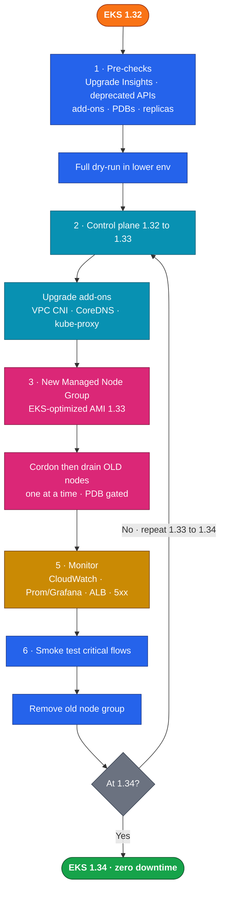
```mermaid
flowchart TD
    S(["EKS 1.32"]) --> PC["1 · Pre-checks<br/>Upgrade Insights · deprecated APIs<br/>add-ons · PDBs · replicas"]
    PC --> LE["Full dry-run in lower env"]
    LE --> CP["2 · Control plane 1.32 to 1.33"]
    CP --> AD["Upgrade add-ons<br/>VPC CNI · CoreDNS · kube-proxy"]
    AD --> NG["3 · New Managed Node Group<br/>EKS-optimized AMI 1.33"]
    NG --> DR["Cordon then drain OLD nodes<br/>one at a time · PDB gated"]
    DR --> MO["5 · Monitor<br/>CloudWatch · Prom/Grafana · ALB · 5xx"]
    MO --> VA["6 · Smoke test critical flows"]
    VA --> RM["Remove old node group"]
    RM --> LOOP{"At 1.34?"}
    LOOP -- "No · repeat 1.33 to 1.34" --> CP
    LOOP -- "Yes" --> D(["EKS 1.34 · zero downtime"])

    classDef start fill:#f97316,stroke:#9a3412,color:#fff,font-weight:bold
    classDef check fill:#2563eb,stroke:#1e3a8a,color:#fff
    classDef ctl fill:#0891b2,stroke:#155e75,color:#fff
    classDef node fill:#db2777,stroke:#831843,color:#fff
    classDef mon fill:#ca8a04,stroke:#713f12,color:#fff
    classDef gate fill:#6b7280,stroke:#374151,color:#fff
    classDef done fill:#16a34a,stroke:#14532d,color:#fff,font-weight:bold
    class S start
    class PC,LE,VA check
    class CP,AD ctl
    class NG,DR node
    class MO mon
    class LOOP gate
    class RM check
    class D done
```

---

## 3. Azure AKS — 1.32 → 1.34

**Key differences from EKS:** AKS also forbids skipping minor versions on non-LTS clusters (LTS clusters can skip). AKS gives you a native **rolling upgrade with `max-surge`** so you often don't build a blue-green pool by hand — AKS spins up surge nodes, cordons+drains old ones (honoring PDBs), then removes them.

**Step 1 — Pre-checks**
```bash
az aks get-upgrades -g myRG -n myAKS -o table          # allowed upgrade paths
az aks get-versions --location eastus -o table         # available versions
kubectl get pdb -A
kubectl get deploy -A -o wide                          # replica counts
kubent                                                  # deprecated APIs
```
> AKS will **block** the upgrade if it detects in-use deprecated APIs (deprecated-API check), which is a safety net EKS doesn't enforce as hard.

**Step 2 — Control plane first (validate API compat before nodes)**
```bash
az aks upgrade -g myRG -n myAKS --kubernetes-version 1.33 --control-plane-only
```

**Step 3 — Node pools — pick a strategy**

*Option A — in-place rolling with surge (most common):*
```bash
# Set surge once; persists for future upgrades. 33% = one-third roll in parallel, rest serve traffic.
az aks nodepool update -g myRG --cluster-name myAKS -n systempool \
  --max-surge 33% --drain-timeout 30 --node-soak-duration 5

az aks nodepool upgrade -g myRG --cluster-name myAKS -n systempool \
  --kubernetes-version 1.33
```
`max-surge 1` = safest/slowest (default). `max-surge 100%` = fastest, doubles cost. Subnet must have IPs for `(nodes + maxSurge) * (1 + maxPods)`.

*Option B — blue-green node pool (max control / risky workloads):* create a new pool on 1.33, cordon+drain the old pool node-by-node, delete old pool after validation — identical to the EKS approach.

**Step 4 — Downtime avoidance:** same five HA guarantees. `--drain-timeout` + PDBs ensure long-running pods finish; surge nodes mean capacity never dips.

**Step 5 — Monitor:** Azure Monitor / Container Insights + **Azure Managed Prometheus & Grafana** — node readiness, pod restarts, pending pods, CPU/mem, App Gateway/Load Balancer backend health, latency, 5xx.

**Step 6 — Validate, then repeat 1.33 → 1.34.**

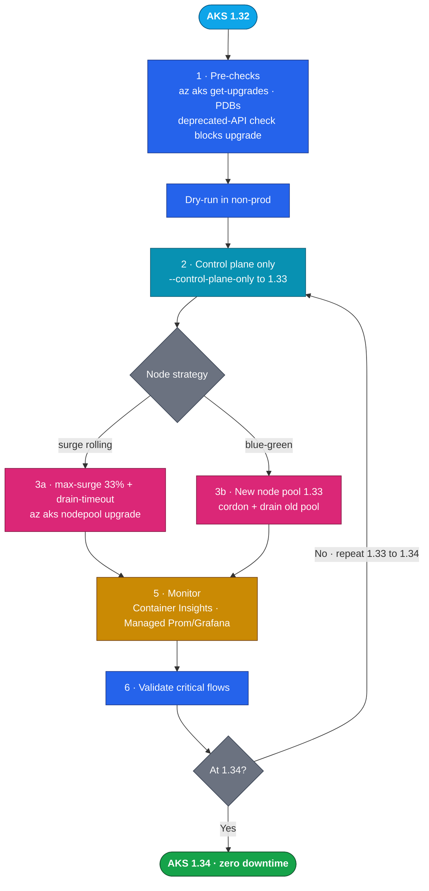
```mermaid
flowchart TD
    S(["AKS 1.32"]) --> PC["1 · Pre-checks<br/>az aks get-upgrades · PDBs<br/>deprecated-API check blocks upgrade"]
    PC --> LE["Dry-run in non-prod"]
    LE --> CP["2 · Control plane only<br/>--control-plane-only to 1.33"]
    CP --> ST{"Node strategy"}
    ST -- "surge rolling" --> SU["3a · max-surge 33% + drain-timeout<br/>az aks nodepool upgrade"]
    ST -- "blue-green" --> BG["3b · New node pool 1.33<br/>cordon + drain old pool"]
    SU --> MO["5 · Monitor<br/>Container Insights · Managed Prom/Grafana"]
    BG --> MO
    MO --> VA["6 · Validate critical flows"]
    VA --> LOOP{"At 1.34?"}
    LOOP -- "No · repeat 1.33 to 1.34" --> CP
    LOOP -- "Yes" --> D(["AKS 1.34 · zero downtime"])

    classDef start fill:#0ea5e9,stroke:#075985,color:#fff,font-weight:bold
    classDef check fill:#2563eb,stroke:#1e3a8a,color:#fff
    classDef ctl fill:#0891b2,stroke:#155e75,color:#fff
    classDef node fill:#db2777,stroke:#831843,color:#fff
    classDef mon fill:#ca8a04,stroke:#713f12,color:#fff
    classDef gate fill:#6b7280,stroke:#374151,color:#fff
    classDef done fill:#16a34a,stroke:#14532d,color:#fff,font-weight:bold
    class S start
    class PC,LE,VA check
    class CP ctl
    class SU,BG node
    class MO mon
    class ST,LOOP gate
    class D done
```

---

## 4. Red Hat OpenShift on OCI — e.g. 4.14 → 4.16 (≈ k8s 1.27 → 1.29)

**This is the most different one.** OpenShift is **operator-driven**: you don't roll nodes by hand. The **Cluster Version Operator (CVO)** upgrades all cluster components; the **Machine Config Operator (MCO)** then reconciles nodes per MachineConfigPool, draining/cordoning up to `maxUnavailable` (default **1**) and rebooting each into new RHCOS. On OCI the workers are OCI compute instances backed by MachineSets, but the upgrade flow is pure OpenShift.

**Step 1 — Pre-checks**
```bash
oc get clusterversion                                  # current version + channel
oc adm upgrade                                         # available targets in channel
oc get co                                              # all ClusterOperators Available/not Degraded
oc get mcp                                             # MachineConfigPools healthy, Updated=True
oc get pdb -A
oc get nodes                                           # all Ready
```
Also: review release notes, and **update OLM Operators** to versions compatible with the target — layered/OLM operators are your "add-ons" and can block or break an upgrade. Update the `oc` client to the target version each hop.

**Step 2 — Set channel & upgrade the control plane (CVO)**
```bash
# Pick channel: stable-<ver> (safest) / fast-<ver> / eus-<ver>
oc adm upgrade channel stable-4.15
oc adm upgrade --to-latest=true            # or --to=4.15.x
# CVO reconciles operators; this phase does NOT reboot nodes (~60-120 min)
watch oc get clusterversion
```

**Step 3 — Worker rollout via MachineConfigPools (this is your "node replacement")**
```bash
# MCO drains+cordons up to maxUnavailable nodes at a time, reboots into new RHCOS.
oc get mcp worker -o jsonpath='{.spec.maxUnavailable}'   # default 1

# Canary / control the blast radius: pause worker pool, verify masters, then unpause
oc patch mcp/worker --type merge -p '{"spec":{"paused":true}}'
# ...control plane completes, validate...
oc patch mcp/worker --type merge -p '{"spec":{"paused":false}}'  # workers roll
watch oc get mcp
```
> **EUS→EUS shortcut** (4.14 → 4.16 in one worker-reboot pass): move to the `eus-4.16` channel, **pause** all non-master MCPs, hop control plane 4.14→4.15→4.16, then **unpause** — workers reboot **once** instead of twice. Huge win for large fleets.

**Step 4 — Downtime avoidance:** MCO honors **PodDisruptionBudgets** during drain, `maxUnavailable=1` means only one worker is ever out, and CVO updates control-plane components in a rolling fashion. Same HA app requirements apply.

**Step 5 — Monitor:** built-in **Prometheus + Grafana / OpenShift Console → Observe**, plus `oc get co`, `oc get mcp`, node conditions, pending pods, route/ingress health, app latency & 5xx.

**Step 6 — Validate before unpausing further pools / declaring done:** smoke test critical routes, `oc get co` all green, then complete remaining pools.

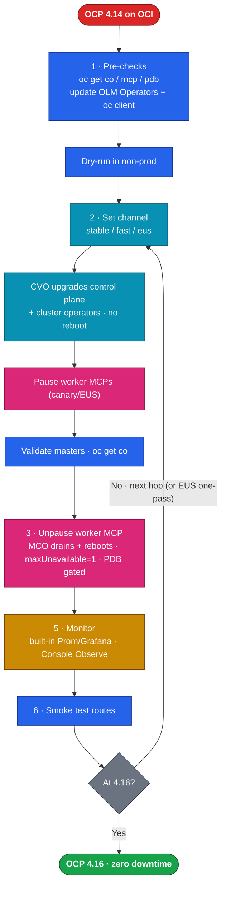
```mermaid
flowchart TD
    S(["OCP 4.14 on OCI"]) --> PC["1 · Pre-checks<br/>oc get co / mcp / pdb<br/>update OLM Operators + oc client"]
    PC --> LE["Dry-run in non-prod"]
    LE --> CH["2 · Set channel<br/>stable / fast / eus"]
    CH --> CVO["CVO upgrades control plane<br/>+ cluster operators · no reboot"]
    CVO --> PAUSE["Pause worker MCPs (canary/EUS)"]
    PAUSE --> VAL1["Validate masters · oc get co"]
    VAL1 --> UNP["3 · Unpause worker MCP<br/>MCO drains + reboots · maxUnavailable=1 · PDB gated"]
    UNP --> MO["5 · Monitor<br/>built-in Prom/Grafana · Console Observe"]
    MO --> VA["6 · Smoke test routes"]
    VA --> LOOP{"At 4.16?"}
    LOOP -- "No · next hop (or EUS one-pass)" --> CH
    LOOP -- "Yes" --> D(["OCP 4.16 · zero downtime"])

    classDef start fill:#dc2626,stroke:#7f1d1d,color:#fff,font-weight:bold
    classDef check fill:#2563eb,stroke:#1e3a8a,color:#fff
    classDef ctl fill:#0891b2,stroke:#155e75,color:#fff
    classDef node fill:#db2777,stroke:#831843,color:#fff
    classDef mon fill:#ca8a04,stroke:#713f12,color:#fff
    classDef gate fill:#6b7280,stroke:#374151,color:#fff
    classDef done fill:#16a34a,stroke:#14532d,color:#fff,font-weight:bold
    class S start
    class PC,LE,VAL1,VA check
    class CH,CVO ctl
    class PAUSE,UNP node
    class MO mon
    class LOOP gate
    class D done
```

---

## 5. Unified mental model (one diagram to rule them all)


```mermaid
flowchart LR
    subgraph PHASE1["PRE-FLIGHT"]
        A["Deprecated APIs<br/>PDBs · replicas<br/>add-on/operator compat"] --> B["Dry-run<br/>lower env"]
    end
    subgraph PHASE2["CONTROL PLANE FIRST"]
        C["Upgrade managed<br/>control plane · n to n+1"] --> E["Upgrade add-ons /<br/>operators to match"]
    end
    subgraph PHASE3["ROLL THE NODES"]
        F["Add capacity<br/>surge / new pool / RHCOS"] --> G["Cordon + drain<br/>gradually · PDB gated"]
    end
    subgraph PHASE4["PROVE IT"]
        H["Monitor<br/>latency · 5xx · pending pods"] --> I["Smoke test<br/>then remove old"]
    end
    B --> C
    E --> F
    G --> H
    I --> J{"Target<br/>reached?"}
    J -- "No · one minor at a time" --> C
    J -- "Yes" --> K(["Zero-downtime<br/>upgrade complete"])

    classDef p1 fill:#2563eb,stroke:#1e3a8a,color:#fff
    classDef p2 fill:#0891b2,stroke:#155e75,color:#fff
    classDef p3 fill:#db2777,stroke:#831843,color:#fff
    classDef p4 fill:#ca8a04,stroke:#713f12,color:#fff
    classDef gate fill:#6b7280,stroke:#374151,color:#fff
    classDef done fill:#16a34a,stroke:#14532d,color:#fff,font-weight:bold
    class A,B p1
    class C,E p2
    class F,G p3
    class H,I p4
    class J gate
    class K done
```

---

## 6. Interview cheat-sheet (say these lines)

- **Order is non-negotiable:** control plane → add-ons/operators → worker nodes. Upgrading the control plane first validates API compatibility *before* any running workload is touched.
- **One minor version at a time** on all three (AKS-LTS and OpenShift-EUS are the only skip exceptions, and EUS still hops the control plane sequentially).
- **The node primitive is what changes:** EKS = new node group + manual cordon/drain (or MNG bump); AKS = `max-surge` rolling (or blue-green pool); OpenShift = MCO reconcile gated by `maxUnavailable`, orchestrated by the CVO.
- **Never delete the old capacity until smoke tests pass.** Keep a rollback path (old node group / old pool / paused MCP).
- **Close with the design point:** zero downtime came from HA app design (replicas, PDBs, readiness probes, Multi-AZ, graceful drain), not from the upgrade command itself.

### Rollback quick reference
| Platform | Rollback lever |
|---|---|
| EKS | Old node group still live → shift workloads back, then abandon the new group. Control plane can't be downgraded, so app-level rollback + old nodes is the safety net. |
| AKS | Blue-green: keep old pool until validated. Surge: no in-flight rollback of control plane; rely on old-pool retention / app rollback. |
| OpenShift | Keep worker MCPs **paused** until masters validate; a bad control-plane upgrade is caught before workers ever reboot. CVO can roll back to previous only in narrow z-stream cases. |