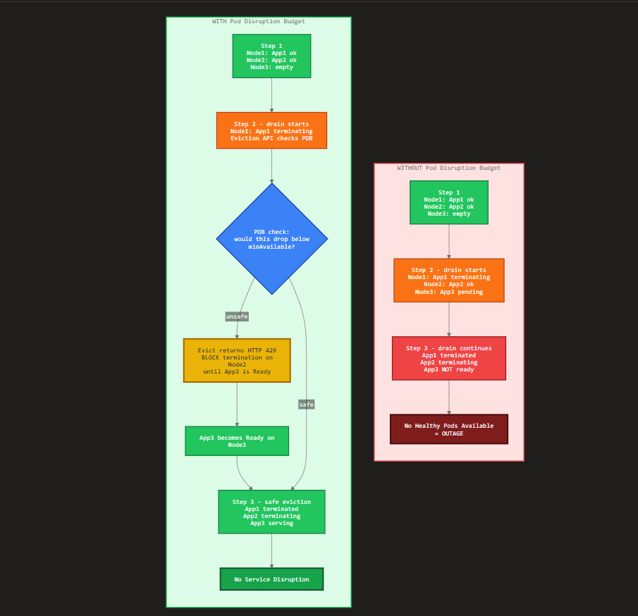

## Pod Disruption Budget — The Core Idea

A **PDB** is a safety floor for availability during **voluntary disruptions** (node drains, upgrades, autoscaler scale-downs). It works through the **Eviction API**: `kubectl drain` doesn't kill pods directly — it *requests* eviction, and the PDB either allows it or returns **HTTP 429** to make the drain wait until a healthy replacement is ready.

- **Without PDB** → evictions cascade freely → you hit a window with **zero healthy pods** → outage.
- **With PDB** → the eviction on the next pod is **blocked until App 3 is Ready** → the app is always serving → no disruption.

Here's the flow as a colorful diagram:The diagram traces both paths side by side. Reading it:

**Red path (no PDB):** the drain terminates App1, then App2, while App3 is still `pending`. Nothing checks whether a replacement exists first, so Step 3 lands on zero healthy pods → outage.

**Green path (with PDB):** the drain calls the Eviction API, which hits the **PDB gate**. If evicting would drop below `minAvailable`, the API returns **429** and the drain waits. App3 comes up Ready, *then* the next eviction is allowed → the app never goes dark.

The whole trick is that one blue decision node — the PDB doesn't stop disruptions, it just **paces** them so availability never dips below your declared floor.

Minimal manifest that produces this behavior for a 3-replica Deployment:

```yaml
apiVersion: policy/v1
kind: PodDisruptionBudget
metadata:
  name: app-pdb
spec:
  maxUnavailable: 1        # at most one pod down at a time
  selector:
    matchLabels:
      app: my-app
```

One gotcha the diagram implies but is worth stating: if you set `maxUnavailable: 0` (or `minAvailable: 100%`), the gate **never** returns "safe" — the drain hangs forever and your node upgrade stalls. That's the most common PDB misconfiguration in production.

Want the AKS node-pool upgrade version of this, showing how `maxSurge` and the PDB interact during a surge upgrade?

