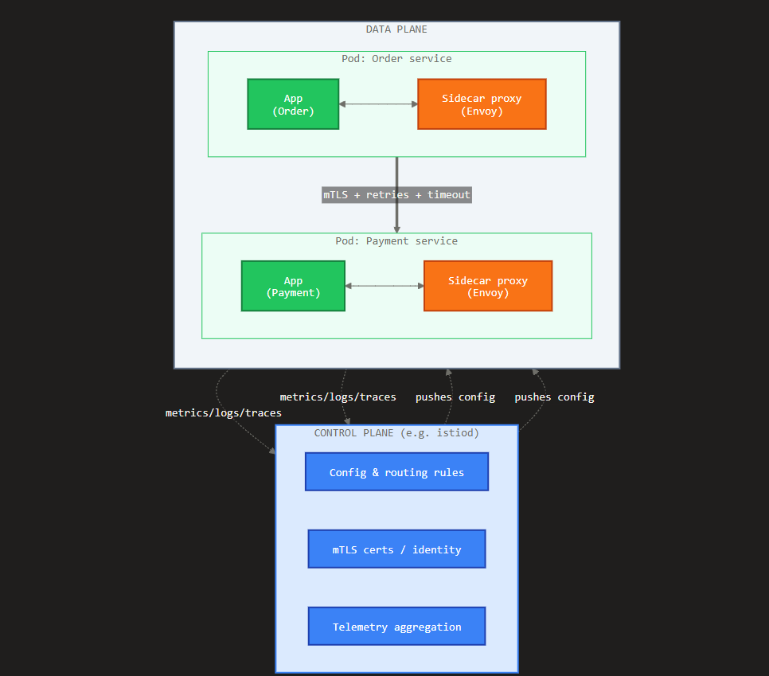

## Service Mesh — Explained

A **service mesh** is a dedicated infrastructure layer that handles **service-to-service communication** in a microservices system. Instead of baking networking logic (retries, timeouts, TLS, metrics) into every application, you push it *out* of the app and into a **sidecar proxy** deployed next to each service. The app just talks to `localhost`; the proxy handles everything on the wire.

It splits into two planes:

- **Data plane** — the sidecar proxies (typically Envoy) that sit beside every pod and intercept all inbound/outbound traffic. This is where routing, mTLS, retries, and telemetry actually happen.
- **Control plane** — the brain (e.g. Istio's `istiod`) that configures all the proxies, distributes certificates for mTLS, and pushes routing rules. It doesn't touch request traffic itself.

The key mental model from your notes: **application code stays simple** because the proxy owns the hard networking concerns, and you configure them declaratively in one place rather than re-implementing them in every service.

Here's the architecture as a diagram:Reading the diagram: every service (green app) has its own sidecar proxy (orange). All Order → Payment traffic flows **proxy-to-proxy** with mTLS, retries, and timeouts applied there. The control plane (blue) never sits in the request path — it only pushes config *down* to the proxies and pulls telemetry *up* from them.

---

## The Scenario Question (L2)

> *Order service intermittently fails to call Payment. How can a service mesh help, and which proxy features would you use?*

This is a classic "handle transient failures gracefully" question. Here's how I'd answer it in an interview:

**Framing:** "Intermittent" is the key word — it signals *transient* failures (a brief GC pause, a pod restart, a network blip, momentary overload), not a hard outage. A service mesh lets me handle these declaratively in the proxy without touching the Order service code. I'd apply these proxy features, in order:

**1. Retries** — Retry the failed call automatically, but *safely*. Only retry on transient conditions and cap attempts so I don't amplify load into a struggling Payment service.

**2. Timeouts** — Bound how long Order waits, so a slow Payment doesn't pile up requests and cascade back into Order.

**3. Outlier detection (circuit breaking)** — If a specific Payment pod keeps failing, eject it from the load-balancing pool for a cooldown period so traffic routes only to healthy instances.

**4. Observability** — Use the proxy's metrics/traces to confirm *whether* it's one bad pod, a latency spike, or overload — so I'm treating the real cause, not guessing.

Istio config for the first three:

```yaml
apiVersion: networking.istio.io/v1
kind: VirtualService
metadata:
  name: payment
spec:
  hosts:
    - payment
  http:
    - route:
        - destination:
            host: payment
      timeout: 2s
      retries:
        attempts: 3
        perTryTimeout: 1s
        retryOn: 5xx,reset,connect-failure,retriable-4xx
---
apiVersion: networking.istio.io/v1
kind: DestinationRule
metadata:
  name: payment
spec:
  host: payment
  trafficPolicy:
    connectionPool:
      http:
        maxRequestsPerConnection: 100
    outlierDetection:
      consecutive5xxErrors: 5
      interval: 10s
      baseEjectionTime: 30s
      maxEjectionPercent: 50
```

**The one caveat that scores points:** retries on Payment are only safe if the operation is **idempotent**. Blindly retrying a "charge card" call risks double-charging. So I'd either ensure Payment uses an idempotency key, or scope `retryOn` to conditions where the request provably never reached the app (e.g. `connect-failure`, `reset`) rather than `5xx`, which could mean the payment *did* process. Mentioning idempotency is what separates an L2 answer from an L3 one.

Want me to add a second mermaid diagram showing the request flow *during* a failure — proxy retry → outlier ejection → reroute to a healthy Payment pod?

