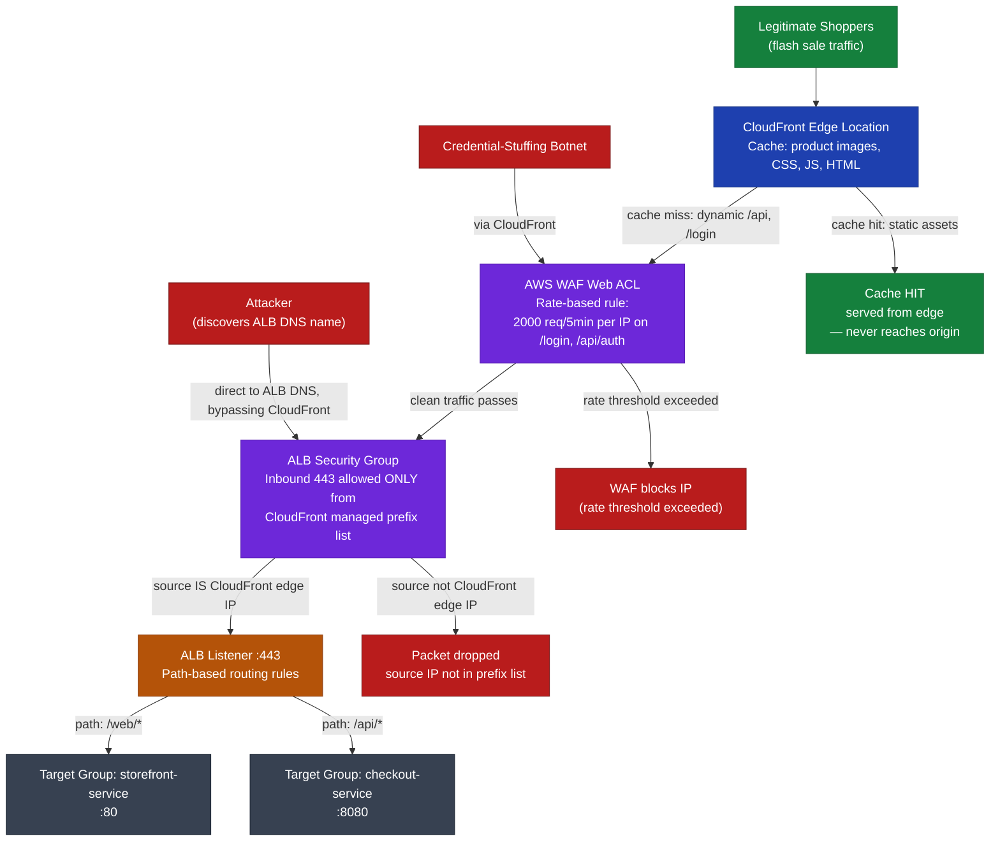
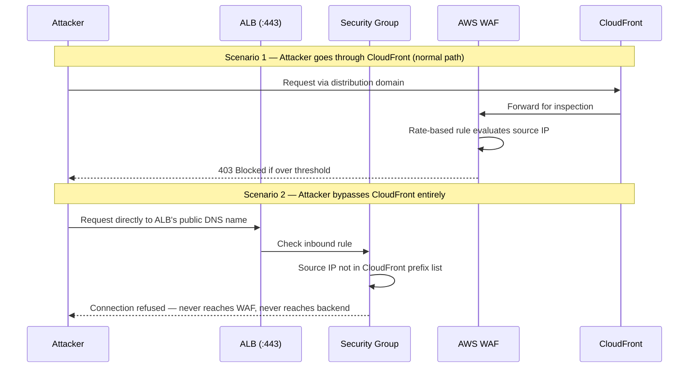

Let's break this into the four control points, in the order a request actually passes through them, then diagram it.

## 1. CloudFront — edge absorption

During a flash sale, the storefront's static assets (product images, CSS, JS, the HTML shell) get cached at CloudFront edge locations. When thousands of shoppers hit the same product page simultaneously, CloudFront serves those from cache at the edge — the origin (ALB → backend services) never even sees that traffic. This is what "absorbs the spike" means literally: origin request count stays flat while edge request count spikes, because a cache hit terminates at the edge.

## 2. AWS WAF — rate-based rule for credential stuffing

WAF is attached to the CloudFront distribution as a Web ACL. A **rate-based rule** counts requests per source IP over a rolling 5-minute window (e.g., threshold of 2000) and specifically watches endpoints like `/login` or `/api/auth`. A credential-stuffing botnet — hundreds of stolen username/password pairs tried rapidly — trips that threshold per attacking IP and gets auto-blocked (temporary block, typically until the rate drops back below threshold). This only inspects the dynamic requests that survived step 1's cache — WAF never needs to look at a cached static asset.

## 3. ALB — path-based routing on `:443`

Only the legitimate remaining dynamic traffic reaches the origin — the ALB, on its HTTPS listener. Listener rules do path-pattern routing: `/api/*` forwards to the checkout service's target group on `:8080`, `/web/*` (or the default rule) forwards to the storefront service's target group on `:80`. Two independently scalable backend services behind one entry point.

## 4. Security group — the bypass-prevention detail

This is the part interviewers use to separate someone who's memorized the CloudFront-WAF-ALB pipeline from someone who's actually secured one. WAF only inspects traffic that flows *through* CloudFront. If the ALB's security group allows `0.0.0.0/0` on 443, an attacker who finds the ALB's DNS name (easy — Certificate Transparency logs, DNS history, `*.elb.amazonaws.com` enumeration) can hit it directly and completely skip CloudFront and WAF. Locking the ALB's security group to only the **AWS-managed CloudFront prefix list** (`com.amazonaws.global.cloudfront.origin-facing`) closes that hole at the network layer — a direct request to the ALB gets dropped before it's even a WAF decision, because the packet's source IP isn't in the allowed prefix list.

## Diagram

## Why the security group step is the "critical detail"

**Interview line to close it out:** "WAF is a Layer 7 content/rate inspector, but it's only in the path if traffic is forced through CloudFront — it provides zero protection against someone who connects straight to the origin. The security-group restriction to the CloudFront managed prefix list is what actually enforces that traffic *cannot* bypass WAF; without it, the WAF configuration is security theater against anyone who finds the ALB's DNS name. That's also why AWS deprecated the older pattern of a shared secret custom header between CloudFront and the origin — the managed prefix list does the same job at the network layer instead of the application layer, and it's harder to leak."