# DevOps Interview — Documentation with Diagrams

A consolidated reference built from the collected interview material: AWS VPC scenarios, 100 DevOps Q&A (Linux → Behavioral), Kubernetes probes, common ports, and production `kubectl` checks. Every answer has a Mermaid diagram to make the concept visual for quick recall.

---

## Table of Contents

1. [AWS VPC — Scenario Questions](#1-aws-vpc--scenario-questions)
2. [AWS Subnets, Security Groups & Routes — Scenarios](#2-aws-subnets-security-groups--routes--scenarios)
3. [Linux & Fundamentals](#3-linux--fundamentals)
4. [Git & Version Control](#4-git--version-control)
5. [CI/CD Pipelines](#5-cicd-pipelines)
6. [Docker & Containers](#6-docker--containers)
7. [Kubernetes](#7-kubernetes)
8. [Terraform & Infrastructure as Code](#8-terraform--infrastructure-as-code)
9. [Cloud (AWS & Azure)](#9-cloud-aws--azure)
10. [GitOps & ArgoCD](#10-gitops--argocd)
11. [Monitoring, Logging & Observability](#11-monitoring-logging--observability)
12. [Security & DevSecOps](#12-security--devsecops)
13. [Networking & Config Management](#13-networking--config-management)
14. [Scenario & Behavioral](#14-scenario--behavioral)
15. [Kubernetes Probes — Deep Dive](#15-kubernetes-probes--deep-dive)
16. [Common Network Ports Reference](#16-common-network-ports-reference)
17. [10 Production kubectl Checks](#17-10-production-kubectl-checks)

---

## 1. AWS VPC — Scenario Questions

### Q1. Design a VPC with public and private subnets for a web app

Put internet-facing tiers (ALB, web server) in a **public subnet** whose route table sends `0.0.0.0/0` to an **Internet Gateway (IGW)**. Put the app server in a **private subnet** whose route table sends `0.0.0.0/0` to a **NAT Gateway** (which lives in the public subnet) so it gets outbound-only internet for patching. No inbound path from the internet reaches the private tier directly.

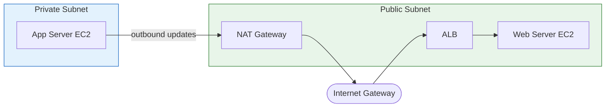

### Q2. Private EC2 can't reach the internet — troubleshoot

Outbound from a private subnet must flow **EC2 → NAT Gateway → IGW → Internet**. Break the chain into checks: the private route table has `0.0.0.0/0 → NAT GW`; the NAT GW is healthy and sits in a **public** subnet; the IGW is attached to the VPC; the NACL allows outbound + ephemeral return ports; the Security Group allows the outbound protocol.

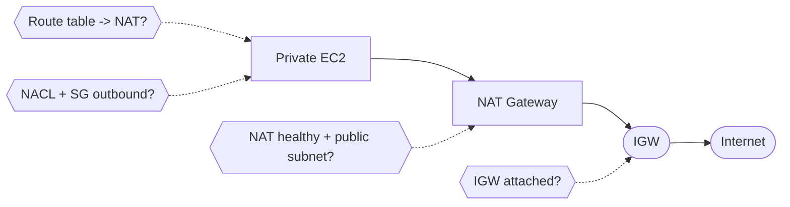

### Q3. Two EC2 in the same VPC/subnet can't ping each other

Same-subnet traffic never touches a route table, so the usual culprits are **Security Groups** (ICMP not allowed), **NACLs**, or the SG not referencing the peer SG. Check SG inbound (allow ICMP from the source SG/CIDR), NACL inbound/outbound, and confirm they are truly in the same subnet.

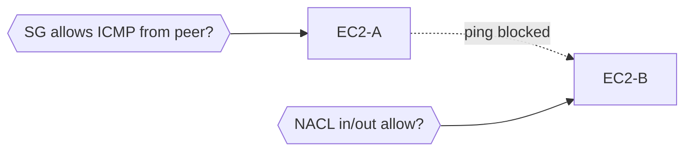

### Q4. Application not reachable from the internet

Trace the packet layer by layer — each layer must allow the traffic: **Internet → IGW → Route Table → NACL → Security Group → EC2**. A single blocked layer drops the request. Verify IGW attached, public route `0.0.0.0/0 → IGW`, NACL inbound/outbound (stateless — needs both directions), SG inbound port, and that the instance has a public/Elastic IP.

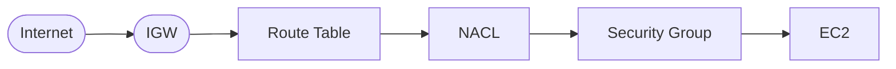

### Q5. Design a VPC for a secure 3-tier application (Web/App/DB)

Three subnet tiers across multiple AZs for HA. **Web tier** (ALB) in public subnets; **App tier** (EC2/containers) in private subnets; **DB tier** (RDS) in isolated private subnets with no internet route. Traffic flows strictly downward; SGs reference each other so only the tier above can talk to the tier below.


### Q6. EC2 can't connect to RDS in the same VPC (connection timeout)

Same VPC means routing is fine, so it is almost always a **firewall or DB config** issue. Check: RDS Security Group inbound allows the **EC2's SG** on port 3306/5432; NACLs on both subnets; route table; the RDS **DB Subnet Group** covers the right subnets; and DNS resolution is enabled on the VPC.

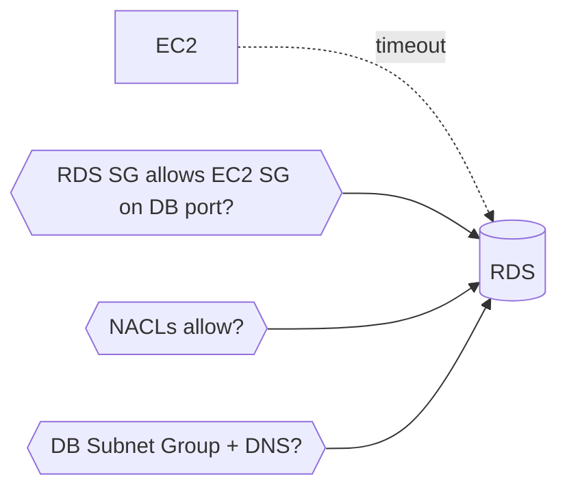

### Q7. VPC Peering between two VPCs (different regions/accounts)

Create a peering connection and **accept** it on the other side. Peering is not transitive and needs routes on **both** sides. Add routes pointing the peer's CIDR to the peering connection in each VPC's route table, open SGs/NACLs for the peer CIDR, and ensure **no overlapping CIDR** blocks.

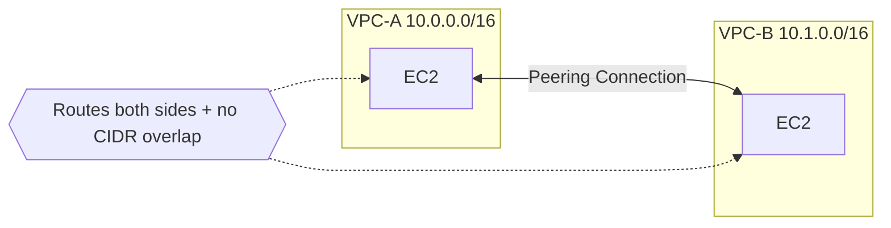

### Q8. Can reach EC2 from internet, but instance can't reach out (traffic not returning)

Inbound works but responses don't come back — classic **NACL asymmetry**. NACLs are stateless, so the outbound rule must allow **ephemeral ports (1024–65535)** for return traffic. Check the return route in the route table and NACL outbound ephemeral range.

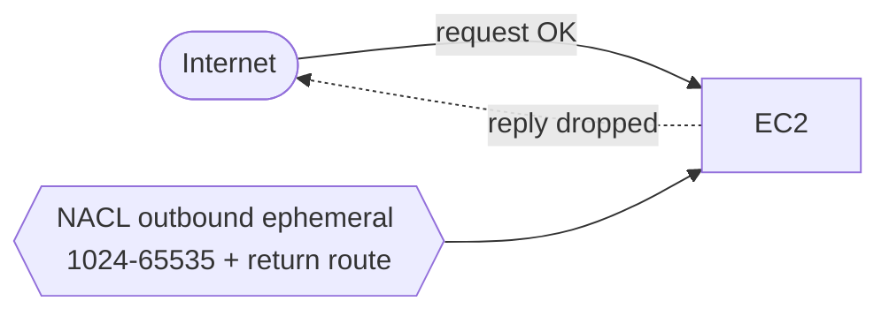

### Q9. Private access to S3 without going over the internet

Use a **Gateway VPC Endpoint** for S3. It adds a prefix-list route to the route table so S3 traffic stays on the AWS backbone — no NAT/IGW needed. Check the endpoint policy, the route table association, the SG (for interface endpoints), and the S3 bucket policy.

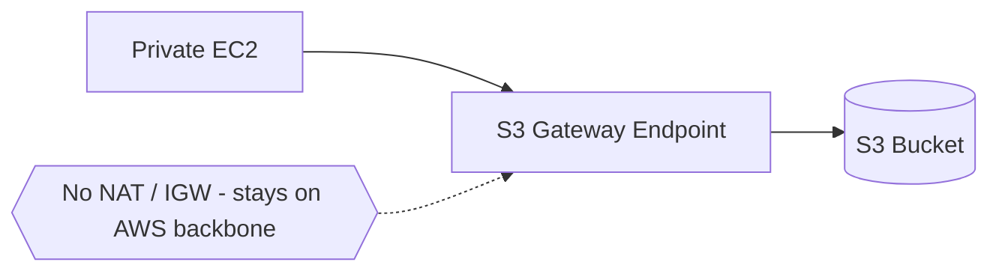

### Q10. Monitor and troubleshoot VPC network issues

Layer your observability: **VPC Flow Logs** for accept/reject per flow, **CloudWatch metrics** for NAT/endpoint throughput, **Reachability Analyzer** to prove a path config-wise, **Traffic Mirroring** for deep packet capture, and `ping`/`traceroute` from inside for live checks.

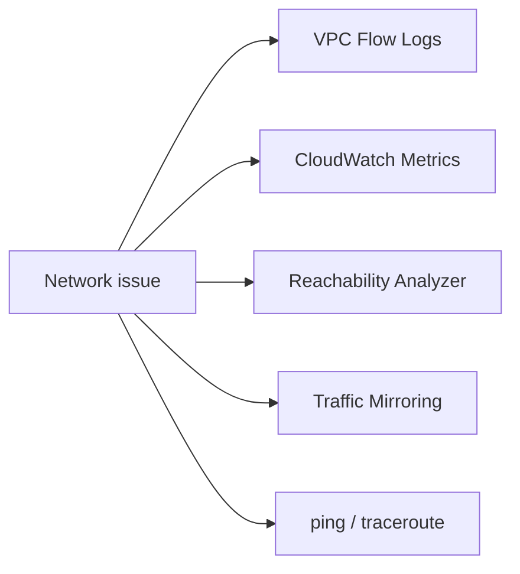

---

## 2. AWS Subnets, Security Groups & Routes — Scenarios

### Q1. Launched EC2 in a public subnet but can't SSH from your laptop

Check the full inbound path: route table has `0.0.0.0/0 → IGW`, IGW is attached, **SG inbound allows SSH (22)** from your IP, NACL allows inbound 22 **and** outbound ephemeral (stateless), and the instance has a public/Elastic IP.

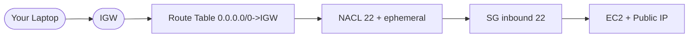

### Q2. Private-subnet EC2 can't get updates

Same as VPC Q2 — needs `0.0.0.0/0 → NAT GW`, NAT GW in a public subnet, IGW attached, and NACL/SG outbound rules.

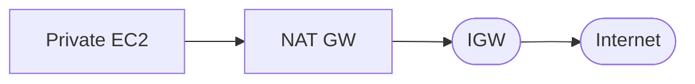

### Q3. Two EC2 in different subnets can't communicate

Now routing matters (cross-subnet). Confirm the VPC **local route** exists (it does by default), SGs allow the traffic in both directions, NACLs on both subnets permit it, and there's **no overlapping CIDR** confusion.

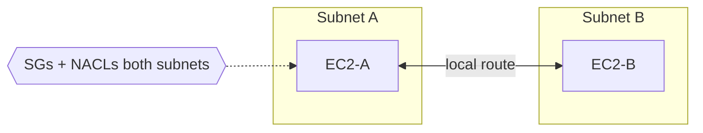

### Q4. Restrict access to only your office IP

Tighten the **Security Group inbound rule** to your office CIDR (e.g. `203.0.113.10/32`) instead of `0.0.0.0/0`. Optionally add a NACL deny as an extra stateless layer. Route table stays unchanged.

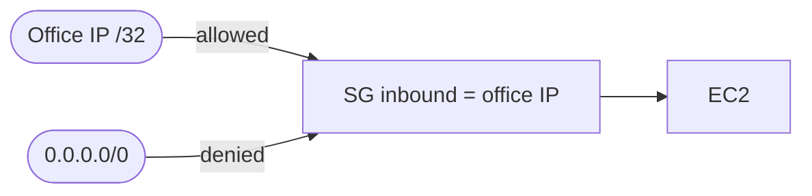

### Q5. Added an inbound SG rule but traffic still blocked

Multiple layers can still block it: correct SG attached to the instance, right port/protocol, **NACL** allowing it, route table correct, and the **OS-level firewall** (iptables/firewalld) not blocking.

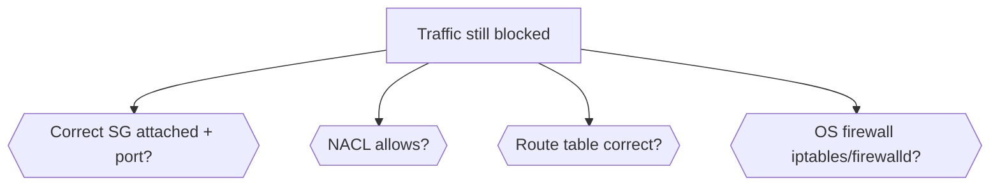

### Q6. Private-subnet instances need S3 without internet

Create an **S3 Gateway Endpoint**, attach it to the route table, no NAT/IGW required. Add SG rules (for interface endpoints) and a bucket policy if restricted.

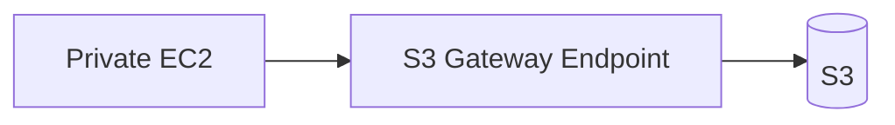

### Q7. Public-subnet app can access RDS in private subnet but times out

Check RDS SG inbound allows the **EC2 SG**, EC2 SG outbound allows the DB port, NACLs on both subnets, route tables (local route), and the RDS subnet group points at the correct private subnets.

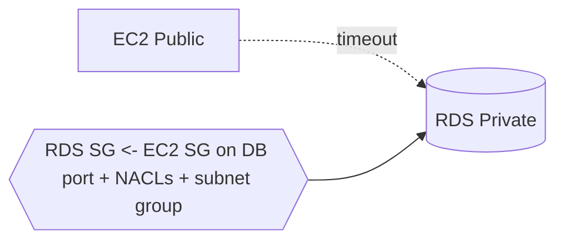

### Q8. IGW attached but instances still have no internet

Usually a **missing route** or association. Check route table actually has `0.0.0.0/0 → IGW`, the subnet is **associated** with that route table, the IGW is attached to the correct VPC, instance has a public IP, and Source/Dest check.

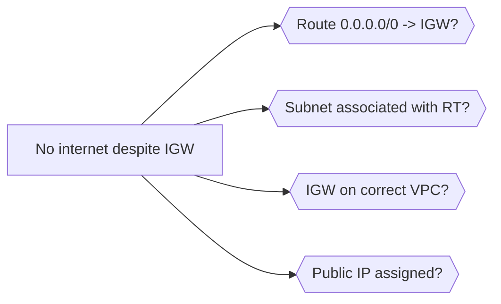

### Q9. Custom route exists but traffic still not going through

Routing uses **Longest Prefix Match** — a more specific route wins. Check for a conflicting specific route, correct target, route propagation (VGW/TGW), and that the subnet is associated with the intended route table.

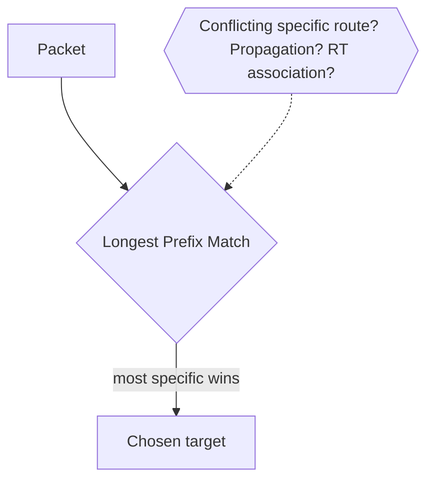

### Q10. Isolate Dev/Test/Prod in the same VPC

Give each environment its **own subnets** (e.g. `10.0.1.0/24`, `10.0.2.0/24`, `10.0.3.0/24`), separate route tables, SGs that restrict cross-env access, an extra NACL layer, and shared services in a separate subnet if needed.

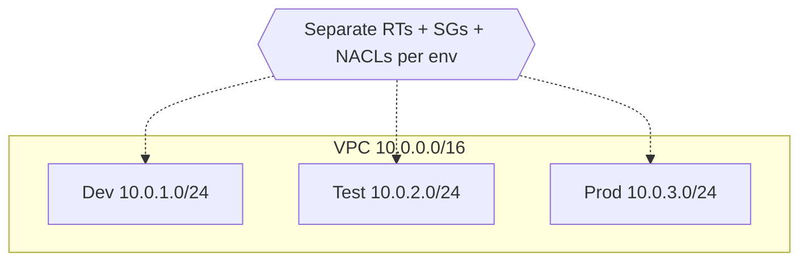

---

## 3. Linux & Fundamentals

### Q1. Hard link vs soft (symbolic) link

A **hard link** points directly to the same inode as the original — deleting the original doesn't break it, and both share the same data on disk. A **soft link** is a pointer to the file *path*; if the original is deleted/moved the symlink breaks. Hard links can't cross filesystems or link directories; symlinks can.

```mermaid
flowchart LR
    HL[Hard link] --> INODE[(Inode / data)]
    ORIG[Original file] --> INODE
    SL[Soft link] --> PATH[/path/to/file] --> ORIG
```

### Q2. Check which process is using a specific port

```bash
sudo lsof -i :PORT
sudo ss -tulpn | grep PORT     # modern
sudo netstat -tulpn | grep PORT
```
Shows the PID and process bound to the port — useful for `address already in use` errors.

```mermaid
flowchart LR
    Q[Which PID owns the port?] --> LSOF[lsof -i :PORT]
    Q --> SS[ss -tulpn]
    LSOF --> PID[PID + process name]
    SS --> PID
```

### Q3. Linux boot process

```mermaid
flowchart LR
    A[BIOS/UEFI POST] --> B[Bootloader GRUB] --> C[Kernel loads] --> D[Mounts root FS] --> E[init/systemd PID 1] --> F[Targets/services in dependency order] --> G[Login / display manager]
```

### Q4. Process vs thread

A **process** is an independent execution unit with its own memory space. **Threads** are lightweight units inside a process that share memory but keep their own stack. Threads are cheaper to create and communicate faster, but a crash in one can take down the whole process.

```mermaid
flowchart TB
    subgraph P[Process - own memory space]
        T1[Thread 1 - own stack]
        T2[Thread 2 - own stack]
        SHARED[(Shared memory/heap)]
        T1 --- SHARED
        T2 --- SHARED
    end
```

### Q5. Find and kill a process consuming high CPU

```bash
top            # or htop, sort by CPU
ps aux --sort=-%cpu | head
kill -15 PID   # graceful (SIGTERM)
kill -9 PID    # force (SIGKILL)
```

```mermaid
flowchart LR
    ID[top / htop / ps --sort=-%cpu] --> PID[Find PID] --> G[kill -15 graceful] -->|still stuck| F[kill -9 force]
```

### Q6. File permissions 755 and 644

**755 (rwxr-xr-x)** — owner full, group/others read+execute; typical for executables, scripts, directories. **644 (rw-r--r--)** — owner read/write, others read only; typical for regular files.

```mermaid
flowchart LR
    P755[755 rwxr-xr-x] --> U1[Owner: rwx]
    P755 --> G1[Group: r-x]
    P755 --> O1[Other: r-x]
    P644[644 rw-r--r--] --> U2[Owner: rw-]
    P644 --> G2[Group: r--]
    P644 --> O2[Other: r--]
```

### Q7. TCP vs UDP

**TCP** is connection-oriented, guarantees ordered/reliable delivery via handshake + acknowledgments — used for HTTP, SSH, databases. **UDP** is connectionless, faster, no delivery guarantee — used for DNS, video streaming, where speed beats reliability.

```mermaid
flowchart LR
    TCP[TCP - reliable, ordered, handshake] --> U1[HTTP / SSH / DB]
    UDP[UDP - fast, connectionless, no guarantee] --> U2[DNS / streaming / VoIP]
```

### Q8. Zombie process

A **zombie** has finished executing but still holds an entry in the process table because its parent hasn't read its exit status. It consumes no resources itself. Fix by getting the parent to call `wait()`, or by killing the misbehaving parent (children re-parent to init, which reaps them).

```mermaid
flowchart LR
    CHILD[Child exits] --> ZOMB[Zombie - entry remains] 
    PARENT[Parent] -->|wait reaps it| GONE[Entry removed]
    PARENT -.->|no wait| ZOMB
```

---

## 4. Git & Version Control

### Q9. git merge vs git rebase

**Merge** creates a new merge commit combining two histories — preserves full history but adds merge commits. **Rebase** replays your commits on top of the target branch — produces a linear, cleaner history but rewrites commit hashes, so never rebase shared/public branches.

```mermaid
flowchart TB
    subgraph Merge
        M1[main] --> MC[Merge commit]
        F1[feature] --> MC
    end
    subgraph Rebase
        R1[main] --> RC[feature commits replayed - linear]
    end
```

### Q10. Resolve a merge conflict

Git marks conflicts with `<<<<<<<`, `=======`, `>>>>>>>`. Manually edit to keep the correct code, remove the markers, `git add` the resolved file, then `git commit` (or `git rebase --continue` if mid-rebase).

```mermaid
flowchart LR
    C[Conflict markers] --> E[Edit + keep correct code] --> A[git add resolved] --> D[git commit / rebase --continue]
```

### Q11. git cherry-pick

Applies a **specific commit** from one branch onto another without merging the whole branch. Useful for hotfixes — pulling a single bug-fix commit into a release branch without unrelated changes.

```mermaid
flowchart LR
    subgraph Feature
        c1[commit A] --> c2[BUGFIX] --> c3[commit C]
    end
    c2 -. cherry-pick .-> REL[Release branch]
```

### Q12. git reset vs git revert

`git reset` moves the branch pointer backward — `--soft`/`--mixed` keep changes, `--hard` discards them; it **rewrites history** so it's unsafe on shared branches. `git revert` creates a **new commit** that undoes a previous one — safe for shared history.

```mermaid
flowchart LR
    RESET[git reset] -->|moves pointer, rewrites history| UNSAFE[Unsafe on shared]
    REVERT[git revert] -->|new inverse commit| SAFE[Safe on shared]
```

### Q13. Detached HEAD state

Happens when you check out a specific commit instead of a branch — HEAD points directly at a commit, not a branch ref. New commits here aren't attached to a branch and can be lost unless you create a new branch to save them.

```mermaid
flowchart LR
    HEAD[HEAD] --> COMMIT[(specific commit)]
    NEW[New commits] -.->|orphaned unless branched| LOST[Lost on checkout]
    FIX[git switch -c newbranch] --> SAVE[Saved]
```

### Q14. Undo the last commit but keep the changes

```bash
git reset --soft HEAD~1    # keeps changes staged
git reset --mixed HEAD~1   # (default) unstages them too
git reset --hard HEAD~1    # discards changes entirely
```

```mermaid
flowchart LR
    SOFT[--soft HEAD~1] --> STAGED[Changes kept staged]
    MIXED[--mixed HEAD~1] --> UNSTAGED[Changes kept unstaged]
    HARD[--hard HEAD~1] --> DISCARD[Changes discarded]
```

---

## 5. CI/CD Pipelines

### Q15. Continuous Delivery vs Continuous Deployment

**Continuous Delivery**: every change that passes automated tests is *deployable* to prod but requires a **manual approval/trigger** to release. **Continuous Deployment** goes further — every passing change is **automatically** deployed to prod with no human gate.

```mermaid
flowchart LR
    COMMIT[Commit] --> TEST[Automated tests]
    TEST --> CD1[Continuous Delivery: manual approval] --> PROD1[Prod]
    TEST --> CD2[Continuous Deployment: auto] --> PROD2[Prod]
```

### Q16. Walk through a CI/CD pipeline end to end

```mermaid
flowchart LR
    SRC[Source trigger push/PR] --> BUILD[Build] --> UT[Unit/static tests] --> ART[Artifact + version] --> IMG[Container build + push to registry] --> STG[Deploy to staging] --> IT[Integration tests] --> GATE[Manual/auto gate] --> PROD[Production]
    PROD --> RB[Rollback strategy]
```

### Q17. Handle secrets in a CI/CD pipeline

Never hardcode secrets in YAML or source. Use a **secrets manager** (Azure Key Vault, AWS Secrets Manager, HashiCorp Vault) or the CI's native store (GitHub Actions secrets, Jenkins credentials), inject at runtime as env vars, and restrict access via least-privilege service accounts.

```mermaid
flowchart LR
    VAULT[Secrets Manager / CI secret store] -->|inject at runtime| ENV[Env vars in job]
    ENV --> STEP[Pipeline step]
    LP{{Least-privilege service account}} -.-> VAULT
```

### Q18. GitHub Actions vs Jenkins

**GitHub Actions**: managed, YAML-based, cloud-hosted runners, tightly integrated with GitHub, low operational overhead, easy scaling. **Jenkins**: self-hosted, plugin-driven, highly customizable, full control but you manage infra/updates — great for on-prem and complex workflows.

```mermaid
flowchart LR
    GHA[GitHub Actions] --> A1[Managed, YAML, low overhead, GitHub-native]
    JEN[Jenkins] --> B1[Self-hosted, plugins, full control, on-prem]
```

### Q19. Rollback strategy in a pipeline

Keep the **last N versioned artifacts/images** and redeploy the previous known-good one; use **blue-green or canary** to switch traffic back instantly; or trigger an **automated rollback** on failed post-deploy health checks.

```mermaid
flowchart LR
    DEPLOY[New deploy] --> HC{Health checks pass?}
    HC -->|no| RB[Rollback: redeploy known-good N-1]
    HC -->|yes| KEEP[Keep]
    RB --> BG[Blue-green / canary traffic switch]
```

### Q20. Pipeline stages structured for speed

Typical: `build → test → security scan → package → deploy`. Speed it up: run independent jobs in **parallel**, **cache** dependencies between runs, **matrix** builds for multi-env testing, and **fail fast** on cheap checks (lint/unit) before expensive ones (integration).

```mermaid
flowchart LR
    B[Build] --> T[Test]
    T --> S[Security scan]
    S --> P[Package]
    P --> D[Deploy]
    FAST{{Parallel jobs + cache + matrix + fail-fast}} -.-> T
```

### Q21. Environment-specific config across dev/staging/prod

Externalize config from code with **env vars, ConfigMaps, or a parameter store** (AWS SSM, Azure App Configuration). Keep env-specific values out of the repo; use templating (Helm values files, Terraform workspaces) to inject the right values per environment.

```mermaid
flowchart LR
    CODE[Same code artifact] --> DEV[dev values]
    CODE --> STG[staging values]
    CODE --> PROD[prod values]
    STORE[(SSM / Key Vault / ConfigMaps)] --> DEV & STG & PROD
```

### Q22. Canary deployment

Route a **small percentage** of live traffic to the new version while most still hits stable; monitor error rate/latency, then gradually increase. Implemented via service mesh traffic splitting (Istio), weighted LB rules, or Argo Rollouts.

```mermaid
flowchart LR
    LB[Load Balancer] -->|95%| V1[Stable v1]
    LB -->|5% canary| V2[New v2]
    MON{Errors/latency OK?} -->|yes| RAMP[Increase to 100%]
    MON -->|no| ROLL[Roll back]
```

### Q23. Blue-green deployment

Two identical prod environments (**blue = current, green = new**) run in parallel. Traffic switches from blue to green **all at once** via LB or DNS after green is verified healthy — giving near-instant rollback by switching back.

```mermaid
flowchart LR
    LB[LB / DNS] -->|active| BLUE[Blue - current]
    GREEN[Green - new, verified] -.->|switch| LB
    LB -.->|instant rollback| BLUE
```

### Q24. Database migrations in a CI/CD pipeline

Use versioned migration tools (Flyway, Liquibase, ORM migrations) as a **separate pipeline step before** app deploy. Migrations must be **backward-compatible** so the old app version keeps working during rollout; destructive changes (drop column) go in a later separate release.

```mermaid
flowchart LR
    MIG[Migration step - backward compatible] --> APP[App deploy]
    APP --> LATER[Destructive changes in later release]
```

---

## 6. Docker & Containers

### Q25. Image vs container

An **image** is a read-only, immutable template (code + deps + filesystem layers). A **container** is a running/stopped **instance** of that image with its own writable layer, network, and process space.

```mermaid
flowchart LR
    IMG[Image - read-only template] -->|docker run| C1[Container 1 - writable layer]
    IMG -->|docker run| C2[Container 2 - writable layer]
```

### Q26. Reduce Docker image size

Use minimal base images (alpine, distroless), **multi-stage builds** to drop build tools, combine RUN commands to reduce layers, clean package caches in the same layer, and use `.dockerignore`.

```mermaid
flowchart LR
    BIG[Large image] --> A[Alpine/distroless base]
    BIG --> B[Multi-stage build]
    BIG --> C[Combine RUN + clean cache]
    BIG --> D[.dockerignore]
    A & B & C & D --> SMALL[Small image]
```

### Q27. Multi-stage builds

Multiple `FROM` statements in one Dockerfile — one stage compiles the app with full tooling, a final stage copies only the compiled artifact into a minimal runtime image. Drastically shrinks final size and attack surface.

```mermaid
flowchart LR
    S1[Stage 1: build - full toolchain] -->|copy artifact only| S2[Stage 2: minimal runtime]
    S2 --> FINAL[Slim final image]
```

### Q28. CMD vs ENTRYPOINT

**ENTRYPOINT** defines the fixed command that always runs when the container starts. **CMD** provides default arguments that can be overridden at runtime. Common pattern: ENTRYPOINT for the binary, CMD for default flags.

```mermaid
flowchart LR
    ENTRY[ENTRYPOINT - fixed binary] --> RUN[Container start]
    CMD[CMD - default args, overridable] --> RUN
```

### Q29. Container isolation without a full hypervisor

Containers use Linux kernel features — **namespaces** (PID, network, mount, UTS, IPC) to isolate what a process sees, and **cgroups** to limit/account CPU, memory, I/O. They share the host kernel, unlike VMs that virtualize hardware.

```mermaid
flowchart TB
    HOST[Host Kernel] --> NS[Namespaces: PID/net/mount/UTS/IPC]
    HOST --> CG[cgroups: CPU/mem/IO limits]
    NS & CG --> CONT[Isolated container]
```

### Q30. Persist data in Docker containers

Use **volumes** (managed by Docker, stored outside the writable layer) for production data, or **bind mounts** (map a host directory) for dev. Volumes survive container removal; the container's own writable layer doesn't.

```mermaid
flowchart LR
    CONT[Container] --> VOL[Volume - survives removal]
    CONT --> BM[Bind mount - host dir]
    CONT --> WL[Writable layer - lost on removal]
```

### Q31. What happens when a container's main process (PID 1) exits

The container **stops** — its lifecycle is tied to PID 1. If PID 1 crashes or completes, the whole container exits even if other background processes are still running inside.

```mermaid
flowchart LR
    PID1[PID 1 process] -->|exits/crashes| STOP[Container stops]
    OTHERS[Other bg processes] -. also killed .-> STOP
```

### Q32. Debug a container that keeps crashing (CrashLoopBackOff-style)

`docker logs <container>` for the exit error; run the image interactively `docker run -it --entrypoint /bin/sh <image>` to inspect filesystem/env/config; verify env vars and mounted config; check resource limits — OOM kills often look like crashes.

```mermaid
flowchart LR
    CRASH[Container crashing] --> L[docker logs - exit error]
    CRASH --> SH[docker run -it --entrypoint sh]
    CRASH --> ENV[Check env + mounts]
    CRASH --> OOM[Check resource limits/OOM]
```

---

## 7. Kubernetes

### Q33. Deployment vs StatefulSet

**Deployment** manages stateless, interchangeable pod replicas — no stable identity or storage. **StatefulSet** gives each pod a **stable network identity and persistent storage** that survives rescheduling — for databases, message queues, stateful workloads.

```mermaid
flowchart LR
    DEP[Deployment] --> ST[Stateless, interchangeable pods]
    STS[StatefulSet] --> ID[Stable identity pod-0, pod-1] 
    STS --> PV[Persistent storage per pod]
```

### Q34. Kubernetes control plane components

```mermaid
flowchart TB
    API[kube-apiserver - front door] --> ETCD[(etcd - cluster state store)]
    API --> SCHED[kube-scheduler - assigns pods to nodes]
    API --> CM[kube-controller-manager - reconciliation loops]
    API --> CCM[cloud-controller-manager - cloud APIs]
```

### Q35. Readiness probe vs liveness probe

A **liveness probe** checks if a container is still alive — on failure Kubernetes **restarts** it. A **readiness probe** checks if a container is ready to receive traffic — on failure the pod is **removed from service endpoints** but not restarted (useful during startup/temporary overload).

```mermaid
flowchart LR
    LIVE[Liveness fails] --> RESTART[Restart container]
    READY[Readiness fails] --> REMOVE[Remove from Service endpoints - no restart]
```

### Q36. How a Service routes traffic to pods

A Service selects pods via **label selectors** and gets a stable virtual IP (ClusterIP). `kube-proxy` programs iptables/IPVS rules on each node so traffic to the Service IP is load-balanced to healthy pod endpoints, tracked via Endpoints/EndpointSlice objects.

```mermaid
flowchart LR
    SVC[Service ClusterIP] -->|label selector| EP[Endpoints/EndpointSlice]
    KP[kube-proxy iptables/IPVS] --> P1[Pod 1]
    KP --> P2[Pod 2]
    SVC --> KP
```

### Q37. ConfigMap vs Secret

Both inject config into pods as env vars or volumes. **ConfigMaps** hold non-sensitive plain-text config; **Secrets** hold sensitive data and are base64-encoded (not encrypted at rest by default unless you enable etcd encryption or use an external secrets manager).

```mermaid
flowchart LR
    CM[ConfigMap - plain text] --> POD[Pod env/volume]
    SEC[Secret - base64, sensitive] --> POD
    ENC{{Enable etcd encryption / external manager}} -.-> SEC
```

### Q38. How Horizontal Pod Autoscaler (HPA) works

HPA watches metrics (CPU/memory or custom via metrics-server/Prometheus adapter) against a target threshold on a Deployment/StatefulSet, and automatically raises/lowers replica count within configured min/max bounds.

```mermaid
flowchart LR
    METRICS[metrics-server / Prometheus] --> HPA[HPA controller]
    HPA -->|current vs target| SCALE{Scale?}
    SCALE -->|up| MORE[More replicas]
    SCALE -->|down| FEWER[Fewer replicas]
    BOUND{{min/max bounds}} -.-> HPA
```

### Q39. DaemonSet vs Deployment

A **DaemonSet** ensures exactly one pod runs on every (or selected) node — for node-level agents like log collectors and monitoring exporters. A **Deployment** manages a desired replica count scheduled wherever, independent of node count.

```mermaid
flowchart LR
    DS[DaemonSet] --> N1[Node1: 1 pod]
    DS --> N2[Node2: 1 pod]
    DS --> N3[Node3: 1 pod]
    DEP[Deployment: N replicas] --> ANY[Scheduled anywhere]
```

### Q40. Troubleshoot a pod stuck in Pending

`kubectl describe pod` shows scheduling events. Common causes: insufficient CPU/memory on nodes, unsatisfied node affinity/taints, unbound PersistentVolumeClaims, or no node matching the pod's selector. Check `kubectl get events` and node resource availability.

```mermaid
flowchart TB
    PEND[Pod Pending] --> D[kubectl describe pod - events]
    PEND --> R{Cause?}
    R --> C1[Insufficient CPU/mem]
    R --> C2[Taints/affinity]
    R --> C3[Unbound PVC]
    R --> C4[No matching node]
```

### Q41. Taint and toleration

A **taint** on a node repels pods that don't tolerate it (e.g. dedicating nodes to specific workloads). A **toleration** on a pod allows (but doesn't force) it to be scheduled onto nodes with a matching taint.

```mermaid
flowchart LR
    NODE[Node with taint] -->|repels| POD1[Pod without toleration]
    NODE -->|allows| POD2[Pod with matching toleration]
```

### Q42. Kubernetes namespaces

Namespaces partition a cluster into **virtual sub-clusters** for resource organization, access control (via RBAC), and resource quotas — used to separate teams, environments (dev/staging/prod), or applications in a shared cluster.

```mermaid
flowchart TB
    CLUSTER[Cluster] --> NSD[ns: dev]
    CLUSTER --> NSS[ns: staging]
    CLUSTER --> NSP[ns: prod]
    RBAC{{RBAC + ResourceQuota per ns}} -.-> NSD
```

### Q43. Ingress vs Service

A **Service** (LoadBalancer/NodePort) exposes a single app's network access, typically at L4. An **Ingress** is an L7 routing ruleset (host/path-based routing, TLS termination) managed by an Ingress Controller (nginx, ALB), letting multiple services share a single external entry point.

```mermaid
flowchart LR
    NET([Internet]) --> ING[Ingress L7 - host/path/TLS]
    ING --> S1[Service A] --> P1[Pods]
    ING --> S2[Service B] --> P2[Pods]
```

### Q44. Troubleshoot high memory usage causing pod OOMKills

Check `kubectl describe pod` for OOMKilled status and exit code **137**, review resource requests/limits vs actual usage (metrics-server/Prometheus), check for memory leaks in app logs, and consider raising limits or optimizing the app's memory footprint.

```mermaid
flowchart LR
    OOM[OOMKilled exit 137] --> DESC[kubectl describe pod]
    OOM --> USE[Usage vs limits - metrics]
    OOM --> LEAK[App logs - memory leak?]
    OOM --> FIX[Raise limits / optimize app]
```

### Q45. Resource requests vs limits

**Requests** are what the scheduler guarantees/reserves for a container — used for bin-packing decisions. **Limits** are the hard ceiling; exceeding a **memory** limit triggers an OOMKill, while exceeding a **CPU** limit causes throttling (not a kill).

```mermaid
flowchart LR
    REQ[Requests - scheduler reserves] --> SCHED[Bin-packing]
    LIM[Limits - hard ceiling] --> MEM[Exceed memory -> OOMKill]
    LIM --> CPU[Exceed CPU -> throttle]
```

### Q46. Zero-downtime rolling update

Set appropriate `maxUnavailable` and `maxSurge` in the Deployment's RollingUpdate strategy, ensure **readiness probes** are configured so traffic isn't sent to unready pods, and use `preStop` hooks + graceful termination so in-flight requests finish before a pod is killed.

```mermaid
flowchart LR
    RU[RollingUpdate maxSurge/maxUnavailable] --> NEW[Spin up new pods]
    NEW --> RP{Readiness probe OK?}
    RP -->|yes| SHIFT[Shift traffic]
    SHIFT --> DRAIN[preStop + graceful term of old pods]
```

### Q47. PodDisruptionBudget (PDB)

A PDB limits how many pods of an app can be **voluntarily disrupted** at once (node drains, cluster upgrades, autoscaling), ensuring a minimum number stay available to prevent an outage during maintenance.

```mermaid
flowchart LR
    DRAIN[Node drain / upgrade] --> PDB{PDB: minAvailable respected?}
    PDB -->|yes| EVICT[Evict pod]
    PDB -->|no| WAIT[Block until safe]
```

---

## 8. Terraform & Infrastructure as Code

### Q48. Terraform state and why it matters

State is a JSON file mapping your configuration to real-world resources, tracking metadata and dependencies. Terraform uses it to know what exists, detect drift, and plan changes accurately — without it, Terraform can't determine what to create/update/destroy.

```mermaid
flowchart LR
    CFG[.tf config] --> STATE[(terraform.tfstate)] --> REAL[Real cloud resources]
    STATE --> DRIFT[Detect drift + plan]
```

### Q49. Manage Terraform state in a team environment

Use a **remote backend** — S3 + DynamoDB for locking, Azure Storage with state locking, or Terraform Cloud — so state is shared and locked to prevent concurrent writes, rather than local state files that cause conflicts and drift.

```mermaid
flowchart LR
    DEV1[Engineer 1] --> BE[(Remote backend S3+DynamoDB / Azure / TFC)]
    DEV2[Engineer 2] --> BE
    LOCK{{State locking prevents concurrent writes}} -.-> BE
```

### Q50. terraform plan vs terraform apply

`plan` shows a preview of changes (create/update/destroy) without touching infra — used for review. `apply` executes those changes against real infra and by default re-runs a plan first for confirmation.

```mermaid
flowchart LR
    PLAN[terraform plan - preview, no changes] --> REVIEW[Review]
    REVIEW --> APPLY[terraform apply - executes changes]
```

### Q51. Terraform modules

Reusable, self-contained groups of resources with defined inputs/outputs — like functions in programming. They standardize infra patterns (a VPC module, an AKS cluster module) and let you reuse them across projects and environments.

```mermaid
flowchart LR
    MOD[Module: inputs -> resources -> outputs] --> P1[Project A]
    MOD --> P2[Project B]
    MOD --> P3[Project C]
```

### Q52. State drift and how to handle it

Drift happens when real infra changes outside Terraform (manual console edits, other tools). Run `terraform plan` to detect it, then either `terraform apply` to bring infra back in line with code, or `terraform import`/update code to reflect the manual change as the new source of truth.

```mermaid
flowchart LR
    MANUAL[Manual change in console] --> DRIFT[Drift]
    DRIFT --> DETECT[terraform plan detects]
    DETECT --> A[apply - restore to code]
    DETECT --> B[import/update code - accept change]
```

### Q53. Handle secrets in Terraform code

Never hardcode secrets in `.tf` or commit them. Mark variables `sensitive = true`, pull values from a secrets manager (Vault, AWS Secrets Manager) via **data sources** at runtime, and ensure state files (which may contain sensitive values) are stored encrypted with restricted access.

```mermaid
flowchart LR
    VAULT[Secrets Manager] -->|data source at runtime| TF[Terraform]
    TF --> SENS[var sensitive=true]
    STATE[(Encrypted state, restricted access)] -.-> TF
```

### Q54. Terraform vs Ansible

**Terraform** is declarative infrastructure **provisioning** — creates/manages the lifecycle of cloud resources. **Ansible** is primarily configuration management/orchestration — installing software, changing config on existing servers. Many teams use Terraform to provision and Ansible to configure.

```mermaid
flowchart LR
    TF[Terraform - provision infra] --> INFRA[VPC, VMs, LBs]
    INFRA --> ANS[Ansible - configure]
    ANS --> SOFT[Packages, config, services]
```

### Q55. Purpose of terraform.tfstate locking

Locking prevents two people or pipeline runs from applying changes simultaneously, which could corrupt state or cause conflicting modifications. Remote backends (S3+DynamoDB, Terraform Cloud) handle this automatically during plan/apply.

```mermaid
flowchart LR
    RUN1[Apply run 1] -->|acquires lock| STATE[(State)]
    RUN2[Apply run 2] -->|blocked until released| STATE
```

### Q56. Terraform workspace and when to use one

Workspaces maintain multiple distinct state files from the **same configuration** — useful for dev/staging/prod with the same code but separate state. For larger differences between environments, separate directories/modules are usually cleaner than workspaces alone.

```mermaid
flowchart LR
    CFG[Same config] --> WD[workspace: dev -> state-dev]
    CFG --> WS[workspace: staging -> state-staging]
    CFG --> WP[workspace: prod -> state-prod]
```

### Q57. Safely destroy/recreate a specific resource

Use `terraform destroy -target=resource.name` for destruction, or `terraform taint resource.name` (or `-replace` in newer versions) to force recreation on the next apply — scoping the blast radius to just that resource instead of the whole state.

```mermaid
flowchart LR
    ONE[One resource] --> T[taint / -replace] --> APPLY[Next apply recreates only it]
    NOTE{{Blast radius scoped, rest untouched}} -.-> T
```

---

## 9. Cloud (AWS & Azure)

### Q58. AWS Security Group vs NACL

A **Security Group** is a **stateful, instance-level** firewall — return traffic is automatically allowed. A **NACL** is a **stateless, subnet-level** firewall where you must explicitly allow both inbound and outbound, evaluated in rule-number order.

```mermaid
flowchart LR
    SG[Security Group - stateful, instance-level] --> AUTO[Return traffic auto-allowed]
    NACL[NACL - stateless, subnet-level] --> BOTH[Must allow in AND out, by rule number]
```

### Q59. How Auto Scaling Groups work

An ASG maintains a **desired number** of EC2 instances based on scaling policies tied to CloudWatch metrics (CPU, request count) or schedules. It launches new instances from a launch template when scaling out and terminates them (respecting termination policies) when scaling in.

```mermaid
flowchart LR
    CW[CloudWatch metrics] --> ASG[ASG desired count]
    ASG -->|scale out| LT[Launch template -> new instances]
    ASG -->|scale in| TERM[Terminate instances]
```

### Q60. ALB vs NLB

**ALB** operates at **L7** — routes on HTTP path/host headers, ideal for microservices and content-based routing. **NLB** operates at **L4** — handles raw TCP/UDP with ultra-low latency and static IPs, ideal for extreme performance or non-HTTP protocols.

```mermaid
flowchart LR
    ALB[ALB - L7] --> H[HTTP path/host routing, microservices]
    NLB[NLB - L4] --> T[TCP/UDP, low latency, static IP]
```

### Q61. Secure access to an EKS cluster

Combine **IAM authentication** (aws-auth ConfigMap mapping IAM roles to Kubernetes RBAC), private API server endpoints or restricted CIDR access, Kubernetes **RBAC** for fine-grained permissions, and **network policies** to control pod-to-pod traffic.

```mermaid
flowchart TB
    IAM[IAM auth -> aws-auth ConfigMap] --> RBAC[K8s RBAC]
    PRIV[Private API endpoint / CIDR] --> API[EKS API server]
    NETPOL[Network Policies] --> POD[Pod-to-pod control]
    RBAC --> API
```

### Q62. Azure AKS vs self-managed Kubernetes

**AKS** is managed — Azure runs the control plane (masters, etcd, upgrades) at no charge for the control plane itself; you only manage worker nodes and workloads. **Self-managed** means you provision and maintain every component, including the control plane.

```mermaid
flowchart LR
    AKS[AKS] --> AZ[Azure manages control plane]
    AKS --> YOU1[You manage worker nodes]
    SELF[Self-managed] --> YOU2[You manage control plane + nodes]
```

### Q63. AWS shared responsibility model

AWS is responsible for security **'of' the cloud** — physical infra, hardware, virtualization layer. The customer is responsible for security **'in' the cloud** — data, IAM config, OS patching (for EC2), network config, and app-level security.

```mermaid
flowchart LR
    AWS[AWS: security OF the cloud] --> A1[Infra, hardware, virtualization]
    CUST[Customer: security IN the cloud] --> C1[Data, IAM, OS patching, network, app]
```

### Q64. Azure ARM templates vs Terraform

**ARM templates** are Azure-native, JSON-based, tightly integrated with Azure resource providers, no third-party dependency. **Terraform** is cloud-agnostic, uses HCL, and can manage multi-cloud + third-party resources in one workflow — at the cost of an extra provider abstraction layer.

```mermaid
flowchart LR
    ARM[ARM templates - JSON, Azure-native] --> AZONLY[Azure only]
    TF[Terraform - HCL, agnostic] --> MULTI[Multi-cloud + 3rd party]
```

### Q65. Design a highly available multi-AZ architecture on AWS

Deploy across at least two/three AZs with an **ALB** distributing traffic, an **Auto Scaling Group** spanning those AZs, a **Multi-AZ RDS** instance (or read replicas) for the DB tier, and S3/CloudFront for static assets — eliminating single points of failure at each tier.

```mermaid
flowchart TB
    ALB[ALB - multi-AZ]
    ALB --> A1[ASG AZ-1]
    ALB --> A2[ASG AZ-2]
    A1 & A2 --> RDS[(Multi-AZ RDS)]
    CF[CloudFront + S3] --> STATIC[Static assets]
```

### Q66. IAM least privilege and enforcing it practically

Grant only the exact permissions needed, nothing more. In practice: scoped IAM policies instead of wildcard actions/resources, prefer roles over long-lived access keys, regularly audit with **IAM Access Analyzer**, and use permission boundaries for delegated admin.

```mermaid
flowchart LR
    LP[Least privilege] --> SCOPE[Scoped policies, no wildcards]
    LP --> ROLE[Roles over long-lived keys]
    LP --> AUDIT[IAM Access Analyzer audits]
    LP --> PB[Permission boundaries]
```

### Q67. S3 bucket policy vs IAM policy

An **IAM policy** is attached to a user/role/group and defines what that identity can do across AWS. A **bucket policy** is attached directly to the S3 bucket and defines which principals can access it — useful for cross-account access or public access control; evaluated together with IAM policies.

```mermaid
flowchart LR
    IAM[IAM policy -> identity] --> WHAT[What identity can do across AWS]
    BP[Bucket policy -> bucket] --> WHO[Who can access this bucket]
    IAM & BP --> EVAL[Evaluated together]
```

---

## 10. GitOps & ArgoCD

### Q68. GitOps vs traditional CI/CD push

GitOps treats **Git as the single source of truth** for desired state; an in-cluster agent (ArgoCD) continuously **pulls** and reconciles the cluster to match Git. Traditional CI/CD **pushes** changes from the pipeline — GitOps pulls changes in, giving auditability and easy rollback via Git history.

```mermaid
flowchart LR
    GIT[(Git - desired state)] --> AGENT[ArgoCD agent in cluster]
    AGENT -->|pull + reconcile| CLUSTER[Cluster]
    PIPE[Traditional CI/CD] -->|push| CLUSTER
```

### Q69. How ArgoCD detects and handles config drift

ArgoCD continuously compares live cluster state against desired state in Git. If they diverge (a manual `kubectl` change), it marks the app **OutOfSync** and — depending on sync policy — either alerts you or automatically re-syncs to bring the cluster back to match Git.

```mermaid
flowchart LR
    GIT[(Git desired)] --> CMP{Compare vs live}
    LIVE[Cluster live] --> CMP
    CMP -->|diverge| OOS[OutOfSync]
    OOS --> ALERT[Alert]
    OOS --> RESYNC[Auto re-sync]
```

### Q70. Automated sync vs manual sync in ArgoCD

**Manual sync** requires a person/external trigger to approve applying Git changes — a review gate. **Automated sync** applies changes as soon as they're detected in Git with no human step — faster but riskier without strong pre-merge review/testing.

```mermaid
flowchart LR
    CHANGE[Git change] --> MAN[Manual sync: human approves] --> APPLY1[Apply]
    CHANGE --> AUTO[Automated sync: no human] --> APPLY2[Apply]
```

### Q71. Roll back a bad deployment in a GitOps model

Revert the offending commit in Git (`git revert` to preserve history) and let ArgoCD/Flux automatically re-sync the cluster to the previous known-good state — the rollback is a **Git operation**, not a manual `kubectl`/helm command against the cluster.

```mermaid
flowchart LR
    BAD[Bad deploy] --> REVERT[git revert commit] --> GIT[(Git)] --> ARGOCD[ArgoCD re-syncs] --> GOOD[Known-good state]
```

---

## 11. Monitoring, Logging & Observability

### Q72. Monitoring vs observability

**Monitoring** watches known metrics/dashboards to detect predefined problems. **Observability** is the broader ability to ask arbitrary questions about system behavior from logs, metrics, and traces to debug unknown issues — monitoring tells you *something* is wrong, observability helps you find out *why*.

```mermaid
flowchart LR
    MON[Monitoring - known metrics] --> WRONG[Something is wrong]
    OBS[Observability - logs+metrics+traces] --> WHY[Why is it wrong]
```

### Q73. Three pillars of observability

```mermaid
flowchart TB
    OBS[Observability]
    OBS --> M[Metrics - numeric time-series: CPU%, request rate]
    OBS --> L[Logs - discrete timestamped events]
    OBS --> T[Traces - end-to-end request paths]
    M & L & T --> RC[Detect, diagnose, root-cause]
```

### Q74. How Prometheus collects metrics

Prometheus uses a **pull model** — it scrapes HTTP `/metrics` endpoints on targets at configured intervals. Data is stored as time-series identified by a metric name plus key-value labels, enabling flexible querying and aggregation via **PromQL**.

```mermaid
flowchart LR
    PROM[Prometheus] -->|scrape /metrics| T1[Target 1]
    PROM -->|scrape /metrics| T2[Target 2]
    PROM --> TSDB[(Time-series DB)]
    TSDB --> PROMQL[PromQL queries]
```

### Q75. Alerting rules and avoiding alert fatigue

Alerting rules trigger notifications when metrics cross thresholds for a sustained period. Avoid fatigue by alerting on **symptoms that affect users** (not every internal metric), using appropriate `for` durations to avoid flapping, tuning severity levels, and routing non-urgent alerts to lower-priority channels.

```mermaid
flowchart LR
    METRIC[Metric crosses threshold] --> FOR[for: sustained duration]
    FOR --> SEV{Severity?}
    SEV -->|urgent, user-facing| PAGE[Page on-call]
    SEV -->|low| CHAN[Low-priority channel]
```

### Q76. Centralized logging for a Kubernetes cluster

Deploy a log-shipping agent as a **DaemonSet** (Fluentd, Fluent Bit, or Promtail) on every node to collect container/pod logs, forward to a centralized store (Elasticsearch, Loki, or a cloud-native service), and visualize/query via Kibana or Grafana.

```mermaid
flowchart LR
    N1[Node1 logs] --> DS[DaemonSet agent Fluentd/Fluent Bit/Promtail]
    N2[Node2 logs] --> DS
    DS --> STORE[(Elasticsearch / Loki)]
    STORE --> VIZ[Kibana / Grafana]
```

---

## 12. Security & DevSecOps

### Q77. Shift-left security

Integrating security checks **earlier** in the development lifecycle — static analysis, dependency scanning, and secret detection run at commit/PR time rather than only pre-production — catching vulnerabilities cheaply before they reach production.

```mermaid
flowchart LR
    COMMIT[Commit/PR: SAST, dep scan, secret detection] --> BUILD[Build] --> TEST[Test] --> PROD[Prod]
    NOTE{{Catch issues left = cheaper}} -.-> COMMIT
```

### Q78. Scan container images for vulnerabilities in a pipeline

Integrate a scanner (Trivy, Grype, or a registry-native scanner like ECR/ACR scanning) as a pipeline stage **after the image build**, fail the build on critical/high CVEs above a threshold, and re-scan periodically since new CVEs are discovered against existing images.

```mermaid
flowchart LR
    BUILD[Image build] --> SCAN[Trivy/Grype/ECR-ACR scan]
    SCAN --> GATE{Critical/High CVEs?}
    GATE -->|yes| FAIL[Fail build]
    GATE -->|no| PUSH[Push]
    RESCAN{{Periodic re-scan}} -.-> SCAN
```

### Q79. SAST vs DAST

**SAST** (Static Application Security Testing) analyzes source code for vulnerabilities without executing it — run early in CI. **DAST** (Dynamic) tests a running application from the outside, simulating real attacks — run later against a deployed staging environment.

```mermaid
flowchart LR
    SAST[SAST - static, source code, early CI] --> CODE[No execution]
    DAST[DAST - dynamic, running app, staging] --> ATTACK[Simulated attacks]
```

### Q80. Manage secrets rotation in production

Use a secrets manager (Vault, AWS Secrets Manager, Azure Key Vault) that supports **automated rotation**, configure apps to **fetch secrets dynamically** rather than baking them into images/config, and ensure rotation doesn't cause downtime by supporting overlapping validity windows for old/new credentials.

```mermaid
flowchart LR
    MGR[Secrets Manager - auto rotation] -->|dynamic fetch| APP[App]
    OLD[Old cred] -. overlap window .-> NEW[New cred]
    NEW --> APP
```

---

## 13. Networking & Config Management

### Q81. DNS and how resolution works

DNS translates human-readable domain names into IP addresses. A resolver queries a **root server → TLD server (.com, .in) → authoritative nameserver** for the domain, caching results along the way based on TTL to speed up future lookups.

```mermaid
flowchart LR
    CLIENT[Client] --> RES[Resolver]
    RES --> ROOT[Root server]
    ROOT --> TLD[TLD .com/.in]
    TLD --> AUTH[Authoritative NS]
    AUTH --> IP[IP address]
    RES -.->|cache TTL| CLIENT
```

### Q82. Forward proxy vs reverse proxy

A **forward proxy** sits in front of **clients**, forwarding their requests to the internet and hiding client identity (filtering/anonymity). A **reverse proxy** sits in front of **servers**, receiving client requests and routing them to backends — used for load balancing, TLS termination, caching (nginx, HAProxy).

```mermaid
flowchart LR
    C[Clients] --> FP[Forward proxy] --> NET([Internet])
    NET2([Clients]) --> RP[Reverse proxy] --> B1[Backend 1]
    RP --> B2[Backend 2]
```

### Q83. Ansible vs Terraform in your workflow

Ansible is **agentless** configuration management connecting over SSH to configure existing servers — installing packages, managing files, running tasks idempotently via YAML playbooks. In practice, Terraform provisions the infrastructure and Ansible configures the software on top.

```mermaid
flowchart LR
    TF[Terraform provisions infra] --> SERVERS[Servers/VMs]
    ANS[Ansible over SSH - agentless] --> SERVERS
    ANS --> CONF[Packages, files, config - idempotent]
```

### Q84. Idempotency in infrastructure automation

An idempotent operation produces the **same end state** no matter how many times it's run. It matters because pipelines and playbooks often re-run after partial failures — idempotency ensures re-running doesn't duplicate resources or break existing state.

```mermaid
flowchart LR
    RUN1[Run 1] --> STATE[Desired state]
    RUN2[Run 2] --> STATE
    RUN3[Run N] --> STATE
    NOTE{{Same result every time - safe re-runs}} -.-> STATE
```

### Q85. Troubleshoot a service unreachable over the network

Work through the layers: check the process is running (`systemctl status`), it's listening on the expected port (`ss -tulpn`), local firewall rules, security group/NACL rules if cloud-hosted, then test connectivity from the client side (`curl`/`telnet`/`nc`).

```mermaid
flowchart TB
    U[Unreachable] --> P[Process running? systemctl status]
    P --> L[Listening? ss -tulpn]
    L --> FW[Local firewall]
    FW --> SG[SG/NACL if cloud]
    SG --> CLIENT[Test from client: curl/telnet/nc]
```

### Q86. Load balancer Layer 4 vs Layer 7

**Layer 4** routes on IP address and port without inspecting content — fast, protocol-agnostic. **Layer 7** inspects application-layer content (HTTP headers, URL paths, cookies) to make smarter routing decisions — at the cost of more processing overhead.

```mermaid
flowchart LR
    L4[L4 LB - IP/port] --> FAST[Fast, protocol-agnostic]
    L7[L7 LB - headers/paths/cookies] --> SMART[Smart routing, more overhead]
```

### Q87. Subnet and CIDR notation

A subnet is a logical subdivision of a network. CIDR notation (e.g. `10.0.0.0/24`) specifies the network address plus a prefix length indicating how many bits are fixed for the network portion — `/24` means 256 addresses, with the remaining 8 bits available for hosts.

```mermaid
flowchart LR
    CIDR[10.0.0.0/24] --> NET[/24 network bits fixed]
    CIDR --> HOST[8 host bits -> 256 addresses]
```

### Q88. Ansible playbook and idempotency in it

A playbook is a YAML file defining a series of tasks to run against target hosts. Idempotency comes from Ansible modules **checking current state before acting** — e.g. the `package` module only installs if the package is absent, so re-running the playbook doesn't reinstall or error out.

```mermaid
flowchart LR
    PLAY[Playbook YAML tasks] --> MOD[Module checks current state]
    MOD -->|already correct| SKIP[No change]
    MOD -->|differs| ACT[Apply change]
```

---

## 14. Scenario & Behavioral

### Q89. A production deployment just broke the site — first three steps

1. **Roll back immediately** to the last known-good version to restore service (don't debug in prod while users are affected). 2. **Communicate status** to stakeholders. 3. Once stable, **investigate root cause** using logs/metrics from the failed deployment window.

```mermaid
flowchart LR
    BREAK[Prod broke] --> RB[1. Roll back to known-good]
    RB --> COMM[2. Communicate to stakeholders]
    COMM --> RCA[3. Root cause from logs/metrics]
```

### Q90. On-call incident where you don't immediately know the cause

**Stabilize first** (rollback, scale up, or failover) before diagnosing. Check recent changes (deployments, config) as the most likely cause, review dashboards for anomalies at time of impact, and escalate early rather than debugging alone under pressure if impact is severe.

```mermaid
flowchart LR
    INC[Incident, cause unknown] --> STAB[Stabilize: rollback/scale/failover]
    STAB --> CHG[Check recent changes]
    CHG --> DASH[Review dashboards at impact time]
    DASH --> ESC[Escalate early if severe]
```

### Q91. A time you improved a CI/CD pipeline's performance

Name a **concrete before/after** (e.g. "build went from 12 minutes to 4") and the specific technique: dependency caching, parallelizing test suites, using a leaner base image, or splitting a monolithic pipeline into independent jobs.

```mermaid
flowchart LR
    BEFORE[12 min build] --> TECH[Caching / parallel tests / leaner image / split jobs]
    TECH --> AFTER[4 min build]
```

### Q92. How you decide what to automate vs do manually

Automate anything repetitive, error-prone when done by hand, or time-sensitive (deployments, scaling, backups). Keep **manual gates** for high-risk, infrequent, or judgment-requiring actions (prod DB schema changes, major architecture shifts) until enough confidence is built to automate safely.

```mermaid
flowchart LR
    TASK[Task] --> Q{Repetitive / error-prone / time-sensitive?}
    Q -->|yes| AUTO[Automate]
    Q -->|high-risk / rare / judgment| MAN[Manual gate]
```

### Q93. Keep infrastructure costs under control in the cloud

**Right-size** resources based on actual utilization data, use auto-scaling instead of static over-provisioning, leverage **spot/reserved** instances for predictable or fault-tolerant workloads, set cost alerts/budgets, and regularly audit for unused resources (orphaned volumes, idle load balancers).

```mermaid
flowchart TB
    COST[Cost control]
    COST --> RS[Right-size by utilization]
    COST --> AS[Auto-scale vs over-provision]
    COST --> SR[Spot / reserved instances]
    COST --> AL[Cost alerts/budgets]
    COST --> AUD[Audit unused resources]
```

### Q94. Approach to writing documentation for infrastructure

Document the **'why'** not just the 'what' — architecture decisions and trade-offs, not just command lists. Keep it close to the code (README in the repo, comments in Terraform modules) so it stays in sync, and include a **runbook** for common failure scenarios.

```mermaid
flowchart LR
    DOC[Documentation] --> WHY[Why: decisions + trade-offs]
    DOC --> CLOSE[Close to code: README, TF comments]
    DOC --> RB[Runbook for failures]
```

### Q95. Handle a disagreement with a developer about a deployment process

Focus on the **shared goal** (reliable, fast delivery) rather than the disagreement itself, back your position with **data** (deployment failure rates, incident history) rather than opinion, and stay open to their constraints — a good process has to work for both dev velocity and operational stability.

```mermaid
flowchart LR
    DIS[Disagreement] --> GOAL[Shared goal: reliable+fast delivery]
    GOAL --> DATA[Back with data, not opinion]
    DATA --> OPEN[Open to their constraints]
    OPEN --> AGREE[Process that serves both]
```

### Q96. Metrics to measure DevOps success (DORA)

The **DORA metrics** are the industry standard: deployment frequency, lead time for changes, change failure rate, and mean time to recovery (MTTR). Together they balance speed (how fast you ship) against stability (how safely you ship).

```mermaid
flowchart TB
    DORA[DORA metrics]
    DORA --> DF[Deployment frequency]
    DORA --> LT[Lead time for changes]
    DORA --> CFR[Change failure rate]
    DORA --> MTTR[Mean time to recovery]
    DF & LT --> SPEED[Speed]
    CFR & MTTR --> STAB[Stability]
```

### Q97. Plan and execute a zero-downtime infrastructure migration

Run old and new environments in **parallel**, replicate data continuously to the new system, gradually **shift traffic** (DNS weighting or LB rules) while monitoring errors/latency, and keep the old environment as a fallback until the new one is proven stable under full production load.

```mermaid
flowchart LR
    OLD[Old env] --> REPL[Continuous data replication] --> NEW[New env]
    LB[DNS/LB weighting] -->|gradual shift| NEW
    LB -.->|fallback until proven| OLD
```

### Q98. The most difficult production outage you've handled

A strong answer names the **specific failure**, the diagnosis steps taken under pressure, the fix, and — most importantly — a concrete process/tooling change made afterward (better alerting, a new runbook, added redundancy) so the same failure mode won't recur.

```mermaid
flowchart LR
    FAIL[Specific failure] --> DIAG[Diagnosis under pressure] --> FIX[Fix]
    FIX --> LEARN[Concrete change: alerting/runbook/redundancy]
    LEARN --> NORECUR[Failure mode won't recur]
```

### Q99. Stay current with the fast-moving DevOps/cloud landscape

A credible answer names **specific habits** — following release notes for tools you use daily (Kubernetes, Terraform providers), hands-on labs for new certifications, and applying new patterns in side projects before adopting them in production — rather than a vague "I read a lot."

```mermaid
flowchart LR
    STAY[Stay current] --> RN[Release notes for daily tools]
    STAY --> LABS[Hands-on labs + certs]
    STAY --> SIDE[Side projects before prod adoption]
```

### Q100. Where the DevOps role is evolving over the next few years

Talking points: **platform engineering** absorbing much of traditional DevOps into self-service internal developer platforms, deeper **AI-assisted automation** in incident response and code review, and continued consolidation around **GitOps and policy-as-code** as the default operating model.

```mermaid
flowchart LR
    EVO[DevOps role evolving]
    EVO --> PE[Platform engineering + IDPs]
    EVO --> AI[AI-assisted automation]
    EVO --> GO[GitOps + policy-as-code default]
```

---

## 15. Kubernetes Probes — Deep Dive

Probes let Kubernetes understand application health. Without them, Kubernetes can't know if an app crashed, isn't ready, or is still starting.

| Probe | Checks | Question it answers | Failure result |
|-------|--------|---------------------|----------------|
| **Liveness** | Is the app alive? | "Is my application dead?" | Restart container |
| **Readiness** | Is the app ready for traffic? | "Can my app handle requests?" | Remove from Service endpoints |
| **Startup** | Has the app started? | "Give my app enough time to boot." | Keep waiting (liveness/readiness disabled until it passes) |

### How each probe flows

```mermaid
flowchart TB
    KUBELET[Kubelet]
    KUBELET --> LP[Liveness Probe]
    KUBELET --> RP[Readiness Probe]
    KUBELET --> SP[Startup Probe]

    LP -->|Success| LA[Alive]
    LP -->|Fail| LR[Restart Container]

    RP -->|Success| RT[Receive Traffic]
    RP -->|Fail| RS[Stop Traffic - remove from endpoints]

    SP -->|Success| SE[Enable Liveness and Readiness]
    SP -->|Fail| SW[Keep Waiting]
```

### Startup probe protects slow-starting apps

Until the startup probe succeeds, liveness and readiness probes are disabled — so a slow-booting app isn't killed by liveness before it finishes starting.

```mermaid
flowchart LR
    START[Container starts] --> SP{Startup probe passes?}
    SP -->|no| WAIT[Keep waiting - L/R disabled]
    WAIT --> SP
    SP -->|yes| ENABLE[Enable Liveness + Readiness]
```

### Best practices

- Set appropriate `initialDelaySeconds`.
- Avoid aggressive probe intervals (they add load and cause false restarts).
- Use HTTP / TCP / Exec probe types appropriately for the workload.
- Use **liveness** for crash detection, **readiness** for traffic control, **startup** for slow-boot apps.

```mermaid
flowchart LR
    L[Liveness] --> CD[Crash detection]
    R[Readiness] --> TC[Traffic control]
    S[Startup] --> SB[Slow boot apps]
```

---

## 16. Common Network Ports Reference

Every DevOps engineer should know these by heart — they come up in firewall rules, security groups, and troubleshooting.

| Service | Port | Notes |
|---------|------|-------|
| HTTP | 80 | Web traffic |
| HTTPS | 443 | Secure web traffic |
| SSH | 22 | Secure shell / remote access |
| FTP | 21 | File transfer |
| MySQL | 3306 | Database |
| Kubernetes API Server | 6443 | K8s control plane |
| Docker Daemon API | 2375 / 2376 | 2375 plain, 2376 TLS |
| MongoDB | 27017 | Database |
| NGINX | 80 / 443 | Web server / reverse proxy |
| Grafana | 3000 | Monitoring dashboard |
| Prometheus | 9090 | Metrics collection |
| Tomcat | 8080 | Java application server |
| Apache Kafka | 9092 | Event streaming |
| Redis | 6379 | In-memory data store |
| RDP | 3389 | Remote Desktop Protocol |
| ElasticSearch API | 9200 | Search & analytics |
| Jenkins | 8080 | CI/CD automation |
| SMTP | 25 | Email sending |

### Grouped mental model

```mermaid
flowchart TB
    WEB[Web / Proxy] --> HTTP[HTTP 80]
    WEB --> HTTPS[HTTPS 443]
    WEB --> NGINX[NGINX 80/443]
    WEB --> TOMCAT[Tomcat 8080]

    REMOTE[Remote access] --> SSH[SSH 22]
    REMOTE --> RDP[RDP 3389]
    REMOTE --> FTP[FTP 21]

    DATA[Data stores] --> MYSQL[MySQL 3306]
    DATA --> MONGO[MongoDB 27017]
    DATA --> REDIS[Redis 6379]
    DATA --> ES[Elasticsearch 9200]

    PLATFORM[Platform / DevOps] --> K8S[K8s API 6443]
    PLATFORM --> DOCKER[Docker API 2375/2376]
    PLATFORM --> JENKINS[Jenkins 8080]
    PLATFORM --> KAFKA[Kafka 9092]

    MONITOR[Monitoring] --> GRAF[Grafana 3000]
    MONITOR --> PROM[Prometheus 9090]
```

> Tip: These are defaults. Always follow security best practices and expose only what is necessary.

---

## 17. 10 Production kubectl Checks

The checks every cluster should pass before going live.

### 1. Image tag — `:latest` breaks reproducibility (silent rollout failures)

```bash
kubectl get pods -o jsonpath='{.items[*].spec.containers[*].image}' | tr ' ' '\n' | grep :latest
```

### 2. Resource limits — no limits = one pod can starve the whole node

```bash
kubectl describe pod <pod-name> | grep -A 4 "Limits:"
```

### 3. Replica count — 1 replica = node drain = guaranteed downtime

```bash
kubectl get deploy -A | awk 'NR>1 && $4 < 2 {print $1,$2}'
```

### 4. Restart count — restarts > 5 = your app is crashing silently right now

```bash
kubectl get pods -A --sort-by='.status.containerStatuses[0].restartCount'
```

### 5. Liveness probe — missing = a stuck pod keeps receiving live traffic

```bash
kubectl get pods -o json | jq '.items[] | select(.spec.containers[].livenessProbe == null) | .metadata.name'
```

### 6. Pending pods — pending = users cannot reach your service

```bash
kubectl get pods -A | grep Pending
```

### 7. CrashLoopBackOff — production is on fire right now

```bash
kubectl get pods -A | grep -i CrashLoopBackOff
```

### 8. Events — unread events = debugging completely blind

```bash
kubectl get events -A --sort-by='.metadata.creationTimestamp' | tail -20
```

### 9. Node pressure — memory pressure = pod evictions incoming

```bash
kubectl describe nodes | grep -E "MemoryPressure|DiskPressure" | grep True
```

### 10. Resource requests — no requests = scheduler places pods incorrectly

```bash
kubectl describe pod <pod-name> | grep -A 4 "Requests:"
```

### Pre-go-live check flow

```mermaid
flowchart TB
    START[Before going live] --> C1[1. No :latest tags]
    C1 --> C2[2. Resource limits set]
    C2 --> C3[3. Replicas >= 2]
    C3 --> C4[4. Restart count low]
    C4 --> C5[5. Liveness probes present]
    C5 --> C6[6. No Pending pods]
    C6 --> C7[7. No CrashLoopBackOff]
    C7 --> C8[8. Events reviewed]
    C8 --> C9[9. No node pressure]
    C9 --> C10[10. Resource requests set]
    C10 --> LIVE[Cluster ready]
```

---

*End of documentation. Answers are written in your own words for interview delivery — pair each Mermaid diagram with the spoken explanation to anchor recall.*