# DevOps Interview — Documentation with Diagrams

A consolidated reference built from the collected interview material: AWS VPC scenarios, 100 DevOps Q&A (Linux → Behavioral), Kubernetes probes, common ports, and production `kubectl` checks. Every answer has a Mermaid diagram to make the concept visual for quick recall.

---

## Table of Contents

1. [AWS VPC — Scenario Questions](#1-aws-vpc--scenario-questions)
2. [AWS Subnets, Security Groups & Routes — Scenarios](#2-aws-subnets-security-groups--routes--scenarios)
3. [Linux & Fundamentals](#3-linux--fundamentals)
4. [Git & Version Control](#4-git--version-control)
5. [CI/CD Pipelines](#5-cicd-pipelines)
6. [Docker & Containers](#6-docker--containers)
7. [Kubernetes](#7-kubernetes)
8. [Terraform & Infrastructure as Code](#8-terraform--infrastructure-as-code)
9. [Cloud (AWS & Azure)](#9-cloud-aws--azure)
10. [GitOps & ArgoCD](#10-gitops--argocd)
11. [Monitoring, Logging & Observability](#11-monitoring-logging--observability)
12. [Security & DevSecOps](#12-security--devsecops)
13. [Networking & Config Management](#13-networking--config-management)
14. [Scenario & Behavioral](#14-scenario--behavioral)
15. [Kubernetes Probes — Deep Dive](#15-kubernetes-probes--deep-dive)
16. [Common Network Ports Reference](#16-common-network-ports-reference)
17. [10 Production kubectl Checks](#17-10-production-kubectl-checks)
18. [Terraform — "What have you built?" (Model Answer)](#18-terraform--what-have-you-built-model-answer)
19. [Ansible — Top 5 Interview Questions](#19-ansible--top-5-interview-questions)
20. [50+ DevOps Troubleshooting Scenarios (Step-by-Step Runbooks)](#20-50-devops-troubleshooting-scenarios-step-by-step-runbooks)

---

## 1. AWS VPC — Scenario Questions

### Q1. Design a VPC with public and private subnets for a web app

Put internet-facing tiers (ALB, web server) in a **public subnet** whose route table sends `0.0.0.0/0` to an **Internet Gateway (IGW)**. Put the app server in a **private subnet** whose route table sends `0.0.0.0/0` to a **NAT Gateway** (which lives in the public subnet) so it gets outbound-only internet for patching. No inbound path from the internet reaches the private tier directly.


### Q2. Private EC2 can't reach the internet — troubleshoot

Outbound from a private subnet must flow **EC2 → NAT Gateway → IGW → Internet**. Break the chain into checks: the private route table has `0.0.0.0/0 → NAT GW`; the NAT GW is healthy and sits in a **public** subnet; the IGW is attached to the VPC; the NACL allows outbound + ephemeral return ports; the Security Group allows the outbound protocol.


### Q3. Two EC2 in the same VPC/subnet can't ping each other

Same-subnet traffic never touches a route table, so the usual culprits are **Security Groups** (ICMP not allowed), **NACLs**, or the SG not referencing the peer SG. Check SG inbound (allow ICMP from the source SG/CIDR), NACL inbound/outbound, and confirm they are truly in the same subnet.

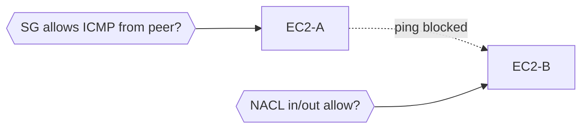

### Q4. Application not reachable from the internet

Trace the packet layer by layer — each layer must allow the traffic: **Internet → IGW → Route Table → NACL → Security Group → EC2**. A single blocked layer drops the request. Verify IGW attached, public route `0.0.0.0/0 → IGW`, NACL inbound/outbound (stateless — needs both directions), SG inbound port, and that the instance has a public/Elastic IP.

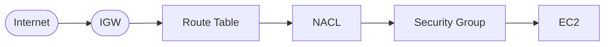

### Q5. Design a VPC for a secure 3-tier application (Web/App/DB)

Three subnet tiers across multiple AZs for HA. **Web tier** (ALB) in public subnets; **App tier** (EC2/containers) in private subnets; **DB tier** (RDS) in isolated private subnets with no internet route. Traffic flows strictly downward; SGs reference each other so only the tier above can talk to the tier below.

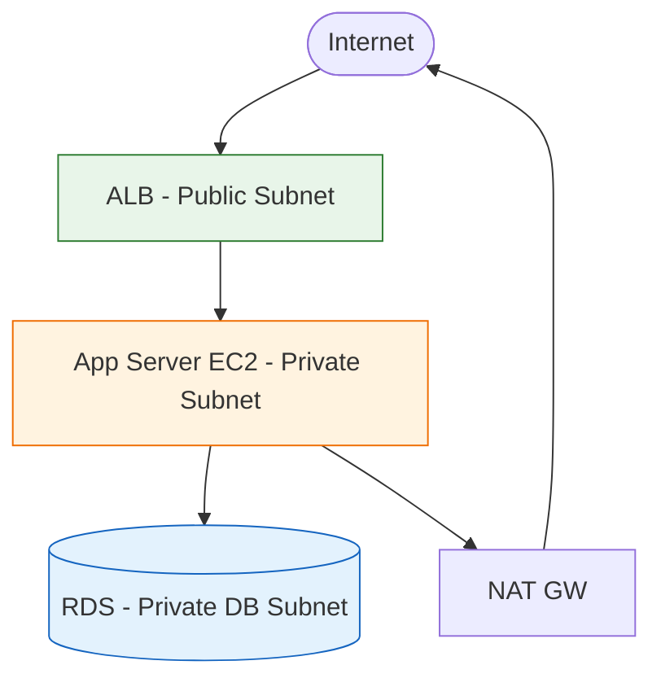

### Q6. EC2 can't connect to RDS in the same VPC (connection timeout)

Same VPC means routing is fine, so it is almost always a **firewall or DB config** issue. Check: RDS Security Group inbound allows the **EC2's SG** on port 3306/5432; NACLs on both subnets; route table; the RDS **DB Subnet Group** covers the right subnets; and DNS resolution is enabled on the VPC.

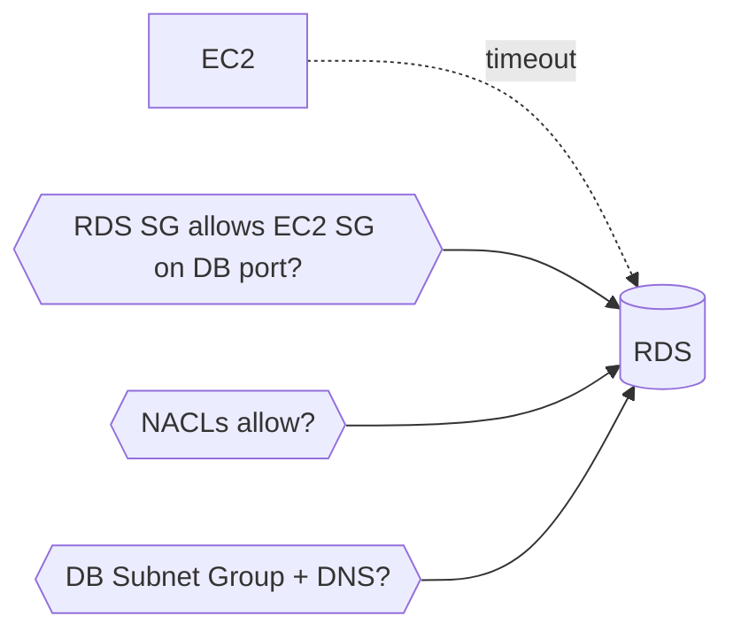

### Q7. VPC Peering between two VPCs (different regions/accounts)

Create a peering connection and **accept** it on the other side. Peering is not transitive and needs routes on **both** sides. Add routes pointing the peer's CIDR to the peering connection in each VPC's route table, open SGs/NACLs for the peer CIDR, and ensure **no overlapping CIDR** blocks.

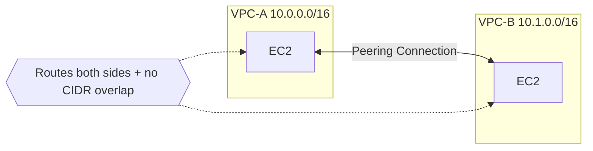

### Q8. Can reach EC2 from internet, but instance can't reach out (traffic not returning)

Inbound works but responses don't come back — classic **NACL asymmetry**. NACLs are stateless, so the outbound rule must allow **ephemeral ports (1024–65535)** for return traffic. Check the return route in the route table and NACL outbound ephemeral range.


### Q9. Private access to S3 without going over the internet

Use a **Gateway VPC Endpoint** for S3. It adds a prefix-list route to the route table so S3 traffic stays on the AWS backbone — no NAT/IGW needed. Check the endpoint policy, the route table association, the SG (for interface endpoints), and the S3 bucket policy.

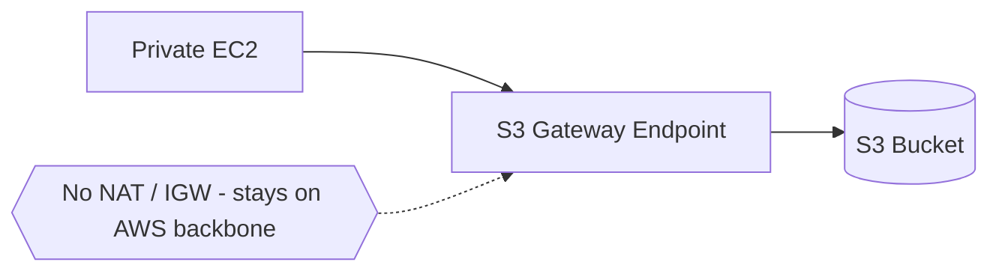

### Q10. Monitor and troubleshoot VPC network issues

Layer your observability: **VPC Flow Logs** for accept/reject per flow, **CloudWatch metrics** for NAT/endpoint throughput, **Reachability Analyzer** to prove a path config-wise, **Traffic Mirroring** for deep packet capture, and `ping`/`traceroute` from inside for live checks.

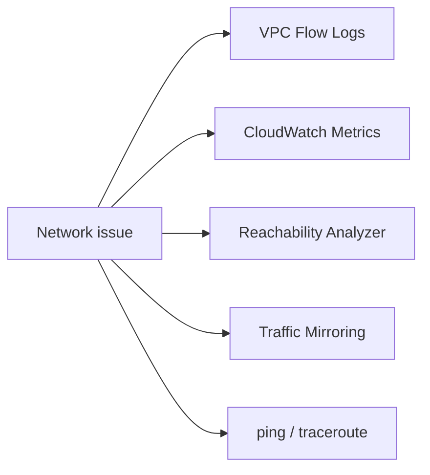

---

## 2. AWS Subnets, Security Groups & Routes — Scenarios

### Q1. Launched EC2 in a public subnet but can't SSH from your laptop

Check the full inbound path: route table has `0.0.0.0/0 → IGW`, IGW is attached, **SG inbound allows SSH (22)** from your IP, NACL allows inbound 22 **and** outbound ephemeral (stateless), and the instance has a public/Elastic IP.


### Q2. Private-subnet EC2 can't get updates

Same as VPC Q2 — needs `0.0.0.0/0 → NAT GW`, NAT GW in a public subnet, IGW attached, and NACL/SG outbound rules.

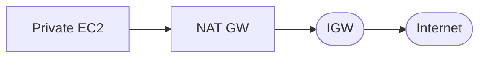

### Q3. Two EC2 in different subnets can't communicate

Now routing matters (cross-subnet). Confirm the VPC **local route** exists (it does by default), SGs allow the traffic in both directions, NACLs on both subnets permit it, and there's **no overlapping CIDR** confusion.

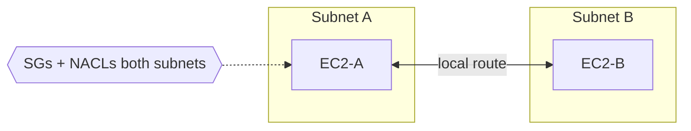

### Q4. Restrict access to only your office IP

Tighten the **Security Group inbound rule** to your office CIDR (e.g. `203.0.113.10/32`) instead of `0.0.0.0/0`. Optionally add a NACL deny as an extra stateless layer. Route table stays unchanged.


### Q5. Added an inbound SG rule but traffic still blocked

Multiple layers can still block it: correct SG attached to the instance, right port/protocol, **NACL** allowing it, route table correct, and the **OS-level firewall** (iptables/firewalld) not blocking.

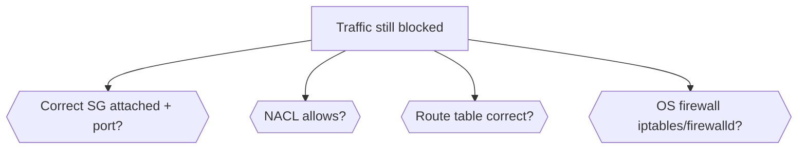

### Q6. Private-subnet instances need S3 without internet

Create an **S3 Gateway Endpoint**, attach it to the route table, no NAT/IGW required. Add SG rules (for interface endpoints) and a bucket policy if restricted.

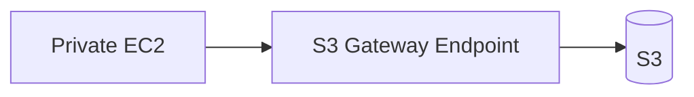

### Q7. Public-subnet app can access RDS in private subnet but times out

Check RDS SG inbound allows the **EC2 SG**, EC2 SG outbound allows the DB port, NACLs on both subnets, route tables (local route), and the RDS subnet group points at the correct private subnets.

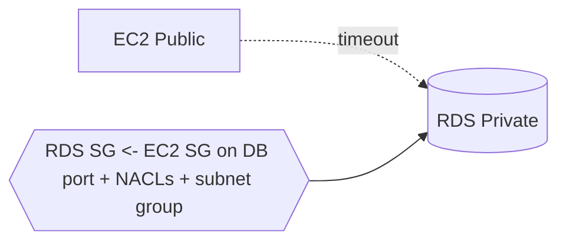

### Q8. IGW attached but instances still have no internet

Usually a **missing route** or association. Check route table actually has `0.0.0.0/0 → IGW`, the subnet is **associated** with that route table, the IGW is attached to the correct VPC, instance has a public IP, and Source/Dest check.

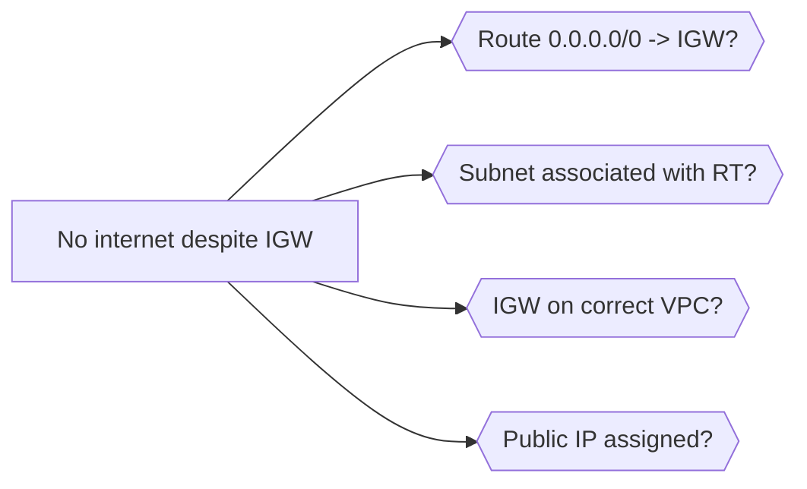

### Q9. Custom route exists but traffic still not going through

Routing uses **Longest Prefix Match** — a more specific route wins. Check for a conflicting specific route, correct target, route propagation (VGW/TGW), and that the subnet is associated with the intended route table.

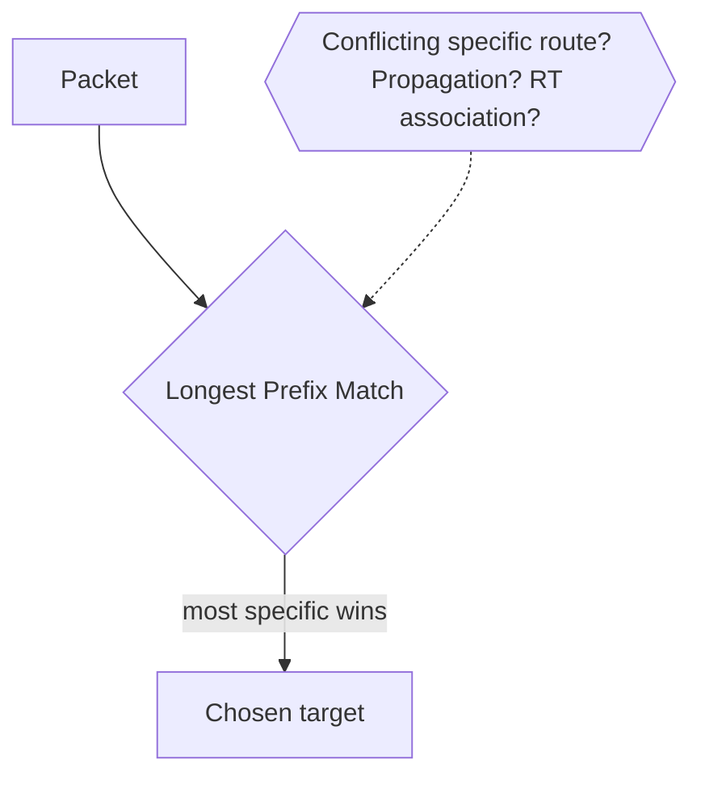

### Q10. Isolate Dev/Test/Prod in the same VPC

Give each environment its **own subnets** (e.g. `10.0.1.0/24`, `10.0.2.0/24`, `10.0.3.0/24`), separate route tables, SGs that restrict cross-env access, an extra NACL layer, and shared services in a separate subnet if needed.

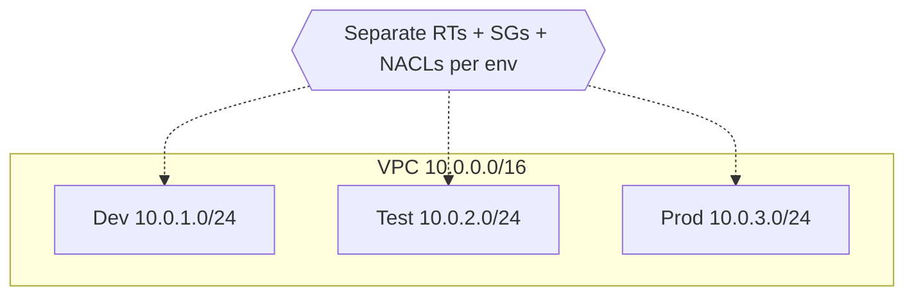

---

## 3. Linux & Fundamentals

### Q1. Hard link vs soft (symbolic) link

A **hard link** points directly to the same inode as the original — deleting the original doesn't break it, and both share the same data on disk. A **soft link** is a pointer to the file *path*; if the original is deleted/moved the symlink breaks. Hard links can't cross filesystems or link directories; symlinks can.

```mermaid
flowchart LR
    HL[Hard link] --> INODE[(Inode / data)]
    ORIG[Original file] --> INODE
    SL[Soft link] --> PATH[/path/to/file] --> ORIG
```

### Q2. Check which process is using a specific port

```bash
sudo lsof -i :PORT
sudo ss -tulpn | grep PORT     # modern
sudo netstat -tulpn | grep PORT
```
Shows the PID and process bound to the port — useful for `address already in use` errors.

```mermaid
flowchart LR
    Q[Which PID owns the port?] --> LSOF[lsof -i :PORT]
    Q --> SS[ss -tulpn]
    LSOF --> PID[PID + process name]
    SS --> PID
```

### Q3. Linux boot process

```mermaid
flowchart LR
    A[BIOS/UEFI POST] --> B[Bootloader GRUB] --> C[Kernel loads] --> D[Mounts root FS] --> E[init/systemd PID 1] --> F[Targets/services in dependency order] --> G[Login / display manager]
```

### Q4. Process vs thread

A **process** is an independent execution unit with its own memory space. **Threads** are lightweight units inside a process that share memory but keep their own stack. Threads are cheaper to create and communicate faster, but a crash in one can take down the whole process.

```mermaid
flowchart TB
    subgraph P[Process - own memory space]
        T1[Thread 1 - own stack]
        T2[Thread 2 - own stack]
        SHARED[(Shared memory/heap)]
        T1 --- SHARED
        T2 --- SHARED
    end
```

### Q5. Find and kill a process consuming high CPU

```bash
top            # or htop, sort by CPU
ps aux --sort=-%cpu | head
kill -15 PID   # graceful (SIGTERM)
kill -9 PID    # force (SIGKILL)
```

```mermaid
flowchart LR
    ID[top / htop / ps --sort=-%cpu] --> PID[Find PID] --> G[kill -15 graceful] -->|still stuck| F[kill -9 force]
```

### Q6. File permissions 755 and 644

**755 (rwxr-xr-x)** — owner full, group/others read+execute; typical for executables, scripts, directories. **644 (rw-r--r--)** — owner read/write, others read only; typical for regular files.

```mermaid
flowchart LR
    P755[755 rwxr-xr-x] --> U1[Owner: rwx]
    P755 --> G1[Group: r-x]
    P755 --> O1[Other: r-x]
    P644[644 rw-r--r--] --> U2[Owner: rw-]
    P644 --> G2[Group: r--]
    P644 --> O2[Other: r--]
```

### Q7. TCP vs UDP

**TCP** is connection-oriented, guarantees ordered/reliable delivery via handshake + acknowledgments — used for HTTP, SSH, databases. **UDP** is connectionless, faster, no delivery guarantee — used for DNS, video streaming, where speed beats reliability.

```mermaid
flowchart LR
    TCP[TCP - reliable, ordered, handshake] --> U1[HTTP / SSH / DB]
    UDP[UDP - fast, connectionless, no guarantee] --> U2[DNS / streaming / VoIP]
```

### Q8. Zombie process

A **zombie** has finished executing but still holds an entry in the process table because its parent hasn't read its exit status. It consumes no resources itself. Fix by getting the parent to call `wait()`, or by killing the misbehaving parent (children re-parent to init, which reaps them).

```mermaid
flowchart LR
    CHILD[Child exits] --> ZOMB[Zombie - entry remains] 
    PARENT[Parent] -->|wait reaps it| GONE[Entry removed]
    PARENT -.->|no wait| ZOMB
```

---

## 4. Git & Version Control

### Q9. git merge vs git rebase

**Merge** creates a new merge commit combining two histories — preserves full history but adds merge commits. **Rebase** replays your commits on top of the target branch — produces a linear, cleaner history but rewrites commit hashes, so never rebase shared/public branches.

```mermaid
flowchart TB
    subgraph Merge
        M1[main] --> MC[Merge commit]
        F1[feature] --> MC
    end
    subgraph Rebase
        R1[main] --> RC[feature commits replayed - linear]
    end
```

### Q10. Resolve a merge conflict

Git marks conflicts with `<<<<<<<`, `=======`, `>>>>>>>`. Manually edit to keep the correct code, remove the markers, `git add` the resolved file, then `git commit` (or `git rebase --continue` if mid-rebase).

```mermaid
flowchart LR
    C[Conflict markers] --> E[Edit + keep correct code] --> A[git add resolved] --> D[git commit / rebase --continue]
```

### Q11. git cherry-pick

Applies a **specific commit** from one branch onto another without merging the whole branch. Useful for hotfixes — pulling a single bug-fix commit into a release branch without unrelated changes.

```mermaid
flowchart LR
    subgraph Feature
        c1[commit A] --> c2[BUGFIX] --> c3[commit C]
    end
    c2 -. cherry-pick .-> REL[Release branch]
```

### Q12. git reset vs git revert

`git reset` moves the branch pointer backward — `--soft`/`--mixed` keep changes, `--hard` discards them; it **rewrites history** so it's unsafe on shared branches. `git revert` creates a **new commit** that undoes a previous one — safe for shared history.

```mermaid
flowchart LR
    RESET[git reset] -->|moves pointer, rewrites history| UNSAFE[Unsafe on shared]
    REVERT[git revert] -->|new inverse commit| SAFE[Safe on shared]
```

### Q13. Detached HEAD state

Happens when you check out a specific commit instead of a branch — HEAD points directly at a commit, not a branch ref. New commits here aren't attached to a branch and can be lost unless you create a new branch to save them.

```mermaid
flowchart LR
    HEAD[HEAD] --> COMMIT[(specific commit)]
    NEW[New commits] -.->|orphaned unless branched| LOST[Lost on checkout]
    FIX[git switch -c newbranch] --> SAVE[Saved]
```

### Q14. Undo the last commit but keep the changes

```bash
git reset --soft HEAD~1    # keeps changes staged
git reset --mixed HEAD~1   # (default) unstages them too
git reset --hard HEAD~1    # discards changes entirely
```

```mermaid
flowchart LR
    SOFT[--soft HEAD~1] --> STAGED[Changes kept staged]
    MIXED[--mixed HEAD~1] --> UNSTAGED[Changes kept unstaged]
    HARD[--hard HEAD~1] --> DISCARD[Changes discarded]
```

---

## 5. CI/CD Pipelines

### Q15. Continuous Delivery vs Continuous Deployment

**Continuous Delivery**: every change that passes automated tests is *deployable* to prod but requires a **manual approval/trigger** to release. **Continuous Deployment** goes further — every passing change is **automatically** deployed to prod with no human gate.

```mermaid
flowchart LR
    COMMIT[Commit] --> TEST[Automated tests]
    TEST --> CD1[Continuous Delivery: manual approval] --> PROD1[Prod]
    TEST --> CD2[Continuous Deployment: auto] --> PROD2[Prod]
```

### Q16. Walk through a CI/CD pipeline end to end

```mermaid
flowchart LR
    SRC[Source trigger push/PR] --> BUILD[Build] --> UT[Unit/static tests] --> ART[Artifact + version] --> IMG[Container build + push to registry] --> STG[Deploy to staging] --> IT[Integration tests] --> GATE[Manual/auto gate] --> PROD[Production]
    PROD --> RB[Rollback strategy]
```

### Q17. Handle secrets in a CI/CD pipeline

Never hardcode secrets in YAML or source. Use a **secrets manager** (Azure Key Vault, AWS Secrets Manager, HashiCorp Vault) or the CI's native store (GitHub Actions secrets, Jenkins credentials), inject at runtime as env vars, and restrict access via least-privilege service accounts.

```mermaid
flowchart LR
    VAULT[Secrets Manager / CI secret store] -->|inject at runtime| ENV[Env vars in job]
    ENV --> STEP[Pipeline step]
    LP{{Least-privilege service account}} -.-> VAULT
```

### Q18. GitHub Actions vs Jenkins

**GitHub Actions**: managed, YAML-based, cloud-hosted runners, tightly integrated with GitHub, low operational overhead, easy scaling. **Jenkins**: self-hosted, plugin-driven, highly customizable, full control but you manage infra/updates — great for on-prem and complex workflows.

```mermaid
flowchart LR
    GHA[GitHub Actions] --> A1[Managed, YAML, low overhead, GitHub-native]
    JEN[Jenkins] --> B1[Self-hosted, plugins, full control, on-prem]
```

### Q19. Rollback strategy in a pipeline

Keep the **last N versioned artifacts/images** and redeploy the previous known-good one; use **blue-green or canary** to switch traffic back instantly; or trigger an **automated rollback** on failed post-deploy health checks.

```mermaid
flowchart LR
    DEPLOY[New deploy] --> HC{Health checks pass?}
    HC -->|no| RB[Rollback: redeploy known-good N-1]
    HC -->|yes| KEEP[Keep]
    RB --> BG[Blue-green / canary traffic switch]
```

### Q20. Pipeline stages structured for speed

Typical: `build → test → security scan → package → deploy`. Speed it up: run independent jobs in **parallel**, **cache** dependencies between runs, **matrix** builds for multi-env testing, and **fail fast** on cheap checks (lint/unit) before expensive ones (integration).

```mermaid
flowchart LR
    B[Build] --> T[Test]
    T --> S[Security scan]
    S --> P[Package]
    P --> D[Deploy]
    FAST{{Parallel jobs + cache + matrix + fail-fast}} -.-> T
```

### Q21. Environment-specific config across dev/staging/prod

Externalize config from code with **env vars, ConfigMaps, or a parameter store** (AWS SSM, Azure App Configuration). Keep env-specific values out of the repo; use templating (Helm values files, Terraform workspaces) to inject the right values per environment.

```mermaid
flowchart LR
    CODE[Same code artifact] --> DEV[dev values]
    CODE --> STG[staging values]
    CODE --> PROD[prod values]
    STORE[(SSM / Key Vault / ConfigMaps)] --> DEV & STG & PROD
```

### Q22. Canary deployment

Route a **small percentage** of live traffic to the new version while most still hits stable; monitor error rate/latency, then gradually increase. Implemented via service mesh traffic splitting (Istio), weighted LB rules, or Argo Rollouts.

```mermaid
flowchart LR
    LB[Load Balancer] -->|95%| V1[Stable v1]
    LB -->|5% canary| V2[New v2]
    MON{Errors/latency OK?} -->|yes| RAMP[Increase to 100%]
    MON -->|no| ROLL[Roll back]
```

### Q23. Blue-green deployment

Two identical prod environments (**blue = current, green = new**) run in parallel. Traffic switches from blue to green **all at once** via LB or DNS after green is verified healthy — giving near-instant rollback by switching back.

```mermaid
flowchart LR
    LB[LB / DNS] -->|active| BLUE[Blue - current]
    GREEN[Green - new, verified] -.->|switch| LB
    LB -.->|instant rollback| BLUE
```

### Q24. Database migrations in a CI/CD pipeline

Use versioned migration tools (Flyway, Liquibase, ORM migrations) as a **separate pipeline step before** app deploy. Migrations must be **backward-compatible** so the old app version keeps working during rollout; destructive changes (drop column) go in a later separate release.

```mermaid
flowchart LR
    MIG[Migration step - backward compatible] --> APP[App deploy]
    APP --> LATER[Destructive changes in later release]
```

---

## 6. Docker & Containers

### Q25. Image vs container

An **image** is a read-only, immutable template (code + deps + filesystem layers). A **container** is a running/stopped **instance** of that image with its own writable layer, network, and process space.

```mermaid
flowchart LR
    IMG[Image - read-only template] -->|docker run| C1[Container 1 - writable layer]
    IMG -->|docker run| C2[Container 2 - writable layer]
```

### Q26. Reduce Docker image size

Use minimal base images (alpine, distroless), **multi-stage builds** to drop build tools, combine RUN commands to reduce layers, clean package caches in the same layer, and use `.dockerignore`.

```mermaid
flowchart LR
    BIG[Large image] --> A[Alpine/distroless base]
    BIG --> B[Multi-stage build]
    BIG --> C[Combine RUN + clean cache]
    BIG --> D[.dockerignore]
    A & B & C & D --> SMALL[Small image]
```

### Q27. Multi-stage builds

Multiple `FROM` statements in one Dockerfile — one stage compiles the app with full tooling, a final stage copies only the compiled artifact into a minimal runtime image. Drastically shrinks final size and attack surface.

```mermaid
flowchart LR
    S1[Stage 1: build - full toolchain] -->|copy artifact only| S2[Stage 2: minimal runtime]
    S2 --> FINAL[Slim final image]
```

### Q28. CMD vs ENTRYPOINT

**ENTRYPOINT** defines the fixed command that always runs when the container starts. **CMD** provides default arguments that can be overridden at runtime. Common pattern: ENTRYPOINT for the binary, CMD for default flags.

```mermaid
flowchart LR
    ENTRY[ENTRYPOINT - fixed binary] --> RUN[Container start]
    CMD[CMD - default args, overridable] --> RUN
```

### Q29. Container isolation without a full hypervisor

Containers use Linux kernel features — **namespaces** (PID, network, mount, UTS, IPC) to isolate what a process sees, and **cgroups** to limit/account CPU, memory, I/O. They share the host kernel, unlike VMs that virtualize hardware.

```mermaid
flowchart TB
    HOST[Host Kernel] --> NS[Namespaces: PID/net/mount/UTS/IPC]
    HOST --> CG[cgroups: CPU/mem/IO limits]
    NS & CG --> CONT[Isolated container]
```

### Q30. Persist data in Docker containers

Use **volumes** (managed by Docker, stored outside the writable layer) for production data, or **bind mounts** (map a host directory) for dev. Volumes survive container removal; the container's own writable layer doesn't.

```mermaid
flowchart LR
    CONT[Container] --> VOL[Volume - survives removal]
    CONT --> BM[Bind mount - host dir]
    CONT --> WL[Writable layer - lost on removal]
```

### Q31. What happens when a container's main process (PID 1) exits

The container **stops** — its lifecycle is tied to PID 1. If PID 1 crashes or completes, the whole container exits even if other background processes are still running inside.

```mermaid
flowchart LR
    PID1[PID 1 process] -->|exits/crashes| STOP[Container stops]
    OTHERS[Other bg processes] -. also killed .-> STOP
```

### Q32. Debug a container that keeps crashing (CrashLoopBackOff-style)

`docker logs <container>` for the exit error; run the image interactively `docker run -it --entrypoint /bin/sh <image>` to inspect filesystem/env/config; verify env vars and mounted config; check resource limits — OOM kills often look like crashes.

```mermaid
flowchart LR
    CRASH[Container crashing] --> L[docker logs - exit error]
    CRASH --> SH[docker run -it --entrypoint sh]
    CRASH --> ENV[Check env + mounts]
    CRASH --> OOM[Check resource limits/OOM]
```

---

## 7. Kubernetes

### Q33. Deployment vs StatefulSet

**Deployment** manages stateless, interchangeable pod replicas — no stable identity or storage. **StatefulSet** gives each pod a **stable network identity and persistent storage** that survives rescheduling — for databases, message queues, stateful workloads.

```mermaid
flowchart LR
    DEP[Deployment] --> ST[Stateless, interchangeable pods]
    STS[StatefulSet] --> ID[Stable identity pod-0, pod-1] 
    STS --> PV[Persistent storage per pod]
```

### Q34. Kubernetes control plane components

```mermaid
flowchart TB
    API[kube-apiserver - front door] --> ETCD[(etcd - cluster state store)]
    API --> SCHED[kube-scheduler - assigns pods to nodes]
    API --> CM[kube-controller-manager - reconciliation loops]
    API --> CCM[cloud-controller-manager - cloud APIs]
```

### Q35. Readiness probe vs liveness probe

A **liveness probe** checks if a container is still alive — on failure Kubernetes **restarts** it. A **readiness probe** checks if a container is ready to receive traffic — on failure the pod is **removed from service endpoints** but not restarted (useful during startup/temporary overload).

```mermaid
flowchart LR
    LIVE[Liveness fails] --> RESTART[Restart container]
    READY[Readiness fails] --> REMOVE[Remove from Service endpoints - no restart]
```

### Q36. How a Service routes traffic to pods

A Service selects pods via **label selectors** and gets a stable virtual IP (ClusterIP). `kube-proxy` programs iptables/IPVS rules on each node so traffic to the Service IP is load-balanced to healthy pod endpoints, tracked via Endpoints/EndpointSlice objects.

```mermaid
flowchart LR
    SVC[Service ClusterIP] -->|label selector| EP[Endpoints/EndpointSlice]
    KP[kube-proxy iptables/IPVS] --> P1[Pod 1]
    KP --> P2[Pod 2]
    SVC --> KP
```

### Q37. ConfigMap vs Secret

Both inject config into pods as env vars or volumes. **ConfigMaps** hold non-sensitive plain-text config; **Secrets** hold sensitive data and are base64-encoded (not encrypted at rest by default unless you enable etcd encryption or use an external secrets manager).

```mermaid
flowchart LR
    CM[ConfigMap - plain text] --> POD[Pod env/volume]
    SEC[Secret - base64, sensitive] --> POD
    ENC{{Enable etcd encryption / external manager}} -.-> SEC
```

### Q38. How Horizontal Pod Autoscaler (HPA) works

HPA watches metrics (CPU/memory or custom via metrics-server/Prometheus adapter) against a target threshold on a Deployment/StatefulSet, and automatically raises/lowers replica count within configured min/max bounds.

```mermaid
flowchart LR
    METRICS[metrics-server / Prometheus] --> HPA[HPA controller]
    HPA -->|current vs target| SCALE{Scale?}
    SCALE -->|up| MORE[More replicas]
    SCALE -->|down| FEWER[Fewer replicas]
    BOUND{{min/max bounds}} -.-> HPA
```

### Q39. DaemonSet vs Deployment

A **DaemonSet** ensures exactly one pod runs on every (or selected) node — for node-level agents like log collectors and monitoring exporters. A **Deployment** manages a desired replica count scheduled wherever, independent of node count.

```mermaid
flowchart LR
    DS[DaemonSet] --> N1[Node1: 1 pod]
    DS --> N2[Node2: 1 pod]
    DS --> N3[Node3: 1 pod]
    DEP[Deployment: N replicas] --> ANY[Scheduled anywhere]
```

### Q40. Troubleshoot a pod stuck in Pending

`kubectl describe pod` shows scheduling events. Common causes: insufficient CPU/memory on nodes, unsatisfied node affinity/taints, unbound PersistentVolumeClaims, or no node matching the pod's selector. Check `kubectl get events` and node resource availability.

```mermaid
flowchart TB
    PEND[Pod Pending] --> D[kubectl describe pod - events]
    PEND --> R{Cause?}
    R --> C1[Insufficient CPU/mem]
    R --> C2[Taints/affinity]
    R --> C3[Unbound PVC]
    R --> C4[No matching node]
```

### Q41. Taint and toleration

A **taint** on a node repels pods that don't tolerate it (e.g. dedicating nodes to specific workloads). A **toleration** on a pod allows (but doesn't force) it to be scheduled onto nodes with a matching taint.

```mermaid
flowchart LR
    NODE[Node with taint] -->|repels| POD1[Pod without toleration]
    NODE -->|allows| POD2[Pod with matching toleration]
```

### Q42. Kubernetes namespaces

Namespaces partition a cluster into **virtual sub-clusters** for resource organization, access control (via RBAC), and resource quotas — used to separate teams, environments (dev/staging/prod), or applications in a shared cluster.

```mermaid
flowchart TB
    CLUSTER[Cluster] --> NSD[ns: dev]
    CLUSTER --> NSS[ns: staging]
    CLUSTER --> NSP[ns: prod]
    RBAC{{RBAC + ResourceQuota per ns}} -.-> NSD
```

### Q43. Ingress vs Service

A **Service** (LoadBalancer/NodePort) exposes a single app's network access, typically at L4. An **Ingress** is an L7 routing ruleset (host/path-based routing, TLS termination) managed by an Ingress Controller (nginx, ALB), letting multiple services share a single external entry point.

```mermaid
flowchart LR
    NET([Internet]) --> ING[Ingress L7 - host/path/TLS]
    ING --> S1[Service A] --> P1[Pods]
    ING --> S2[Service B] --> P2[Pods]
```

### Q44. Troubleshoot high memory usage causing pod OOMKills

Check `kubectl describe pod` for OOMKilled status and exit code **137**, review resource requests/limits vs actual usage (metrics-server/Prometheus), check for memory leaks in app logs, and consider raising limits or optimizing the app's memory footprint.

```mermaid
flowchart LR
    OOM[OOMKilled exit 137] --> DESC[kubectl describe pod]
    OOM --> USE[Usage vs limits - metrics]
    OOM --> LEAK[App logs - memory leak?]
    OOM --> FIX[Raise limits / optimize app]
```

### Q45. Resource requests vs limits

**Requests** are what the scheduler guarantees/reserves for a container — used for bin-packing decisions. **Limits** are the hard ceiling; exceeding a **memory** limit triggers an OOMKill, while exceeding a **CPU** limit causes throttling (not a kill).

```mermaid
flowchart LR
    REQ[Requests - scheduler reserves] --> SCHED[Bin-packing]
    LIM[Limits - hard ceiling] --> MEM[Exceed memory -> OOMKill]
    LIM --> CPU[Exceed CPU -> throttle]
```

### Q46. Zero-downtime rolling update

Set appropriate `maxUnavailable` and `maxSurge` in the Deployment's RollingUpdate strategy, ensure **readiness probes** are configured so traffic isn't sent to unready pods, and use `preStop` hooks + graceful termination so in-flight requests finish before a pod is killed.

```mermaid
flowchart LR
    RU[RollingUpdate maxSurge/maxUnavailable] --> NEW[Spin up new pods]
    NEW --> RP{Readiness probe OK?}
    RP -->|yes| SHIFT[Shift traffic]
    SHIFT --> DRAIN[preStop + graceful term of old pods]
```

### Q47. PodDisruptionBudget (PDB)

A PDB limits how many pods of an app can be **voluntarily disrupted** at once (node drains, cluster upgrades, autoscaling), ensuring a minimum number stay available to prevent an outage during maintenance.

```mermaid
flowchart LR
    DRAIN[Node drain / upgrade] --> PDB{PDB: minAvailable respected?}
    PDB -->|yes| EVICT[Evict pod]
    PDB -->|no| WAIT[Block until safe]
```

---

## 8. Terraform & Infrastructure as Code

### Q48. Terraform state and why it matters

State is a JSON file mapping your configuration to real-world resources, tracking metadata and dependencies. Terraform uses it to know what exists, detect drift, and plan changes accurately — without it, Terraform can't determine what to create/update/destroy.

```mermaid
flowchart LR
    CFG[.tf config] --> STATE[(terraform.tfstate)] --> REAL[Real cloud resources]
    STATE --> DRIFT[Detect drift + plan]
```

### Q49. Manage Terraform state in a team environment

Use a **remote backend** — S3 + DynamoDB for locking, Azure Storage with state locking, or Terraform Cloud — so state is shared and locked to prevent concurrent writes, rather than local state files that cause conflicts and drift.

```mermaid
flowchart LR
    DEV1[Engineer 1] --> BE[(Remote backend S3+DynamoDB / Azure / TFC)]
    DEV2[Engineer 2] --> BE
    LOCK{{State locking prevents concurrent writes}} -.-> BE
```

### Q50. terraform plan vs terraform apply

`plan` shows a preview of changes (create/update/destroy) without touching infra — used for review. `apply` executes those changes against real infra and by default re-runs a plan first for confirmation.

```mermaid
flowchart LR
    PLAN[terraform plan - preview, no changes] --> REVIEW[Review]
    REVIEW --> APPLY[terraform apply - executes changes]
```

### Q51. Terraform modules

Reusable, self-contained groups of resources with defined inputs/outputs — like functions in programming. They standardize infra patterns (a VPC module, an AKS cluster module) and let you reuse them across projects and environments.

```mermaid
flowchart LR
    MOD[Module: inputs -> resources -> outputs] --> P1[Project A]
    MOD --> P2[Project B]
    MOD --> P3[Project C]
```

### Q52. State drift and how to handle it

Drift happens when real infra changes outside Terraform (manual console edits, other tools). Run `terraform plan` to detect it, then either `terraform apply` to bring infra back in line with code, or `terraform import`/update code to reflect the manual change as the new source of truth.

```mermaid
flowchart LR
    MANUAL[Manual change in console] --> DRIFT[Drift]
    DRIFT --> DETECT[terraform plan detects]
    DETECT --> A[apply - restore to code]
    DETECT --> B[import/update code - accept change]
```

### Q53. Handle secrets in Terraform code

Never hardcode secrets in `.tf` or commit them. Mark variables `sensitive = true`, pull values from a secrets manager (Vault, AWS Secrets Manager) via **data sources** at runtime, and ensure state files (which may contain sensitive values) are stored encrypted with restricted access.

```mermaid
flowchart LR
    VAULT[Secrets Manager] -->|data source at runtime| TF[Terraform]
    TF --> SENS[var sensitive=true]
    STATE[(Encrypted state, restricted access)] -.-> TF
```

### Q54. Terraform vs Ansible

**Terraform** is declarative infrastructure **provisioning** — creates/manages the lifecycle of cloud resources. **Ansible** is primarily configuration management/orchestration — installing software, changing config on existing servers. Many teams use Terraform to provision and Ansible to configure.

```mermaid
flowchart LR
    TF[Terraform - provision infra] --> INFRA[VPC, VMs, LBs]
    INFRA --> ANS[Ansible - configure]
    ANS --> SOFT[Packages, config, services]
```

### Q55. Purpose of terraform.tfstate locking

Locking prevents two people or pipeline runs from applying changes simultaneously, which could corrupt state or cause conflicting modifications. Remote backends (S3+DynamoDB, Terraform Cloud) handle this automatically during plan/apply.

```mermaid
flowchart LR
    RUN1[Apply run 1] -->|acquires lock| STATE[(State)]
    RUN2[Apply run 2] -->|blocked until released| STATE
```

### Q56. Terraform workspace and when to use one

Workspaces maintain multiple distinct state files from the **same configuration** — useful for dev/staging/prod with the same code but separate state. For larger differences between environments, separate directories/modules are usually cleaner than workspaces alone.

```mermaid
flowchart LR
    CFG[Same config] --> WD[workspace: dev -> state-dev]
    CFG --> WS[workspace: staging -> state-staging]
    CFG --> WP[workspace: prod -> state-prod]
```

### Q57. Safely destroy/recreate a specific resource

Use `terraform destroy -target=resource.name` for destruction, or `terraform taint resource.name` (or `-replace` in newer versions) to force recreation on the next apply — scoping the blast radius to just that resource instead of the whole state.

```mermaid
flowchart LR
    ONE[One resource] --> T[taint / -replace] --> APPLY[Next apply recreates only it]
    NOTE{{Blast radius scoped, rest untouched}} -.-> T
```

---

## 9. Cloud (AWS & Azure)

### Q58. AWS Security Group vs NACL

A **Security Group** is a **stateful, instance-level** firewall — return traffic is automatically allowed. A **NACL** is a **stateless, subnet-level** firewall where you must explicitly allow both inbound and outbound, evaluated in rule-number order.

```mermaid
flowchart LR
    SG[Security Group - stateful, instance-level] --> AUTO[Return traffic auto-allowed]
    NACL[NACL - stateless, subnet-level] --> BOTH[Must allow in AND out, by rule number]
```

### Q59. How Auto Scaling Groups work

An ASG maintains a **desired number** of EC2 instances based on scaling policies tied to CloudWatch metrics (CPU, request count) or schedules. It launches new instances from a launch template when scaling out and terminates them (respecting termination policies) when scaling in.

```mermaid
flowchart LR
    CW[CloudWatch metrics] --> ASG[ASG desired count]
    ASG -->|scale out| LT[Launch template -> new instances]
    ASG -->|scale in| TERM[Terminate instances]
```

### Q60. ALB vs NLB

**ALB** operates at **L7** — routes on HTTP path/host headers, ideal for microservices and content-based routing. **NLB** operates at **L4** — handles raw TCP/UDP with ultra-low latency and static IPs, ideal for extreme performance or non-HTTP protocols.

```mermaid
flowchart LR
    ALB[ALB - L7] --> H[HTTP path/host routing, microservices]
    NLB[NLB - L4] --> T[TCP/UDP, low latency, static IP]
```

### Q61. Secure access to an EKS cluster

Combine **IAM authentication** (aws-auth ConfigMap mapping IAM roles to Kubernetes RBAC), private API server endpoints or restricted CIDR access, Kubernetes **RBAC** for fine-grained permissions, and **network policies** to control pod-to-pod traffic.

```mermaid
flowchart TB
    IAM[IAM auth -> aws-auth ConfigMap] --> RBAC[K8s RBAC]
    PRIV[Private API endpoint / CIDR] --> API[EKS API server]
    NETPOL[Network Policies] --> POD[Pod-to-pod control]
    RBAC --> API
```

### Q62. Azure AKS vs self-managed Kubernetes

**AKS** is managed — Azure runs the control plane (masters, etcd, upgrades) at no charge for the control plane itself; you only manage worker nodes and workloads. **Self-managed** means you provision and maintain every component, including the control plane.

```mermaid
flowchart LR
    AKS[AKS] --> AZ[Azure manages control plane]
    AKS --> YOU1[You manage worker nodes]
    SELF[Self-managed] --> YOU2[You manage control plane + nodes]
```

### Q63. AWS shared responsibility model

AWS is responsible for security **'of' the cloud** — physical infra, hardware, virtualization layer. The customer is responsible for security **'in' the cloud** — data, IAM config, OS patching (for EC2), network config, and app-level security.

```mermaid
flowchart LR
    AWS[AWS: security OF the cloud] --> A1[Infra, hardware, virtualization]
    CUST[Customer: security IN the cloud] --> C1[Data, IAM, OS patching, network, app]
```

### Q64. Azure ARM templates vs Terraform

**ARM templates** are Azure-native, JSON-based, tightly integrated with Azure resource providers, no third-party dependency. **Terraform** is cloud-agnostic, uses HCL, and can manage multi-cloud + third-party resources in one workflow — at the cost of an extra provider abstraction layer.

```mermaid
flowchart LR
    ARM[ARM templates - JSON, Azure-native] --> AZONLY[Azure only]
    TF[Terraform - HCL, agnostic] --> MULTI[Multi-cloud + 3rd party]
```

### Q65. Design a highly available multi-AZ architecture on AWS

Deploy across at least two/three AZs with an **ALB** distributing traffic, an **Auto Scaling Group** spanning those AZs, a **Multi-AZ RDS** instance (or read replicas) for the DB tier, and S3/CloudFront for static assets — eliminating single points of failure at each tier.

```mermaid
flowchart TB
    ALB[ALB - multi-AZ]
    ALB --> A1[ASG AZ-1]
    ALB --> A2[ASG AZ-2]
    A1 & A2 --> RDS[(Multi-AZ RDS)]
    CF[CloudFront + S3] --> STATIC[Static assets]
```

### Q66. IAM least privilege and enforcing it practically

Grant only the exact permissions needed, nothing more. In practice: scoped IAM policies instead of wildcard actions/resources, prefer roles over long-lived access keys, regularly audit with **IAM Access Analyzer**, and use permission boundaries for delegated admin.

```mermaid
flowchart LR
    LP[Least privilege] --> SCOPE[Scoped policies, no wildcards]
    LP --> ROLE[Roles over long-lived keys]
    LP --> AUDIT[IAM Access Analyzer audits]
    LP --> PB[Permission boundaries]
```

### Q67. S3 bucket policy vs IAM policy

An **IAM policy** is attached to a user/role/group and defines what that identity can do across AWS. A **bucket policy** is attached directly to the S3 bucket and defines which principals can access it — useful for cross-account access or public access control; evaluated together with IAM policies.

```mermaid
flowchart LR
    IAM[IAM policy -> identity] --> WHAT[What identity can do across AWS]
    BP[Bucket policy -> bucket] --> WHO[Who can access this bucket]
    IAM & BP --> EVAL[Evaluated together]
```

---

## 10. GitOps & ArgoCD

### Q68. GitOps vs traditional CI/CD push

GitOps treats **Git as the single source of truth** for desired state; an in-cluster agent (ArgoCD) continuously **pulls** and reconciles the cluster to match Git. Traditional CI/CD **pushes** changes from the pipeline — GitOps pulls changes in, giving auditability and easy rollback via Git history.

```mermaid
flowchart LR
    GIT[(Git - desired state)] --> AGENT[ArgoCD agent in cluster]
    AGENT -->|pull + reconcile| CLUSTER[Cluster]
    PIPE[Traditional CI/CD] -->|push| CLUSTER
```

### Q69. How ArgoCD detects and handles config drift

ArgoCD continuously compares live cluster state against desired state in Git. If they diverge (a manual `kubectl` change), it marks the app **OutOfSync** and — depending on sync policy — either alerts you or automatically re-syncs to bring the cluster back to match Git.

```mermaid
flowchart LR
    GIT[(Git desired)] --> CMP{Compare vs live}
    LIVE[Cluster live] --> CMP
    CMP -->|diverge| OOS[OutOfSync]
    OOS --> ALERT[Alert]
    OOS --> RESYNC[Auto re-sync]
```

### Q70. Automated sync vs manual sync in ArgoCD

**Manual sync** requires a person/external trigger to approve applying Git changes — a review gate. **Automated sync** applies changes as soon as they're detected in Git with no human step — faster but riskier without strong pre-merge review/testing.

```mermaid
flowchart LR
    CHANGE[Git change] --> MAN[Manual sync: human approves] --> APPLY1[Apply]
    CHANGE --> AUTO[Automated sync: no human] --> APPLY2[Apply]
```

### Q71. Roll back a bad deployment in a GitOps model

Revert the offending commit in Git (`git revert` to preserve history) and let ArgoCD/Flux automatically re-sync the cluster to the previous known-good state — the rollback is a **Git operation**, not a manual `kubectl`/helm command against the cluster.

```mermaid
flowchart LR
    BAD[Bad deploy] --> REVERT[git revert commit] --> GIT[(Git)] --> ARGOCD[ArgoCD re-syncs] --> GOOD[Known-good state]
```

---

## 11. Monitoring, Logging & Observability

### Q72. Monitoring vs observability

**Monitoring** watches known metrics/dashboards to detect predefined problems. **Observability** is the broader ability to ask arbitrary questions about system behavior from logs, metrics, and traces to debug unknown issues — monitoring tells you *something* is wrong, observability helps you find out *why*.

```mermaid
flowchart LR
    MON[Monitoring - known metrics] --> WRONG[Something is wrong]
    OBS[Observability - logs+metrics+traces] --> WHY[Why is it wrong]
```

### Q73. Three pillars of observability

```mermaid
flowchart TB
    OBS[Observability]
    OBS --> M[Metrics - numeric time-series: CPU%, request rate]
    OBS --> L[Logs - discrete timestamped events]
    OBS --> T[Traces - end-to-end request paths]
    M & L & T --> RC[Detect, diagnose, root-cause]
```

### Q74. How Prometheus collects metrics

Prometheus uses a **pull model** — it scrapes HTTP `/metrics` endpoints on targets at configured intervals. Data is stored as time-series identified by a metric name plus key-value labels, enabling flexible querying and aggregation via **PromQL**.

```mermaid
flowchart LR
    PROM[Prometheus] -->|scrape /metrics| T1[Target 1]
    PROM -->|scrape /metrics| T2[Target 2]
    PROM --> TSDB[(Time-series DB)]
    TSDB --> PROMQL[PromQL queries]
```

### Q75. Alerting rules and avoiding alert fatigue

Alerting rules trigger notifications when metrics cross thresholds for a sustained period. Avoid fatigue by alerting on **symptoms that affect users** (not every internal metric), using appropriate `for` durations to avoid flapping, tuning severity levels, and routing non-urgent alerts to lower-priority channels.

```mermaid
flowchart LR
    METRIC[Metric crosses threshold] --> FOR[for: sustained duration]
    FOR --> SEV{Severity?}
    SEV -->|urgent, user-facing| PAGE[Page on-call]
    SEV -->|low| CHAN[Low-priority channel]
```

### Q76. Centralized logging for a Kubernetes cluster

Deploy a log-shipping agent as a **DaemonSet** (Fluentd, Fluent Bit, or Promtail) on every node to collect container/pod logs, forward to a centralized store (Elasticsearch, Loki, or a cloud-native service), and visualize/query via Kibana or Grafana.

```mermaid
flowchart LR
    N1[Node1 logs] --> DS[DaemonSet agent Fluentd/Fluent Bit/Promtail]
    N2[Node2 logs] --> DS
    DS --> STORE[(Elasticsearch / Loki)]
    STORE --> VIZ[Kibana / Grafana]
```

---

## 12. Security & DevSecOps

### Q77. Shift-left security

Integrating security checks **earlier** in the development lifecycle — static analysis, dependency scanning, and secret detection run at commit/PR time rather than only pre-production — catching vulnerabilities cheaply before they reach production.

```mermaid
flowchart LR
    COMMIT[Commit/PR: SAST, dep scan, secret detection] --> BUILD[Build] --> TEST[Test] --> PROD[Prod]
    NOTE{{Catch issues left = cheaper}} -.-> COMMIT
```

### Q78. Scan container images for vulnerabilities in a pipeline

Integrate a scanner (Trivy, Grype, or a registry-native scanner like ECR/ACR scanning) as a pipeline stage **after the image build**, fail the build on critical/high CVEs above a threshold, and re-scan periodically since new CVEs are discovered against existing images.

```mermaid
flowchart LR
    BUILD[Image build] --> SCAN[Trivy/Grype/ECR-ACR scan]
    SCAN --> GATE{Critical/High CVEs?}
    GATE -->|yes| FAIL[Fail build]
    GATE -->|no| PUSH[Push]
    RESCAN{{Periodic re-scan}} -.-> SCAN
```

### Q79. SAST vs DAST

**SAST** (Static Application Security Testing) analyzes source code for vulnerabilities without executing it — run early in CI. **DAST** (Dynamic) tests a running application from the outside, simulating real attacks — run later against a deployed staging environment.

```mermaid
flowchart LR
    SAST[SAST - static, source code, early CI] --> CODE[No execution]
    DAST[DAST - dynamic, running app, staging] --> ATTACK[Simulated attacks]
```

### Q80. Manage secrets rotation in production

Use a secrets manager (Vault, AWS Secrets Manager, Azure Key Vault) that supports **automated rotation**, configure apps to **fetch secrets dynamically** rather than baking them into images/config, and ensure rotation doesn't cause downtime by supporting overlapping validity windows for old/new credentials.

```mermaid
flowchart LR
    MGR[Secrets Manager - auto rotation] -->|dynamic fetch| APP[App]
    OLD[Old cred] -. overlap window .-> NEW[New cred]
    NEW --> APP
```

---

## 13. Networking & Config Management

### Q81. DNS and how resolution works

DNS translates human-readable domain names into IP addresses. A resolver queries a **root server → TLD server (.com, .in) → authoritative nameserver** for the domain, caching results along the way based on TTL to speed up future lookups.

```mermaid
flowchart LR
    CLIENT[Client] --> RES[Resolver]
    RES --> ROOT[Root server]
    ROOT --> TLD[TLD .com/.in]
    TLD --> AUTH[Authoritative NS]
    AUTH --> IP[IP address]
    RES -.->|cache TTL| CLIENT
```

### Q82. Forward proxy vs reverse proxy

A **forward proxy** sits in front of **clients**, forwarding their requests to the internet and hiding client identity (filtering/anonymity). A **reverse proxy** sits in front of **servers**, receiving client requests and routing them to backends — used for load balancing, TLS termination, caching (nginx, HAProxy).

```mermaid
flowchart LR
    C[Clients] --> FP[Forward proxy] --> NET([Internet])
    NET2([Clients]) --> RP[Reverse proxy] --> B1[Backend 1]
    RP --> B2[Backend 2]
```

### Q83. Ansible vs Terraform in your workflow

Ansible is **agentless** configuration management connecting over SSH to configure existing servers — installing packages, managing files, running tasks idempotently via YAML playbooks. In practice, Terraform provisions the infrastructure and Ansible configures the software on top.

```mermaid
flowchart LR
    TF[Terraform provisions infra] --> SERVERS[Servers/VMs]
    ANS[Ansible over SSH - agentless] --> SERVERS
    ANS --> CONF[Packages, files, config - idempotent]
```

### Q84. Idempotency in infrastructure automation

An idempotent operation produces the **same end state** no matter how many times it's run. It matters because pipelines and playbooks often re-run after partial failures — idempotency ensures re-running doesn't duplicate resources or break existing state.

```mermaid
flowchart LR
    RUN1[Run 1] --> STATE[Desired state]
    RUN2[Run 2] --> STATE
    RUN3[Run N] --> STATE
    NOTE{{Same result every time - safe re-runs}} -.-> STATE
```

### Q85. Troubleshoot a service unreachable over the network

Work through the layers: check the process is running (`systemctl status`), it's listening on the expected port (`ss -tulpn`), local firewall rules, security group/NACL rules if cloud-hosted, then test connectivity from the client side (`curl`/`telnet`/`nc`).

```mermaid
flowchart TB
    U[Unreachable] --> P[Process running? systemctl status]
    P --> L[Listening? ss -tulpn]
    L --> FW[Local firewall]
    FW --> SG[SG/NACL if cloud]
    SG --> CLIENT[Test from client: curl/telnet/nc]
```

### Q86. Load balancer Layer 4 vs Layer 7

**Layer 4** routes on IP address and port without inspecting content — fast, protocol-agnostic. **Layer 7** inspects application-layer content (HTTP headers, URL paths, cookies) to make smarter routing decisions — at the cost of more processing overhead.

```mermaid
flowchart LR
    L4[L4 LB - IP/port] --> FAST[Fast, protocol-agnostic]
    L7[L7 LB - headers/paths/cookies] --> SMART[Smart routing, more overhead]
```

### Q87. Subnet and CIDR notation

A subnet is a logical subdivision of a network. CIDR notation (e.g. `10.0.0.0/24`) specifies the network address plus a prefix length indicating how many bits are fixed for the network portion — `/24` means 256 addresses, with the remaining 8 bits available for hosts.

```mermaid
flowchart LR
    CIDR[10.0.0.0/24] --> NET[/24 network bits fixed]
    CIDR --> HOST[8 host bits -> 256 addresses]
```

### Q88. Ansible playbook and idempotency in it

A playbook is a YAML file defining a series of tasks to run against target hosts. Idempotency comes from Ansible modules **checking current state before acting** — e.g. the `package` module only installs if the package is absent, so re-running the playbook doesn't reinstall or error out.

```mermaid
flowchart LR
    PLAY[Playbook YAML tasks] --> MOD[Module checks current state]
    MOD -->|already correct| SKIP[No change]
    MOD -->|differs| ACT[Apply change]
```

---

## 14. Scenario & Behavioral

### Q89. A production deployment just broke the site — first three steps

1. **Roll back immediately** to the last known-good version to restore service (don't debug in prod while users are affected). 2. **Communicate status** to stakeholders. 3. Once stable, **investigate root cause** using logs/metrics from the failed deployment window.

```mermaid
flowchart LR
    BREAK[Prod broke] --> RB[1. Roll back to known-good]
    RB --> COMM[2. Communicate to stakeholders]
    COMM --> RCA[3. Root cause from logs/metrics]
```

### Q90. On-call incident where you don't immediately know the cause

**Stabilize first** (rollback, scale up, or failover) before diagnosing. Check recent changes (deployments, config) as the most likely cause, review dashboards for anomalies at time of impact, and escalate early rather than debugging alone under pressure if impact is severe.

```mermaid
flowchart LR
    INC[Incident, cause unknown] --> STAB[Stabilize: rollback/scale/failover]
    STAB --> CHG[Check recent changes]
    CHG --> DASH[Review dashboards at impact time]
    DASH --> ESC[Escalate early if severe]
```

### Q91. A time you improved a CI/CD pipeline's performance

Name a **concrete before/after** (e.g. "build went from 12 minutes to 4") and the specific technique: dependency caching, parallelizing test suites, using a leaner base image, or splitting a monolithic pipeline into independent jobs.

```mermaid
flowchart LR
    BEFORE[12 min build] --> TECH[Caching / parallel tests / leaner image / split jobs]
    TECH --> AFTER[4 min build]
```

### Q92. How you decide what to automate vs do manually

Automate anything repetitive, error-prone when done by hand, or time-sensitive (deployments, scaling, backups). Keep **manual gates** for high-risk, infrequent, or judgment-requiring actions (prod DB schema changes, major architecture shifts) until enough confidence is built to automate safely.

```mermaid
flowchart LR
    TASK[Task] --> Q{Repetitive / error-prone / time-sensitive?}
    Q -->|yes| AUTO[Automate]
    Q -->|high-risk / rare / judgment| MAN[Manual gate]
```

### Q93. Keep infrastructure costs under control in the cloud

**Right-size** resources based on actual utilization data, use auto-scaling instead of static over-provisioning, leverage **spot/reserved** instances for predictable or fault-tolerant workloads, set cost alerts/budgets, and regularly audit for unused resources (orphaned volumes, idle load balancers).

```mermaid
flowchart TB
    COST[Cost control]
    COST --> RS[Right-size by utilization]
    COST --> AS[Auto-scale vs over-provision]
    COST --> SR[Spot / reserved instances]
    COST --> AL[Cost alerts/budgets]
    COST --> AUD[Audit unused resources]
```

### Q94. Approach to writing documentation for infrastructure

Document the **'why'** not just the 'what' — architecture decisions and trade-offs, not just command lists. Keep it close to the code (README in the repo, comments in Terraform modules) so it stays in sync, and include a **runbook** for common failure scenarios.

```mermaid
flowchart LR
    DOC[Documentation] --> WHY[Why: decisions + trade-offs]
    DOC --> CLOSE[Close to code: README, TF comments]
    DOC --> RB[Runbook for failures]
```

### Q95. Handle a disagreement with a developer about a deployment process

Focus on the **shared goal** (reliable, fast delivery) rather than the disagreement itself, back your position with **data** (deployment failure rates, incident history) rather than opinion, and stay open to their constraints — a good process has to work for both dev velocity and operational stability.

```mermaid
flowchart LR
    DIS[Disagreement] --> GOAL[Shared goal: reliable+fast delivery]
    GOAL --> DATA[Back with data, not opinion]
    DATA --> OPEN[Open to their constraints]
    OPEN --> AGREE[Process that serves both]
```

### Q96. Metrics to measure DevOps success (DORA)

The **DORA metrics** are the industry standard: deployment frequency, lead time for changes, change failure rate, and mean time to recovery (MTTR). Together they balance speed (how fast you ship) against stability (how safely you ship).

```mermaid
flowchart TB
    DORA[DORA metrics]
    DORA --> DF[Deployment frequency]
    DORA --> LT[Lead time for changes]
    DORA --> CFR[Change failure rate]
    DORA --> MTTR[Mean time to recovery]
    DF & LT --> SPEED[Speed]
    CFR & MTTR --> STAB[Stability]
```

### Q97. Plan and execute a zero-downtime infrastructure migration

Run old and new environments in **parallel**, replicate data continuously to the new system, gradually **shift traffic** (DNS weighting or LB rules) while monitoring errors/latency, and keep the old environment as a fallback until the new one is proven stable under full production load.

```mermaid
flowchart LR
    OLD[Old env] --> REPL[Continuous data replication] --> NEW[New env]
    LB[DNS/LB weighting] -->|gradual shift| NEW
    LB -.->|fallback until proven| OLD
```

### Q98. The most difficult production outage you've handled

A strong answer names the **specific failure**, the diagnosis steps taken under pressure, the fix, and — most importantly — a concrete process/tooling change made afterward (better alerting, a new runbook, added redundancy) so the same failure mode won't recur.

```mermaid
flowchart LR
    FAIL[Specific failure] --> DIAG[Diagnosis under pressure] --> FIX[Fix]
    FIX --> LEARN[Concrete change: alerting/runbook/redundancy]
    LEARN --> NORECUR[Failure mode won't recur]
```

### Q99. Stay current with the fast-moving DevOps/cloud landscape

A credible answer names **specific habits** — following release notes for tools you use daily (Kubernetes, Terraform providers), hands-on labs for new certifications, and applying new patterns in side projects before adopting them in production — rather than a vague "I read a lot."

```mermaid
flowchart LR
    STAY[Stay current] --> RN[Release notes for daily tools]
    STAY --> LABS[Hands-on labs + certs]
    STAY --> SIDE[Side projects before prod adoption]
```

### Q100. Where the DevOps role is evolving over the next few years

Talking points: **platform engineering** absorbing much of traditional DevOps into self-service internal developer platforms, deeper **AI-assisted automation** in incident response and code review, and continued consolidation around **GitOps and policy-as-code** as the default operating model.

```mermaid
flowchart LR
    EVO[DevOps role evolving]
    EVO --> PE[Platform engineering + IDPs]
    EVO --> AI[AI-assisted automation]
    EVO --> GO[GitOps + policy-as-code default]
```

---

## 15. Kubernetes Probes — Deep Dive

Probes let Kubernetes understand application health. Without them, Kubernetes can't know if an app crashed, isn't ready, or is still starting.

| Probe | Checks | Question it answers | Failure result |
|-------|--------|---------------------|----------------|
| **Liveness** | Is the app alive? | "Is my application dead?" | Restart container |
| **Readiness** | Is the app ready for traffic? | "Can my app handle requests?" | Remove from Service endpoints |
| **Startup** | Has the app started? | "Give my app enough time to boot." | Keep waiting (liveness/readiness disabled until it passes) |

### How each probe flows

```mermaid
flowchart TB
    KUBELET[Kubelet]
    KUBELET --> LP[Liveness Probe]
    KUBELET --> RP[Readiness Probe]
    KUBELET --> SP[Startup Probe]

    LP -->|Success| LA[Alive]
    LP -->|Fail| LR[Restart Container]

    RP -->|Success| RT[Receive Traffic]
    RP -->|Fail| RS[Stop Traffic - remove from endpoints]

    SP -->|Success| SE[Enable Liveness and Readiness]
    SP -->|Fail| SW[Keep Waiting]
```

### Startup probe protects slow-starting apps

Until the startup probe succeeds, liveness and readiness probes are disabled — so a slow-booting app isn't killed by liveness before it finishes starting.

```mermaid
flowchart LR
    START[Container starts] --> SP{Startup probe passes?}
    SP -->|no| WAIT[Keep waiting - L/R disabled]
    WAIT --> SP
    SP -->|yes| ENABLE[Enable Liveness + Readiness]
```

### Best practices

- Set appropriate `initialDelaySeconds`.
- Avoid aggressive probe intervals (they add load and cause false restarts).
- Use HTTP / TCP / Exec probe types appropriately for the workload.
- Use **liveness** for crash detection, **readiness** for traffic control, **startup** for slow-boot apps.

```mermaid
flowchart LR
    L[Liveness] --> CD[Crash detection]
    R[Readiness] --> TC[Traffic control]
    S[Startup] --> SB[Slow boot apps]
```

---

## 16. Common Network Ports Reference

Every DevOps engineer should know these by heart — they come up in firewall rules, security groups, and troubleshooting.

| Service | Port | Notes |
|---------|------|-------|
| HTTP | 80 | Web traffic |
| HTTPS | 443 | Secure web traffic |
| SSH | 22 | Secure shell / remote access |
| FTP | 21 | File transfer |
| MySQL | 3306 | Database |
| Kubernetes API Server | 6443 | K8s control plane |
| Docker Daemon API | 2375 / 2376 | 2375 plain, 2376 TLS |
| MongoDB | 27017 | Database |
| NGINX | 80 / 443 | Web server / reverse proxy |
| Grafana | 3000 | Monitoring dashboard |
| Prometheus | 9090 | Metrics collection |
| Tomcat | 8080 | Java application server |
| Apache Kafka | 9092 | Event streaming |
| Redis | 6379 | In-memory data store |
| RDP | 3389 | Remote Desktop Protocol |
| ElasticSearch API | 9200 | Search & analytics |
| Jenkins | 8080 | CI/CD automation |
| SMTP | 25 | Email sending |

### Grouped mental model

```mermaid
flowchart TB
    WEB[Web / Proxy] --> HTTP[HTTP 80]
    WEB --> HTTPS[HTTPS 443]
    WEB --> NGINX[NGINX 80/443]
    WEB --> TOMCAT[Tomcat 8080]

    REMOTE[Remote access] --> SSH[SSH 22]
    REMOTE --> RDP[RDP 3389]
    REMOTE --> FTP[FTP 21]

    DATA[Data stores] --> MYSQL[MySQL 3306]
    DATA --> MONGO[MongoDB 27017]
    DATA --> REDIS[Redis 6379]
    DATA --> ES[Elasticsearch 9200]

    PLATFORM[Platform / DevOps] --> K8S[K8s API 6443]
    PLATFORM --> DOCKER[Docker API 2375/2376]
    PLATFORM --> JENKINS[Jenkins 8080]
    PLATFORM --> KAFKA[Kafka 9092]

    MONITOR[Monitoring] --> GRAF[Grafana 3000]
    MONITOR --> PROM[Prometheus 9090]
```

> Tip: These are defaults. Always follow security best practices and expose only what is necessary.

---

## 17. 10 Production kubectl Checks

The checks every cluster should pass before going live.

### 1. Image tag — `:latest` breaks reproducibility (silent rollout failures)

```bash
kubectl get pods -o jsonpath='{.items[*].spec.containers[*].image}' | tr ' ' '\n' | grep :latest
```

### 2. Resource limits — no limits = one pod can starve the whole node

```bash
kubectl describe pod <pod-name> | grep -A 4 "Limits:"
```

### 3. Replica count — 1 replica = node drain = guaranteed downtime

```bash
kubectl get deploy -A | awk 'NR>1 && $4 < 2 {print $1,$2}'
```

### 4. Restart count — restarts > 5 = your app is crashing silently right now

```bash
kubectl get pods -A --sort-by='.status.containerStatuses[0].restartCount'
```

### 5. Liveness probe — missing = a stuck pod keeps receiving live traffic

```bash
kubectl get pods -o json | jq '.items[] | select(.spec.containers[].livenessProbe == null) | .metadata.name'
```

### 6. Pending pods — pending = users cannot reach your service

```bash
kubectl get pods -A | grep Pending
```

### 7. CrashLoopBackOff — production is on fire right now

```bash
kubectl get pods -A | grep -i CrashLoopBackOff
```

### 8. Events — unread events = debugging completely blind

```bash
kubectl get events -A --sort-by='.metadata.creationTimestamp' | tail -20
```

### 9. Node pressure — memory pressure = pod evictions incoming

```bash
kubectl describe nodes | grep -E "MemoryPressure|DiskPressure" | grep True
```

### 10. Resource requests — no requests = scheduler places pods incorrectly

```bash
kubectl describe pod <pod-name> | grep -A 4 "Requests:"
```

### Pre-go-live check flow

```mermaid
flowchart TB
    START[Before going live] --> C1[1. No :latest tags]
    C1 --> C2[2. Resource limits set]
    C2 --> C3[3. Replicas >= 2]
    C3 --> C4[4. Restart count low]
    C4 --> C5[5. Liveness probes present]
    C5 --> C6[6. No Pending pods]
    C6 --> C7[7. No CrashLoopBackOff]
    C7 --> C8[8. Events reviewed]
    C8 --> C9[9. No node pressure]
    C9 --> C10[10. Resource requests set]
    C10 --> LIVE[Cluster ready]
```

---

*End of documentation. Answers are written in your own words for interview delivery — pair each Mermaid diagram with the spoken explanation to anchor recall.*

---

## 18. Terraform — "What have you built?" (Model Answer)

**How to frame it:** describe the *resources* you provision, the *modular structure*, a concrete *example*, and how you handle *state* — then close with the *business value*. This is a strong narrative answer for "What infrastructure have you built using Terraform?"

> In my current project I use Terraform to provision and manage AWS infrastructure. I organize the code as **reusable modules** so the same pattern deploys consistently across dev/staging/prod. For an EC2 server, instead of clicking in the console I define the parameters (instance type, AMI, subnet, security group, IAM role, storage) in Terraform and run it through our automation. I also manage **remote state** securely so multiple team members can work safely. Overall, Terraform standardizes provisioning, reduces manual work, and keeps environments consistent.

**Resources provisioned:** VPC, Subnets, Route tables, Internet Gateway, NAT Gateway, Security Groups, EC2, EBS volumes, S3 buckets, IAM roles/policies, Application Load Balancers, RDS, EFS, Route 53, EKS.

```mermaid
flowchart TB
    MOD[Reusable Terraform Modules]
    MOD --> NET[Network: VPC, Subnets, Route tables, IGW, NAT]
    MOD --> COMP[Compute: EC2, EBS, EKS, ALB]
    MOD --> DATA[Data: RDS, EFS, S3]
    MOD --> SEC[Security: Security Groups, IAM roles/policies]
    MOD --> DNS[DNS: Route 53]
    STATE[(Remote state - locked, encrypted)] -.-> MOD
    MOD --> ENVS[Consistent deploy across dev / staging / prod]
```

**Example — provisioning an EC2 via parameters not clicks:**

```mermaid
flowchart LR
    PARAMS["Params: instance_type, AMI, subnet, SG, IAM role, storage"] --> TF[terraform plan/apply]
    TF --> AUTO[CI automation runs workflow]
    AUTO --> EC2[EC2 created/updated]
    STATE[(Remote state)] -.-> TF
```

**Value delivered:** standardized infrastructure, less manual work, drift-free consistency across environments — infrastructure lives in code, not in the console.

---

## 19. Ansible — Top 5 Interview Questions

### Q1. What are Ansible facts and how do you customize them?

Ansible **facts** are system details automatically gathered by the `setup` module — OS, IP, memory, CPU, disks, etc. You customize them with **custom facts** placed in `/etc/ansible/facts.d/` as `.fact` files (INI/JSON) or executable scripts; they then appear under `ansible_local`.

```mermaid
flowchart LR
    SETUP[setup module] --> FACTS[Facts: OS, IP, memory...]
    CUSTOM["/etc/ansible/facts.d/*.fact (INI/JSON/script)"] --> LOCAL[ansible_local custom facts]
    FACTS & LOCAL --> PLAY[Usable in playbooks]
```

### Q2. How do you delegate a task to another host?

Use the **`delegate_to`** keyword to run a task on a host other than the current target — useful for running a command from a jump/bastion server, a central host, or a load balancer during rolling updates.

```mermaid
flowchart LR
    PLAY[Play targets web nodes] --> TASK["Task with delegate_to: jump_host"]
    TASK -->|runs on| JUMP[Jump / central host]
    JUMP -->|acts for| WEB[Web nodes]
```

### Q3. What is a role and why is it useful?

A **role** organizes playbooks, tasks, variables, handlers, and templates into a standard directory structure (`tasks/`, `vars/`, `handlers/`, `templates/`, `defaults/`). Roles make automation reusable, maintainable, and easy to share across teams.

```mermaid
flowchart TB
    ROLE[Role]
    ROLE --> T[tasks/]
    ROLE --> V[vars/ + defaults/]
    ROLE --> H[handlers/]
    ROLE --> TM[templates/]
    ROLE --> REUSE[Reusable, maintainable, shareable]
```

### Q4. How do you handle variables for different environments?

Use **`group_vars/`** and **`host_vars/`** directories to define variables per environment (dev/staging/prod). Use inventory files to group hosts, and **Ansible Vault** to encrypt sensitive environment-specific values.

```mermaid
flowchart LR
    INV[Inventory groups] --> GV[group_vars/dev, staging, prod]
    INV --> HV[host_vars/host1, host2]
    VAULT[Ansible Vault - encrypted secrets] --> GV
    GV & HV --> PLAY[Right values per environment]
```

### Q5. Ad-hoc commands vs playbooks

**Ad-hoc commands** are single, quick one-liners for simple tasks (`ansible all -m ping`). **Playbooks** are YAML files for complex, repeatable, multi-step automation with structure, error handling, and scalability.

```mermaid
flowchart LR
    ADHOC["Ad-hoc: ansible all -m ping"] --> QUICK[Quick one-off tasks]
    PLAYBOOK[Playbook YAML] --> COMPLEX[Repeatable multi-step, error handling, scale]
```

---

## 20. 50+ DevOps Troubleshooting Scenarios (Step-by-Step Runbooks)

These are **incident runbooks** — the systematic order to work a problem under pressure. Each Mermaid flow *is* the step-by-step method: read top to bottom. (Numbering follows the source; a few themes like CrashLoopBackOff and disk-full recur intentionally as reinforcement.)

### 1. CI Pipeline failing at Build stage

```mermaid
flowchart TB
    A[Check build logs for error] --> B[Verify code changes / dependencies]
    B --> C["Check build tool config (Maven/Gradle/npm)"]
    C --> D[Validate environment & required tools]
    D --> E[Re-run locally to reproduce]
    E --> F[Fix & commit -> re-run pipeline]
```

### 2. Deployment failed in Production

```mermaid
flowchart TB
    A[Check deployment logs / error message] --> B[Verify health checks / readiness probes]
    B --> C[Check recent code changes]
    C --> D[Rollback to last stable version]
    D --> E[Communicate with team]
    E --> F[Fix issue & re-deploy]
```

### 3. Application is Down / Not Accessible

```mermaid
flowchart TB
    A["Check service status (systemctl/docker/k8s)"] --> B[Verify logs for errors]
    B --> C["Check resource usage (CPU/Mem/Disk)"]
    C --> D[Check network / SG / firewall]
    D --> E[Validate DB / external service]
    E --> F[Restart service / pod if required]
    F --> G[Monitor & confirm resolution]
```

### 4. High CPU / Memory Usage

```mermaid
flowchart TB
    A[top / htop / free -m] --> B[Identify the high-usage process]
    B --> C[Analyze application logs]
    C --> D[Check for memory leaks / inefficient code]
    D --> E[Optimize config / scale resources]
    E --> F[Restart service if required]
    F --> G[Monitor after changes]
```

### 5. Database Connection Issues

```mermaid
flowchart TB
    A[Check DB service status] --> B[Verify connection string / credentials]
    B --> C["Test connectivity (telnet/nc/ping)"]
    C --> D[Check firewall / security group]
    D --> E[Verify DB logs for errors]
    E --> F[Check max connections / limits]
    F --> G[Restart DB / fix & re-test]
```

### 6. Docker Container Not Starting

```mermaid
flowchart TB
    A[docker ps -a for status] --> B[docker logs container_id]
    B --> C[Verify Dockerfile / image]
    C --> D[Check port conflicts / volume mounts]
    D --> E[Ensure required env variables]
    E --> F[Rebuild image if required]
    F --> G[Start container & verify]
```

### 7. Jenkins Build is Failing

```mermaid
flowchart TB
    A[Check build logs for the error] --> B[Identify failed stage / test case]
    B --> C[Verify code changes / dependencies]
    C --> D[Check Jenkins config & plugins]
    D --> E[Validate credentials / access rights]
    E --> F[Re-run with --debug if needed]
    F --> G[Fix in code/config -> commit, push, rebuild]
```

### 8. Kubernetes Pod in CrashLoopBackOff

```mermaid
flowchart TB
    A[kubectl get pods -n ns] --> B[kubectl describe pod]
    B --> C[kubectl logs pod --previous]
    C --> D["Identify root cause (config/code/resources)"]
    D --> E["Check resource limits (CPU/Memory)"]
    E --> F[Fix & update deployment]
    F --> G[kubectl rollout restart deploy -> monitor]
```

### 9. Pipeline Failing at Test Stage

```mermaid
flowchart TB
    A[Check test logs / report] --> B[Re-run test stage locally]
    B --> C[Check test data / environment]
    C --> D[Verify dependencies / service availability]
    D --> E[Fix failing test / code]
    E --> F[Commit & push -> re-run from failed stage]
    F --> G[Validate all tests pass]
```

### 10. High Memory Usage in Pod

```mermaid
flowchart TB
    A[kubectl top pods -n ns] --> B[Identify pod using high memory]
    B --> C[kubectl describe pod]
    C --> D[Check logs for leaks / OOMKilled]
    D --> E[Review application code / config]
    E --> F[Increase memory limit if required]
    F --> G[Rollout restart -> monitor again]
```

### 11. Secrets / Config Not Loading

```mermaid
flowchart TB
    A[kubectl get secret/configmap - exists?] --> B[Verify key-value pairs]
    B --> C[Deployment uses correct secret/config?]
    C --> D[Correct namespace & permissions]
    D --> E[Rollout restart deployment]
    E --> F[Check app logs for errors -> fix & monitor]
```

### 12. Service Not Accessible

```mermaid
flowchart TB
    A[kubectl get svc -n ns] --> B[kubectl get endpoints -n ns]
    B --> C[Verify pod is running & ready]
    C --> D[Check service selector / port config]
    D --> E[Test connectivity from inside cluster]
    E --> F[Check firewall / network policies]
    F --> G[Fix config & validate access]
```

### 13. Database is Slow / High Latency

```mermaid
flowchart TB
    A[Check DB CPU / memory / disk] --> B[Review slow queries / logs]
    B --> C[Check index usage / missing indexes]
    C --> D[Analyze connections / locks / waits]
    D --> E[Check query execution plan]
    E --> F[Optimize query / add indexes]
    F --> G[Scale DB / upgrade -> monitor]
```

### 14. Disk Space Full on Server

```mermaid
flowchart TB
    A[df -h] --> B[Identify large files / folders]
    B --> C[Clean logs / temp / cache]
    C --> D[Archive or delete old data]
    D --> E[Increase disk if required]
    E --> F[Set alerts + log rotation to prevent recurrence]
```

### 15. Build Success but Tests Failing

```mermaid
flowchart TB
    A[Check test logs / report] --> B[Re-run failed tests locally]
    B --> C[Identify recent code changes]
    C --> D[Check test data / environment]
    D --> E[Fix code or test data]
    E --> F[Re-run tests & validate -> trigger pipeline]
```

### 16. Rollback to Previous Version

```mermaid
flowchart TB
    A[Identify last working version] --> B[Use CI/CD tool to rollback]
    B --> C[Use old docker image / artifact]
    C --> D[Run DB rollback script if needed]
    D --> E[Verify application after rollback]
    E --> F[Communicate with stakeholders -> analyze cause]
```

### 17. Monitoring Alerts Not Working

```mermaid
flowchart TB
    A["Check monitoring tool (Prometheus/Grafana)"] --> B[Verify exporters / agents]
    B --> C[Check alert rule / configuration]
    C --> D["Confirm notification channel (Email/Slack)"]
    D --> E[Test alert rule manually]
    E --> F[Fix misconfig / restart -> validate alerts]
```

### 18. Permission Denied / Access Issue

```mermaid
flowchart TB
    A[Check user / role / group permissions] --> B[Verify access to server / repo / registry]
    B --> C[Check SSH key / token / credential]
    C --> D[Validate file / directory permissions]
    D --> E[Update permission & test again]
    E --> F[Document & follow least privilege]
```

### 19. Docker Image Build Failing

```mermaid
flowchart TB
    A[Check Dockerfile syntax / logs] --> B[Verify base image availability]
    B --> C[Check dependency / package errors]
    C --> D[Clear cache & rebuild image]
    D --> E[Test build locally]
    E --> F[Push to registry -> monitor build]
```

### 20. Kubernetes Pod in Pending State

```mermaid
flowchart TB
    A[kubectl get pods + describe pod] --> B[Check events for the reason]
    B --> C[Check resource limits / requests]
    C --> D[Verify node status & disk/memory]
    D --> E[Check taints / tolerations]
    E --> F[Check PVC / storage availability]
    F --> G[Fix issue & re-deploy]
```

### 21. Pod Keeps Restarting (CrashLoopBackOff)

```mermaid
flowchart TB
    A[kubectl get pods - status] --> B[kubectl describe pod]
    B --> C[kubectl logs pod --previous]
    C --> D["Identify root cause (config/code/resource)"]
    D --> E[Fix in code / config]
    E --> F[Update image & rebuild -> deploy]
    F --> G[Monitor pod till stable]
```

### 22. ImagePullBackOff

```mermaid
flowchart TB
    A[kubectl get pods - status] --> B[kubectl describe pod]
    B --> C[Check events for image pull error]
    C --> D[Verify image name / tag]
    D --> E[Check registry credentials / secret]
    E --> F[docker login to registry]
    F --> G[Push image if missing -> update secret & redeploy]
```

### 23. CI/CD Pipeline Succeeds but Deployment Failed

```mermaid
flowchart TB
    A[Check deployment logs / events] --> B[Verify image exists in registry]
    B --> C[Check values / config / secrets]
    C --> D[Check resource limits & quotas]
    D --> E[kubectl rollout status]
    E --> F[Rollback to last working version]
    F --> G[Fix & redeploy -> add validation in pipeline]
```

### 24. Service Down After Deployment

```mermaid
flowchart TB
    A[kubectl get svc - status] --> B[kubectl get pods - status]
    B --> C[kubectl get endpoints]
    C --> D[Check logs of pods]
    D --> E[Verify health probe config]
    E --> F[Check app / database connectivity]
    F --> G[Rollback if needed -> fix root cause & redeploy]
```

### 25. High CPU Usage in Pod

```mermaid
flowchart TB
    A[kubectl top pods] --> B[Describe pod & check requests/limits]
    B --> C[Check logs for leaks / heavy process]
    C --> D[Profile the application]
    D --> E[Optimize code / queries]
    E --> F[Increase resource limit if required]
    F --> G[Restart pod / rollout -> monitor]
```

### 26. Node Not Ready in Kubernetes

```mermaid
flowchart TB
    A[kubectl get nodes - status] --> B[kubectl describe node]
    B --> C[Check kubelet & system logs]
    C --> D[Check disk / memory / network usage]
    D --> E[Restart kubelet or node if required]
    E --> F[Drain node & move pods]
    F --> G[Fix infra issue -> make it ready]
```

### 27. Database Connection Failure

```mermaid
flowchart TB
    A[Check DB service / pod status] --> B[Verify connection string / credentials]
    B --> C["Test from pod (nc/telnet/ping)"]
    C --> D[Check firewall / security group rules]
    D --> E[Check DB logs for errors]
    E --> F[Verify DB max connections / limits]
    F --> G[Fix & restart service -> monitor]
```

### 28. Disk Full on Server / Node

```mermaid
flowchart TB
    A[df -h] --> B["Find large files/folders (du -sh *)"]
    B --> C[Clear logs / cache / temp files]
    C --> D[Archive or delete old data]
    D --> E[Setup log rotation]
    E --> F[Increase disk if needed -> monitor & set alerts]
```

### 29. High Network Latency / Timeout

```mermaid
flowchart TB
    A["Check connectivity (ping/telnet)"] --> B[Check latency to external services]
    B --> C[Verify DNS resolution]
    C --> D[Check firewall / security group rules]
    D --> E[Review proxy / load balancer settings]
    E --> F[Check application logs for timeouts]
    F --> G[Optimize network / add retry -> monitor]
```

### 30. SSL Certificate Expired / Invalid

```mermaid
flowchart TB
    A[Check certificate expiry date] --> B[Verify certificate chain / CA]
    B --> C[Check domain name / SAN match]
    C --> D[Renew or request new certificate]
    D --> E[Update in server / LB / ingress]
    E --> F[Restart service & verify]
    F --> G[Monitor & set expiry alerts]
```

### 31. Log Files are Too Large

```mermaid
flowchart TB
    A[Check disk usage] --> B["Configure log rotation (logrotate)"]
    B --> C[Archive / compress old logs]
    C --> D[Set retention policy]
    D --> E[Clean temp / cache files]
    E --> F[Increase disk if needed -> monitor log size]
```

### 32. Container Keeps Exiting (CrashLoopBackOff)

```mermaid
flowchart TB
    A[Check pod status & describe pod] --> B[Check logs for error / stacktrace]
    B --> C["Verify resource limits (CPU/Memory)"]
    C --> D[Check liveness / readiness probes]
    D --> E[Fix configuration / code issue]
    E --> F[Rebuild image & redeploy -> monitor]
```

### 33. Database Performance is Slow

```mermaid
flowchart TB
    A[Check DB CPU / Memory / Disk] --> B[Review slow queries / logs]
    B --> C[Check index usage]
    C --> D[Verify connection pool settings]
    D --> E[Optimize queries / add indexes]
    E --> F[Scale DB / upgrade -> monitor metrics]
```

### 34. Configuration Changes Not Applied

```mermaid
flowchart TB
    A[Check if config file is updated] --> B[Verify env / configmap / secret]
    B --> C[Restart / rollout restart deployment]
    C --> D[Check if app reads latest config]
    D --> E[Clear cache if applicable]
    E --> F[Validate changes in running app]
```

### 35. Deployment Rollback Required

```mermaid
flowchart TB
    A[Identify last stable version] --> B["Rollback via CI/CD (or kubectl rollout undo)"]
    B --> C[Verify service is working]
    C --> D[Check logs & metrics]
    D --> E[Communicate with team]
    E --> F[Investigate root cause -> fix & redeploy]
```

### 36. CI Pipeline Triggered but Not Running

```mermaid
flowchart TB
    A[Check webhook / trigger configuration] --> B[Verify permissions / tokens]
    B --> C[Check CI server logs]
    C --> D[Verify branch / event filters]
    D --> E[Reconfigure & test trigger]
    E --> F[Monitor pipeline queue / status]
```

### 37. Secrets Exposed in Code / Repo

```mermaid
flowchart TB
    A["Identify exposed secret (key/token/pwd)"] --> B[Revoke the secret immediately]
    B --> C[Remove from code / repo history]
    C --> D[Scan repo for more secrets]
    D --> E["Use secret management (Vault/AWS SM/KMS)"]
    E --> F[Rotate secrets & update all envs]
    F --> G[Add pre-commit hooks / secret scanning]
```

### 38. Blue-Green Deployment Scenario

```mermaid
flowchart TB
    A[Deploy new version in Green] --> B[Run health checks / smoke tests]
    B --> C["Switch traffic Blue -> Green (LB/DNS)"]
    C --> D[Monitor application]
    D --> E[Keep Blue idle for rollback]
    E -->|issue| F[Rollback traffic to Blue]
    E -->|stable| G[Terminate old environment]
```

### 39. Autoscaling Not Working

```mermaid
flowchart TB
    A[Check HPA / ASG configuration] --> B["Verify metrics (CPU/Memory) available"]
    B --> C[Check min / max / target values]
    C --> D[Verify permissions for autoscaling]
    D --> E[Check logs for errors]
    E --> F[Test scaling manually -> fix config & monitor]
```

### 40. Build Successful but Tests Failing

```mermaid
flowchart TB
    A[Check test logs / reports] --> B[Identify failing test cases]
    B --> C[Check code changes / recent commits]
    C --> D[Verify test data & environment]
    D --> E[Re-run tests locally]
    E --> F[Fix & commit -> re-run pipeline, ensure pass]
```

### 41. Multiple Docker Containers Not Communicating

```mermaid
flowchart TB
    A[Check if containers on same network] --> B["Verify network config (bridge/custom)"]
    B --> C[Check container IPs & ports]
    C --> D[Verify service discovery / DNS]
    D --> E[Check firewall / security group rules]
    E --> F["Test with ping/curl -> fix network config"]
```

### 42. High Error Rate After Deployment

```mermaid
flowchart TB
    A[Check monitoring / alert dashboard] --> B[Identify error pattern & affected service]
    B --> C[Check recent changes / deployments]
    C --> D[Review logs / stacktrace]
    D --> E[Check external dependencies]
    E --> F[Rollback if required -> fix root cause & redeploy]
```

### 43. Jenkins Pipeline is Slow

```mermaid
flowchart TB
    A[Check current job duration report] --> B[Identify slow stages / steps]
    B --> C[Review build agents / resource usage]
    C --> D[Check for unnecessary steps / scripts]
    D --> E[Use caching / parallel builds]
    E --> F[Optimize checkout / test execution -> improve continuously]
```

### 44. Kubernetes Pod in CrashLoopBackOff (repeat)

```mermaid
flowchart TB
    A[kubectl get pods] --> B[kubectl describe pod]
    B --> C[kubectl logs pod --previous]
    C --> D["Identify root cause (error/config/resource)"]
    D --> E[Fix the issue]
    E --> F[Update deployment & redeploy -> monitor till stable]
```

### 45. Environment Variables Not Set

```mermaid
flowchart TB
    A[Check env var in config / deployment file] --> B[Verify in pod / container]
    B --> C[Check secret / configmap reference]
    C --> D[Restart / redeploy after adding]
    D --> E[Verify application logs]
    E --> F[Document & follow best practice]
```

### 46. Disk / Storage Full in Node

```mermaid
flowchart TB
    A[df -h] --> B[Identify large files / logs / images]
    B --> C[Clean old logs / temp / cache]
    C --> D[Prune unused docker images / containers]
    D --> E[Increase disk size if needed]
    E --> F[Setup log rotation & alerts]
```

### 47. Application Not Accessible After Deployment

```mermaid
flowchart TB
    A[Check service / pod status] --> B[Verify logs / error messages]
    B --> C[Check recent changes / deployments]
    C --> D[Validate config / environment variables]
    D --> E[Check database / external connectivity]
    E --> F[Verify ingress / DNS / firewall rules]
    F --> G[Rollback if needed -> fix root cause & redeploy]
```

### 48. Database Connection Timeout

```mermaid
flowchart TB
    A[Check database service status] --> B[Verify connection string / credentials]
    B --> C["Check network connectivity (SG/firewall/DNS)"]
    C --> D[Check DB max connections / limits]
    D --> E[Review slow queries / locks]
    E --> F[Optimize queries / connection pooling]
    F --> G[Restart DB if required -> monitor & set alerts]
```

### 49. Docker Image Build Failing (repeat)

```mermaid
flowchart TB
    A[Check Dockerfile syntax / errors] --> B[Verify base image availability]
    B --> C[Check dependencies / package install]
    C --> D[Review build logs for failure point]
    D --> E[Clear cache & rebuild image]
    E --> F[Test build locally -> push to registry & monitor]
```

### 50. Kubernetes Pod in Unknown State

```mermaid
flowchart TB
    A[Describe pod & check status] --> B[Check events / describe pod]
    B --> C[Review logs / previous logs]
    C --> D[Check node status & resource pressure]
    D --> E[Drain & move pod if node issue]
    E --> F[Restart / delete & recreate if required]
    F --> G[Check readiness / liveness probes -> fix & monitor]
```

### 51. CI Pipeline Stuck / Hanging

```mermaid
flowchart TB
    A[Check pipeline logs / stuck stage] --> B[Verify agent / runner status]
    B --> C[Check resource usage of agent]
    C --> D[Identify timeout / lock / script issue]
    D --> E[Cancel & rerun from last successful stage]
    E --> F[Optimize steps + add timeout/retry -> monitor perf]
```

### 52. SSL Certificate Not Trusted

```mermaid
flowchart TB
    A[Check certificate expiry date] --> B[Verify certificate chain / CA]
    B --> C[Check domain name / SAN match]
    C --> D[Update certificate in server / LB]
    D --> E[Restart service & verify]
    E --> F["Test using openssl / browser -> monitor & alert"]
```

### 53. Logs Not Available in Centralized System

```mermaid
flowchart TB
    A[Check log collector / agent status] --> B[Verify agent config / permissions]
    B --> C[Check network connectivity to ELK / Loki]
    C --> D[Review log shipping / indexing errors]
    D --> E[Verify index pattern / time range]
    E --> F[Restart agent / service]
    F --> G[Test log ingestion -> set alert for log failure]
```

### 54. High Memory Usage in Node / Server

```mermaid
flowchart TB
    A["Check memory (free -m / top / htop)"] --> B[Identify top memory-consuming process]
    B --> C[Check for memory leaks in application]
    C --> D[Review recent deployments / config changes]
    D --> E[Increase memory if required]
    E --> F["Restart service/pod, optimize app/JVM settings"]
    F --> G[Monitor memory & set alerts]
```

---

### Universal troubleshooting method (the pattern behind all 54)

Every scenario above follows the same skeleton — memorize this and you can improvise any incident:

```mermaid
flowchart LR
    OBSERVE[1. Observe: status, logs, events, metrics] --> ISOLATE[2. Isolate: which layer? app/config/resource/network]
    ISOLATE --> HYPO[3. Hypothesize root cause]
    HYPO --> STABILIZE[4. Stabilize: rollback/restart/scale to restore service]
    STABILIZE --> FIX[5. Fix root cause]
    FIX --> VERIFY[6. Verify & communicate]
    VERIFY --> PREVENT[7. Prevent: alerts, rotation, validation, runbook]
```

**Interview delivery tip:** always say *"stabilize before you debug"* — restore service first (rollback/restart/scale), then investigate root cause. And end every answer with a **prevention** step (alerts, log rotation, pipeline validation, a runbook) — that's what separates a senior answer from a junior one.

### Quick DevOps command reference

```bash
kubectl get pods -A                          # all pods, all namespaces
kubectl get svc / kubectl get endpoints      # services / endpoints
kubectl describe pod <pod> -n <ns>           # scheduling + events
kubectl logs <pod> -n <ns> --previous        # crashed container's logs
kubectl top pods -n <ns>                     # live CPU/memory
kubectl rollout restart deploy/<name>        # safe restart
kubectl rollout undo deploy/<name>           # rollback
docker ps -a                                 # container status
docker logs <container-id>                   # container logs
df -h  |  du -sh *  |  free -m  |  top        # disk / memory triage
systemctl status <service>                   # service state
journalctl -u <service> -f                   # follow service logs
git log --oneline -5                         # recent commits
```


# DevOps Interview — Deep Dive (Line-by-Line + Diagrams + Real-World)

A companion to the main documentation. For **every line** in the source images this file gives: (1) what the line means, (2) *why* it matters, (3) a Mermaid diagram, and (4) how it actually plays out in a production environment.

Covers: **Terraform** ("what have you built"), **Ansible Top 5**, and all **50 DevOps troubleshooting scenarios**.

---

## Part A — Terraform: "What infrastructure have you built?"

### The opening claim, explained

> *"In my current project, I use Terraform to provision and manage different AWS infrastructure components."*

- **provision** = create resources from nothing (declare desired state, Terraform makes it real).
- **manage** = keep them updated and destroy them cleanly — the full lifecycle, not just day-1 creation.
- Saying *"different AWS components"* signals breadth: you don't just spin up one VM, you own the whole stack as code.

### The resources you provision — each one, and why it's in Terraform

| Resource | What it is | Why manage it in Terraform |
|----------|-----------|----------------------------|
| **VPC** | Isolated virtual network boundary | The foundation everything else attaches to; must be reproducible per environment |
| **Subnets** | Public/private IP ranges inside the VPC | Placement decides internet exposure; code prevents "prod DB in a public subnet" mistakes |
| **Route tables** | Rules directing traffic (to IGW/NAT/peer) | One wrong route breaks connectivity silently; versioned routes are auditable |
| **Internet Gateway** | VPC's door to the public internet | Attach once, reference everywhere; avoids manual misconfiguration |
| **NAT Gateway** | Outbound-only internet for private subnets | Lets private servers patch without being reachable inbound |
| **Security Groups** | Stateful instance firewalls | The most-edited resource in an outage; code makes rule changes reviewable via PR |
| **EC2 instances** | Virtual servers | Reproducible compute — same AMI/type/config every time |
| **EBS volumes** | Block storage attached to EC2 | Encryption, size, and IOPS enforced consistently |
| **S3 buckets** | Object storage | Bucket policies + encryption + versioning codified (public-bucket leaks come from manual setup) |
| **IAM roles & policies** | Permissions for services/users | Least-privilege enforced in code and audited — the #1 security surface |
| **Application Load Balancers** | L7 traffic distribution | Listeners, target groups, health checks reproducible per environment |
| **RDS** | Managed relational database | Multi-AZ, backups, parameter groups declared, not clicked |
| **EFS** | Shared network file system | Consistent mount targets across AZs |
| **Route 53** | DNS | Records tied to infra changes so DNS never drifts from reality |
| **EKS** | Managed Kubernetes | Cluster + node groups + IAM/OIDC wired together reproducibly |

```mermaid
flowchart TB
    VPC[VPC - network boundary]
    VPC --> SUB[Subnets public/private]
    SUB --> RT[Route tables]
    RT --> IGW[Internet Gateway]
    RT --> NAT[NAT Gateway]
    VPC --> SG[Security Groups]
    SG --> EC2[EC2 + EBS]
    SG --> ALB[ALB]
    SG --> RDS[(RDS)]
    SG --> EKS[EKS]
    EC2 --> EFS[EFS shared FS]
    S3[(S3 buckets)]
    IAM[IAM roles/policies] -.-> EC2 & S3 & EKS & RDS
    R53[Route 53 DNS] --> ALB
```

**Real-world applicability:** When a new region or a new client environment is needed, you run the same modules with a different `tfvars` file and a full VPC-to-EKS stack comes up in minutes, identical to prod. During audits, every IAM policy and security-group rule has a Git history showing who changed what and when.

### Reusable modules, explained

> *"We organize the Terraform code using reusable modules so the same infrastructure pattern can be deployed consistently across different environments."*

- **module** = a packaged group of resources with inputs/outputs (like a function).
- **consistently across environments** = dev, staging, and prod differ only by input values, not by copy-pasted code — so "works in staging, breaks in prod" config gaps disappear.

```mermaid
flowchart LR
    MOD["Module: network / compute / data"] --> DEV[dev tfvars]
    MOD --> STG[staging tfvars]
    MOD --> PROD[prod tfvars]
    NOTE{{Same code, different inputs}} -.-> MOD
```

**Real-world applicability:** A single `vpc` module is reused across 5 environments. Fixing a subnet bug once fixes it everywhere on the next apply, instead of hunting through five hand-built VPCs.

### The concrete EC2 example, explained

> *"Instead of creating it manually from the AWS console, we define the required parameters in Terraform, such as: instance type, AMI, subnet, security group, IAM role, storage configuration."*

- **instance type** = CPU/RAM size (e.g. `t3.medium`) — capacity as code.
- **AMI** = the base image — pins the exact OS/build, so servers aren't snowflakes.
- **subnet** = where it lives (which AZ, public vs private).
- **security group** = its firewall.
- **IAM role** = what AWS APIs it may call (no hard-coded keys on the box).
- **storage configuration** = disk size/type/encryption.

```mermaid
flowchart LR
    P["instance_type, AMI, subnet, SG, IAM role, storage"] --> APPLY[terraform apply]
    APPLY --> EC2[Identical EC2 every time]
    CONSOLE[Manual console clicks] -. replaced by .-> P
```

**Real-world applicability:** New team members never "click to launch." They change a variable, open a PR, get review, and the pipeline applies it — eliminating the untracked, misconfigured instances that manual creation produces.

### Automation + state management, explained

> *"Then we run the Terraform workflow through our automation process… I have also worked with Terraform state management and understand the importance of maintaining the state securely and consistently when multiple team members work on the infrastructure."*

- **automation process** = plan/apply runs in CI (with approvals), not from someone's laptop — consistent, auditable, no local-credential risk.
- **state** = Terraform's record of what exists; must be **remote + locked** (S3+DynamoDB or TF Cloud) so two engineers can't corrupt it with simultaneous applies.

```mermaid
flowchart LR
    PR[Pull request] --> CI[CI: terraform plan]
    CI --> APPROVE[Manual approval]
    APPROVE --> APPLYCI[terraform apply in pipeline]
    STATE[(Remote state - locked, encrypted)] -.-> CI
    STATE -.-> APPLYCI
```

**Real-world applicability:** With remote locked state, two engineers applying at once get a lock error instead of a corrupted state file and half-created resources — the single most common way self-managed Terraform teams cause outages.

### The closing value statement

> *"Overall, Terraform has helped us standardize infrastructure provisioning, reduce manual work, and maintain consistency across environments."*

- **standardize** = every environment built the same way.
- **reduce manual work** = fewer human errors, faster delivery.
- **consistency** = no drift between what's documented and what's running.

```mermaid
flowchart LR
    TF[Terraform IaC] --> STD[Standardized builds]
    TF --> LESS[Less manual work]
    TF --> CONS[No environment drift]
    STD & LESS & CONS --> OUTCOME[Reliable, auditable, fast infra]
```

---

## Part B — Ansible: Top 5, Line by Line

### Q1. Ansible facts and customizing them

> *"Ansible facts are system information collected by the setup module (e.g., OS, IP, memory). You can customize them by creating custom facts in /etc/ansible/facts.d/ using .fact files (INI, JSON, or executable scripts)."*

- **facts** = auto-discovered data about a host — OS family, IP addresses, RAM, CPU, mounted disks.
- **setup module** = the built-in module that runs at the start of a play to gather them.
- **custom facts** = your own values dropped in `/etc/ansible/facts.d/`; `.fact` files can be static (INI/JSON) or **executable scripts** that compute a value at runtime. They surface under `ansible_local`.

```mermaid
flowchart LR
    SETUP[setup module] --> FACTS["Facts: ansible_os_family, ansible_default_ipv4, ansible_memtotal_mb"]
    CUSTOM["/etc/ansible/facts.d/app.fact (INI/JSON/script)"] --> LOCAL[ansible_local.app.*]
    FACTS & LOCAL --> COND[Conditionals & templates use them]
```

**Real-world applicability:** A playbook uses `ansible_os_family` to pick `yum` vs `apt` automatically, so one role configures both RHEL and Ubuntu fleets. A custom fact script exposes the app's installed version so the playbook only upgrades hosts that are behind.

### Q2. Delegating a task to another host

> *"Use the delegate_to keyword to run a task on a different host. For example: delegate_to: other_host. This is useful for actions like running a command from a jump server or central host."*

- **delegate_to** = "run *this* task somewhere other than the host the play is currently targeting."
- **jump/central host** = the task executes on a bastion or controller even while iterating over app nodes.

```mermaid
flowchart LR
    PLAY[Play loops over web01, web02] --> TASK["Task: remove node from LB (delegate_to: loadbalancer)"]
    TASK -->|executes on| LB[Load balancer host]
    LB --> WEB[Then patch web01/web02]
```

**Real-world applicability:** In a rolling update you `delegate_to` the load balancer to drain a node, patch the app server, then delegate again to add it back — zero-downtime deploys driven from one playbook.

### Q3. What a role is and why it's useful

> *"A role is a way to organize playbooks, tasks, variables, handlers, and templates in a structured directory format. Roles make your automation reusable, maintainable, and easier to share across teams."*

- **structured directory** = fixed folders (`tasks/`, `handlers/`, `vars/`, `defaults/`, `templates/`, `files/`) that Ansible auto-loads.
- **reusable/maintainable/shareable** = one `nginx` role installs and configures nginx everywhere; publishable to Ansible Galaxy for other teams.

```mermaid
flowchart TB
    ROLE[role: webserver]
    ROLE --> TASKS[tasks/main.yml]
    ROLE --> HANDLERS[handlers/main.yml - restart nginx]
    ROLE --> VARS[defaults/ + vars/]
    ROLE --> TMPL[templates/nginx.conf.j2]
    ROLE --> SHARE[Reuse across projects + Galaxy]
```

**Real-world applicability:** Instead of a 900-line monolithic playbook, infrastructure is composed of roles (`common`, `docker`, `monitoring`, `webserver`). A new server's playbook is just a list of roles — readable, testable, and shared across squads.

### Q4. Handling variables for different environments

> *"Use group_vars and host_vars directories to define variables for specific environments (e.g., dev, staging, prod). You can also use inventory files or Ansible Vault to manage sensitive environment-specific variables."*

- **group_vars/** = variables applied to a whole inventory group (all `prod` hosts).
- **host_vars/** = variables for one specific host.
- **inventory files** = define the groups themselves.
- **Ansible Vault** = encrypts secrets (passwords, keys) so they can live safely in Git.

```mermaid
flowchart LR
    INV[inventory: dev/staging/prod groups] --> GV[group_vars/prod.yml]
    INV --> HV[host_vars/db01.yml]
    VAULT[Vault-encrypted secrets] --> GV
    GV & HV --> RUN["Correct values injected per -i inventory"]
```

**Real-world applicability:** The same `deploy` playbook runs against `-i inventory/prod` or `-i inventory/dev`; `group_vars` swaps DB endpoints and replica counts, and Vault decrypts the prod DB password at runtime — no secrets in plain text, no per-environment code forks.

### Q5. Ad-hoc commands vs playbooks

> *"Ad-hoc commands are single, quick commands used for simple tasks. Playbooks are YAML files used for complex, repeatable, multi-step automation with better structure, error handling, and scalability."*

- **ad-hoc** = one-off, e.g. `ansible all -m ping` or `ansible web -m service -a "name=nginx state=restarted"` — for immediate checks/fixes.
- **playbooks** = declarative YAML capturing many steps, with `handlers`, `when` conditions, `block/rescue` error handling — for anything you'll repeat.

```mermaid
flowchart LR
    ADHOC["ansible all -m ping / restart a service"] --> USE1[One-off checks & quick fixes]
    PLAYBOOK[site.yml with roles + handlers] --> USE2[Repeatable, version-controlled automation]
```

**Real-world applicability:** During an incident you fire an ad-hoc command to restart a stuck service across 20 hosts instantly. For the actual deployment you use a committed playbook so the process is identical every release and reviewable in Git.

---

## Part C — 50 DevOps Scenarios: Line by Line

For each scenario: **why it happens**, every step explained (what it does + what it tells you), a Mermaid flow, and a real-world example.

### 1. CI Pipeline failing at Build stage

*Why:* the code never compiled/packaged — a code, dependency, or tooling problem before tests even run.

- **Check build logs for error** — the log names the exact failing command; always start here, not with guesses.
- **Verify code changes / dependencies** — a new commit or a bumped library version is the usual trigger.
- **Check build tool config (Maven/Gradle/npm)** — wrong versions, missing plugins, or a bad `pom.xml`/`package.json`.
- **Validate environment & required tools** — the agent may lack the right JDK/Node version.
- **Re-run locally to reproduce** — confirms it's the code, not the agent.
- **Fix & commit → re-run pipeline** — small commit, let CI verify.

```mermaid
flowchart TB
    A[Read build logs] --> B[Check code/deps changes]
    B --> C["Check build tool config (Maven/Gradle/npm)"]
    C --> D[Validate agent tools/versions]
    D --> E[Reproduce locally]
    E --> F[Fix, commit, re-run]
```

**Real-world:** A teammate bumps a library that needs Java 17 but the Jenkins agent runs Java 11 — build fails on every PR until the agent image is updated. The log line "unsupported class file version" points straight to it.

### 2. Deployment failed in Production

*Why:* the release reached prod but the app won't come up healthy — protect users first.

- **Check deployment logs / error message** — did the deploy tool or the app fail?
- **Verify health checks / readiness probes** — misconfigured probes mark healthy pods as failed (or vice versa).
- **Check recent code changes** — the diff since last good release is your suspect list.
- **Rollback to last stable version** — restore service *before* debugging; users come first.
- **Communicate with team** — stakeholders need status, not silence.
- **Fix issue & re-deploy** — root-cause after service is safe.

```mermaid
flowchart TB
    A[Check deploy + app logs] --> B[Verify readiness/health probes]
    B --> C[Review recent code changes]
    C --> D[Rollback to last stable - restore service]
    D --> E[Communicate status]
    E --> F[Fix root cause & redeploy]
```

**Real-world:** A checkout service ships a bad config at peak hours; you `rollout undo` in 30 seconds to stop revenue loss, post in the incident channel, then diagnose the config typo calmly.

### 3. Application is Down / Not Accessible

*Why:* users can't reach it — could be process, resources, network, or a dependency.

- **Check service status (systemctl/docker/k8s)** — is the process/pod even running?
- **Verify logs for errors** — crash reason or a failing dependency.
- **Check resource usage (CPU/Mem/Disk)** — exhaustion silently kills apps.
- **Check network / SG / firewall** — the app may be up but unreachable.
- **Validate database / external service** — a dead dependency looks like an app outage.
- **Restart service / pod if required** — clears transient hangs.
- **Monitor & confirm resolution** — verify it stays up.

```mermaid
flowchart TB
    A["Service status (systemctl/docker/k8s)"] --> B[Check logs]
    B --> C["Resource usage (CPU/Mem/Disk)"]
    C --> D[Network / SG / firewall]
    D --> E[DB / external dependency]
    E --> F[Restart if needed]
    F --> G[Monitor & confirm]
```

**Real-world:** An API returns 503s; the pod is Running but its Postgres dependency hit max connections — the real fix is on the DB, not the app, which resource/dependency checks reveal.

### 4. High CPU / Memory Usage

*Why:* something is consuming resources abnormally — find *what*, then *why*.

- **top / htop / free -m** — see live consumers at a glance.
- **Identify the high-usage process** — pin the exact PID/container.
- **Analyze application logs** — a loop, a stuck query, a retry storm.
- **Check for memory leaks / inefficient code** — steadily climbing memory = leak.
- **Optimize config / scale resources** — tune heap/limits or add capacity.
- **Restart service if required** — temporary relief for a leak while you fix it.
- **Monitor after changes** — confirm the curve flattens.

```mermaid
flowchart TB
    A[top / htop / free -m] --> B[Identify the process]
    B --> C[Analyze app logs]
    C --> D[Leak or inefficient code?]
    D --> E[Optimize / scale]
    E --> F[Restart if needed]
    F --> G[Monitor after changes]
```

**Real-world:** A JVM service creeps to 100% memory nightly (a cache without eviction); a restart buys time, but the real fix is an eviction policy — monitoring the sawtooth pattern proves the leak.

### 5. Database Connection Issues

*Why:* the app can't reach or authenticate to the DB.

- **Check DB service status** — is the database process/instance actually up?
- **Verify connection string / credentials** — wrong host/port/password is the #1 cause.
- **Test connectivity (telnet/nc/ping)** — isolates network from auth.
- **Check firewall / security group** — a blocked port looks like a hang.
- **Verify DB logs for errors** — auth failures, too-many-connections.
- **Check max connections / limits** — pool exhaustion under load.
- **Restart DB / fix & re-test** — apply the fix and confirm.

```mermaid
flowchart TB
    A[DB service status] --> B[Connection string / credentials]
    B --> C["Test connectivity (telnet/nc/ping)"]
    C --> D[Firewall / security group]
    D --> E[DB logs]
    E --> F[Max connections / limits]
    F --> G[Fix & re-test]
```

**Real-world:** After a security-group change, the app's subnet loses port 5432 to RDS — `nc -zv rds-endpoint 5432` fails, immediately proving it's network, not credentials.

### 6. Docker Container Not Starting

*Why:* the container exits immediately or won't launch.

- **docker ps -a for status** — shows exited containers and exit codes.
- **docker logs container_id** — the crash reason is almost always here.
- **Verify Dockerfile / image** — a bad ENTRYPOINT or missing binary.
- **Check port conflicts / volume mounts** — port already in use, or a missing host path.
- **Ensure required env variables** — apps often exit if a required var is unset.
- **Rebuild image if required** — after fixing the Dockerfile.
- **Start container & verify** — confirm it stays up.

```mermaid
flowchart TB
    A[docker ps -a - exit code] --> B[docker logs container_id]
    B --> C[Verify Dockerfile / image]
    C --> D[Port conflicts / volume mounts]
    D --> E[Required env vars set?]
    E --> F[Rebuild if needed]
    F --> G[Start & verify]
```

**Real-world:** A container exits 1 instantly; logs show "config not found" because a volume mount path was wrong in `docker-compose.yml` — a two-line fix once the logs point to it.

### 7. Jenkins Build is Failing

*Why:* a Jenkins-specific failure — code, config, plugins, or credentials.

- **Check build logs for the error** — the console output pinpoints the stage.
- **Identify failed stage / test case** — narrows the search area.
- **Verify code changes / dependencies** — recent commits or lib bumps.
- **Check Jenkins config & plugins** — a broken/updated plugin can fail all jobs.
- **Validate credentials / access rights** — expired tokens block checkout/push.
- **Re-run with --debug if needed** — verbose output for tricky failures.
- **Fix → commit, push, rebuild** — verify the fix through the pipeline.

```mermaid
flowchart TB
    A[Console build logs] --> B[Identify failed stage]
    B --> C[Code / dependency changes]
    C --> D[Jenkins config & plugins]
    D --> E[Credentials / access]
    E --> F[Re-run with --debug]
    F --> G[Fix, commit, rebuild]
```

**Real-world:** Every job suddenly fails at checkout — a rotated Git credential in Jenkins expired. Updating the credential restores all pipelines at once.

### 8. Kubernetes Pod in CrashLoopBackOff

*Why:* the container starts, crashes, and K8s keeps restarting it with growing backoff.

- **kubectl get pods -n ns** — confirm the CrashLoopBackOff status and restart count.
- **kubectl describe pod** — events show the last state and reason (OOMKilled, exit code).
- **kubectl logs pod --previous** — logs from the *crashed* container, not the new one.
- **Identify root cause (config/code/resources)** — bad env, missing file, or too little memory.
- **Check resource limits (CPU/Memory)** — an OOMKill (exit 137) means raise limits or fix the leak.
- **Fix & update deployment** — correct the manifest/image.
- **kubectl rollout restart → monitor** — redeploy and watch it stabilize.

```mermaid
flowchart TB
    A[kubectl get pods -n ns] --> B[kubectl describe pod - events]
    B --> C[kubectl logs pod --previous]
    C --> D["Root cause: config / code / resources"]
    D --> E["Check limits (exit 137 = OOMKilled)"]
    E --> F[Fix manifest/image]
    F --> G[rollout restart -> monitor]
```

**Real-world:** A pod loops because a required `DATABASE_URL` env var is missing from the ConfigMap; `--previous` logs show "connection refused: empty host" — the fix is one ConfigMap key.

### 9. Pipeline Failing at Test Stage

*Why:* build passed but tests fail — flaky data, environment, or a real regression.

- **Check test logs / report** — which test, which assertion.
- **Re-run test stage locally** — confirms reproducibility.
- **Check test data / environment** — a stale test DB or seed causes false failures.
- **Verify dependencies / service availability** — a down test dependency fails integration tests.
- **Fix failing test / code** — real bug or outdated test.
- **Commit & push → re-run from failed stage** — save time by not rebuilding.
- **Validate all tests pass** — green before merge.

```mermaid
flowchart TB
    A[Test logs / report] --> B[Re-run locally]
    B --> C[Test data / environment]
    C --> D[Dependency / service availability]
    D --> E[Fix test or code]
    E --> F[Commit -> re-run from failed stage]
    F --> G[All tests pass]
```

**Real-world:** Integration tests fail only in CI because the ephemeral test DB wasn't seeded; adding a seed step to the stage makes them deterministic.

### 10. High Memory Usage in Pod

*Why:* a pod is approaching its memory limit and risks an OOMKill.

- **kubectl top pods -n ns** — ranks pods by live memory.
- **Identify pod using high memory** — target the offender.
- **kubectl describe pod** — shows limits vs usage and any prior OOMKills.
- **Check logs for leaks / OOMKilled** — climbing usage or exit 137.
- **Review application code / config** — cache without bounds, large payloads.
- **Increase memory limit if required** — short-term relief.
- **Rollout restart → monitor again** — confirm the fix holds.

```mermaid
flowchart TB
    A[kubectl top pods] --> B[Identify high-mem pod]
    B --> C[kubectl describe pod - limits vs usage]
    C --> D[Logs: leak / OOMKilled?]
    D --> E[Review code / config]
    E --> F[Raise limit if needed]
    F --> G[Rollout restart -> monitor]
```

**Real-world:** An image-processing pod OOMKills on large uploads; raising the limit stops the crashes short-term, but streaming the file instead of loading it fully is the real fix.

### 11. Secrets / Config Not Loading

*Why:* the app starts but behaves as if config/secrets are empty or wrong.

- **kubectl get secret/configmap — exists?** — confirm the object is actually there.
- **Verify key-value pairs** — a typo'd key name means the app reads nothing.
- **Deployment uses correct secret/config?** — the manifest may reference the wrong name.
- **Correct namespace & permissions** — secrets are namespace-scoped; RBAC can block reads.
- **Rollout restart deployment** — pods only pick up changed env/secrets on restart.
- **Check app logs for errors → fix & monitor** — confirm values now load.

```mermaid
flowchart TB
    A[get secret/configmap - exists?] --> B[Verify key-value pairs]
    B --> C[Deployment references correct name?]
    C --> D[Namespace & RBAC permissions]
    D --> E[Rollout restart - reload values]
    E --> F[Check logs -> fix & monitor]
```

**Real-world:** A new secret is created but the Deployment still references the old name; pods run with blank credentials until the manifest is corrected and restarted.

### 12. Service Not Accessible

*Why:* the Service exists but traffic doesn't reach healthy pods.

- **kubectl get svc -n ns** — confirm the Service and its type/ports.
- **kubectl get endpoints -n ns** — *empty endpoints* means the selector matches no ready pods (the key clue).
- **Verify pod is running & ready** — readiness failures remove pods from endpoints.
- **Check service selector / port config** — label mismatch or wrong targetPort.
- **Test connectivity from inside cluster** — `curl` the ClusterIP from another pod.
- **Check firewall / network policies** — a NetworkPolicy may block the traffic.
- **Fix config & validate access** — align labels/ports and retest.

```mermaid
flowchart TB
    A[kubectl get svc] --> B[kubectl get endpoints - empty?]
    B --> C[Pods running & ready?]
    C --> D[Selector / port config]
    D --> E[Curl ClusterIP from a pod]
    E --> F[Network policies]
    F --> G[Fix & validate]
```

**Real-world:** A Service has zero endpoints because the pod template label was changed but the Service selector wasn't — the classic "svc up, no traffic" mismatch that `get endpoints` exposes instantly.

### 13. Database is Slow / High Latency

*Why:* queries are taking too long — resource, query, or indexing bound.

- **Check DB CPU / memory / disk** — saturation causes global slowness.
- **Review slow queries / logs** — the slow-query log names the culprits.
- **Check index usage / missing indexes** — full table scans kill performance.
- **Analyze connections / locks / waits** — lock contention stalls everyone.
- **Check query execution plan** — `EXPLAIN` shows scans vs index seeks.
- **Optimize query / add indexes** — the highest-leverage fix.
- **Scale DB / upgrade → monitor** — when tuning isn't enough.

```mermaid
flowchart TB
    A[DB CPU / mem / disk] --> B[Slow-query log]
    B --> C[Index usage / missing indexes]
    C --> D[Connections / locks / waits]
    D --> E[EXPLAIN plan]
    E --> F[Optimize query / add index]
    F --> G[Scale / upgrade -> monitor]
```

**Real-world:** A report page times out; `EXPLAIN` reveals a full scan on a 40M-row table — adding one composite index drops the query from 12s to 40ms.

### 14. Disk Space Full on Server

*Why:* a full disk breaks writes, logging, and often the whole app.

- **df -h** — shows which mount is full.
- **Identify large files / folders** — `du -sh *` walks down to the offender.
- **Clean logs / temp / cache** — usually the quick win.
- **Archive or delete old data** — free space safely.
- **Increase disk if required** — grow the volume when cleanup isn't enough.
- **Set alerts + log rotation** — prevent the repeat (the real fix).

```mermaid
flowchart TB
    A[df -h - which mount?] --> B["du -sh * - find big dirs"]
    B --> C[Clean logs / temp / cache]
    C --> D[Archive / delete old data]
    D --> E[Grow volume if needed]
    E --> F[Alerts + log rotation to prevent recurrence]
```

**Real-world:** An app node fills up from unrotated logs and stops accepting writes; clearing logs restores it, and adding `logrotate` + a CloudWatch disk alarm ensures it never silently recurs.

### 15. Build Success but Tests Failing

*Why:* compilation is fine but behavior/tests broke — often a regression or bad test data.

- **Check test logs / report** — the failing assertions.
- **Re-run failed tests locally** — reproduce outside CI.
- **Identify recent code changes** — the diff that likely caused it.
- **Check test data / environment** — stale fixtures cause false negatives.
- **Fix code or test data** — depending on whether it's a real bug.
- **Re-run tests & validate → trigger pipeline** — confirm green.

```mermaid
flowchart TB
    A[Test logs / report] --> B[Re-run failed tests locally]
    B --> C[Recent code changes]
    C --> D[Test data / environment]
    D --> E[Fix code or test data]
    E --> F[Re-run & validate -> pipeline]
```

**Real-world:** A rounding change breaks a pricing test; the test caught a genuine regression that would have mis-charged customers — exactly why you never disable a failing test to "go green."

### 16. Rollback to Previous Version

*Why:* the new release is bad; restore the last known-good build fast.

- **Identify last working version** — the tag/build number to return to.
- **Use CI/CD tool to rollback** — `kubectl rollout undo` or redeploy the prior artifact.
- **Use old docker image / artifact** — pinned, immutable, guaranteed to run.
- **Run DB rollback script if needed** — only if the release included a migration.
- **Verify application after rollback** — confirm service restored.
- **Communicate with team / stakeholders** — status update.
- **Analyze cause & prevent again** — post-incident action.

```mermaid
flowchart TB
    A[Identify last working version] --> B["CI/CD rollback (rollout undo)"]
    B --> C[Deploy old image / artifact]
    C --> D[DB rollback script if migration involved]
    D --> E[Verify app]
    E --> F[Communicate -> analyze & prevent]
```

**Real-world:** A release breaks login; you `rollout undo` to the previous image instantly. Because the release also ran a DB migration, you confirm it was backward-compatible so no data rollback is needed — which is *why* migrations must be backward-compatible.

### 17. Monitoring Alerts Not Working

*Why:* you're flying blind — alerts silently stopped firing.

- **Check monitoring tool (Prometheus/Grafana)** — is the stack itself up?
- **Verify exporters / agents** — a dead node-exporter = no metrics.
- **Check alert rule / configuration** — a broken PromQL expression never fires.
- **Confirm notification channel (Email/Slack)** — the alert may fire but not deliver.
- **Test alert rule manually** — force a condition to validate the path end-to-end.
- **Fix misconfig / restart services → validate alerts** — confirm delivery.

```mermaid
flowchart TB
    A["Monitoring stack up? (Prometheus/Grafana)"] --> B[Exporters / agents alive?]
    B --> C[Alert rule / PromQL valid?]
    C --> D["Notification channel (Slack/Email) OK?"]
    D --> E[Trigger a test alert]
    E --> F[Fix / restart -> validate]
```

**Real-world:** Nobody got paged during a real outage because a Slack webhook token was revoked — alerts fired but never delivered. Testing the *whole* path (rule → route → channel) catches this.

### 18. Permission Denied / Access Issue

*Why:* an action is blocked by identity, keys, or file permissions.

- **Check user / role / group permissions** — is the identity authorized?
- **Verify access to server / repo / registry** — the specific resource grant.
- **Check SSH key / token / credential** — expired or wrong key.
- **Validate file / directory permissions** — `chmod`/`chown` issues on the host.
- **Update permission & test again** — apply the minimal grant.
- **Document & follow least privilege** — grant only what's needed, record why.

```mermaid
flowchart TB
    A[User / role / group perms] --> B[Access to server/repo/registry]
    B --> C[SSH key / token / credential]
    C --> D[File / directory permissions]
    D --> E[Update permission & test]
    E --> F[Document + least privilege]
```

**Real-world:** A pipeline can't push to ECR — its IAM role lacks `ecr:PutImage`. You add the single scoped action rather than attaching a broad admin policy, keeping least privilege intact.

### 19. Docker Image Build Failing

*Why:* the image won't build — Dockerfile, base image, or dependency problem.

- **Check Dockerfile syntax / logs** — the failing instruction is named.
- **Verify base image availability** — a pulled tag may be gone or renamed.
- **Check dependency / package errors** — apt/pip/npm failures mid-build.
- **Clear cache & rebuild image** — stale layers can hide fixes (`--no-cache`).
- **Test build locally** — reproduce off the CI agent.
- **Push to registry → monitor** — verify the pushed image runs.

```mermaid
flowchart TB
    A[Dockerfile syntax / build logs] --> B[Base image available?]
    B --> C[Dependency / package install errors]
    C --> D[docker build --no-cache]
    D --> E[Test build locally]
    E --> F[Push -> monitor]
```

**Real-world:** A build breaks because `FROM node:18` shifted and dropped a system lib; pinning `node:18.19-bullseye` and rebuilding with `--no-cache` restores reproducibility.

### 20. Kubernetes Pod in Pending State

*Why:* the scheduler can't place the pod on any node.

- **kubectl get pods + describe pod** — events explain *why* unscheduled.
- **Check events for the reason** — "Insufficient cpu/memory", "no nodes match".
- **Check resource limits / requests** — requests too high for any node.
- **Verify node status & disk/memory** — nodes may be full or NotReady.
- **Check taints / tolerations** — nodes may repel the pod.
- **Check PVC / storage availability** — an unbound PVC blocks scheduling.
- **Fix issue & re-deploy** — adjust requests/affinity/storage.

```mermaid
flowchart TB
    A[describe pod - events] --> B{Reason?}
    B --> C[Insufficient CPU/mem -> lower requests / add node]
    B --> D[Taints -> add toleration]
    B --> E[Unbound PVC -> fix storage]
    B --> F[No matching node -> fix affinity]
```

**Real-world:** A pod stays Pending because its `requests.memory: 16Gi` exceeds every node; right-sizing the request to 2Gi schedules it immediately — a common copy-paste-from-prod mistake in dev.

### 21. Pod Keeps Restarting (CrashLoopBackOff)

*Why:* same as #8 — container crashes repeatedly; reinforced as its own drill.

- **kubectl get pods** — confirm status + restart count.
- **kubectl describe pod** — events and last termination reason.
- **kubectl logs pod --previous** — the crash output.
- **Identify root cause (config/code/resource)** — the recurring triad.
- **Fix in code / config** — correct the manifest or app.
- **Update image & rebuild → deploy** — ship the fix.
- **Monitor pod till stable** — restart count should stop climbing.

```mermaid
flowchart TB
    A[get pods - restart count] --> B[describe pod]
    B --> C[logs --previous]
    C --> D["Root cause: config/code/resource"]
    D --> E[Fix + rebuild image]
    E --> F[Deploy -> monitor till stable]
```

**Real-world:** A pod restarts every 40s because its liveness probe path returns 404 (wrong path in the manifest) — K8s "helpfully" kills a healthy container. Fixing the probe path stops the loop.

### 22. ImagePullBackOff

*Why:* the node can't pull the container image.

- **kubectl get pods** — status shows ImagePullBackOff/ErrImagePull.
- **kubectl describe pod** — the exact pull error (auth vs not-found).
- **Check events for image pull error** — "manifest unknown" vs "unauthorized".
- **Verify image name / tag** — a typo or missing tag.
- **Check registry credentials / secret** — missing `imagePullSecrets`.
- **docker login to registry** — confirm creds work manually.
- **Push image if missing → update secret & redeploy** — fix and retry.

```mermaid
flowchart TB
    A[describe pod - pull error] --> B{Auth or not-found?}
    B --> C[Not found -> fix image name/tag or push image]
    B --> D[Unauthorized -> fix imagePullSecrets]
    C --> E[Redeploy]
    D --> E
```

**Real-world:** Deploys fail cluster-wide after moving to a private registry — the namespace lacked `imagePullSecrets`. Adding the pull secret fixes every pod at once.

### 23. CI/CD Pipeline Succeeds but Deployment Failed

*Why:* green pipeline, red cluster — the gap is between "built" and "running".

- **Check deployment logs / events** — what the cluster rejected.
- **Verify image exists in registry** — the pipeline may have skipped the push.
- **Check values / config / secrets** — env-specific config missing in prod.
- **Check resource limits & quotas** — a namespace quota can block scheduling.
- **kubectl rollout status** — shows the stuck rollout precisely.
- **Rollback to last working version** — restore service.
- **Fix & redeploy → add validation in pipeline** — close the gap permanently.

```mermaid
flowchart TB
    A[Deployment logs / events] --> B[Image actually in registry?]
    B --> C[Values / config / secrets present?]
    C --> D[Namespace quotas / limits]
    D --> E[kubectl rollout status]
    E --> F[Rollback -> fix -> add pipeline validation]
```

**Real-world:** The pipeline reports success but the image was never pushed (a silent registry-auth warning); prod pulls the old tag. Adding a post-push "image exists" check catches it before deploy.

### 24. Service Down After Deployment

*Why:* the deploy completed but the service is unhealthy.

- **kubectl get svc — status** — Service present?
- **kubectl get pods — status** — pods Ready?
- **kubectl get endpoints** — endpoints populated?
- **Check logs of pods** — startup errors.
- **Verify health probe configuration** — bad probes fail healthy pods.
- **Check app / database connectivity** — dependency reachable?
- **Rollback if needed → fix root cause & redeploy** — restore then fix.

```mermaid
flowchart TB
    A[get svc] --> B[get pods - Ready?]
    B --> C[get endpoints - populated?]
    C --> D[Pod logs]
    D --> E[Health probe config]
    E --> F[App/DB connectivity]
    F --> G[Rollback -> fix -> redeploy]
```

**Real-world:** After a deploy the new pods fail readiness because a probe timeout is too tight for a slow startup; loosening `initialDelaySeconds` lets them pass and traffic returns.

### 25. High CPU Usage in Pod

*Why:* a pod is CPU-bound and possibly being throttled.

- **kubectl top pods** — rank by CPU.
- **Describe pod & check requests/limits** — a low CPU limit causes throttling, not a kill.
- **Check logs for leaks / heavy process** — a hot loop or unindexed query.
- **Profile the application** — find the exact hot path.
- **Optimize code / queries** — reduce the work.
- **Increase resource limit if required** — give it more headroom.
- **Restart pod / rollout → monitor** — confirm.

```mermaid
flowchart TB
    A[kubectl top pods] --> B[Requests/limits - throttled?]
    B --> C[Logs: hot loop / heavy query]
    C --> D[Profile app]
    D --> E[Optimize code/queries]
    E --> F[Raise CPU limit if needed]
    F --> G[Rollout -> monitor]
```

**Real-world:** A service is slow though CPU "looks fine" — it's hitting its CPU *limit* and being throttled. Raising the limit (or fixing the N+1 query driving it) restores latency.

### 26. Node Not Ready in Kubernetes

*Why:* a whole node dropped out; its pods are at risk.

- **kubectl get nodes — status** — spot the NotReady node.
- **kubectl describe node** — conditions (MemoryPressure, DiskPressure, kubelet down).
- **Check kubelet & system logs** — the agent may have crashed.
- **Check disk / memory / network usage** — resource exhaustion on the node.
- **Restart kubelet or node if required** — recover the agent.
- **Drain node & move pods** — protect workloads while you fix it.
- **Fix infra issue → make it ready** — root-cause the host.

```mermaid
flowchart TB
    A[kubectl get nodes - NotReady] --> B[describe node - conditions]
    B --> C[kubelet & system logs]
    C --> D[Disk / memory / network]
    D --> E[Restart kubelet/node]
    E --> F[Drain & reschedule pods]
    F --> G[Fix infra -> Ready]
```

**Real-world:** A node goes NotReady from DiskPressure (image sprawl filled the disk). You cordon+drain to move pods, prune images, and add an alert on node disk to prevent repeats.

### 27. Database Connection Failure

*Why:* an app pod specifically can't connect to the DB.

- **Check DB service / pod status** — DB up?
- **Verify connection string / credentials** — host/port/user/password.
- **Test from pod (nc/telnet/ping)** — from *inside* the failing pod, not your laptop.
- **Check firewall / security group rules** — path blocked.
- **Check DB logs for errors** — auth or connection-limit errors.
- **Verify DB max connections / limits** — pool exhaustion.
- **Fix & restart service → monitor** — confirm.

```mermaid
flowchart TB
    A[DB service / pod status] --> B[Connection string / creds]
    B --> C["Test from the pod (nc/telnet)"]
    C --> D[Firewall / SG rules]
    D --> E[DB logs]
    E --> F[Max connections / limits]
    F --> G[Fix & monitor]
```

**Real-world:** The app works from your laptop but fails from the pod — testing *inside* the pod reveals a NetworkPolicy blocks egress to the DB subnet, which laptop testing would never surface.

### 28. Disk Full on Server / Node

*Why:* same class as #14, node-focused; keeps the runbook sharp.

- **df -h** — which filesystem is full.
- **Find large files/folders (du -sh *)** — locate the bulk.
- **Clear logs / cache / temp files** — quick reclaim.
- **Archive or delete old data** — safely free space.
- **Setup log rotation** — stop the regrowth.
- **Increase disk if needed → monitor & set alerts** — headroom + early warning.

```mermaid
flowchart TB
    A[df -h] --> B["du -sh * - largest dirs"]
    B --> C[Clear logs / cache / temp]
    C --> D[Archive / delete old data]
    D --> E[Log rotation]
    E --> F[Grow disk if needed -> monitor & alert]
```

**Real-world:** A CI runner fills up with dangling Docker images; a `docker image prune` cron plus a disk alert keeps the fleet healthy without manual cleanup.

### 29. High Network Latency / Timeout

*Why:* requests are slow or timing out across the network path.

- **Check connectivity (ping/telnet)** — reachability and round-trip time.
- **Check latency to external services** — a slow dependency, not you.
- **Verify DNS resolution** — slow/failed DNS looks like app latency.
- **Check firewall / security group rules** — intermittent drops.
- **Review proxy / load balancer settings** — misrouting or overloaded LB.
- **Check application logs for timeouts** — where the wait happens.
- **Optimize network / add retry → monitor** — resilience + confirm.

```mermaid
flowchart TB
    A["ping / telnet - RTT"] --> B[Latency to external services]
    B --> C[DNS resolution]
    C --> D[Firewall / SG drops]
    D --> E[Proxy / LB settings]
    E --> F[App timeout logs]
    F --> G[Optimize + retry -> monitor]
```

**Real-world:** API calls intermittently time out; DNS lookups are taking 5s because a resolver is failing over — pointing at a reliable resolver removes the latency spikes entirely.

### 30. SSL Certificate Expired / Invalid

*Why:* clients reject the connection over TLS.

- **Check certificate expiry date** — the most common cause: it simply lapsed.
- **Verify certificate chain / CA** — a missing intermediate breaks trust.
- **Check domain name / SAN match** — cert must cover the hostname.
- **Renew or request new certificate** — issue/replace it.
- **Update in server / load balancer / ingress** — deploy the new cert everywhere it terminates.
- **Restart service & verify** — reload TLS.
- **Monitor & set expiry alerts** — never get surprised again.

```mermaid
flowchart TB
    A[Check expiry date] --> B[Verify chain / CA]
    B --> C[Domain / SAN match]
    C --> D[Renew / request cert]
    D --> E[Update server / LB / ingress]
    E --> F[Restart & verify]
    F --> G[Expiry alerts]
```

**Real-world:** Checkout goes down because the LB cert expired over a weekend; renewing and adding a 30-day expiry alert (or cert-manager auto-renewal) ensures it never recurs.

### 31. Log Files are Too Large

*Why:* runaway logs eat disk and slow the system.

- **Check disk usage** — confirm logs are the cause.
- **Configure log rotation (logrotate)** — cap size and count automatically.
- **Archive / compress old logs** — keep history cheaply.
- **Set retention policy** — delete beyond N days.
- **Clean temp / cache files** — reclaim more space.
- **Increase disk if needed → monitor log size** — headroom + watch.

```mermaid
flowchart TB
    A[Check disk usage] --> B["logrotate (size + count)"]
    B --> C[Compress old logs]
    C --> D[Retention policy]
    D --> E[Clean temp/cache]
    E --> F[Grow disk if needed -> monitor size]
```

**Real-world:** A debug-level log left on in prod grows 5GB/day; enabling logrotate with compression and dropping the level to INFO stops the disk bleed.

### 32. Container Keeps Exiting (CrashLoopBackOff)

*Why:* container-focused crash loop (probes/limits emphasis).

- **Check pod status & describe pod** — status and events.
- **Check logs for error / stacktrace** — the crash reason.
- **Verify resource limits (CPU/Memory)** — OOM disguised as a crash.
- **Check liveness / readiness probes** — aggressive probes kill healthy apps.
- **Fix configuration / code issue** — correct the root cause.
- **Rebuild image & redeploy → monitor** — verify stable.

```mermaid
flowchart TB
    A[Pod status & describe] --> B[Logs / stacktrace]
    B --> C["Limits (OOM?)"]
    C --> D[Liveness/readiness probes]
    D --> E[Fix config / code]
    E --> F[Rebuild -> redeploy -> monitor]
```

**Real-world:** A container is fine but a 1s liveness timeout during GC pauses triggers restarts; widening the probe timeout stops the false kills.

### 33. Database Performance is Slow

*Why:* like #13 — DB-tuning focus for consistency.

- **Check DB CPU / Memory / Disk** — resource saturation.
- **Review slow queries / logs** — identify offenders.
- **Check index usage** — missing indexes = scans.
- **Verify connection pool settings** — too few/many connections both hurt.
- **Optimize queries / add indexes** — biggest lever.
- **Scale DB / upgrade → monitor metrics** — when tuning caps out.

```mermaid
flowchart TB
    A[DB CPU/mem/disk] --> B[Slow-query log]
    B --> C[Index usage]
    C --> D[Connection pool settings]
    D --> E[Optimize / add index]
    E --> F[Scale -> monitor metrics]
```

**Real-world:** App latency spikes at peak because the connection pool is too small and requests queue; sizing the pool to the DB's capacity smooths it out.

### 34. Configuration Changes Not Applied

*Why:* you changed config but the app still uses the old values.

- **Check if config file is updated** — did the change actually land?
- **Verify env / configmap / secret** — the right source updated?
- **Restart / rollout restart deployment** — many apps read config only at startup.
- **Check if app reads latest config** — some cache config in memory.
- **Clear cache if applicable** — force a reload.
- **Validate changes in running app** — confirm the new value is live.

```mermaid
flowchart TB
    A[Config file / configmap updated?] --> B[Correct source: env/configmap/secret]
    B --> C[Rollout restart - reload at startup]
    C --> D[App reads latest config?]
    D --> E[Clear cache]
    E --> F[Validate in running app]
```

**Real-world:** A ConfigMap change doesn't take effect because pods mount it as env vars (read once at boot); a `rollout restart` is required — mounted-file configs can hot-reload, env vars can't.

### 35. Deployment Rollback Required

*Why:* the current release must be reverted quickly and safely.

- **Identify last stable version** — the target to restore.
- **Rollback via CI/CD (or kubectl rollout undo)** — one command, fast.
- **Verify service is working** — confirm restoration.
- **Check logs & metrics** — ensure health post-rollback.
- **Communicate with team** — status.
- **Investigate root cause → fix & redeploy** — proper fix afterward.

```mermaid
flowchart TB
    A[Identify last stable] --> B["rollout undo / redeploy"]
    B --> C[Verify service]
    C --> D[Check logs & metrics]
    D --> E[Communicate]
    E --> F[Root cause -> fix -> redeploy]
```

**Real-world:** `kubectl rollout undo deploy/api` reverts to the prior ReplicaSet in seconds; because Deployments keep revision history, rollback is a first-class operation, not a scramble.

### 36. CI Pipeline Triggered but Not Running

*Why:* the job is queued/created but never executes.

- **Check webhook / trigger configuration** — did the event actually reach CI?
- **Verify permissions / tokens** — an expired token blocks the trigger.
- **Check CI server logs** — server-side rejection reasons.
- **Verify branch / event filters** — filters may exclude the branch/event.
- **Reconfigure & test trigger** — fix and fire a test event.
- **Monitor pipeline queue / status** — confirm it runs.

```mermaid
flowchart TB
    A[Webhook / trigger config] --> B[Permissions / tokens]
    B --> C[CI server logs]
    C --> D[Branch / event filters]
    D --> E[Reconfigure & test trigger]
    E --> F[Monitor queue]
```

**Real-world:** PRs stop triggering builds because a branch filter was set to `main` only after a rename to `master`→`main`; correcting the filter restores auto-builds.

### 37. Secrets Exposed in Code / Repo

*Why:* a credential leaked into source — treat as a live security incident.

- **Identify the exposed secret (key/token/pwd)** — know exactly what leaked.
- **Revoke the secret immediately** — assume it's compromised; rotate first, investigate later.
- **Remove from code / repo history** — history rewrite (BFG/filter-repo), not just a new commit.
- **Scan repo for more secrets** — leaks cluster.
- **Use secret management (Vault/AWS SM/KMS)** — stop hard-coding.
- **Rotate secrets & update all env** — everywhere the secret was used.
- **Add pre-commit hooks / secret scanning** — prevent the next leak.

```mermaid
flowchart TB
    A[Identify leaked secret] --> B[REVOKE immediately]
    B --> C[Scrub from repo history]
    C --> D[Scan repo for more]
    D --> E[Move to Vault / Secrets Manager]
    E --> F[Rotate everywhere]
    F --> G[Pre-commit secret scanning]
```

**Real-world:** An AWS key is pushed to a public repo and abused within minutes by bots; revoking it *first* stops the bleeding — scrubbing history and adding `gitleaks` pre-commit prevents recurrence.

### 38. Blue-Green Deployment Scenario

*Why:* release with instant rollback by keeping two environments.

- **Deploy new version in Green** — build the parallel environment.
- **Run health checks / smoke tests** — validate Green before any traffic.
- **Switch traffic Blue → Green (LB/DNS)** — cut over atomically.
- **Monitor application** — watch error rate/latency post-switch.
- **Keep Blue idle for rollback** — instant fallback path.
- **Rollback to Blue if any issue** — flip back in seconds.
- **Terminate old environment if stable** — reclaim cost once confident.

```mermaid
flowchart TB
    A[Deploy Green] --> B[Health checks / smoke tests]
    B --> C[Switch LB/DNS Blue -> Green]
    C --> D[Monitor]
    D -->|issue| E[Flip back to Blue]
    D -->|stable| F[Terminate Blue]
```

**Real-world:** A payments release cuts over to Green; error rate jumps, so a single LB switch reverts to Blue with zero downtime — impossible with in-place upgrades.

### 39. Autoscaling Not Working

*Why:* load rises but replicas/instances don't scale.

- **Check HPA / ASG configuration** — is autoscaling even enabled/targeted correctly?
- **Verify metrics (CPU/Memory) are available** — HPA can't scale without metrics-server.
- **Check min / max / target values** — max too low, or target never crossed.
- **Verify permissions for autoscaling** — ASG/IAM rights to launch instances.
- **Check logs for errors** — scaling events and failures.
- **Test scaling manually → fix config & monitor** — force a scale to validate.

```mermaid
flowchart TB
    A[HPA / ASG config] --> B[Metrics available? metrics-server]
    B --> C[min/max/target sane?]
    C --> D[Autoscale permissions/IAM]
    D --> E[Scaling event logs]
    E --> F[Manual scale test -> fix & monitor]
```

**Real-world:** An HPA never scales because metrics-server isn't installed, so CPU shows `<unknown>`; installing it lets the HPA finally react to load.

### 40. Build Successful but Tests Failing

*Why:* same class as #15/#9 — test-failure discipline.

- **Check test logs / reports** — the assertions.
- **Identify failing test cases** — scope it.
- **Check code changes / recent commits** — likely cause.
- **Verify test data & environment** — false negatives.
- **Re-run tests locally** — reproduce.
- **Fix & commit → re-run pipeline, ensure pass** — green before merge.

```mermaid
flowchart TB
    A[Test logs / reports] --> B[Failing test cases]
    B --> C[Recent commits]
    C --> D[Test data & environment]
    D --> E[Re-run locally]
    E --> F[Fix -> re-run -> pass]
```

**Real-world:** A shared test environment's clock skew breaks time-based assertions; pinning a fixed clock in tests removes the flakiness.

### 41. Multiple Docker Containers Not Communicating

*Why:* containers can't reach each other — networking or discovery.

- **Check if containers are on the same network** — different networks can't talk by default.
- **Verify network config (bridge/custom)** — the intended network exists and is attached.
- **Check container IPs & ports** — right target and exposed port.
- **Verify service discovery / DNS** — use service names, not IPs, in Compose/K8s.
- **Check firewall / security group rules** — host-level blocks.
- **Test with ping/curl → fix network config** — prove reachability.

```mermaid
flowchart TB
    A[Same docker network?] --> B["Network config (bridge/custom)"]
    B --> C[Container IPs & ports]
    C --> D[Service discovery / DNS]
    D --> E[Firewall / SG]
    E --> F["ping/curl by service name -> fix"]
```

**Real-world:** An app can't reach `redis` because Compose put them on separate networks; attaching both to one user-defined bridge lets DNS resolve `redis` by name.

### 42. High Error Rate After Deployment

*Why:* the new release is throwing errors at scale.

- **Check monitoring / alert dashboard** — quantify the spike.
- **Identify error pattern & affected service** — which endpoint/service.
- **Check recent changes / deployments** — the release is the prime suspect.
- **Review logs / stacktrace** — the exception behind the errors.
- **Check external dependencies** — a downstream may be failing.
- **Rollback if required** — stop the bleeding.
- **Fix root cause & re-deploy** — proper resolution.

```mermaid
flowchart TB
    A[Dashboards - quantify spike] --> B[Error pattern / affected service]
    B --> C[Recent deployments]
    C --> D[Logs / stacktrace]
    D --> E[External dependencies]
    E --> F[Rollback -> fix -> redeploy]
```

**Real-world:** 5xx rate jumps after a deploy due to a null-check regression; rolling back restores SLOs while the fix is prepared, guided by the stacktrace in logs.

### 43. Jenkins Pipeline is Slow

*Why:* pipelines take too long, slowing delivery.

- **Check current job duration report** — establish the baseline and worst stages.
- **Identify slow stages / steps** — where time is spent.
- **Review build agents / resource usage** — under-provisioned agents.
- **Check for unnecessary steps / scripts** — dead weight.
- **Use caching / parallel builds** — biggest speed wins.
- **Optimize checkout / test execution → improve continuously** — trim and parallelize.

```mermaid
flowchart TB
    A[Job duration report] --> B[Slow stages / steps]
    B --> C[Agent resource usage]
    C --> D[Remove unnecessary steps]
    D --> E[Caching + parallel builds]
    E --> F[Optimize checkout/tests -> improve]
```

**Real-world:** A 22-minute pipeline drops to 6 by caching dependencies and running unit/integration suites in parallel — the concrete before/after that impresses interviewers.

### 44. Kubernetes Pod in CrashLoopBackOff

*Why:* the CrashLoopBackOff drill again — muscle memory.

- **kubectl get pods** — status + restarts.
- **kubectl describe pod** — events/last reason.
- **kubectl logs pod --previous** — crashed container output.
- **Identify root cause (error/config/resource)** — the triad.
- **Fix the issue** — code/config/limits.
- **Update deployment & redeploy** — ship it.
- **Monitor until pod is stable** — restarts stop.

```mermaid
flowchart TB
    A[get pods] --> B[describe pod]
    B --> C[logs --previous]
    C --> D["Root cause: error/config/resource"]
    D --> E[Fix -> update deployment]
    E --> F[Redeploy -> monitor stable]
```

**Real-world:** A pod crashes on boot because a mounted secret key was renamed; `--previous` logs show "KeyError: DB_PASS", pointing straight at the ConfigMap/Secret mismatch.

### 45. Environment Variables Not Set

*Why:* the app misbehaves because expected env vars are missing.

- **Check env var in config / deployment file** — is it declared?
- **Verify in pod / container** — `kubectl exec ... env` shows what's actually set.
- **Check secret / configmap reference** — the source may be misnamed.
- **Restart / redeploy after adding** — env changes need a restart.
- **Verify application logs** — confirm the value is read.
- **Document & follow best practice** — record required vars.

```mermaid
flowchart TB
    A[Declared in deployment?] --> B["Verify in pod: exec env"]
    B --> C[Secret/configmap reference correct?]
    C --> D[Restart / redeploy]
    D --> E[Verify app logs]
    E --> F[Document required vars]
```

**Real-world:** A service defaults to `localhost` for the DB because `DB_HOST` wasn't injected; `kubectl exec -- env` proves the var is absent, and adding it to the Deployment fixes it.

### 46. Disk / Storage Full in Node

*Why:* node-level storage exhaustion (image/log sprawl).

- **df -h** — which mount is full.
- **Identify large files / logs / images** — usually container images/logs.
- **Clean old logs / temp / cache** — quick reclaim.
- **Prune unused docker images / containers** — `docker/crictl prune` is the big win on nodes.
- **Increase disk size if needed** — grow the volume.
- **Setup log rotation & alerts** — prevent recurrence.

```mermaid
flowchart TB
    A[df -h] --> B[Large logs / images]
    B --> C[Clean logs / temp / cache]
    C --> D[Prune unused images / containers]
    D --> E[Grow disk if needed]
    E --> F[Log rotation + alerts]
```

**Real-world:** Nodes hit DiskPressure and start evicting pods because old image layers pile up; a periodic image-prune plus a disk alert keeps nodes schedulable.

### 47. Application Not Accessible After Deployment

*Why:* deploy finished but users still can't reach the app.

- **Check service / pod status** — are pods Ready and the Service present?
- **Verify logs / error messages** — startup failures.
- **Check recent changes / deployments** — the release diff.
- **Validate configuration / environment variables** — missing/wrong config.
- **Check database / external service connectivity** — dependency reachable?
- **Verify ingress / DNS / firewall rules** — the L7/DNS path to the user.
- **Rollback if needed → fix root cause & redeploy** — restore then fix.

```mermaid
flowchart TB
    A[Service / pod status] --> B[Logs / errors]
    B --> C[Recent changes]
    C --> D[Config / env vars]
    D --> E[DB / external connectivity]
    E --> F[Ingress / DNS / firewall]
    F --> G[Rollback -> fix -> redeploy]
```

**Real-world:** Pods are healthy but users get 404s because an Ingress path rule was dropped in the new manifest; restoring the ingress route brings traffic back.

### 48. Database Connection Timeout

*Why:* connections hang and time out rather than fail fast.

- **Check database service status** — DB healthy?
- **Verify connection string / credentials** — correct target.
- **Check network connectivity (SG/firewall/DNS)** — a blocked path causes timeouts (not auth errors).
- **Check DB max connections / limits** — exhaustion queues new connections until they time out.
- **Review slow queries / locks** — long locks hold connections open.
- **Optimize queries / connection pooling** — free connections faster.
- **Restart DB if required → monitor & set alerts** — recover + watch.

```mermaid
flowchart TB
    A[DB service status] --> B[Connection string / creds]
    B --> C["Network path (SG/firewall/DNS)"]
    C --> D[Max connections / limits]
    D --> E[Slow queries / locks]
    E --> F[Optimize + pooling]
    F --> G[Restart if needed -> monitor]
```

**Real-world:** Timeouts (not refusals) point to network or saturation, not credentials — here the DB hit `max_connections` during a traffic spike; adding pooling (PgBouncer) resolves it.

### 49. Docker Image Build Failing

*Why:* build breaks (dependency/base-image focus) — reinforced drill.

- **Check Dockerfile syntax / errors** — the failing instruction.
- **Verify base image availability** — tag exists and pulls.
- **Check dependencies / package install** — apt/pip/npm errors.
- **Review build logs for failure point** — exact line.
- **Clear cache & rebuild image** — `--no-cache`.
- **Test build locally → push to registry & monitor** — verify then ship.

```mermaid
flowchart TB
    A[Dockerfile syntax / errors] --> B[Base image available?]
    B --> C[Dependency / package install]
    C --> D[Build logs - failure point]
    D --> E[Rebuild --no-cache]
    E --> F[Test locally -> push -> monitor]
```

**Real-world:** A pinned apt package version vanished from the upstream repo, breaking builds; unpinning to a supported version (or using a package mirror) restores the build.

### 50. Kubernetes Pod in Unknown State

*Why:* the pod's state is indeterminate — often a node/kubelet problem.

- **Describe pod & check status** — what K8s last knew.
- **Check events / describe pod** — scheduling/runtime events.
- **Review logs / previous logs** — any output before it went dark.
- **Check node status & resource pressure** — a sick node causes Unknown.
- **Drain & move pod if node issue** — reschedule elsewhere.
- **Restart pod / delete & recreate if required** — force a clean placement.
- **Check readiness / liveness probes → fix & monitor** — validate health path.

```mermaid
flowchart TB
    A[Describe pod - status] --> B[Events]
    B --> C[Logs / previous]
    C --> D[Node status & pressure]
    D --> E[Drain & reschedule]
    E --> F[Delete & recreate pod]
    F --> G[Probes -> fix & monitor]
```

**Real-world:** A pod shows Unknown because its node lost kubelet heartbeat (network partition); draining the node and letting the pod reschedule on a healthy node restores service.

### 51. CI Pipeline Stuck / Hanging

*Why:* a stage runs forever without finishing or failing.

- **Check pipeline logs / stuck stage** — where it froze.
- **Verify agent / runner status** — the runner may be dead/offline.
- **Check resource usage of agent** — an agent out of memory hangs.
- **Identify timeout / lock / script issue** — a waiting-for-input or deadlock.
- **Cancel & rerun from last successful stage** — save time.
- **Optimize steps + add timeout/retry → monitor perf** — prevent indefinite hangs.

```mermaid
flowchart TB
    A[Logs - stuck stage] --> B[Agent / runner status]
    B --> C[Agent resource usage]
    C --> D[Timeout / lock / script issue]
    D --> E[Cancel & rerun from last good stage]
    E --> F[Add step timeouts + retry -> monitor]
```

**Real-world:** A deploy step hangs waiting on an interactive prompt (`kubectl` asking for confirmation); adding `--yes`/non-interactive flags and a stage timeout stops indefinite hangs.

### 52. SSL Certificate Not Trusted

*Why:* the cert is valid but clients don't trust it (chain/CA issue).

- **Check certificate expiry date** — rule out expiry first.
- **Verify certificate chain / CA** — a missing intermediate breaks trust even on valid certs.
- **Check domain name / SAN match** — hostname coverage.
- **Update certificate in server / load balancer** — install the *full* chain.
- **Restart service & verify** — reload TLS.
- **Test using openssl / browser → monitor & alert** — `openssl s_client` shows chain gaps.

```mermaid
flowchart TB
    A[Expiry date] --> B[Chain / CA - intermediate present?]
    B --> C[Domain / SAN match]
    C --> D[Install FULL chain on server/LB]
    D --> E[Restart & verify]
    E --> F["openssl s_client / browser -> monitor"]
```

**Real-world:** Browsers trust the site but a Java client rejects it — the server served the leaf cert without the intermediate. `openssl s_client -showcerts` reveals the gap; bundling the full chain fixes it.

### 53. Logs Not Available in Centralized System

*Why:* logs aren't reaching ELK/Loki — the pipeline broke somewhere.

- **Check log collector / agent status** — Fluentd/Fluent Bit/Promtail running?
- **Verify agent config / permissions** — output target and creds.
- **Check network connectivity to ELK / Loki** — the agent can't ship if blocked.
- **Review log shipping / indexing errors** — backpressure or index rejects.
- **Verify index pattern / time range** — logs may be arriving but you're querying wrong.
- **Restart agent / service** — clear a stuck shipper.
- **Test log ingestion → set alert for log failure** — prove and protect the path.

```mermaid
flowchart TB
    A[Collector / agent status] --> B[Agent config / permissions]
    B --> C[Network to ELK / Loki]
    C --> D[Shipping / indexing errors]
    D --> E[Index pattern / time range]
    E --> F[Restart agent]
    F --> G[Test ingestion -> alert on failure]
```

**Real-world:** Logs vanish from Kibana because Fluent Bit's output buffer filled when Elasticsearch was briefly down and never recovered; restarting the agent and adding a "no logs ingested" alert prevents silent blind spots.

### 54. High Memory Usage in Node / Server

*Why:* node-level memory pressure risks evictions and instability.

- **Check memory (free -m / top / htop)** — confirm and quantify.
- **Identify top memory-consuming process** — the offender.
- **Check for memory leaks in application** — steady climb over time.
- **Review recent deployments / config changes** — a new release may leak.
- **Increase memory if required** — short-term headroom.
- **Restart service/pod, optimize app/JVM settings** — tune heap/GC.
- **Monitor memory & set alerts** — early warning.

```mermaid
flowchart TB
    A["free -m / top / htop"] --> B[Top memory process]
    B --> C[Leak? steady climb]
    C --> D[Recent deployments / config]
    D --> E[Add memory if needed]
    E --> F[Restart + tune JVM/heap]
    F --> G[Monitor & alert]
```

**Real-world:** A node approaches memory pressure because a JVM app's heap (`-Xmx`) is set higher than the pod limit, so the kernel OOM-kills it; aligning `-Xmx` below the container limit stops the evictions.

---

## The one method behind all 50

Every scenario reduces to the same disciplined loop. Memorize this and you can reason through any incident you've never seen:

```mermaid
flowchart LR
    O[1. Observe: status + logs + events + metrics] --> I[2. Isolate the layer: app / config / resource / network / dependency]
    I --> H[3. Hypothesize the root cause]
    H --> S[4. Stabilize: rollback / restart / scale - restore service FIRST]
    S --> F[5. Fix the root cause]
    F --> V[6. Verify & communicate]
    V --> P[7. Prevent: alert / rotation / validation / runbook]
```

**Two lines that make any answer sound senior:**
1. *"I stabilize before I debug"* — restore the user experience first (rollback/restart/scale), then investigate.
2. *"Then I add a control to prevent recurrence"* — an alert, log rotation, a pipeline check, or a runbook. Ending on prevention is the difference between fixing a symptom and owning the system.

### Command cheat-sheet used across these scenarios

```bash
# Kubernetes
kubectl get pods -A                       # everything, everywhere
kubectl describe pod <pod> -n <ns>        # events + last state
kubectl logs <pod> -n <ns> --previous     # crashed container's logs
kubectl top pods / top nodes              # live CPU + memory
kubectl get svc / get endpoints -n <ns>   # service wiring (empty endpoints = selector mismatch)
kubectl rollout status deploy/<name>      # is the rollout progressing?
kubectl rollout undo   deploy/<name>      # instant rollback
kubectl exec <pod> -- env                 # what env vars are actually set

# Docker
docker ps -a                              # container status + exit codes
docker logs <container-id>                # why it exited
docker build --no-cache -t app .          # bypass stale layers
docker image prune -f                     # reclaim node disk

# Linux / triage
df -h ; du -sh * ; free -m ; top          # disk + memory
systemctl status <service>                # service state
journalctl -u <service> -f                # follow service logs
nc -zv <host> <port> ; telnet <host> <port>   # network reachability
openssl s_client -connect host:443 -showcerts # TLS chain
dig <domain> ; nslookup <domain>          # DNS resolution
```

---

*End of deep dive. Each scenario here maps 1:1 to the source images, expanded with the reasoning behind every step and how it shows up in production.*