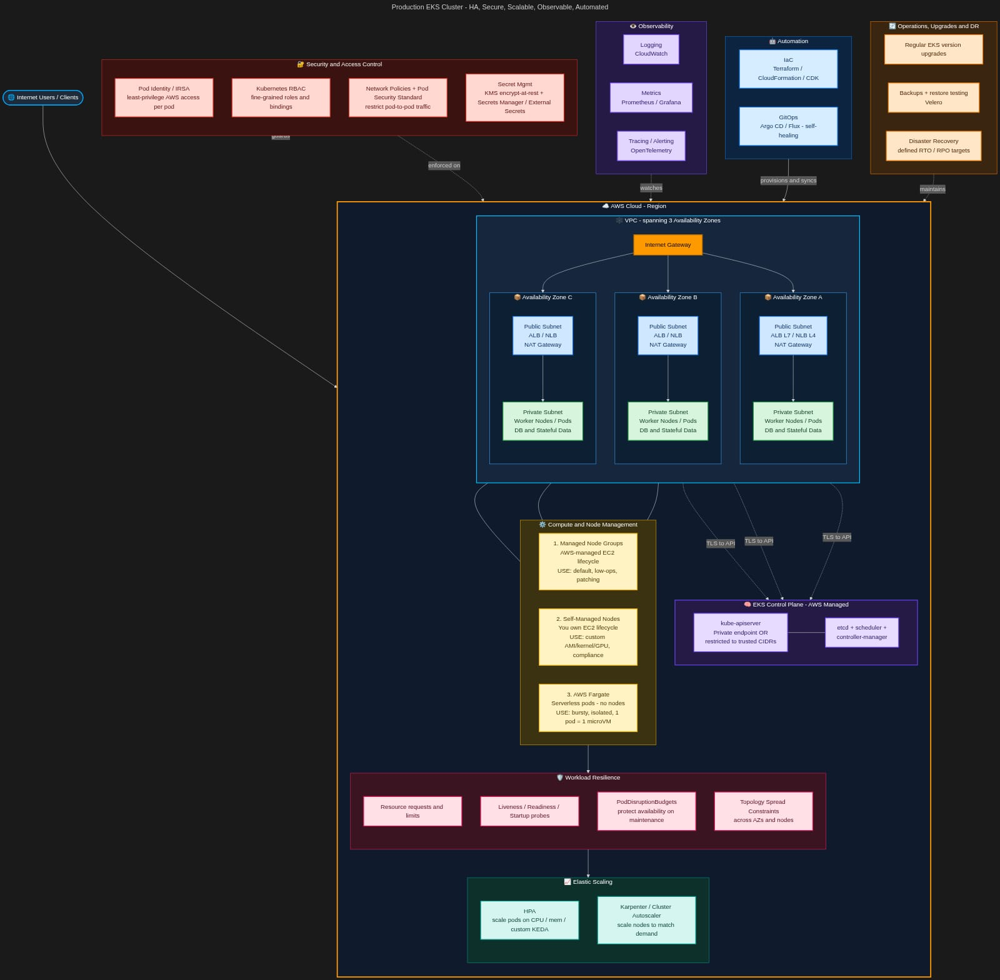

# KodeKloud — Interview Prep Master Table

Covers all 247 labs across `100DaysofDevops` (100), `100DaysofAWS` (50), `100DaysofAzure` (47), `100DaysofTerraform` (35), `100DaysofK8s` (15) — plus a Linux command baseline that every troubleshooting question eventually lands on, and the `100DaysofNW` multi-cloud reference deployment with the Kubernetes API portability split (section 11).

**How to use:** Each row is one interview answer. Read *Concept* → say the *Real-time use* → drop the *Command* → close with the *Architecture* line. That last column is what separates a junior answer from a senior one.

**Start at section 0.** Linux file, OS, network, and resource commands are non-negotiable for any troubleshooting round — cloud consoles change, `ss` and `journalctl` do not.

---

## 0. Linux Command Arsenal — the troubleshooting baseline

Every interview that touches DevOps, Cloud, or SRE opens or closes here. Cloud consoles change; `ss`, `journalctl`, and `iostat` do not. Learn these four tables as one loop: **what is the file doing → what is the OS doing → what is the network doing → what is the machine spending**.

### 0a. File & directory operations

| Command | What it tells you / does | When you reach for it | Trap or senior point |
|---|---|---|---|
| `ls -lhtr`, `ls -lah` | Long listing with human sizes, oldest→newest | "Which log rotated last?", "did the artifact actually land?" | `-tr` puts the newest at the bottom — the only sane order on a busy directory you are tailing |
| `find /var/log -type f -size +100M -mtime -1` | Files by type, size, age, owner | Disk filled overnight — find the culprit before you delete anything | `-exec cmd {} \;` runs once per file, `{} +` batches. Always dry-run with `-print` first; `find -delete` has no undo |
| `du -h --max-depth=1 /var \| sort -rh \| head` | Space consumed per directory, biggest first | `/` at 100% — walk down the tree one level at a time | `du` counts what files claim, `df` counts what the filesystem lost. When they disagree, you have deleted-but-open files |
| `df -hT`, `df -i` | Free space per mount + **inode** usage | "No space left on device" while `df -h` shows free space | That is inode exhaustion — millions of tiny files (session/cache dirs). `df -i` is the check nobody remembers |
| `lsof +L1`, `lsof -p PID`, `lsof /mount` | Open file handles; `+L1` = unlinked but still held | Deleted a 20 GB log and got no space back | A deleted file keeps its blocks until the last holder closes it — restart the process, don't hunt for the file |
| `stat file` | Inode, size, atime/mtime/ctime, permissions | "Who changed this, and when?" | mtime = content changed, ctime = metadata/permissions changed. `touch` can forge mtime, not ctime — forensics relies on that |
| `tail -F app.log`, `tail -n 200`, `head`, `less +F` | Read or stream a file | Live-tail during a deploy or a failing health check | `-F` follows the **name** and survives rotation; `-f` follows the inode and goes silent the moment logrotate runs |
| `grep -rn "ERROR" /var/log --include=*.log -C5` | Recursive search with line numbers and context | Pull the stack trace *around* the failure, not just the line | `-C/-A/-B` context is what makes grep usable in an incident; `-c` counts, `-l` lists files only, `-v` inverts |
| `awk '{print $9}' access.log \| sort \| uniq -c \| sort -rn \| head` | Extract a field, then rank by frequency | Top status codes, top URLs, top client IPs | The canonical log-triage one-liner. Learn it as one unit — it answers "what is actually failing" in five seconds |
| `sed -i.bak 's/old/new/g' file` | Stream edit, in place, with a backup | Flip a config value across a fleet from Ansible or a loop | Always `-i.bak`. A greedy regex without a backup is an outage, and `sed -i` on a symlink replaces the link, not the target |
| `tar -czf bundle.tgz dir/`, `tar -xzf`, `zgrep`, `zcat` | Archive, extract, search compressed logs | Shipping evidence to a vendor; grepping yesterday's rotated `.gz` | `zgrep` searches gzipped logs without expanding them to a disk that is already full |
| `rsync -avz --dry-run src/ dst/` | Delta copy over SSH with progress and resume | Migrating app data or web roots between hosts | `--dry-run` first, every time. A trailing slash on the source copies *contents*; no slash copies the *directory* |
| `ln -s /opt/releases/r42 /opt/current` | Symlink | Blue/green release switch and instant rollback | Swapping a symlink is atomic — the cheapest rollback mechanism that exists. Capistrano, Deployer, and most CD tools are this plus bookkeeping |
| `chmod 640`, `chown app:app`, `umask`, `getfacl/setfacl` | Discretionary permission model | "Permission denied" straight after a deploy | Default umask 022 explains most surprises. ACLs silently override plain rwx — the only hint in `ls -l` is the trailing `+` |
| `realpath`, `readlink -f`, `basename`, `dirname` | Resolve paths regardless of invocation directory | Scripts that must work from cron, CI, and your shell alike | `cd "$(dirname "$(readlink -f "$0")")"` is the first line of every portable ops script |

### 0b. Operating system, services & kernel

| Command | What it tells you / does | When you reach for it | Trap or senior point |
|---|---|---|---|
| `uname -a`, `cat /etc/os-release`, `hostnamectl` | Kernel version, distro, machine identity | First line of every bug report and patching decision | Kernel version drives which CVEs, cgroup version, and container runtime features apply to you |
| `uptime`, `who -b`, `last reboot` | How long up, when it last booted | "Did the box bounce, or did just the service die?" | The three numbers in `uptime` are 1/5/15-minute **run-queue length**, not CPU percentage — compare them to core count |
| `systemctl status\|start\|stop\|restart\|enable --now svc` | Unit lifecycle and current state | Service is down; bring it back and make it stay back | `start` = now, `enable` = survives reboot. Forgetting `enable` is the single most common repeat incident |
| `systemctl list-units --failed` | Everything currently broken, in one screen | First command after any unexpected reboot | Faster than checking services one by one, and it catches the dependency that failed *before* your app |
| `journalctl -xeu svc`, `-u svc --since "10 min ago"`, `-p err -b` | Service logs from the journal, filtered | A unit refuses to start and prints nothing useful | `-b` = this boot only, `-p err` = severity filter, `-x` = adds catalog explanations. `-f` to follow |
| `dmesg -T \| tail -50`, `journalctl -k` | Kernel ring buffer | OOM kills, disk I/O errors, NIC resets, filesystem remounts read-only | The OOM killer's verdict appears **only here** — the application never logs its own death |
| `systemd-analyze blame`, `critical-chain` | What made boot slow, attributed per unit | A VM takes four minutes to become useful in an autoscaling group | Slow boot is a scaling problem: it is dead time inside every scale-out event and every rolling restart |
| `crontab -l -u user`, `ls /etc/cron.d/`, `systemctl list-timers` | Scheduled work on the host | "The nightly job stopped running" | Cron runs with a minimal `PATH` and no login environment — that is 80% of "works manually, fails in cron". Absolute paths, and log stdout/stderr |
| `sysctl -a \| grep <knob>`, `/etc/sysctl.d/` | Kernel tunables (runtime + persistent) | Connection tracking full, backlog drops, forwarding disabled | `net.ipv4.ip_forward`, `net.core.somaxconn`, `fs.file-max`, `net.netfilter.nf_conntrack_max` are the four that show up in real tickets |
| `ulimit -a`, `/etc/security/limits.conf`, `LimitNOFILE=` | Per-process resource ceilings | "Too many open files" under load | Your shell's `ulimit` is **not** what a systemd daemon gets — `LimitNOFILE=` in the unit file is the one that applies. Same idea as a container's limits |
| `rpm -qa \| grep x` / `dpkg -l`, `yum list installed` / `apt list --installed` | Package inventory | CVE response: "are we running the affected version?" | This is the manual version of an SBOM. At fleet scale it is Ansible facts or an inventory tool, never SSH-in-a-loop |
| `rpm -qf /path` / `dpkg -S /path` | Which package owns a file | "Where did this binary come from and is it managed?" | Unowned files in `/usr/bin` are the fingerprint of a manual change — exactly the drift IaC exists to prevent |
| `getenforce`, `ausearch -m avc -ts recent`, `restorecon -Rv /path` | SELinux mode and denial audit trail | Permission denied that correct `chmod`/`chown` does not fix | Relabel, never `setenforce 0`. Disabling MAC is an audit finding in every regulated environment |
| `timedatectl`, `chronyc sources -v` | Clock and NTP sync state | TLS handshakes failing, tokens "expired", logs out of order across hosts | Skew beyond a few minutes breaks Kerberos, SAML, AWS SigV4, and JWT validation simultaneously — and the errors never say "your clock is wrong" |

### 0c. Networking

| Command | What it tells you / does | When you reach for it | Trap or senior point |
|---|---|---|---|
| `ip -br a`, `ip a` | Interfaces, addresses, up/down state | Step one of "the host is unreachable" | `ifconfig` is deprecated and lies about secondary addresses. `-br` is the readable form |
| `ip r`, `ip route get 8.8.8.8` | Routing table, and which route a given destination actually uses | Missing default gateway, asymmetric routing, multi-NIC hosts | `route get` answers "which interface and source IP will this leave by" — the question a routing table alone does not answer |
| `ss -tulnp` | Listening sockets with the owning PID and user | "Connection refused" vs "connection timed out" | **Refused = nothing is listening. Timed out = firewall or route.** That single distinction is the answer interviewers are fishing for |
| `ss -s`, `ss -tan state time-wait \| wc -l` | Socket state census | Ephemeral port exhaustion, TIME_WAIT pile-up behind a proxy | A connection-per-request client at high RPS exhausts ports long before it exhausts CPU — fix with keep-alive, not with sysctl hacks |
| `ping -c4 host`, `ping -M do -s 1472 host` | ICMP reachability; forced-DF probe for path MTU | "Small requests work, large ones hang" | That symptom is MTU/fragmentation — classic on VPNs, VXLAN/overlay CNIs, and IPsec tunnels. ICMP being blocked also makes PMTU discovery fail silently |
| `traceroute -n host`, `mtr -rwc 100 host` | Hop-by-hop path and per-hop loss | Intermittent latency that curl alone cannot characterise | `mtr` samples continuously, so it shows *which* hop loses packets over time; traceroute is one snapshot |
| `dig +short name`, `dig @1.1.1.1 name`, `dig +trace`, `getent hosts` | DNS resolution, per-resolver and end-to-end | "It resolves on my laptop but not on the server" | Always query a **specific** resolver. `/etc/hosts`, `nsswitch.conf` order, and search domains decide the real winner — `getent` shows what the app will actually get |
| `curl -Iv https://host`, `curl -o /dev/null -s -w 'dns:%{time_namelookup} conn:%{time_connect} ttfb:%{time_starttransfer} total:%{time_total} code:%{http_code}\n'` | L7 probe with a full timing breakdown | "Is it the network, the TLS handshake, or the app?" | The `-w` timing split localises latency in one command — slow DNS, slow connect, and slow TTFB are three completely different tickets |
| `openssl s_client -connect host:443 -servername host` | Certificate chain, expiry, SNI, protocol and cipher | TLS errors, "works in browser, fails in curl/Java" | Missing **intermediate** certs and SNI mismatches are invisible in a browser (it caches the chain) but fatal for every API client |
| `tcpdump -i any -nn 'port 3306' -c 200 -w cap.pcap` | Packet-level truth | "The app says it sent it, the DB says it never arrived" | `-nn` skips name lookups, which can themselves hang during a network incident. Capture to a file, analyse in Wireshark, never eyeball a busy interface |
| `nc -zv host 22`, `nc -l 9000` | Port reachability test and a throwaway listener | Prove the network path independently of the application | Standing up `nc -l` on the target proves whether the path or the app is at fault — the single fastest way to end a "network vs app" argument |
| `iptables -L -n -v --line-numbers`, `nft list ruleset`, `firewall-cmd --list-all` | Host firewall rules **with packet counters** | Traffic reaching the host but disappearing | The counters are the evidence: zero hits means the packet never arrived, so the problem is upstream (SG/NSG/route), not local |
| `ip -s link`, `netstat -i`, `ethtool eth0` | Interface errors, drops, link speed and duplex | Packet loss with healthy CPU and healthy app | Rising `RX dropped`/`errors` points at the NIC, driver, or ring buffers — a layer most people never check |
| `/etc/resolv.conf`, `/etc/hosts`, `/etc/nsswitch.conf` | Name-resolution configuration and its precedence | Split-brain resolution, stale overrides left by a previous engineer | In containers these are injected by the runtime; in Kubernetes by the kubelet with `ndots:5` — the cause of most "DNS is slow in K8s" reports |

### 0d. Resource consumption — CPU, memory, disk I/O, processes

| Command | What it tells you / does | When you reach for it | Trap or senior point |
|---|---|---|---|
| `top`, `htop` | Live CPU, memory, load, per-process | The first sixty seconds of any "server is slow" call | High `%wa` (iowait) means disk-bound, **not** CPU-bound. Press `1` for per-core, `M`/`P` to sort by memory/CPU |
| `uptime` / `cat /proc/loadavg` | Run-queue depth over 1/5/15 minutes | Is the box saturated, and is it getting better or worse? | Load must be read against core count: load 8 on 8 cores is saturated, on 32 cores it is idle. Rising 1-min over 15-min means it is still degrading |
| `ps -eo pid,ppid,user,%cpu,%mem,etime,cmd --sort=-%cpu \| head` | Top consumers with parentage and age | Identify the runaway and who spawned it | `ppid` and `etime` turn "one process is hot" into "this cron job forked at 03:00 and never exited" |
| `free -h`, `cat /proc/meminfo` | Memory breakdown | "We are out of RAM" | **`available` is the number that matters, not `free`.** buff/cache is reclaimable — a box with 200 MB "free" and 12 GB "available" is perfectly healthy |
| `vmstat 1 5` | Run queue, swap in/out, io wait, context switches | One command that separates CPU, memory, and I/O pressure | Sustained non-zero `si`/`so` means the box is swapping — that, not CPU, is your latency. High `cs` means contention/too many threads |
| `iostat -xz 1` | Per-device utilisation, `await`, queue depth | Disk-bound workloads, noisy-neighbour EBS volumes | `%util` near 100 with rising `await` = the disk is the bottleneck. On EBS this usually means you hit the IOPS/throughput ceiling for the volume type |
| `iotop -oPa`, `pidstat -d 1` | Which process is generating the I/O | You know the disk is saturated; now attribute it | Attribution is the whole game — "the disk is busy" is not an action item, "this backup job is doing 400 MB/s" is |
| `pidstat -u -r -d 1` | Per-process CPU, memory and I/O sampled over time | Intermittent spikes that `top` keeps missing | Sampling over time beats a snapshot for anything periodic — GC pauses, cron collisions, log rotation |
| `sar -u`, `sar -r`, `sar -n DEV`, `sar -f /var/log/sa/saDD` | **Historical** CPU/memory/network, retained for days | "It was slow at 03:00 last night" | `sar` is the only local time machine you get. Enable `sysstat` on every host *before* you need it — you cannot collect the past retroactively |
| `dmesg -T \| grep -i -E 'oom\|killed process'` | Kernel OOM-killer decisions | A process vanished with no error in its own log | The kernel kills by `oom_score`, so the biggest consumer dies — often not the leaking one. This is exactly what surfaces as `OOMKilled` in Kubernetes |
| `pmap -x PID`, `/proc/PID/status`, `/proc/PID/limits` | Real memory map and the limits actually in force on a running process | Memory growth analysis; "which limit is it hitting?" | `/proc/PID/limits` shows the effective ceiling, not what your shell would have given it — the fastest way to settle a ulimit argument |
| `ls /proc/PID/fd \| wc -l`, `lsof -p PID \| wc -l` | File-descriptor count for a process | Catch an fd leak before it hits the ceiling and takes the service down | Trend it. A slowly rising fd count is a leak; a flat high count is just a busy connection pool |
| `strace -c -p PID`, `strace -f -e trace=network -p PID` | Syscall profile of a hung or slow process | Process stuck in `D` state with no logs and no clue | Real overhead — last resort, short bursts, never casually on a hot production process. `-c` summarises instead of flooding |
| `systemd-cgtop`, `/sys/fs/cgroup/...` | Resource accounting per cgroup | Container CPU throttling and memory limits | This is the same accounting a container runtime and Kubernetes read — `container_cpu_cfs_throttled_seconds` and `OOMKilled` both originate here |
| `nproc`, `lscpu`, `lsblk`, `lsmem`, `free -h` | Hardware inventory | Right-sizing an instance type before you scale up | Capacity decisions start with knowing what you already have — vCPU count, NUMA layout, disk topology |

### 0e. The scenario chains interviewers actually ask for

| Scenario they describe | The chain you walk | What you say while doing it |
|---|---|---|
| "The application is unreachable" | `systemctl status app` → `ss -tulnp \| grep :443` → `curl -Iv localhost:443` → `iptables -L -n -v` / SG / NSG → `ip r` + `dig` → app logs | Process → listener → local response → firewall → route/DNS → application. Refused means no listener; timeout means firewall or route |
| "The server is slow" | `uptime` → `top` (check `%wa`) → `vmstat 1` (swap, run queue) → `iostat -xz 1` (disk) → `pidstat`/`iotop` (attribute) → `sar` (was it always?) | Saturated on what — CPU, memory, or I/O? Only then attribute it to a process, then check whether it is new |
| "The disk is full" | `df -hT` → `df -i` (inodes) → `du -h --max-depth=1` walking down → `lsof +L1` (deleted-but-open) → rotate/clean → fix logrotate or retention | Free space and free inodes are two separate exhaustions, and space that `du` cannot see is held open by a process |
| "A process was killed and nobody knows why" | `dmesg -T \| grep -i oom` → `journalctl -u svc --since` → `/proc/PID/limits` → cgroup/container memory limit → `free -h` trend | The kernel logs the kill, the app cannot. Then decide: raise the limit or fix the leak |
| "It works from my machine but not from the server" | `getent hosts name` → `dig @<resolver> name` → `nc -zv host port` → `curl -w` timing split → `openssl s_client` | Resolution, then reachability, then latency breakdown, then TLS. Four layers, four commands, in that order |

---

## 1. Linux Administration & Troubleshooting — `100DaysofDevops/01–20`

| # | Concept | Real-time use | Key commands | Architecture (bigger scope) |
|---|---|---|---|---|
| 01 | User creation | Onboarding app/service accounts; non-login users for daemons | `useradd -m -s /bin/bash user`, `useradd -r -s /sbin/nologin svc` | Identity layer. In real estates this is LDAP/AD/IAM-backed, not local — local users are the fallback for break-glass and service identities |
| 02 | Account expiry | Contractor/vendor access that must auto-revoke; compliance (SOX/ISO) | `chage -E 2026-12-31 user`, `chage -l user` | Time-bound access = least privilege. Same principle as STS tokens in AWS and PIM in Azure AD |
| 03 | SSH hardening | Disable root login, enforce key-only auth on every fleet node | `sed -i 's/^PermitRootLogin.*/PermitRootLogin no/' /etc/ssh/sshd_config`, `systemctl restart sshd` | First control in the CIS benchmark. In production this is enforced by Ansible/config-mgmt drift detection, not hand edits |
| 04 | File permissions | Fixing "permission denied" on deploy artifacts and web roots | `chmod 755 dir`, `chmod 644 file`, `chown user:group path` | rwx/octal model underpins container `USER` directives, K8s `securityContext`, and volume mount failures |
| 05 | SELinux | Web server can't read files despite correct chmod — the classic MAC trap | `getenforce`, `setenforce 0`, `semanage fcontext -a -t httpd_sys_content_t`, `restorecon -Rv` | Mandatory Access Control layer *above* DAC. Disabling it is a finding in every audit — relabel instead |
| 06 | Cron scheduling | Log rotation, backups, cleanup jobs on a single host | `crontab -e`, `crontab -l -u user`, `*/5 * * * * /script.sh` | The pre-orchestrator scheduler. Scales up to Jenkins cron triggers → K8s CronJobs → EventBridge/Logic Apps |
| 07 | Passwordless SSH | Prereq for Ansible, Jenkins agents, scp-based deploys | `ssh-keygen -t rsa -b 4096`, `ssh-copy-id user@host` | Trust bootstrap for all agentless automation. Public key on target, private key on controller — never the reverse |
| 08 | Ansible install | Building the control node for config management | `yum install -y ansible-core`, `ansible --version` | Control-node/managed-node topology. Push model, agentless — contrast with Puppet/Chef pull-agents |
| 09 | MariaDB troubleshooting | DB won't start after a disk/permission event — highest-severity incident type | `systemctl status mariadb`, `journalctl -xeu mariadb`, `chown -R mysql:mysql /var/lib/mysql`, `ss -tlnp \| grep 3306` | The four-layer debug ladder: service → logs → filesystem/ownership → port binding. Applies to any stateful service |
| 10 | Bash scripting | Wrapping repeatable ops into idempotent, re-runnable scripts | `#!/bin/bash`, `set -euo pipefail`, loops over host lists | The bridge from manual toil to automation. Every Ansible module started life as someone's bash script |
| 11 | Tomcat install | Deploying a Java app server + WAR on a fixed port | `yum install tomcat`, `systemctl enable --now tomcat`, WAR → `/var/lib/tomcat/webapps/ROOT.war` | App-server tier of the classic 3-tier stack. Containerisation replaces this — same WAR, now in an image |
| 12 | Network troubleshooting | "App unreachable" — is it the process, port, firewall, or route? | `ss -tulnp`, `curl -Iv http://host:port`, `iptables -L -n -v`, `systemctl status` | The universal L3→L7 walk: listener exists? → local firewall? → network path? → app responding? Identical logic for K8s Services and Azure NSGs |
| 13 | iptables | Host-level ingress control, port allow/deny, NAT rules | `iptables -A INPUT -p tcp --dport 80 -j ACCEPT`, `iptables -L -n --line-numbers`, `service iptables save` | Host firewall. Its cloud equivalents are AWS Security Groups and Azure NSGs — and `kube-proxy` writes iptables rules for every K8s Service |
| 14 | Process troubleshooting | Runaway CPU/memory, zombie processes, service flapping | `ps aux --sort=-%cpu`, `top`, `journalctl -u svc -f`, `kill -9 PID` | Feeds capacity planning and alerting thresholds. Same signals Prometheus scrapes as node metrics |
| 15 | Nginx + SSL | Terminating HTTPS with a cert on the edge server | `openssl req -x509 -newkey rsa:2048`, `ssl_certificate` in server block, `nginx -t`, `systemctl reload nginx` | TLS termination point. In cloud this moves to ALB/App Gateway/Ingress — the cert lifecycle problem stays identical |
| 16 | Nginx load balancer | Distributing traffic across app servers | `upstream {}` block, `proxy_pass`, `nginx -t`, `curl` to verify round-robin | L7 reverse proxy. Same role as AWS ALB, Azure App Gateway, K8s Ingress Controller (which *is* Nginx, usually) |
| 17 | PostgreSQL DB creation | Provisioning a database + owner role for a new app | `sudo -u postgres psql`, `CREATE USER ... WITH PASSWORD`, `CREATE DATABASE ... OWNER` | Data tier. Managed equivalents: RDS, Azure SQL — the role/grant model does not change |
| 18 | DB configuration | Enabling remote connections, tuning, binding to a non-loopback address | `bind-address` / `listen_addresses`, `pg_hba.conf`, `systemctl restart` | Default-deny networking on the DB. Modern equivalent: private endpoints + firewall rules instead of open binds |
| 19 | Web app install | Full stack deploy — code, permissions, service, port | `scp` artifact, `chown`, `systemctl enable --now`, `curl` verify | The manual version of a CD pipeline. Every step here becomes a pipeline stage later |
| 20 | Nginx + PHP-FPM | LEMP stack — dynamic content behind a web server | `yum install nginx php-fpm`, `fastcgi_pass 127.0.0.1:9000`, `systemctl enable --now php-fpm nginx` | Web-server/app-runtime separation over a socket. Same split as Nginx→uWSGI, or a sidecar container pair in K8s |

---

## 2. Git & Version Control — `100DaysofDevops/21–34`

| # | Concept | Real-time use | Key commands | Architecture (bigger scope) |
|---|---|---|---|---|
| 21 | Git server setup | Self-hosted bare repo as team origin | `git init --bare`, `git clone /opt/repo.git` | Origin is just a repo with no working tree. GitHub/GitLab add auth, PRs, and CI on top of exactly this |
| 22 | Clone | Getting a working copy on a build/deploy server | `git clone /path/repo.git /usr/src/app` | Entry point of every CI pipeline — the first stage of a Jenkins job |
| 23 | Fork | Contributing without write access to upstream | `git clone fork`, `git remote add upstream`, `git push origin branch` | Fork-and-PR model powers open source and enforces review-before-merge in regulated environments |
| 24 | Checkout / branching | Feature isolation; never work on master directly | `git checkout -b feature`, `git branch -a` | Branching strategy = release strategy. GitFlow vs trunk-based determines your deploy cadence |
| 25 | Merge | Integrating a feature into master with history preserved | `git checkout master`, `git merge feature`, `git push origin master` | Merge commits keep true history; the PR merge button is this command server-side |
| 26 | Remotes | Pointing a repo at a new origin after migration | `git remote add/set-url origin`, `git remote -v`, `git ls-remote` | Repo→server mapping. Critical during Bitbucket→GitHub migrations and mirror setups |
| 27 | Revert | Undoing a bad commit on a **shared** branch safely | `git revert <sha>`, `git log --oneline` | Forward-only correction — creates a new commit. The only safe undo for pushed history |
| 28 | Cherry-pick | Hotfix: pull one specific commit into release without merging the branch | `git cherry-pick <sha>` | Selective promotion between environments. Core of hotfix/backport workflows |
| 29 | Pull | Syncing local with remote before work | `git pull origin master`, `git fetch` + `merge` | `pull` = `fetch` + `merge`. Knowing the split is what lets you avoid surprise merge commits |
| 30 | Hard reset | Discarding local commits, resetting to a known-good SHA | `git reset --hard <sha>`, `git push --force` | Destructive and history-rewriting. Acceptable on private branches, forbidden on shared ones — protected-branch rules exist for this |
| 31 | Stash | Parking WIP to switch to an urgent fix | `git stash`, `git stash list`, `git stash pop` | Context-switch tool. Signals you should have been on a separate branch |
| 32 | Rebase | Linear history; replaying your commits on top of updated master | `git fetch`, `git rebase origin/master` | Merge vs rebase is a team-policy decision: readable linear log vs true history. Never rebase shared branches |
| 33 | Merge conflicts | Two people touched the same lines — resolve and continue | `git status`, edit markers, `git add`, `git commit` | Conflict frequency is a proxy for architecture: constant conflicts = files/modules too coarse |
| 34 | Git hooks | Enforcing policy at commit/push time — tag on merge, block secrets | `.git/hooks/post-merge`, `chmod +x`, `git show-ref`, `git tag` | Shift-left enforcement. Client hooks are advisory; server hooks and CI gates are authoritative |

---

## 3. Docker & Containers — `100DaysofDevops/35–47`

| # | Concept | Real-time use | Key commands | Architecture (bigger scope) |
|---|---|---|---|---|
| 35 | Docker install | Preparing a container host | `yum install docker-ce docker-ce-cli containerd.io docker-compose-plugin`, `systemctl enable --now docker` | Client → daemon → containerd → runc. Knowing this chain explains K8s dropping dockershim for containerd |
| 36 | Run container | Launching a service with a port map | `docker run -d --name nginx -p 8080:80 nginx:latest`, `docker ps` | Port publishing is a NAT/iptables rule. Same concept as a K8s NodePort |
| 37 | Copy to/from container | Pulling logs out or pushing a config in during an incident | `docker cp file container:/path`, `docker exec -it container bash` | Debug-only escape hatch. Anything copied by hand is lost on restart — containers are immutable, config belongs in mounts/env |
| 38 | Pull & tag images | Promoting images between environments by tag | `docker pull image:tag`, `docker tag src dest`, `docker images` | Tags are mutable pointers; digests are immutable. Production should pin digests |
| 39 | Commit image | Snapshotting a modified container into an image | `docker commit container image:tag` | Anti-pattern for production — undocumented layers. Dockerfile is the reproducible path; know why |
| 40 | Docker service/exec | Verifying processes inside a running container | `docker exec container ps`, `docker ps --format` | One container = one main process (PID 1). Signal handling and restarts hang off this |
| 41 | Build from Dockerfile | Baking app + deps into a versioned artifact | `docker build -t app:v1 .`, `docker run -d -p 80:80 app:v1` | Layer caching drives build speed; ordering instructions correctly is the main optimisation lever |
| 42 | Docker networking | Container-to-container name resolution on a user-defined bridge | `docker network create --driver bridge net1`, `docker network inspect` | Bridge/host/overlay/none. User-defined bridges give embedded DNS — the ancestor of K8s Service discovery |
| 43 | Pull + run image | Standing up a service from a registry image | `docker pull`, `docker run -d -p host:container` | Registry → host pull path. In K8s this is the kubelet's job, with imagePullSecrets |
| 44 | Docker Compose | Declaring a multi-container stack in one file | `docker compose up -d`, `docker compose ps`, `docker compose down` | Declarative multi-container spec — the conceptual predecessor of K8s manifests. Single-host only |
| 45 | Docker troubleshooting | Build/run failures: bad base image, port clash, missing file in context | `docker build` output, `docker logs`, `docker images` | Failure taxonomy: build-time vs runtime vs network. Different logs answer each |
| 46 | App deploy with Compose | Web + DB stack with volumes and dependencies | compose `services`, `volumes`, `depends_on`, `docker compose up -d` | Stateful+stateless together. Volumes are the durability boundary — the container is disposable, the volume is not |
| 47 | Python app container | Containerising a Flask/Python app with a custom Dockerfile | `FROM python`, `COPY`, `RUN pip install -r requirements.txt`, `CMD`, `docker build`/`run` | Language-runtime image pattern. Multi-stage builds shrink final image and cut CVE surface |

---

## 4. Kubernetes — `100DaysofDevops/48–67` + `100DaysofK8s/01–14`

| Ref | Concept | Real-time use | Key commands | Architecture (bigger scope) |
|---|---|---|---|---|
| D48, K01 | Pod | Smallest deployable unit; one-off debug pods | `kubectl run pod --image=nginx`, `kubectl apply -f pod.yaml`, `kubectl get pods -o wide` | Pod = shared network namespace + shared volumes across containers. Bare pods aren't self-healing — that's why Deployments exist |
| D49, K02 | Deployment | Standard way to run stateless apps with self-healing | `kubectl create deployment nginx --image=nginx`, `kubectl get deploy` | Deployment → ReplicaSet → Pod. Each spec change mints a new RS — that's what makes rollback possible |
| K03 | Namespace | Multi-tenant separation: dev/qa/prod, per-team quotas | `kubectl create ns dev`, `kubectl get pods -n dev` | Logical isolation + scope for RBAC, ResourceQuota, and NetworkPolicy. Not a security boundary on its own |
| D50, K04 | Resource requests/limits | Preventing noisy-neighbour and OOMKills | `resources.requests/limits` in spec, `kubectl describe pod` | Requests drive scheduling, limits drive throttling/kill. QoS class (Guaranteed/Burstable/BestEffort) sets eviction order |
| D51, K05 | Rolling update | Zero-downtime image upgrade | `kubectl set image deploy/app c=nginx:1.19`, `kubectl rollout status deploy/app` | maxSurge/maxUnavailable control blast radius. Readiness probes are what make it truly zero-downtime |
| D52, K06 | Rollback | Reverting a bad release in seconds | `kubectl rollout history deploy/app`, `kubectl rollout undo deploy/app --to-revision=N` | Revision history retained on old ReplicaSets. MTTR-driven — roll back first, debug after |
| K07 | ReplicaSet | Maintaining N healthy replicas | `kubectl apply -f rs.yaml`, `kubectl get rs` | Reconciliation loop: desired vs actual. Manage via Deployment, not directly |
| K08, K09 | Job / CronJob | Batch work, backups, scheduled reports | `kubectl get jobs`, `kubectl get cronjobs`, `schedule: "*/5 * * * *"` | Run-to-completion vs run-forever. `backoffLimit`, `completions`, `concurrencyPolicy` are the interview details |
| D53 | Volume mounts | Serving files into a container at a mount path | `volumeMounts` + `volumes`, `kubectl cp`, `kubectl exec` | Mount path shadows existing image content — the #1 cause of "my files vanished" |
| D54 | Shared volumes | Two containers exchanging data in one pod | `emptyDir` volume mounted into both containers | Pod as the sharing boundary. Basis of sidecar patterns |
| D55 | Sidecar | Log shipper / proxy alongside the app container | multi-container `containers:` list, `kubectl logs pod -c sidecar` | Separation of concerns without changing app code. Service meshes (Istio/Envoy) are sidecars at scale |
| D56 | Nginx web server deploy | Standard stateless web tier | `kubectl apply -f deploy.yaml`, `curl` via service | Deployment + Service + Ingress is the canonical web-tier triple |
| D57 | Env variables | Injecting config without rebuilding the image | `env:` / `envFrom:`, `kubectl logs pod` | 12-factor config. ConfigMap for plain, Secret for sensitive |
| D58 | Grafana deploy | Running the observability stack in-cluster | `kubectl apply`, NodePort service, `curl` | Prometheus + Grafana + Alertmanager. Metrics → dashboards → alerts → on-call |
| D59, D64, K11 | Deployment troubleshooting | ImagePullBackOff, CrashLoopBackOff, Pending | `kubectl describe pod`, `kubectl logs --previous`, `kubectl get events --sort-by=.lastTimestamp`, `kubectl edit deploy` | Triage ladder: events → describe → logs → exec. Pending = scheduling/resources; CrashLoop = app; ImagePull = registry/auth |
| D60 | PersistentVolume / PVC | Durable storage that survives pod restarts | `kubectl apply -f pv.yaml pvc.yaml`, `kubectl get pv,pvc` | PV (cluster resource) ↔ PVC (namespaced claim) ↔ StorageClass (dynamic provisioning). Access modes + reclaim policy matter |
| D61 | Init containers | Wait-for-dependency, schema migration, file pre-seed | `initContainers:`, `kubectl logs pod -c init` | Ordered, run-to-completion before app start. Keeps startup ordering out of app code |
| D62 | Secrets | DB passwords, API keys injected safely | `kubectl create secret generic`, `kubectl describe secret`, mount or `envFrom` | Base64 ≠ encrypted. Production needs etcd encryption-at-rest + External Secrets/Vault/Key Vault CSI |
| D63 | Multi-tier app deploy | Web + DB with services, secrets, PVCs together | `kubectl apply -f`, `kubectl -n ns get all`, `curl` NodePort | Full app topology in one namespace. This is the "design a K8s app" whiteboard answer |
| D65 | Redis deploy | Cache/session store in-cluster | `kubectl apply`, `kubectl exec -- redis-cli ping` | Cache tier. ConfigMap-driven config; often a StatefulSet when persistence is needed |
| D66 | MySQL deploy | Stateful DB with PVC + Secret | `kubectl apply`, `kubectl exec -- mysql -u root -p` | Stateful workloads need stable storage + stable identity — the argument for StatefulSet over Deployment |
| D67 | StatefulSet | Ordered, identity-stable pods (DBs, queues, clusters) | `kubectl apply -f sts.yaml`, `kubectl get sts` | Stable network ID (`pod-0`, `pod-1`), ordered rollout, per-pod PVC via volumeClaimTemplates + headless Service |
| K10 | ConfigMap | Non-secret config as files or env | `kubectl apply -f cm.yaml`, `kubectl exec -- cat /config/file` | Config decoupled from image. Note: mounted CMs update live; env-injected ones need a restart |
| K12 | Scale + update together | Replica bump plus image change in one release | `kubectl apply`, `kubectl rollout status`, `kubectl scale` | Manual scale is the baseline; HPA on CPU/custom metrics is the production answer |
| K13 | Service / NodePort | Exposing pods behind a stable virtual IP | `kubectl apply -f svc.yaml`, `kubectl get svc`, `kubectl describe svc` | ClusterIP → NodePort → LoadBalancer → Ingress. Selector-to-label match is the #1 "service has no endpoints" bug |
| K14 | *(empty file)* | Volume mount issues — worth filling in | `kubectl describe pod`, check `volumeMounts` vs `volumes` names | Gap in your notes |

---

## 5. Jenkins & CI/CD — `100DaysofDevops/68–81`

| # | Concept | Real-time use | Key commands / UI path | Architecture (bigger scope) |
|---|---|---|---|---|
| 68 | Jenkins install | Standing up the CI controller | `yum install jenkins java-17`, `systemctl enable --now jenkins`, unlock via `initialAdminPassword` | Controller/agent architecture. Controller schedules, agents execute — never build on the controller |
| 69 | Plugin management | Git, Pipeline, SSH Agent, Credentials Binding plugins | Manage Jenkins → Plugins | Plugin sprawl is the top Jenkins fragility and CVE source. Pin versions, review before upgrade |
| 70 | User management | Per-user accounts instead of shared admin logins | Manage Jenkins → Users | Auditability — every build traceable to a human. Real setups delegate to LDAP/SSO |
| 71 | Package/artifact job | Freestyle job producing a build artifact | Build step: shell; SSH keys to targets | Artifact as the unit of promotion — build once, deploy many |
| 72 | Parameterised builds | One job serving multiple envs/branches | Job → "This project is parameterized" → String/Choice params | Reusable pipelines over copy-pasted jobs. Parameters are the interface |
| 73 | Cron/scheduled jobs | Nightly builds, periodic housekeeping | Build Triggers → Build periodically `H/5 * * * *` | `H` spreads load across the hour — real answer to "why H instead of 0" |
| 74 | DB backup job | Scheduled DB dump pushed to a backup host | shell step + `scp`, key-based SSH | CI server as an ops scheduler. Fine at small scale; backups belong in a dedicated tool at scale |
| 75 | Agent/node setup | Distributing builds to labelled agents | Manage Jenkins → Nodes; SSH launch method + `ssh-keygen` | Horizontal scale + build isolation. Labels route workloads to the right OS/toolchain |
| 76 | Security & authorization | Matrix/role-based permissions per job | Configure Global Security → Matrix-based security | Least privilege in CI. A CI system with prod creds is a top-tier breach target |
| 77 | Pipeline deploy | Declarative pipeline: checkout → build → deploy | `Jenkinsfile`, `pipeline { stages { } }`, `git` + `sshagent` | Pipeline-as-code lives with the app, is versioned and reviewed. The core CI/CD interview answer |
| 78 | Conditional pipeline | Branch-based routing (develop → dev, master → prod) | `when { branch 'master' }` | Environment promotion logic in code. Basis of trunk-based delivery |
| 79 | Push-triggered build | Auto-deploy on `git push` | Poll SCM `* * * * *` / webhook | Poll is pull-based (lag, load); webhook is push-based (instant). Know the trade-off |
| 80 | Chained builds | Job A deploys, then triggers job B to restart httpd | Post-build → Build other projects; `credentials-binding` | Job orchestration DAG. Modern equivalent: pipeline stages or Argo Workflows |
| 81 | Multi-stage pipeline | Deploy + test in one declarative pipeline | `stages { stage('Deploy') stage('Test') }`, `git push` from pipeline | Quality gates between stages. Failed test → no promotion, which is what CD actually means |

---

## 6. Ansible — `100DaysofDevops/82–93`

| # | Concept | Real-time use | Key commands / modules | Architecture (bigger scope) |
|---|---|---|---|---|
| 82 | Inventory | Defining managed hosts and connection vars | `inventory` file, `ansible-inventory --list`, `ansible all -m ping` | Static vs dynamic inventory. Cloud estates use dynamic plugins keyed off tags — inventory becomes generated, not written |
| 83 | Troubleshooting / ansible.cfg | Fixing host-key, privilege, and inventory-path failures | `ansible.cfg` with `host_key_checking=False`, `inventory=`, `remote_user=` | Config precedence: `ANSIBLE_CFG` env → cwd → `~/.ansible.cfg` → `/etc/ansible`. Classic gotcha question |
| 84 | Copy module | Pushing config/content files to many hosts | `ansible.builtin.copy: src= dest= owner= mode=` | Idempotency: copies only on checksum change. Idempotence is Ansible's whole value proposition |
| 85 | File module | Creating dirs/files with exact ownership and perms | `ansible.builtin.file: path= state=touch/directory owner= mode=` | Declarative desired state — you describe the end state, not the steps |
| 86 | Ping / connectivity | Verifying SSH trust before any playbook run | `ssh-keygen`, `ssh-copy-id`, `ansible all -m ping` | Agentless over SSH. `ping` here is an Ansible module round-trip, not ICMP — a favourite interview trick |
| 87 | Package module | Installing packages fleet-wide, distro-agnostically | `ansible.builtin.yum/dnf/package: name= state=present` | `package` abstracts the distro's package manager. Abstraction over portability |
| 88 | blockinfile | Managing a marked block inside an existing config file | `ansible.builtin.blockinfile: path= block= marker=` | Safe partial-file edits — markers make it re-runnable. Full-file `template` is cleaner when you own the file |
| 89 | Service module | Ensuring services are started and enabled | `ansible.builtin.service: name= state=started enabled=yes` | Convergence to desired state, plus handlers for restart-on-change |
| 90 | ACLs | Fine-grained access beyond owner/group/other | `ansible.posix.acl`, `getfacl`, `ansible-galaxy collection install` | POSIX ACLs when standard perms can't express the requirement. Collections = modular content distribution |
| 91 | lineinfile | Changing a single directive in a config file | `ansible.builtin.lineinfile: path= regexp= line=` | Regex-based idempotent edit. Regex accuracy is the failure mode — anchor your patterns |
| 92 | Jinja2 templates | Per-host config rendered from variables | `ansible.builtin.template: src=x.j2 dest=`, `{{ var }}`, `` | One template, N hosts. Same idea as Helm charts for K8s and Terraform interpolation |
| 93 | Conditionals | Branching on OS family, facts, or variables | `when: ansible_facts['os_family'] == 'RedHat'`, `register` + `when` | Facts gathering drives conditional logic. Playbooks become portable across heterogeneous fleets |

---

## 7. Terraform / IaC — `100DaysofDevops/94–100` + `100DaysofTerraform/01–35`

### 7a. Core workflow & language

| Ref | Concept | Real-time use | Key commands | Architecture (bigger scope) |
|---|---|---|---|---|
| all | Core workflow | Every change goes init → validate → plan → apply | `terraform init`, `terraform validate`, `terraform plan`, `terraform apply -auto-approve`, `terraform destroy` | Plan is the review artifact and the safety gate — "plan in PR, apply on merge" is the standard pipeline |
| all | State | Source of truth mapping config → real resources | `terraform state list`, `terraform state show <addr>`, `terraform state rm` | Local state doesn't scale. Remote backend (S3+DynamoDB lock / Azure Storage) gives sharing, locking, versioning. State holds secrets in plaintext — encrypt it |
| T25, T25.1 | Lifecycle meta-arguments | Protecting prod resources; avoiding downtime on replace | `lifecycle { create_before_destroy, prevent_destroy, ignore_changes }` | Governs the destroy/create ordering that Terraform would otherwise pick. `ignore_changes` reconciles Terraform with out-of-band drift |
| T25 | Resource replacement | Why a type change forces destroy+create | `terraform plan` shows `-/+ must be replaced` | ForceNew attributes in the provider schema. Knowing which attributes force replacement prevents accidental prod outages |
| D98–100 | Outputs & validation | Surfacing IDs/IPs to operators and downstream modules | `terraform output`, `terraform validate` | Outputs are a module's public API — how modules compose via `remote_state`/inputs |
| T35 | *(empty file)* | Variables & tfvars — worth filling in | `variable {}`, `-var-file=prod.tfvars`, `TF_VAR_x` | Gap in your notes. Precedence order (CLI > env > tfvars > default) is a frequent question |
| T30–33 | Targeted destroy | Removing one resource but keeping the code | `terraform destroy -target=aws_instance.ec2 -auto-approve` | `-target` is a break-glass tool — it partially applies the graph. Correct long-term answer is `count = 0` or removing the block |
| T29 | Provisioners / null_resource | Running CLI steps Terraform has no resource for (S3 sync then delete) | `resource "null_resource"` + `local-exec` | Last resort — provisioners break the declarative model and aren't tracked in state. Prefer native resources or a pipeline step |

### 7b. Resource catalogue

| Ref | Concept | Real-time use | Key resources | Architecture (bigger scope) |
|---|---|---|---|---|
| T01 | Key pair | SSH access to EC2, key generated by Terraform | `tls_private_key`, `aws_key_pair`, `local_file` | Private key lands in state **and** on disk — real answer is Secrets Manager or a pre-created key |
| T02, D95 | Security group | Instance-level firewall with ingress/egress rules | `aws_security_group`, `data "aws_vpc"` | Stateful firewall at the ENI. SG-referencing-SG is the pattern for tier-to-tier rules (web→app→db) |
| T03, T04, D94 | VPC & CIDR | Network foundation and address planning | `aws_vpc { cidr_block }` | CIDR sizing is one-way — over-provision. Non-overlapping ranges are mandatory for future peering/VPN |
| T05 | *(empty)* IPv6 VPC | — | `assign_generated_ipv6_cidr_block = true` | Gap in your notes |
| T06 | *(empty)* Elastic IP | — | `aws_eip` | Gap in your notes (covered in T26) |
| T07, D96 | EC2 instance | Compute with AMI, type, key, and SG attached | `aws_instance`, `data "aws_security_group"` | Compute tier. AMI + user_data = immutable infrastructure; instead of patching, rebuild and replace |
| T08 | AMI from instance | Golden image capture for autoscaling | `aws_ami_from_instance`, `data "aws_instance"` | Baking (Packer/AMI) vs bootstrapping (user_data/Ansible). Baking gives faster, deterministic scale-out |
| T09 | EBS volume | Block storage for a DB or app data disk | `aws_ebs_volume { size, type, availability_zone }` | AZ-bound — volume and instance must share an AZ. gp3 vs io2 is a cost/IOPS decision |
| T10 | EBS snapshot | Point-in-time backup before a risky change | `aws_ebs_snapshot`, `data "aws_ebs_volume"` | Incremental, S3-backed, cross-region copyable. Backbone of backup/DR and RPO planning |
| T11, D100 | CloudWatch alarm | Alerting on CPU/status-check thresholds | `aws_cloudwatch_metric_alarm` | Metric → threshold → SNS → action. Alarms should drive auto-remediation, not just email |
| T12 | Public S3 bucket | Static site or public asset hosting | `aws_s3_bucket`, `_acl`, `_ownership_controls`, `_public_access_block`, `_policy` | Public buckets are the classic breach headline. Post-2023 AWS blocks public access by default — you must explicitly unwind four controls |
| T15, T28 | Private S3 + versioning | Default-secure bucket with object history | `aws_s3_bucket_versioning`, `_public_access_block` | Versioning protects against overwrite/delete and is a prerequisite for replication and object lock |
| T34 | S3 object upload | Shipping a file into a bucket via IaC | `aws_s3_object { bucket, key, source, etag }` | IaC managing data, not just infra — fine for small config/static assets, wrong for app data |
| T13 | IAM user | Human/service identity with access keys | `aws_iam_user`, `_access_key`, `_login_profile`, `_policy_attachment` | Long-lived keys are a liability. Roles + STS/OIDC federation is the modern answer |
| T14 | IAM group | Permissions assigned by role, not per person | `aws_iam_group`, `_membership`, `_policy_attachment` | Group-based RBAC scales; per-user policies do not |
| T16, D97 | IAM policy | Least-privilege JSON permission document | `aws_iam_policy { policy = jsonencode(...) }` | Effect/Action/Resource/Condition. Deny beats Allow; explicit Deny is unoverridable |
| T27, D99 | Policy attachment | Binding a policy to user/group/role | `aws_iam_user_policy_attachment`, `_role_policy_attachment` | Separating policy definition from binding lets one policy serve many principals |
| T32 | IAM role | Assumable identity for services and cross-account | `aws_iam_role` + `assume_role_policy`, `_role_policy_attachment` | Trust policy (who can assume) vs permission policy (what they can do). The distinction is a standard interview question |
| T17 | DynamoDB | NoSQL key-value store; also the TF state-lock table | `aws_dynamodb_table { hash_key, billing_mode }` | Partition key design determines throughput distribution. On-demand vs provisioned is a cost model choice |
| T18 | Kinesis | Real-time streaming ingest | `aws_kinesis_stream { shard_count, retention_period }` | Shards = throughput units. Streaming pipeline: producer → stream → consumer → sink |
| T19 | SNS | Pub/sub fan-out for alerts and events | `aws_sns_topic`, `_subscription`, `_topic_policy` | Decouples producers from consumers. SNS (push, fan-out) + SQS (pull, buffered) is the durable pattern |
| T20 | SSM Parameter Store | Config and secrets without hardcoding | `aws_ssm_parameter { type = "SecureString" }`, `data "aws_ssm_parameter"` | Externalised config with KMS encryption and IAM-scoped reads. Cheaper alternative to Secrets Manager |
| T24 | Secrets Manager | Credentials with rotation and versioning | `aws_secretsmanager_secret`, `_secret_version` | Native rotation + fine-grained IAM. Secrets still land in TF state — pull at runtime instead of at plan time |
| T21 | CloudWatch Logs | Centralised log aggregation with retention | `aws_cloudwatch_log_group`, `_log_stream`, `_metric_filter`, `_subscription_filter` | Logs → metric filters → alarms; subscription filters ship to Kinesis/Lambda/OpenSearch. The observability pipeline |
| T22 | CloudFormation via Terraform | Wrapping a CFN stack inside Terraform | `aws_cloudformation_stack { template_body }` | Migration/coexistence pattern for estates that still run CFN. Two state systems — know which owns what |
| T23 | OpenSearch | Search and log analytics backend | `aws_opensearch_domain { cluster_config, ebs_options }` | ELK/OpenSearch stack. Sizing (data vs master nodes) and access policy are the operational levers |
| T26 | Elastic IP association | Stable public IP attached to an instance | `aws_eip`, `aws_eip_association` | Static IPs are an anti-pattern for scale — DNS + load balancer is the elastic answer. EIPs remain for allow-listing |
| D98 | Private VPC infra | Private subnet, no public IP, controlled egress | `aws_vpc`, subnets, route tables, `aws_instance` | Public/private subnet split = the standard secure topology. Private egress via NAT Gateway; access via bastion/SSM |

---

## 8. Azure — `100DaysofAzure/01–47`

### 8a. Compute & VM lifecycle

| # | Concept | Real-time use | Key commands | Architecture (bigger scope) |
|---|---|---|---|---|
| 01 | VM creation | Provisioning the base compute unit | `az vm create -g RG -n vm --image Ubuntu2204 --size Standard_B1s`, `az vm show -d` | A "VM" is really 5 resources: VM + NIC + Public IP + NSG + Disk. Explaining that is a strong interview answer |
| 02 | VM resize | Right-sizing for cost or performance | `az vm list-vm-resize-options`, `az vm resize --size Standard_B2s` | Vertical scaling requires a reboot and is capped by the host SKU family. Horizontal (VMSS) is the cloud-native answer |
| 03 | Attach managed disk | Adding data capacity to a running VM | `az vm disk attach --vm-name vm --name disk`, `az disk show` | Managed disks decouple storage lifecycle from VM lifecycle. OS vs data vs temp disk — temp is ephemeral |
| 05 | Attach NIC | Multi-NIC VMs for segmented traffic | `az vm deallocate`, `az vm nic add`, `az vm start` | NIC changes need deallocation. Multi-NIC = management/data plane separation, common in NVAs |
| 08 | Tagging | Cost allocation, ownership, environment tracking | `az resource tag --tags env=prod owner=team`, `az resource list -g RG` | Tags drive chargeback, Azure Policy enforcement, and automated cleanup. Untagged resources are unowned spend |
| 09, 10 | SSH keys | Key-based VM auth and key distribution | `ssh-keygen -t rsa -b 4096`, `az vm create --ssh-key-values`, `az vm show -d --query publicIps` | Azure stores only the public key. Lost private key = lost access unless you use VM Access Extension or Bastion |
| 11 | Managed disk create | Pre-provisioning storage for later attach | `az disk create -g RG -n disk --size-gb 30 --sku Standard_LRS` | SKU = redundancy + performance tier (Standard_LRS → Premium_SSD → Ultra). LRS/ZRS/GRS is the durability axis |
| 18, 21 | VM + SSH provisioning | Full VM build with key auth and open ports | `az vm create --generate-ssh-keys`, `az vm open-port --port 80`, `az vm delete`, `az disk delete` | `az vm delete` leaves the disk, NIC, and IP behind — orphaned-resource cost is a real finding |
| 19, 20 | VM + Nginx (cloud-init) | Bootstrapping software at first boot | `az vm create --custom-data cloud-init.txt`, `az vm run-command invoke --command-id RunShellScript` | cloud-init = declarative bootstrap; `run-command` = imperative post-hoc fix. Prefer bootstrap for reproducibility |
| 22 | Disk expand + attach | Growing the OS disk and adding a data disk | `az vm deallocate`, `az disk update --size-gb`, `az vm disk attach`, then in-guest `growpart` + `resize2fs` | Two-layer resize: cloud disk **and** guest filesystem. Forgetting the guest step is the classic mistake |
| 25, 31 | VM troubleshooting | Web app unreachable on a public VM | `az vm run-command invoke`, `az network nsg rule list`, `az network nic show`, `az network route-table route list` | Ordered path check: NSG (subnet+NIC) → route table → NIC/IP association → guest service. Both NSG layers must allow |
| 34 | VM ↔ MySQL connectivity | App VM reaching a database VM privately | `az vm create`, `az network nsg rule create --destination-port-ranges 3306`, `az vm list-ip-addresses` | Tier-to-tier rules scoped to source subnet, never `0.0.0.0/0`. Private-only DB traffic |

### 8b. Networking

| # | Concept | Real-time use | Key commands | Architecture (bigger scope) |
|---|---|---|---|---|
| 04 | Public IP → NIC | Making a VM internet-reachable | `az network nic ip-config update --public-ip-address`, `az network public-ip show` | Public IP binds to an ipconfig on a NIC, not to the VM. Static vs dynamic matters for DNS and allow-lists |
| 06 | Public IP allocation | Reserving a static address | `az network public-ip create --allocation-method Static --sku Standard` | Standard SKU is zone-redundant and secure-by-default (deny inbound unless an NSG allows). Basic is retired |
| 07 | VNet & subnet | Network segmentation per tier | `az network vnet create --address-prefix 10.0.0.0/16`, `az network vnet subnet create --address-prefix 10.0.1.0/24` | Address planning must anticipate peering and on-prem VPN. Azure reserves 5 IPs per subnet |
| 12 | NSG rules | Stateful allow/deny at subnet and NIC level | `az network nsg create`, `az network nsg rule create --priority 100 --destination-port-ranges 22`, `az network nic update --network-security-group` | Lowest priority number wins; default rules allow intra-VNet and deny internet inbound. Both NSG layers evaluate — the top source of "why is it still blocked" |
| 23, 24 | Public/private VNet deploy | Bastion-plus-private-workload topology | `az network vnet create`, `az vm create --public-ip-address ""`, `az network nsg rule` | Hub-and-spoke. Private subnets egress via NAT Gateway or firewall; access via Bastion/Just-In-Time (file 24 is empty) |
| 30 | Load balancer | Distributing traffic across VM backends | `az network lb create`, `az network lb probe create`, `az network lb rule create` | L4 (Azure LB) vs L7 (App Gateway). Health probe defines what "healthy" means — probe misconfiguration = silent outage |
| 32 | VNet peering | Connecting two VNets privately | `az network vnet peering create --remote-vnet --allow-vnet-access` | Peering is **non-transitive** and must be created on both sides. Overlapping CIDRs block it permanently |
| 40, 47 | Application Gateway | L7 routing, WAF, path/host-based rules | `az network application-gateway show`, `... show-backend-health`, `az deployment group create` | L7 with TLS termination, WAF, and cookie affinity. Needs a dedicated subnet. Backend health is the first thing to check on a 502 |

### 8c. Storage

| # | Concept | Real-time use | Key commands | Architecture (bigger scope) |
|---|---|---|---|---|
| 13, 14 | Storage account + container | Object storage for artifacts, backups, media | `az storage account create --sku Standard_LRS`, `az storage container create --public-access off/blob`, `az storage account keys list` | Account → container → blob. Replication (LRS/ZRS/GRS/RA-GRS) is a DR decision; access tier (Hot/Cool/Archive) is a cost decision |
| 15, 29 | Blob upload / copy | Moving artifacts and backups between containers | `az storage blob upload`, `az storage blob copy start`, `az storage blob list`, `az storage blob exists` | Server-side copy is async and avoids egress through the client. Always verify with `exists`/`show` before deleting the source |
| 16 | Change container access | Locking down an accidentally public container | `az storage container set-permission --public-access off` | Public blob access is a top audit finding. Prefer SAS tokens or Entra ID RBAC over anonymous access |
| 33 | Lifecycle management | Auto-tiering and expiring old blobs | `az storage account management-policy create --policy @policy.json` | Policy-driven cost control: Hot → Cool → Archive → delete. The single biggest storage-cost lever |
| 35 | VM → Blob upload | App on a VM writing backups to object storage | `az storage blob upload`, account key or Managed Identity | Managed Identity beats account keys — no secret to rotate or leak. Key-based access is the legacy path |
| 36 | Static website hosting | Hosting a SPA/static site directly from storage | `az storage blob service-properties update --static-website --index-document index.html` | Serverless hosting: no VM, no patching. Front with CDN/Front Door for TLS, custom domain, and caching |
| 38 | Table storage | NoSQL key-attribute store for a to-do style app | `az storage table create`, `az storage entity insert/query/show` | PartitionKey + RowKey = the entire index. Cheap and fast for known-key access; Cosmos DB is the richer successor |
| 39 | Blob backup & cleanup | Download-then-delete retention workflow | `az storage blob download-batch`, `az storage container delete`, `az storage container exists` | Verify-before-delete is the rule. Soft delete and versioning are the real safety nets |

### 8d. Platform services

| # | Concept | Real-time use | Key commands | Architecture (bigger scope) |
|---|---|---|---|---|
| 17 | ARM template deploy | Declarative, repeatable infra deployment | `az deployment group create --template-file azuredeploy.json --parameters @params.json` | Azure's native IaC. Idempotent, supports what-if. Bicep is the readable DSL; Terraform is the multi-cloud alternative |
| 26, 45 | Azure Container Registry | Private image registry feeding VMs/AKS | `az acr create --sku Basic`, `az acr login`, `az acr build`, `az acr repository list`, `az acr repository show-tags` | Registry sits between CI and runtime. Managed Identity/AcrPull for auth, not admin credentials. Enable content trust + vulnerability scanning |
| 27, 44 | Azure SQL | Managed relational DB with firewall rules and export | `az sql server create`, `az sql db create`, `az sql server firewall-rule create`, `az sql db export --storage-uri` | PaaS DB: HA, patching, and backup managed for you. `db export` to a bacpac in blob is the portable backup/migration path |
| 28 | App Service / Web App | PaaS app hosting with no VM management | `az appservice plan create`, `az webapp create --runtime`, `az webapp config appsettings set` | Plan = compute, webapp = workload; many apps per plan. App settings inject config as env vars — the 12-factor path |
| 37 | Key Vault | Central secrets/keys with encrypt-decrypt operations | `az keyvault create`, `az keyvault key create --kty RSA`, `az keyvault key encrypt/decrypt`, `az keyvault set-policy` | Keys never leave the vault — you send data to it, not the key to you (HSM-backed). Access via RBAC/policy + Managed Identity |
| 41, 43 | Event Hubs | High-throughput event/log ingestion and capture to blob | `az eventhubs namespace create`, `az eventhubs eventhub create --partition-count`, `az eventhubs namespace authorization-rule keys list`, `az monitor metrics list` | Kafka-equivalent ingest. Partitions = parallelism; consumer groups = independent readers. Capture writes straight to blob for cheap replay |
| 42 | AKS | Managed Kubernetes control plane | `az aks create --node-count --enable-managed-identity`, `az aks get-credentials`, `az aks update`, `az aks disable-addons` | Managed control plane, you own the node pools. Integrates ACR, Key Vault CSI, Entra RBAC, and Azure CNI vs kubenet networking |
| 46 | Storage + Nginx static content | VM serving content pulled from blob storage | `az storage account create/update`, `az storage blob exists`, `az network nsg rule create` | Content-origin separation: storage is the source of truth, the VM is a cache/serving tier. Front Door/CDN replaces this at scale |

---

## 9. AWS — `100DaysofAWS/01–50`

Every lab pinned to `us-east-1` on the `aws-client` host with time-boxed session credentials. The recurring pattern across all fifty: **`Name` is a tag, not a native field** — you resolve the real ID (`InstanceId`, `VolumeId`, `AllocationId`) from `--filters "Name=tag:Name,Values=..."` before you can act on the resource. Say that once in an interview and you sound like someone who has actually used the CLI.

### 9a. Identity, access & encryption

| # | Concept | Real-time use | Key commands | Architecture (bigger scope) |
|---|---|---|---|---|
| 16 | IAM user | A persistent identity for a person or legacy app | `aws iam create-user --user-name x`, `aws iam get-user` | IAM is **global**, not regional. A new user has zero permissions and zero credentials — deliberately useless until you grant something |
| 17 | IAM group | Permission container; users inherit from membership | `aws iam create-group --group-name x`, `aws iam add-user-to-group` | Permissions belong on groups and roles, never on individual users. That is the difference between an estate you can audit and one you cannot |
| 18 | Customer-managed policy | Custom read-only EC2 access as a reusable JSON document | `aws iam create-policy --policy-name x --policy-document file://p.json`, `"Action": "ec2:Describe*"` | Policy = Effect + Action + Resource (+ Condition). `Describe*` calls do not support resource-level scoping, so read-only policies legitimately use `"Resource": "*"` |
| 19 | Attach policy to user | Wiring an identity to a permission set | `aws iam list-policies --scope Local`, `aws iam attach-user-policy --policy-arn` | You attach by **ARN**, not by name; `--scope Local` distinguishes your policies from AWS-managed ones. Attachment is additive — effective permission is the union, minus any explicit Deny |
| 20 | IAM role + trust policy | An identity that is *assumed*, not logged into | `aws iam create-role --assume-role-policy-document`, `aws iam attach-role-policy` | Two policies per role: **trust** (who may assume it) and **permission** (what it can then do). Roles issue short-lived STS credentials — the reason they beat access keys everywhere |
| 37 | EC2 → instance profile → S3 | Give an instance S3 access with no keys on disk | `aws iam create-instance-profile`, `add-role-to-instance-profile`, `aws ec2 associate-iam-instance-profile` | The piece everyone misses: an instance attaches to an **instance profile**, which wraps the role. Credentials arrive via IMDS and auto-rotate. Same idea as Azure Managed Identity and GKE Workload Identity |
| 41 | KMS symmetric key | Encrypt/decrypt sensitive data with a managed key | `aws kms create-key`, `aws kms create-alias --alias-name alias/x`, `aws kms encrypt/decrypt` | Key material never leaves KMS — you send data to the key, not the key to your data. Direct encrypt caps at 4 KB; beyond that you use envelope encryption with a data key. The human name is an **alias**, not a property |

### 9b. Compute — EC2 lifecycle

| # | Concept | Real-time use | Key commands | Architecture (bigger scope) |
|---|---|---|---|---|
| 01 | Key pair | SSH credential for Linux instances | `aws ec2 create-key-pair --key-type rsa --key-format pem --query KeyMaterial --output text > k.pem`, `chmod 400` | AWS stores only the public key; the private key is shown **once, ever**. Key pairs are regional. At scale you replace SSH entirely with SSM Session Manager — no keys, no port 22, full audit trail |
| 06, 21 | Launch an instance | Standing up a server from an AMI | `aws ssm get-parameters --names /aws/service/ami-amazon-linux-latest/...` then `aws ec2 run-instances --image-id --instance-type t2.micro --key-name --security-group-ids --tag-specifications` | Resolve the AMI dynamically through SSM Parameter Store — hardcoded AMI IDs go stale and are region-specific. `run-instances` is the imperative form of what a Terraform `aws_instance` or a launch template declares |
| 07, 08 | Stop protection | Guard a workload against accidental stop | `aws ec2 modify-instance-attribute --disable-api-stop`, `describe-instance-attribute --attribute disableApiStop` | Metadata flag, applied live, no restart. Pair it with tag-based IAM conditions if you want the guard to be policy-enforced rather than advisory |
| 10 | Termination protection | Guard against irreversible deletion | `aws ec2 modify-instance-attribute --disable-api-termination` | `disableApiStop` blocks stopping, `disableApiTermination` blocks terminating — independent booleans. Terraform's `prevent_destroy` lifecycle rule is the IaC equivalent |
| 11 | Secondary ENI attach | Extra private IPs, or a separate management plane | `aws ec2 attach-network-interface --device-index 1` | ENIs are subnet-scoped and subnets are AZ-scoped, so the **ENI and instance must share an AZ**. Device index 0 is the primary and cannot be detached |
| 13 | AMI from an instance | Golden image for repeatable launches | `aws ec2 create-image --instance-id --name x`, `aws ec2 wait image-available` | Immutable infrastructure starts here: bake the image, launch identical copies, never patch in place. `--no-reboot` is faster but risks a filesystem-inconsistent image. Packer automates exactly this |
| 14 | Terminate an instance | Decommissioning | `aws ec2 terminate-instances`, `aws ec2 wait instance-terminated` | `running → shutting-down → terminated`, and root volumes go with it by default (`DeleteOnTermination`). Termination protection returns `OperationNotPermitted` — disable it first |
| 22 | Passwordless SSH via user data | Bootstrap trust to a fresh instance from a controller | `ssh-keygen -t rsa`, user-data script appending to `/root/.ssh/authorized_keys`, `--user-data file://ud.sh` | AWS AMIs disable root SSH and land imported keys in `ec2-user`/`ubuntu` — user data is the only reliable way to place a key under root. This is the prerequisite for Ansible against fresh instances |
| 26 | Nginx via user data | Instance that is serving traffic the moment it boots | `--user-data` installing and enabling nginx, SG inbound 80 from `0.0.0.0/0` | User data runs **once, at first boot, as root**. It is the seam between provisioning and configuration — and the reason a slow bootstrap script hurts every autoscaling event |
| 43 | Auto Scaling Group + ALB | Self-healing, elastic web tier | `aws ec2 create-launch-template`, `aws autoscaling create-auto-scaling-group --target-group-arns`, `put-scaling-policy --policy-type TargetTrackingScaling` | Launch template = blueprint, ASG = desired state, target group = shared registration point, target-tracking policy = the controller holding CPU at 50%. This is a Kubernetes Deployment + HPA, expressed in VMs |

### 9c. Storage — EBS & S3

| # | Concept | Real-time use | Key commands | Architecture (bigger scope) |
|---|---|---|---|---|
| 05 | gp3 EBS volume | General-purpose block storage for an instance | `aws ec2 create-volume --volume-type gp3 --size 2 --availability-zone us-east-1a --tag-specifications` | gp3 decouples baseline performance (3,000 IOPS / 125 MiB/s) from size — a 2 GiB gp3 gets full baseline, which gp2 never did. Volumes are **AZ-scoped**, and that constraint drives most attach failures |
| 12 | Attach a volume | Adding a data disk to a running instance | `aws ec2 attach-volume --device /dev/sdb` | Attach only presents a block device — it does **not** format or mount. The instance and volume must be in the same AZ; that is the number-one attach failure |
| 50 | Online volume expansion | Grow a full root disk without downtime | `aws ec2 modify-volume --size 12`, then `growpart /dev/xvda 1`, then `resize2fs` / `xfs_growfs` | Three layers, three steps: **block device → partition → filesystem**. Expanding the EBS volume alone changes nothing the OS can see. Identical logic to expanding a Kubernetes PVC |
| 15 | EBS snapshot | Point-in-time backup, and the basis of AMIs | `aws ec2 create-snapshot --volume-id --description x --tag-specifications`, `aws ec2 wait snapshot-completed` | Snapshots are **incremental** after the first, and can be taken while the volume is in use. Note the split: `--description` is a native field, the name is a `Name` tag |
| 04 | S3 versioning | Recovery from overwrite and accidental delete | `aws s3api put-bucket-versioning --versioning-configuration Status=Enabled` | Bucket-level, off by default, and **one-way**: once enabled you can only suspend, never return to unversioned. Delete writes a marker instead of destroying data. Pair with lifecycle rules or old versions become a cost line |
| 23 | S3 → S3 migration | Move or consolidate bucket contents | `aws s3 sync s3://src s3://dst`, then compare object counts | `sync` is incremental and copies **server-side** — bytes never traverse your host. In `us-east-1` you must omit `--create-bucket-configuration`; every other region requires it |
| 39 | S3 static website hosting | Serving a static site with no servers at all | `aws s3api delete-public-access-block`, `put-bucket-policy` (`s3:GetObject` for `*`), `put-bucket-website` | Public access needs **three** independent things: Block Public Access off, a bucket policy allowing GetObject, and website hosting enabled. Miss one and you get 403. The website endpoint (`s3-website-<region>`) is not the REST endpoint — and only the REST endpoint supports HTTPS, which is why CloudFront fronts it in production |

### 9d. Networking — VPC & load balancing

| # | Concept | Real-time use | Key commands | Architecture (bigger scope) |
|---|---|---|---|---|
| 02 | Security group | Stateful instance-level firewall | `aws ec2 create-security-group --vpc-id`, `authorize-security-group-ingress --protocol tcp --port 80 --cidr 0.0.0.0/0` | **Stateful**: allow inbound and the return traffic is automatic. Default is deny-all in, allow-all out. SGs can reference other SGs — that is how you say "only the load balancer may reach me" without hardcoding IPs |
| 03 | Subnet | An AZ-bound slice of the VPC CIDR | `aws ec2 create-subnet --vpc-id --cidr-block 172.31.96.0/20 --availability-zone` | Subnets are **AZ-scoped** — this is where your availability design actually lives. The CIDR must fit inside the VPC and not overlap an existing subnet |
| 09, 21 | Elastic IP | A static public IPv4 that survives stop/start | `aws ec2 allocate-address`, `aws ec2 associate-address --allocation-id --instance-id` | Allocate ≠ associate — two distinct steps. Auto-assigned public IPs change on every stop/start; EIPs do not. Prefer a load balancer or DNS name over an EIP wherever you can |
| 27 | Public VPC from scratch | Building a network that can actually reach the internet | `create-vpc`, `create-subnet`, `create-internet-gateway` + `attach-internet-gateway`, `create-route-table` + `create-route --destination-cidr-block 0.0.0.0/0 --gateway-id`, `associate-route-table`, `modify-subnet-attribute --map-public-ip-on-launch` | A subnet is "public" only with **both** a public IP and a `0.0.0.0/0 → IGW` route associated to it. The forgotten route is the classic failure — an auto-assigned public IP that leads nowhere |
| 45 | NAT Gateway | Outbound internet for private-subnet instances | `aws ec2 create-nat-gateway --subnet-id <public> --allocation-id`, private route table `0.0.0.0/0 → nat-...` | The NAT lives in a **public** subnet and serves the **private** one. Outbound only — nothing on the internet can initiate inward. Managed and HA per-AZ, versus a NAT instance you have to patch and scale yourself. For S3 specifically, a Gateway VPC Endpoint is cheaper and never leaves the AWS backbone |
| 29 | VPC peering | Private connectivity between two VPCs | `create-vpc-peering-connection`, `accept-vpc-peering-connection`, routes on **both** sides, SG rules for the peer CIDR | The connection object alone is inert. Traffic needs: accepted → routes both directions → SGs allow the peer CIDR. Peering is **non-transitive** and CIDRs must not overlap — the two constraints that push large estates to Transit Gateway |
| 24, 36 | Application Load Balancer | L7 traffic distribution across healthy backends | `create-load-balancer --subnets <2 AZs>`, `create-target-group --health-check-path`, `register-targets`, `create-listener --default-actions Type=forward` | An ALB requires **≥2 subnets in ≥2 AZs, one of which must contain your target** — otherwise the target reads `unused` and you get 503. Chain the SGs: world → ALB SG, ALB SG → instance SG. Same role as Azure Application Gateway and a Kubernetes Ingress |
| 40 | VPC reachability troubleshooting | "Port 80 is open but the site times out" | `describe-route-tables` (look for `blackhole`), `describe-internet-gateways`, `describe-network-acls`, `describe-instances` for the public IP | Six layers, any one of which produces an identical timeout: NACL (stateless, needs ephemeral return ports) → SG (stateful) → public IP → route-table association → route to IGW → IGW attached. The lab's root cause was a **blackhole route** — a route pointing at a detached IGW. This is the cloud form of the Linux `ss`/`iptables`/`ip r` walk in section 0 |

### 9e. Databases

| # | Concept | Real-time use | Key commands | Architecture (bigger scope) |
|---|---|---|---|---|
| 31 | RDS MySQL, private | Managed relational database for an app tier | `aws rds create-db-instance --engine mysql --db-instance-class db.t3.micro --no-publicly-accessible --max-allocated-storage 22`, `aws rds wait db-instance-available` | Managed = AWS owns patching, backups, failover. "Private" means no public endpoint — only the VPC can reach it. Needs a **DB subnet group** spanning ≥2 AZs, which is what makes Multi-AZ failover possible later |
| 32 | Snapshot & restore | Clone production data into a test instance | `create-db-snapshot`, `wait db-snapshot-available`, `restore-db-instance-from-db-snapshot`, `wait db-instance-available` | Restore always creates a **new** instance with a **new endpoint** — it never overwrites the source. Which is why an untested restore is not a backup, and why the endpoint belongs behind a DNS name or a secret, not in code |
| 35 | Two-tier app: EC2 + private RDS | Public web tier talking to a private data tier | SG chain: world → EC2:80, EC2 SG → RDS:3306; PHP `mysqli_connect` to the RDS endpoint | The canonical secure topology, and the one interviewers draw on a whiteboard: **public subnet for the web tier, private subnet for data, security groups referencing each other rather than CIDRs**. The database is never reachable from the internet |
| 42 | DynamoDB | Serverless NoSQL key-value / document store | `aws dynamodb create-table --key-schema AttributeName=taskId,KeyType=HASH --billing-mode PAY_PER_REQUEST`, `put-item`, `wait table-exists` | You define only the **key schema** — everything else is schema-less per item. The partition key determines data distribution, so a poorly chosen key creates hot partitions. `PAY_PER_REQUEST` removes capacity planning; provisioned mode is cheaper at steady, predictable load |

### 9f. Containers

| # | Concept | Real-time use | Key commands | Architecture (bigger scope) |
|---|---|---|---|---|
| 28 | ECR push | Private image registry for your account | `aws ecr create-repository`, `aws ecr get-login-password \| docker login --username AWS --password-stdin <acct>.dkr.ecr.<region>.amazonaws.com`, `docker tag`, `docker push` | The **tag is the destination** — Docker routes on the registry prefix, so an untagged `myapp:latest` never reaches ECR. Auth tokens last 12 hours. In a pipeline the runner authenticates through an IAM role, never stored credentials |
| 38 | ECS on Fargate from ECR | Run containers with no EC2 instances to manage | `register-task-definition` (with `containerPort`), `create-cluster`, `create-service --launch-type FARGATE --network-configuration "...assignPublicIp=ENABLED"` | Serverless containers: no nodes, no patching, per-task ENI. The two things that break it every time are the **SG not allowing the container port** and **no public IP** on the task. Compare with EKS: ECS is simpler, EKS is portable |
| 44 | EKS cluster, private endpoint | Managed Kubernetes control plane | `aws eks create-cluster --role-arn <eksClusterRole> --resources-vpc-config subnetIds=...,endpointPublicAccess=false,endpointPrivateAccess=true`, `aws eks wait cluster-active` | AWS runs the API server and etcd; you own networking, IAM, and node groups. Needs subnets in ≥2 AZs. A **private endpoint** means the API server is reachable only from inside the VPC — the standard hardening, and the reason your CI runner has to live in the VPC or reach it via a bastion/VPN |

### 9g. Serverless & event-driven

| # | Concept | Real-time use | Key commands | Architecture (bigger scope) |
|---|---|---|---|---|
| 33 | Lambda (console) | Run code with no server, on demand | Function + **execution role** trusting `lambda.amazonaws.com` with `AWSLambdaBasicExecutionRole` | Every Lambda needs an execution role even to write its own logs. Billing is per-invocation and per-GB-second — the model only wins for spiky or event-driven work, not steady high throughput |
| 34 | Lambda via CLI package | Deploying a function as a zip artifact | `zip function.zip lambda_function.py`, `aws lambda create-function --runtime python3.12 --handler lambda_function.lambda_handler --role --zip-file fileb://function.zip` | The handler string is `file.function` — filename and function name must match it exactly. This is the deployable-artifact form CI/CD actually uses; the console path does not scale past one person |
| 46 | S3 event → Lambda → S3 + DynamoDB | Auto-process every uploaded file | `aws s3api put-bucket-notification-configuration`, `aws lambda add-permission --principal s3.amazonaws.com --action lambda:InvokeFunction` | **Two** separate wirings, and people configure only the first: the Lambda's *execution role* (what it may do) and the *resource policy* granting S3 permission to invoke it. Event-driven means no polling and no idle cost — but you must design for retries and idempotency |
| 47 | SNS → SQS priority queues → Lambda | Fan-out with priority handling | `sns create-topic`, `sqs create-queue`, `sns subscribe` with a **filter policy** on a message attribute, queue policy allowing SNS to send | SNS is push fan-out (pub/sub), SQS is a durable pull buffer. Putting a queue between them gives you retries, a DLQ, and back-pressure the topic alone cannot provide. **Filter policies do the routing at the topic**, so the consumer never sees traffic it does not want |

### 9h. Observability, IaC & automation

| # | Concept | Real-time use | Key commands | Architecture (bigger scope) |
|---|---|---|---|---|
| 25 | CloudWatch alarm → SNS | Alert when CPU crosses a threshold | `aws cloudwatch put-metric-alarm --metric-name CPUUtilization --namespace AWS/EC2 --dimensions Name=InstanceId,Value=... --statistic Average --period 300 --evaluation-periods 1 --threshold 90 --comparison-operator GreaterThanOrEqualToThreshold --alarm-actions <sns-arn>` | Metric + statistic + period + evaluation periods + threshold is the whole alarm contract — and every one of those five is a tuning decision. Too sensitive and you train the team to ignore it. The alarm action is where the same wire also feeds auto scaling |
| 49 | Log aggregation across a peering link | Private instance's logs reaching S3 without internet | rsyslog/`aws s3 sync` from the public instance, VPC peering for transport, IAM instance profile `xfusion-s3-role` for S3 write | Collector pattern: private workloads stay isolated, one egress-capable host ships the data, and the credential is a **role on the instance**, not a key in a config file. The managed version of this is the CloudWatch Agent or Fluent Bit |
| 48 | CloudFormation stack | Declarative provisioning of a Lambda + its role | `aws cloudformation deploy --template-file t.yaml --capabilities CAPABILITY_IAM`, `describe-stacks`, `delete-stack` | AWS-native IaC with managed state and rollback on failure. `CAPABILITY_IAM` is the explicit acknowledgement that the stack creates permissions. Terraform is the multi-cloud alternative with its own state file — CloudFormation keeps state for you and only works on AWS |

### 9i. AWS ↔ Azure ↔ Kubernetes, in one table

Interviewers with a multi-cloud estate ask this directly. Knowing the mapping is what makes your Azure experience count toward an AWS role, and vice versa.

| Capability | AWS | Azure | Kubernetes equivalent |
|---|---|---|---|
| Virtual network | VPC | VNet | Cluster pod network (CNI) |
| Subnet firewall | NACL (stateless) | NSG (stateful) | NetworkPolicy |
| Instance firewall | Security Group (stateful) | NSG on NIC / ASG | NetworkPolicy on pod labels |
| Outbound for private subnets | NAT Gateway | NAT Gateway / Azure Firewall | Node egress + egress gateway |
| L7 load balancing | ALB | Application Gateway | Ingress Controller |
| L4 load balancing | NLB | Load Balancer (Standard) | Service type `LoadBalancer` |
| VNet-to-VNet | VPC Peering / Transit Gateway | VNet Peering / Virtual WAN | — |
| Object storage | S3 | Blob Storage | — (PV via CSI) |
| Block storage | EBS | Managed Disks | PersistentVolume |
| Private registry | ECR | ACR | — |
| Managed Kubernetes | EKS | AKS | — |
| Serverless containers | Fargate | Container Apps / ACI | Virtual Kubelet |
| Functions | Lambda | Azure Functions | Knative / KEDA |
| Managed SQL | RDS | Azure SQL / Flexible Server | — (operators) |
| NoSQL | DynamoDB | Cosmos DB | — |
| Secrets | Secrets Manager / SSM | Key Vault | Secret + CSI driver |
| Key management | KMS | Key Vault keys (HSM) | — |
| Workload identity, no keys | IAM role + instance profile / IRSA | Managed Identity | ServiceAccount + IRSA/Workload Identity |
| Native IaC | CloudFormation | ARM / Bicep | Manifests / Helm |
| Metrics & alerting | CloudWatch | Azure Monitor | Prometheus + Alertmanager |
| Pub/sub + queue | SNS + SQS | Event Grid + Service Bus | — |
| Event streaming | Kinesis | Event Hubs | Kafka / Strimzi |

---

## 10. Cross-cutting architecture story (the "bigger scope" answer)

```
Developer → Git (branch/PR)
   → Jenkins (build, test, artifact/image)
       → Registry (ACR / Docker Hub)
           → Terraform / ARM  (provision infra: VNet, VM/AKS, DB, storage, IAM)
               → Ansible      (configure OS + app on VMs)
               → Kubernetes   (schedule containers: Deployment → Service → Ingress)
                   → Monitoring (CloudWatch / Prometheus + Grafana → alerts)
                       → Feedback loop back to Git
```

**The four boundaries interviewers probe:**

| Boundary | Question they ask | Your answer |
|---|---|---|
| Provisioning vs configuration | "Terraform or Ansible?" | Terraform provisions immutable infra (declarative, state-tracked). Ansible configures inside it (idempotent, agentless). They compose; they don't compete |
| Mutable vs immutable | "How do you patch 200 servers?" | Ansible for mutable fleets; rebuild from a golden image/container for immutable. Immutable removes drift entirely |
| Push vs pull | "Webhook or poll?" | Push (webhook, Ansible) = instant, needs reachability. Pull (Poll SCM, GitOps/Argo) = resilient, eventually consistent |
| Stateless vs stateful | "Deployment or StatefulSet?" | Stateless → Deployment + HPA, any pod is disposable. Stateful → StatefulSet + PVC + headless Service for stable identity and ordered rollout |

**Secrets, across every layer:** never in Git → Jenkins Credentials → Ansible Vault → K8s Secret (+ etcd encryption) → SSM/Secrets Manager/Key Vault → Managed Identity (best: no secret exists at all).

**Troubleshooting ladder that works everywhere:**
`Is the process running?` → `Is it listening on the port?` → `Does the firewall allow it?` (host iptables / SG / NSG) → `Is the route/DNS correct?` → `Is the app returning errors?` (logs)

---

## 11. Multi-cloud Kubernetes — reference deployment & API portability — `100DaysofNW`



*Production Kubernetes cluster — HA, secure, scalable, observable, automated (drawn for EKS; the same shape holds on AKS, GKE and OKE)*

**How to narrate the diagram in 60 seconds:** one VPC/VNet spanning three AZs → public subnets hold the L7/L4 load balancer and NAT, private subnets hold worker nodes, pods and stateful data → the managed control plane (`kube-apiserver` + `etcd` + scheduler + controller-manager) is reached over TLS through a private endpoint or a trusted-CIDR allowlist → compute is one of three node models (managed node groups, self-managed nodes, serverless pods) → resilience comes from requests/limits, probes, PodDisruptionBudgets and topology spread → elasticity from HPA/KEDA for pods and Karpenter/Cluster Autoscaler for nodes → security is pod-level cloud identity, RBAC, NetworkPolicy and KMS-backed secrets → observability, GitOps and DR wrap the whole thing.

Then comes the question that actually separates candidates: **how much of that diagram survives a move to another cloud?** Answer it in two halves — the objects that are 100% portable, and the smaller set where a cloud-specific controller sits behind an identical spec. The second half *is* the migration surface.

### 11a. Table A — identical on every cloud (no controller swap involved)

| API Group / Version | Objects |
|---|---|
| `v1` (core) | Namespace, Pod, Service (ClusterIP/NodePort), ConfigMap, Secret, ServiceAccount, Endpoints, Node, LimitRange, ResourceQuota, Event, PersistentVolume/PersistentVolumeClaim (spec itself) |
| `apps/v1` | Deployment, ReplicaSet, StatefulSet, DaemonSet, ControllerRevision |
| `batch/v1` | Job, CronJob |
| `rbac.authorization.k8s.io/v1` | Role, RoleBinding, ClusterRole, ClusterRoleBinding |
| `networking.k8s.io/v1` | NetworkPolicy, Ingress, IngressClass (objects identical; enforcement/controller behind them differs — see Table B) |
| `policy/v1` | PodDisruptionBudget |
| `scheduling.k8s.io/v1` | PriorityClass |
| `node.k8s.io/v1` | RuntimeClass |
| `coordination.k8s.io/v1` | Lease |
| `discovery.k8s.io/v1` | EndpointSlice |
| `autoscaling/v2` | HorizontalPodAutoscaler |
| `apiextensions.k8s.io/v1` | CustomResourceDefinition (CRD) |
| `admissionregistration.k8s.io/v1` | MutatingWebhookConfiguration, ValidatingWebhookConfiguration |
| `certificates.k8s.io/v1` | CertificateSigningRequest |
| `storage.k8s.io/v1` | StorageClass, CSIDriver, CSINode, VolumeAttachment (objects identical; provisioner field differs — see Table B) |
| `snapshot.storage.k8s.io/v1` | VolumeSnapshot, VolumeSnapshotClass, VolumeSnapshotContent |
| `flowcontrol.apiserver.k8s.io/v1` | FlowSchema, PriorityLevelConfiguration (API Priority and Fairness) |
| `gateway.networking.k8s.io` | GatewayClass, Gateway, HTTPRoute, GRPCRoute, TCPRoute, ReferenceGrant |

### 11b. Table B — same object, cloud-specific controller/provisioner behind it

| Object | AWS (EKS) | Azure (AKS) | GCP (GKE) | OCI (OKE) |
|---|---|---|---|---|
| `Service type: LoadBalancer` | AWS Load Balancer Controller → NLB/ALB; `service.beta.kubernetes.io/aws-load-balancer-*` | Azure cloud-controller-manager → Azure LB; `service.beta.kubernetes.io/azure-load-balancer-*` | GCE cloud provider → Cloud Load Balancer; `cloud.google.com/load-balancer-type` | OCI cloud-controller-manager → Flexible Load Balancer; `oci.oraclecloud.com/load-balancer-*` |
| `Ingress` | AWS Load Balancer Controller (`IngressClass: alb`) | AGIC (`IngressClass: azure-application-gateway`) or nginx | GKE Ingress via GCE controller (`IngressClass: gce`) | OCI Native Ingress Controller (`IngressClass: oci`) or nginx |
| `IngressClass` controller field | `ingress.k8s.aws/alb` | `azure/application-gateway` | `k8s.io/ingress-gce` | `oci.oraclecloud.com/native-ingress-controller` |
| `Gateway` / `HTTPRoute` | AWS Gateway API Controller | Envoy Gateway/Istio (maturing) | GKE Gateway controller (one of the most mature native implementations) | Istio or other supported controller |
| `StorageClass` provisioner | `ebs.csi.aws.com`, `efs.csi.aws.com` | `disk.csi.azure.com`, `file.csi.azure.com` | `pd.csi.storage.gke.io`, `filestore.csi.storage.gke.io` | `blockvolume.csi.oraclecloud.com`, `fss.csi.oraclecloud.com` |
| `PersistentVolume` backing | EBS / EFS | Azure Disk / Azure Files | Persistent Disk (PD) / Filestore | OCI Block Volume / File Storage |
| `CSIDriver` | `ebs.csi.aws.com`, `efs.csi.aws.com` | `disk.csi.azure.com`, `file.csi.azure.com` | `pd.csi.storage.gke.io` | `blockvolume.csi.oraclecloud.com` |
| `HorizontalPodAutoscaler` custom metrics | CloudWatch adapter | Azure Monitor adapter | Google Cloud Monitoring (Stackdriver) adapter | OCI Monitoring adapter |
| Cluster Autoscaler (not a native object) | Scales AWS ASG (Auto Scaling Group) | Scales Azure VMSS (Virtual Machine Scale Set) | Scales GCP MIG (Managed Instance Group) | Scales OCI Instance Pool |
| `ServiceAccount` + cloud IAM | IRSA: `eks.amazonaws.com/role-arn` annotation | Workload Identity: federated credential + `azure.workload.identity/use: "true"` | GKE Workload Identity: `iam.gke.io/gcp-service-account` annotation binding KSA↔GSA | Workload Identity: instance/resource principal, `oci.oraclecloud.com/*` annotation |
| `NetworkPolicy` enforcement | VPC CNI's policy agent, or Calico/Cilium | Azure CNI + Calico, or Azure Network Policy Manager | GKE Dataplane V2 (Cilium-based) or Calico | Calico or VCN-native policies |
| `Node` registration | EC2 instance via AWS cloud provider | Azure VM/VMSS via Azure cloud provider | GCE instance via GCP cloud provider | OCI Compute instance via OCI cloud provider |

**Interview soundbite:** "Table A is roughly 40+ object kinds across a dozen API groups that behave identically on every conformant cluster — that's the CNCF conformance guarantee. Table B is the actual migration surface: about ten object types where the spec is the same but the controller reading it is cloud-specific, so a lift-and-shift between clouds is really 'swap the StorageClass provisioner, the Ingress/LoadBalancer controller, and the IAM federation annotation' — not a re-architecture."

---

## 12. Gaps in your notes (worth filling before interviews)

| File | Missing topic | Why it matters |
|---|---|---|
| `100DaysofK8s/14.K8s_volume_mountissues.md` | Volume mount troubleshooting | Mount-path shadowing and volume-name mismatch are common interview scenarios |
| `100DaysofTerraform/05.Terrafrom_vpc_ipv6.md` | IPv6-enabled VPC | `assign_generated_ipv6_cidr_block`, dual-stack subnets |
| `100DaysofTerraform/06.Terrafrom_elastic_ip.md` | Elastic IP creation | Partly covered by `26.Terraform_elsaticip.md` |
| `100DaysofTerraform/35.Terraform_variablesetup.md` | Variables, tfvars, precedence | Asked in nearly every Terraform interview |
| `100DaysofAzure/24.vm_deploy_private_vn.md` | Private VNet VM deploy | The secure-topology counterpart to file 23 |
