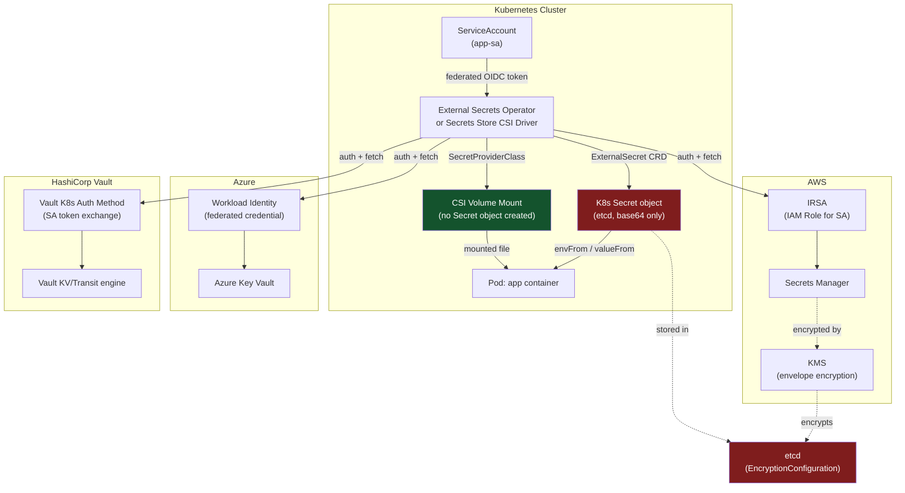
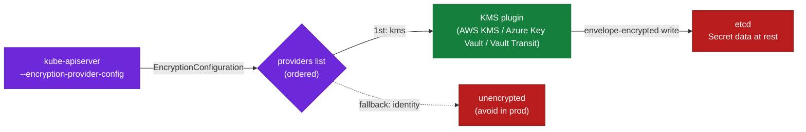

Here's the single reference table — this is the one to memorize for a quick verbal answer:

| Approach | Auth Mechanism | Creates K8s Secret? | Secret Ends Up In | Best For | 10-sec Interview Line |
|---|---|---|---|---|---|
| Native `kubectl create secret` | None (RBAC only) | Yes | etcd (base64, not encrypted) | Dev/test only | "Base64 is encoding, not encryption — never production-safe alone." |
| AWS Secrets Manager + ESO | IRSA (OIDC federated IAM role) | Yes | etcd | Existing apps using `envFrom`/`valueFrom` unchanged | "IRSA means no static AWS keys ever touch the cluster." |
| Azure Key Vault + CSI Driver | Workload Identity (federated credential) | **No** | Nowhere (mounted file only) | Apps that can read secrets as files; smallest blast radius | "CSI mounts the secret, it never creates a Secret object — so it's not sitting in etcd at all." |
| Azure Key Vault + ESO | Workload Identity | Yes | etcd | Same as AWS row, but Azure-native | "Same ESO pattern as AWS, just swap the auth to Workload Identity." |
| Vault Agent Injector (sidecar) | Vault Kubernetes auth (SA token exchange) | **No** | Nowhere (in-memory/file in sidecar) | Multi-cloud or on-prem, dynamic secrets (leased DB creds) | "Vault can issue short-lived, auto-rotating DB credentials — not just static ones." |
| Vault via ESO | Vault Kubernetes auth | Yes | etcd | One CRD interface across AWS/Azure/Vault in multi-cloud shops | "ESO gives us a single abstraction so app teams don't care which backend it is." |
| etcd `EncryptionConfiguration` | KMS provider (AWS KMS / Azure Key Vault / Vault Transit) | N/A (control, not injection) | Encrypts what's already in etcd | Mandatory companion to every "Yes" row above | "Injection and encryption-at-rest are two separate controls — you need both." |

**The one sentence that ties it together, if asked to summarize:** "Every approach solves getting the secret *into* the pod safely without hardcoding it or committing it to Git — the differentiator is whether it also creates a Kubernetes Secret object in etcd (AWS/Azure+ESO, Vault+ESO) or bypasses etcd entirely (CSI driver, Vault Agent Injector), and if it does land in etcd, encryption-at-rest via KMS is non-negotiable, not optional."


 External Secrets is exactly the kind of follow-up interviewers ask right after "kubectl create secret." Here are concrete examples for all three backends, using the **External Secrets Operator (ESO)** pattern (the most commonly asked-about approach) plus the CSI driver alternative, since interviewers sometimes probe which one you'd pick and why.

## 1. AWS Secrets Manager / KMS

ESO with IRSA (IAM Roles for Service Accounts) — no static AWS keys in the cluster:

```yaml
# SecretStore - defines the AWS connection, auth via IRSA
apiVersion: external-secrets.io/v1beta1
kind: SecretStore
metadata:
  name: aws-secretsmanager
  namespace: prod
spec:
  provider:
    aws:
      service: SecretsManager
      region: us-east-1
      auth:
        jwt:
          serviceAccountRef:
            name: app-sa   # IRSA-annotated SA: eks.amazonaws.com/role-arn
---
# ExternalSecret - pulls the secret and materializes a K8s Secret
apiVersion: external-secrets.io/v1beta1
kind: ExternalSecret
metadata:
  name: db-creds
  namespace: prod
spec:
  refreshInterval: 1h
  secretStoreRef:
    name: aws-secretsmanager
    kind: SecretStore
  target:
    name: db-creds-k8s
    creationPolicy: Owner
  data:
    - secretKey: password
      remoteRef:
        key: prod/db/postgres
        property: password
```

KMS itself doesn't store secret *values* — it's the encryption key used underneath Secrets Manager, S3, or your own envelope encryption. The interview-relevant KMS use case for K8s is **envelope encryption of etcd** (see #4 below) or encrypting Terraform state/S3 buckets holding sensitive tfvars.

## 2. Azure Key Vault

Two common patterns — pick based on what the JD says:

**a) Secrets Store CSI Driver** (mounts as a volume, common when apps read secrets as files):

```yaml
apiVersion: secrets-store.csi.x-k8s.io/v1
kind: SecretProviderClass
metadata:
  name: azure-kv-provider
  namespace: prod
spec:
  provider: azure
  parameters:
    usePodIdentity: "false"
    useVMManagedIdentity: "false"
    userAssignedIdentityID: "<client-id-of-workload-identity>"
    keyvaultName: "kv-prod-app"
    tenantId: "<tenant-id>"
    objects: |
      array:
        - |
          objectName: db-password
          objectType: secret
---
# Pod referencing it, using Azure Workload Identity (federated OIDC)
apiVersion: v1
kind: Pod
metadata:
  name: app
  labels:
    azure.workload.identity/use: "true"
spec:
  serviceAccountName: app-sa
  containers:
    - name: app
      image: myapp:latest
      volumeMounts:
        - name: secrets-store
          mountPath: "/mnt/secrets"
          readOnly: true
  volumes:
    - name: secrets-store
      csi:
        driver: secrets-store.csi.k8s.io
        readOnly: true
        volumeAttributes:
          secretProviderClass: "azure-kv-provider"
```

**b) External Secrets Operator with Workload Identity** (materializes an actual K8s Secret, so `envFrom` works unchanged):

```yaml
apiVersion: external-secrets.io/v1beta1
kind: SecretStore
metadata:
  name: azure-kv-store
spec:
  provider:
    azurekv:
      vaultUrl: "https://kv-prod-app.vault.azure.net"
      authType: WorkloadIdentity
      serviceAccountRef:
        name: app-sa
```

Since your CV already leans on Workload Identity/OIDC at DSV, this is a strong talking point: "we moved from Managed Identity + Key Vault CSI to federated Workload Identity so pods authenticate to Key Vault without any node-level identity or secret bootstrap."

## 3. HashiCorp Vault

**Vault Agent Injector** (sidecar pattern, very commonly asked in interviews as the "Vault-native" approach):

```yaml
apiVersion: apps/v1
kind: Deployment
metadata:
  name: app
spec:
  template:
    metadata:
      annotations:
        vault.hashicorp.com/agent-inject: "true"
        vault.hashicorp.com/role: "app-role"
        vault.hashicorp.com/agent-inject-secret-db-creds: "secret/data/prod/db"
        vault.hashicorp.com/agent-inject-template-db-creds: |
          {{- with secret "secret/data/prod/db" -}}
          DB_PASSWORD={{ .Data.data.password }}
          {{- end -}}
    spec:
      serviceAccountName: app-sa
      containers:
        - name: app
          image: myapp:latest
```

Auth is via Vault's **Kubernetes auth method** — the pod's projected ServiceAccount token is exchanged for a Vault token, scoped by a Vault policy bound to that SA/namespace:

```bash
vault write auth/kubernetes/role/app-role \
  bound_service_account_names=app-sa \
  bound_service_account_namespaces=prod \
  policies=app-policy \
  ttl=1h
```

Or via ESO if you want a uniform ExternalSecret CRD interface across all three backends (common in multi-cloud shops, which fits your GKE/EKS/AKS portfolio):

```yaml
apiVersion: external-secrets.io/v1beta1
kind: SecretStore
metadata:
  name: vault-backend
spec:
  provider:
    vault:
      server: "https://vault.internal:8200"
      path: "secret"
      version: "v2"
      auth:
        kubernetes:
          mountPath: "kubernetes"
          role: "app-role"
          serviceAccountRef:
            name: app-sa
```

## 4. The etcd encryption-at-rest piece

This is the detail that separates a mid answer from a senior one — External Secrets/CSI solves *injection*, not *storage*. Native K8s Secrets are base64 in etcd unless you also enable an `EncryptionConfiguration`:

```yaml
apiVersion: apiserver.config.k8s.io/v1
kind: EncryptionConfiguration
resources:
  - resources: ["secrets"]
    providers:
      - kms:
          name: aws-kms   # or azure-kms via provider plugin, or vault transit
          endpoint: unix:///var/run/kmsplugin/socket.sock
          cachesize: 1000
          timeout: 3s
      - identity: {}   # fallback, keep last
```

On EKS/AKS this is largely managed for you (both now offer envelope encryption with a customer-managed KMS/Key Vault key at cluster creation); on self-managed clusters (kubeadm) you configure the `--encryption-provider-config` flag on the API server yourself — that's the detail interviewers use to check if you've actually run etcd encryption versus just knowing the term.

**Interview one-liner if asked to summarize the tradeoff:** CSI driver mounts secrets as files and never creates a K8s Secret object (smallest blast radius, but apps must read files, not env vars); ESO creates a real K8s Secret so existing `envFrom`/`valueFrom` workloads need zero code change, at the cost of the secret now also living in etcd — which is exactly why etcd encryption-at-rest is the mandatory companion control, not an optional extra.


Here's a diagram tying the three backends together — the auth method differs, but the flow into the pod is the same shape in every case:



The two red-boxed nodes are the ones interviewers probe on: a K8s Secret is base64 in etcd regardless of which backend fed it, so it's only as safe as your etcd encryption-at-rest config. The CSI volume path (green) sidesteps that entirely since no Secret object is ever created — which is the tradeoff worth stating out loud if asked "which would you choose and why."


Same six diagrams, recolored with a consistent legend: **blue** = identity/auth, **amber** = cloud-native secret store, **purple** = K8s operator/driver, **red** = lands in etcd (risk), **green** = never touches etcd (safe), **gray** = application pod.**1. AWS Secrets Manager — ESO + IRSA**

```mermaid
flowchart LR
    classDef identity fill:#1e40af,color:#fff,stroke:#1e3a8a
    classDef cloud fill:#b45309,color:#fff,stroke:#92400e
    classDef operator fill:#6d28d9,color:#fff,stroke:#5b21b6
    classDef danger fill:#b91c1c,color:#fff,stroke:#7f1d1d
    classDef pod fill:#374151,color:#fff,stroke:#1f2937

    SA["ServiceAccount: app-sa<br/>(eks.amazonaws.com/role-arn)"]:::identity -->|OIDC federated token| IRSA["IAM Role<br/>(IRSA trust policy)"]:::identity
    IRSA -->|assumes role| SM["AWS Secrets Manager<br/>prod/db/postgres"]:::cloud
    SM -->|"SecretStore: aws-secretsmanager"| ESO["External Secrets Operator"]:::operator
    ESO -->|"ExternalSecret: db-creds"| K8SEC["K8s Secret: db-creds-k8s"]:::danger
    K8SEC -->|envFrom| POD["Pod: app"]:::pod
    SM -.encrypted by.-> KMS["AWS KMS key"]:::cloud
```


**2. Azure Key Vault — Secrets Store CSI Driver**

```mermaid
flowchart LR
    classDef identity fill:#1e40af,color:#fff,stroke:#1e3a8a
    classDef cloud fill:#b45309,color:#fff,stroke:#92400e
    classDef operator fill:#6d28d9,color:#fff,stroke:#5b21b6
    classDef safe fill:#15803d,color:#fff,stroke:#166534
    classDef pod fill:#374151,color:#fff,stroke:#1f2937

    SA["Pod label: azure.workload.identity/use=true<br/>SA: app-sa"]:::identity -->|federated credential| WI["Workload Identity<br/>userAssignedIdentityID"]:::identity
    WI -->|auth| AKV["Azure Key Vault<br/>kv-prod-app: db-password"]:::cloud
    AKV -->|"SecretProviderClass: azure-kv-provider"| CSI["Secrets Store CSI Driver"]:::operator
    CSI -->|volume mount, no K8s Secret created| VOL["/mnt/secrets/db-password"]:::safe
    VOL --> POD["Pod: app container"]:::pod
```


**3. Azure Key Vault — External Secrets Operator (Workload Identity)**


**4. HashiCorp Vault — Agent Injector (sidecar)**

```mermaid
flowchart LR
    classDef identity fill:#1e40af,color:#fff,stroke:#1e3a8a
    classDef cloud fill:#b45309,color:#fff,stroke:#92400e
    classDef operator fill:#6d28d9,color:#fff,stroke:#5b21b6
    classDef safe fill:#15803d,color:#fff,stroke:#166534
    classDef pod fill:#374151,color:#fff,stroke:#1f2937

    SA["ServiceAccount: app-sa<br/>(projected token)"]:::identity -->|"role: app-role"| K8SAUTH["Vault Kubernetes Auth Method"]:::identity
    K8SAUTH -->|token exchange| POLICY["Vault Policy: app-policy"]:::operator
    POLICY -->|read| KV["Vault KV v2<br/>secret/data/prod/db"]:::cloud
    KV -->|agent-inject-template| INJECT["Vault Agent Sidecar<br/>writes /vault/secrets/db-creds"]:::safe
    INJECT --> APP["app container<br/>(same pod, reads file)"]:::pod
```


**5. HashiCorp Vault — via External Secrets Operator**


**6. etcd Encryption-at-Rest (companion control for #1, #3, #5)**


Red still marks anything that lands in etcd, and green marks the paths (or controls) that keep it out — that contrast is the thing worth pointing at if an interviewer asks you to compare approaches on a whiteboard.