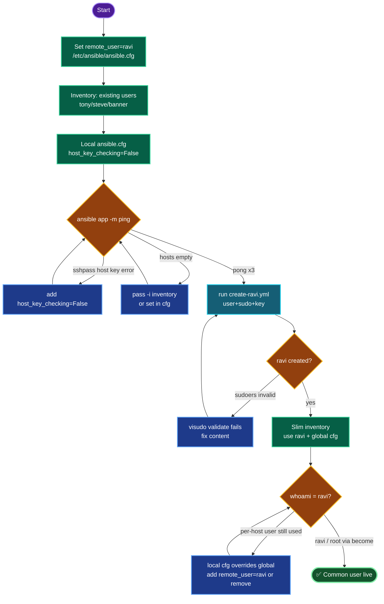

# Ansible Common Sudo User Bootstrap — `ravi` Across Stratos DC
### Fleet User Provisioning Documentation

---

## TODO

| # | Task | Status |
|---|------|--------|
| 1 | Set `remote_user = ravi` in `/etc/ansible/ansible.cfg` | ✅ |
| 2 | Create working dir + grouped inventory (bootstrap users) | ✅ |
| 3 | Local `ansible.cfg` (host key checking off) | ✅ |
| 4 | Verify connectivity to fleet | ✅ |
| 5 | Run `create-ravi.yml` (user + sudo + key) | ⬜ |
| 6 | Switch inventory to use `ravi`, verify | ⬜ |

---

## Concept

**1. `remote_user` only names the user — it doesn't create it.** Setting `remote_user = ravi` in ansible.cfg tells Ansible *which* user to SSH as, but `ravi` must actually exist on every target with auth + sudo. Bootstrap is the chicken-and-egg step: connect as the *existing* per-server users to create the common user, then switch to it.

**2. Three requirements for a usable automation user.** On every target: (a) the user exists, (b) Ansible can authenticate (SSH key preferred over password), (c) the user has sudo — ideally `NOPASSWD` so unattended runs don't hang on a prompt.

**3. sshpass + host key checking.** Password SSH uses `sshpass`, which can't answer the first-connect fingerprint prompt. `host_key_checking = False` removes it. This is the recurring gotcha across every password-based Ansible task.

**4. Config precedence.** A local `./ansible.cfg` overrides `/etc/ansible/ansible.cfg`. During bootstrap the local cfg (without `remote_user`) lets the inventory's per-host users win — correct, since `ravi` doesn't exist yet. After bootstrap, the global `remote_user = ravi` takes over.

**5. Why a common user at all.** One automation identity everywhere → key-based auth, no plaintext per-server passwords, NOPASSWD sudo for unattended runs, single point to rotate/audit. This is standard fleet practice (a dedicated `ansible`/`deploy` user), never shared human accounts.

---

## Runbook

### Phase 1 — Global default user (the graded requirement)
```bash
sudo cp /etc/ansible/ansible.cfg /etc/ansible/ansible.cfg.bak
sudo tee -a /etc/ansible/ansible.cfg > /dev/null <<'EOF'

[defaults]
remote_user = ravi
EOF
ansible-config dump | grep -i remote_user   # DEFAULT_REMOTE_USER = ravi
```

### Phase 2 — Working dir + bootstrap inventory
```bash
mkdir -p /home/thor/ansible
cat > /home/thor/ansible/inventory <<'EOF'
[app]
stapp01 ansible_host=stapp01 ansible_user=tony   ansible_ssh_pass=Ir0nM@n  ansible_become_pass=Ir0nM@n
stapp02 ansible_host=stapp02 ansible_user=steve  ansible_ssh_pass=Am3ric@  ansible_become_pass=Am3ric@
stapp03 ansible_host=stapp03 ansible_user=banner ansible_ssh_pass=BigGr33n ansible_become_pass=BigGr33n

[all:vars]
ansible_connection=ssh
ansible_become=yes
ansible_become_method=sudo
EOF
```

### Phase 3 — Local ansible.cfg (bootstrap phase)
```bash
cat > /home/thor/ansible/ansible.cfg <<'EOF'
[defaults]
inventory = inventory
host_key_checking = False
EOF
```

### Phase 4 — Verify connectivity
```bash
cd /home/thor/ansible
ansible app -m ping
ansible app -b -m command -a "whoami"      # root (via sudo)
```

### Phase 5 — Bootstrap `ravi`
```bash
# Ensure thor has a key to push (for key-based ravi login)
[ -f ~/.ssh/id_rsa.pub ] || ssh-keygen -t rsa -b 4096 -f ~/.ssh/id_rsa -N ""

cat > /home/thor/ansible/create-ravi.yml <<'EOF'
---
- name: Bootstrap common sudo user ravi
  hosts: app
  become: yes
  vars:
    common_user: ravi
    common_pass: "Ravi@123"
  tasks:
    - name: Create user ravi
      ansible.builtin.user:
        name: "{{ common_user }}"
        password: "{{ common_pass | password_hash('sha512') }}"
        shell: /bin/bash
        create_home: yes
    - name: Passwordless sudo for ravi
      ansible.builtin.copy:
        dest: /etc/sudoers.d/ravi
        content: "ravi ALL=(ALL) NOPASSWD:ALL\n"
        mode: '0440'
        validate: 'visudo -cf %s'
    - name: Push jump-host key to ravi
      ansible.builtin.authorized_key:
        user: ravi
        state: present
        key: "{{ lookup('file', '/home/thor/.ssh/id_rsa.pub') }}"
EOF

ansible-playbook create-ravi.yml
```

### Phase 6 — Switch to `ravi` and verify
```bash
# Slim inventory — no per-host creds; ravi + key + NOPASSWD handles it
cat > /home/thor/ansible/inventory <<'EOF'
[app]
stapp01 ansible_host=stapp01
stapp02 ansible_host=stapp02
stapp03 ansible_host=stapp03

[all:vars]
ansible_connection=ssh
ansible_become=yes
ansible_become_method=sudo
EOF

# Remove remote_user override from LOCAL cfg so global ravi applies (or add remote_user=ravi here)
ansible app -m ping
ansible app -m command -a "whoami"         # ravi
ansible app -b -m command -a "whoami"      # root
```

---

## OTS (One-Line-To-Ship)

```bash
# Global default user (graded part)
sudo tee -a /etc/ansible/ansible.cfg >/dev/null <<< $'\n[defaults]\nremote_user = ravi' && ansible-config dump | grep -i remote_user

# Bootstrap ravi across fleet
mkdir -p /home/thor/ansible && cd /home/thor/ansible && \
printf '[defaults]\ninventory = inventory\nhost_key_checking = False\n' > ansible.cfg && \
[ -f ~/.ssh/id_rsa.pub ] || ssh-keygen -t rsa -b 4096 -f ~/.ssh/id_rsa -N "" && \
ansible-playbook create-ravi.yml
```

---

## Mermaid



---

## Troubleshooting

| Symptom | Cause | Fix |
|---------|-------|-----|
| `hosts list is empty, could not match 'app'` | No `-i inventory` and default cfg empty | pass `-i inventory` or set `inventory=` in local cfg |
| `sshpass ... Host Key checking is enabled` | first-connect fingerprint prompt | `host_key_checking = False` in local ansible.cfg |
| `sshpass program not found` | sshpass missing | `sudo yum install -y sshpass` |
| `No such file or directory` on inventory write | dir doesn't exist | `mkdir -p /home/thor/ansible` first |
| sudo prompt hangs the run | no NOPASSWD / missing become pass | `ansible_become_pass` in inventory, or NOPASSWD sudoers |
| sudoers task fails validation | bad sudoers syntax | `validate: 'visudo -cf %s'` (already applied) |
| `whoami` shows tony not ravi after switch | local cfg overrides global `remote_user` | add `remote_user = ravi` to local cfg or remove local override |
| `authorized_key` file lookup fails | thor has no SSH key | `ssh-keygen -t rsa -b 4096 -f ~/.ssh/id_rsa -N ""` |
| `password_hash` filter error | passlib missing | `pip install passlib` on jump host |

---

## What you can do with `ravi` once live

| Task | Command (whole fleet at once) |
|------|-------------------------------|
| Audit | `ansible app -b -m command -a "uptime"` / `df -h /` |
| Install package | `ansible app -b -m yum -a "name=htop state=present"` |
| Patch all | `ansible app -b -m yum -a "name=* state=latest"` |
| Service control | `ansible app -b -m service -a "name=chronyd state=started enabled=yes"` |
| Distribute file | `ansible app -b -m copy -a "src=motd dest=/etc/motd"` |

Ties directly into the Java patching lab — those playbooks now run cleanly as `ravi` with no per-host creds.

---

## Security Note (production)

Lab uses `NOPASSWD:ALL` + shared password for simplicity. In production: scope sudo to specific commands (`ravi ALL=(ALL) NOPASSWD: /usr/bin/yum, /bin/systemctl`), use **ansible-vault** for any secrets, prefer SSH keys over passwords entirely, and reserve the shared user strictly for automation tooling — humans get individual accounts.

---

**Definition of done:** `/etc/ansible/ansible.cfg` sets `remote_user = ravi` (confirmed via `ansible-config dump`); `ravi` exists on all app servers with NOPASSWD sudo and key-based login; a slimmed inventory (no per-host creds) connects as `ravi`; `ansible app -m command -a "whoami"` returns `ravi`, and with `-b` returns `root`.